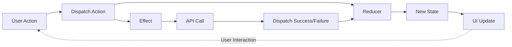

# Admin Portal - Arquitetura

## 🏗️ Visão Geral Arquitetural

O Admin Portal segue uma arquitetura **Flux/Redux** implementada com **Fluxor**, garantindo state management previsível e unidirecional.

## 🔄 Padrão Flux

### Fluxo de Dados Unidirecional



### Componentes do Padrão

| Componente | Responsabilidade | Exemplo |
|------------|------------------|---------|
| **Action** | Descreve o que aconteceu | `LoadProvidersAction` |
| **Reducer** | Atualiza o state baseado na action | `ProvidersReducer` |
| **Effect** | Side-effects (API calls, logging) | `ProvidersEffects` |
| **State** | Single source of truth | `ProvidersState` |
| **Selector** | Derivar dados do state | `GetActiveProviders` |

## 📁 Estrutura de Features

Cada feature segue a estrutura:

```text
Features/
└── Modules/
    └── Providers/
        ├── ProvidersState.cs        # State definition
        ├── ProvidersActions.cs      # All actions
        ├── ProvidersReducers.cs     # State mutations
        ├── ProvidersEffects.cs      # Side-effects
        └── ProvidersSelectors.cs    # (opcional) Derived state
```

### Exemplo Completo: Providers Feature

#### 1. State

```csharp
[FeatureState]
public record ProvidersState
{
    public IReadOnlyList<ModuleProviderDto> Providers { get; init; } = [];
    public bool IsLoading { get; init; }
    public string? ErrorMessage { get; init; }
    public int CurrentPage { get; init; } = 1;
    public int PageSize { get; init; } = 20;
    public int TotalCount { get; init; }
    
    // Computed properties
    public int TotalPages => TotalCount > 0 
        ? (int)Math.Ceiling(TotalCount / (double)PageSize) 
        : 0;
    public bool HasPreviousPage => CurrentPage > 1;
    public bool HasNextPage => CurrentPage < TotalPages;
}
```

#### 2. Actions

```csharp
// Load
public record LoadProvidersAction(int PageNumber = 1, int PageSize = 20);
public record LoadProvidersSuccessAction(
    IReadOnlyList<ModuleProviderDto> Providers,
    int TotalCount,
    int PageNumber,
    int PageSize);
public record LoadProvidersFailureAction(string ErrorMessage);

// Delete
public record DeleteProviderAction(Guid ProviderId);
public record DeleteProviderSuccessAction(Guid ProviderId);
public record DeleteProviderFailureAction(Guid ProviderId, string ErrorMessage);

// Pagination
public record NextPageAction;
public record PreviousPageAction;
public record GoToPageAction(int PageNumber);
```

#### 3. Reducers

```csharp
public class ProvidersReducers
{
    [ReducerMethod]
    public static ProvidersState ReduceLoadProvidersAction(
        ProvidersState state,
        LoadProvidersAction action) =>
        state with { IsLoading = true, ErrorMessage = null };

    [ReducerMethod]
    public static ProvidersState ReduceLoadProvidersSuccessAction(
        ProvidersState state,
        LoadProvidersSuccessAction action) =>
        state with
        {
            Providers = action.Providers,
            TotalCount = action.TotalCount,
            CurrentPage = action.PageNumber,
            PageSize = action.PageSize,
            IsLoading = false,
            ErrorMessage = null
        };

    [ReducerMethod]
    public static ProvidersState ReduceLoadProvidersFailureAction(
        ProvidersState state,
        LoadProvidersFailureAction action) =>
        state with
        {
            IsLoading = false,
            ErrorMessage = action.ErrorMessage
        };
}
```

#### 4. Effects

```csharp
public class ProvidersEffects
{
    private readonly IProvidersApi _providersApi;
    private readonly ErrorHandlingService _errorHandler;
    private readonly ISnackbar _snackbar;

    [EffectMethod]
    public async Task HandleLoadProvidersAction(
        LoadProvidersAction action,
        IDispatcher dispatcher)
    {
        var result = await _errorHandler.ExecuteWithErrorHandlingAsync(
            ct => _providersApi.GetProvidersAsync(action.PageNumber, action.PageSize, ct),
            "Load providers");

        if (result.IsSuccess)
        {
            dispatcher.Dispatch(new LoadProvidersSuccessAction(
                result.Value.Items,
                result.Value.TotalItems,
                result.Value.PageNumber,
                result.Value.PageSize));
        }
        else
        {
            var errorMessage = _errorHandler.HandleApiError(result, "load providers");
            _snackbar.Add(errorMessage, Severity.Error);
            dispatcher.Dispatch(new LoadProvidersFailureAction(errorMessage));
        }
    }
}
```

#### 5. Uso em Componentes

```razor
@inherits FluxorComponent
@inject IState<ProvidersState> ProvidersState
@inject IDispatcher Dispatcher

<MudDataGrid Items="@ProvidersState.Value.Providers"
             Loading="@ProvidersState.Value.IsLoading">
    <!-- Columns -->
</MudDataGrid>

@code {
    protected override void OnInitialized()
    {
        base.OnInitialized();
        Dispatcher.Dispatch(new LoadProvidersAction());
    }
}
```

## 🎨 Componentes e Dialogs

### Decisão Arquitetural: Pragmatic Approach

**Dialogs NÃO usam Fluxor** - mantêm direct API calls por serem componentes efêmeros.

**Justificativa**:
- Lifecycle curto (abrir → submit → fechar)
- Sem necessidade de compartilhar estado
- Single Responsibility: apenas submit de formulário
- Simplicidade > Consistência neste caso (YAGNI)

### Exemplo de Dialog

```razor
@inject IProvidersApi ProvidersApi
@inject ISnackbar Snackbar

<MudDialog>
    <DialogContent>
        <MudForm @ref="form" @bind-IsValid="@isValid">
            <MudTextField @bind-Value="model.Name" Label="Nome" Required />
            <MudTextField @bind-Value="model.Email" Label="E-mail" Required />
        </MudForm>
    </DialogContent>
    <DialogActions>
        <MudButton OnClick="Cancel">Cancelar</MudButton>
        <MudButton Color="Color.Primary" OnClick="Submit" Disabled="@(!isValid)">
            Salvar
        </MudButton>
    </DialogActions>
</MudDialog>

@code {
    [CascadingParameter] MudDialogInstance MudDialog { get; set; }
    
    private async Task Submit()
    {
        try
        {
            var result = await ProvidersApi.UpdateProviderAsync(model);
            if (result.IsSuccess)
            {
                Snackbar.Add("Provedor atualizado com sucesso!", Severity.Success);
                MudDialog.Close(DialogResult.Ok(true));
            }
            else
            {
                Snackbar.Add(result.Error?.Message ?? "Erro ao atualizar", Severity.Error);
            }
        }
        catch (Exception ex)
        {
            Snackbar.Add($"Erro: {ex.Message}", Severity.Error);
        }
    }
}
```

## 🔌 API Integration

### Refit Clients

Todos os módulos têm interfaces Refit tipadas:

```csharp
public interface IProvidersApi
{
    [Get("/api/providers")]
    Task<ApiResult<PagedResponse<ModuleProviderDto>>> GetProvidersAsync(
        [Query] int pageNumber = 1,
        [Query] int pageSize = 20,
        CancellationToken cancellationToken = default);

    [Get("/api/providers/{id}")]
    Task<ApiResult<ModuleProviderDto>> GetProviderByIdAsync(
        Guid id,
        CancellationToken cancellationToken = default);

    [Put("/api/providers/{id}")]
    Task<ApiResult> UpdateProviderAsync(
        Guid id,
        [Body] UpdateProviderRequest request,
        CancellationToken cancellationToken = default);

    [Delete("/api/providers/{id}")]
    Task<ApiResult> DeleteProviderAsync(
        Guid id,
        CancellationToken cancellationToken = default);
}
```

### Registro de Serviços

```csharp
// Program.cs
builder.Services.AddRefitClient<IProvidersApi>()
    .ConfigureHttpClient(c => c.BaseAddress = new Uri(builder.Configuration["ApiBaseUrl"]))
    .AddStandardResilienceHandler(options =>
    {
        options.Retry.MaxRetryAttempts = 3;
        options.Retry.Delay = TimeSpan.FromSeconds(2);
        options.Retry.BackoffType = DelayBackoffType.Exponential;
    });
```

## 🛡️ Error Handling

### ErrorHandlingService

Centraliza tratamento de erros com retry automático:

```csharp
public class ErrorHandlingService
{
    public async Task<Result<T>> ExecuteWithErrorHandlingAsync<T>(
        Func<CancellationToken, Task<Result<T>>> operation,
        string operationName,
        int maxRetries = 3)
    {
        for (int attempt = 1; attempt <= maxRetries; attempt++)
        {
            try
            {
                var result = await operation(CancellationToken.None);
                
                if (result.IsSuccess || !ShouldRetry(result.Error?.StatusCode))
                    return result;
                
                if (attempt < maxRetries)
                {
                    await Task.Delay(GetRetryDelay(attempt));
                }
            }
            catch (Exception ex)
            {
                _logger.LogError(ex, "Error in {Operation}, attempt {Attempt}", 
                    operationName, attempt);
                
                if (attempt == maxRetries)
                    return Result.Failure<T>(new Error(500, ex.Message));
            }
        }
        
        return Result.Failure<T>(new Error(500, "Max retries exceeded"));
    }

    private bool ShouldRetry(int? statusCode) =>
        statusCode >= 500 || statusCode == 408; // Server errors + Timeout

    private TimeSpan GetRetryDelay(int attempt) =>
        TimeSpan.FromSeconds(Math.Pow(2, attempt)); // Exponential backoff
}
```

## 🌐 Localização

### LocalizationService

Dictionary-based translations com suporte a múltiplos idiomas:

```csharp
public class LocalizationService
{
    private readonly Dictionary<string, Dictionary<string, string>> _translations = new()
    {
        ["pt-BR"] = new()
        {
            ["Common.Save"] = "Salvar",
            ["Common.Cancel"] = "Cancelar",
            ["Providers.Active"] = "Ativo",
            // ...
        },
        ["en-US"] = new()
        {
            ["Common.Save"] = "Save",
            ["Common.Cancel"] = "Cancel",
            ["Providers.Active"] = "Active",
            // ...
        }
    };

    public string GetString(string key, params object[] args)
    {
        var culture = CultureInfo.CurrentUICulture.Name;
        
        if (_translations.TryGetValue(culture, out var cultureDictionary) &&
            cultureDictionary.TryGetValue(key, out var value))
        {
            return args.Length > 0 ? string.Format(value, args) : value;
        }
        
        // Fallback to en-US
        return _translations["en-US"].GetValueOrDefault(key, $"[{key}]");
    }

    public void SetCulture(string cultureName)
    {
        var culture = new CultureInfo(cultureName);
        CultureInfo.CurrentCulture = culture;
        CultureInfo.CurrentUICulture = culture;
        OnCultureChanged?.Invoke();
    }

    public event Action? OnCultureChanged;
}
```

## ⚡ Performance Optimizations

### 1. Virtualization

```razor
<MudDataGrid Items="@providers"
             Virtualize="true"
             FixedHeader="true"
             Height="600px">
    <!-- Renderiza apenas ~20-30 linhas visíveis -->
</MudDataGrid>
```

### 2. Debouncing

```csharp
public class DebounceHelper
{
    private CancellationTokenSource? _cts;

    public async Task<T> DebounceAsync<T>(
        Func<Task<T>> operation,
        int millisecondsDelay = 300)
    {
        _cts?.Cancel();
        _cts = new CancellationTokenSource();

        try
        {
            await Task.Delay(millisecondsDelay, _cts.Token);
            return await operation();
        }
        catch (TaskCanceledException)
        {
            return default!;
        }
    }
}
```

### 3. Memoization

```csharp
public class PerformanceHelper
{
    private static readonly Dictionary<string, (object Value, DateTime Expiry)> _cache = new();

    public static T Memoize<T>(string key, Func<T> factory, TimeSpan? ttl = null)
    {
        if (_cache.TryGetValue(key, out var cached) && DateTime.UtcNow < cached.Expiry)
        {
            return (T)cached.Value;
        }

        var value = factory();
        var expiry = DateTime.UtcNow + (ttl ?? TimeSpan.FromSeconds(30));
        _cache[key] = (value!, expiry);
        return value;
    }
}
```

## 🧪 Testing

### bUnit Tests

```csharp
[Fact]
public void ProvidersPage_ShouldLoadProviders_OnInitialized()
{
    // Arrange
    var mockState = new Mock<IState<ProvidersState>>();
    mockState.Setup(x => x.Value).Returns(new ProvidersState
    {
        Providers = new List<ModuleProviderDto> { /* test data */ },
        IsLoading = false
    });

    Services.AddSingleton(mockState.Object);
    Services.AddSingleton<IDispatcher>(new MockDispatcher());

    // Act
    var cut = RenderComponent<Providers>();

    // Assert
    cut.Find("table").Should().NotBeNull();
    cut.FindAll("tr").Count.Should().BeGreaterThan(1);
}
```

## 📊 Métricas de Arquitetura

### Code Reduction (Flux Refactoring)

| Página | Antes (LOC) | Depois (LOC) | Redução |
|--------|-------------|--------------|---------|
| Providers.razor | 95 | 18 | 81% |
| Documents.razor | 87 | 12 | 86% |
| Categories.razor | 103 | 18 | 83% |
| Services.razor | 98 | 18 | 82% |
| AllowedCities.razor | 92 | 14 | 85% |
| **TOTAL** | **475** | **80** | **83%** |

## 🔗 Referências

- [Fluxor Documentation](https://github.com/mrpmorris/Fluxor)
- [Flux Pattern Guide](../architecture/flux-pattern-implementation.md)
- [Refit Documentation](https://github.com/reactiveui/refit)
- [MudBlazor Components](https://mudblazor.com/)
