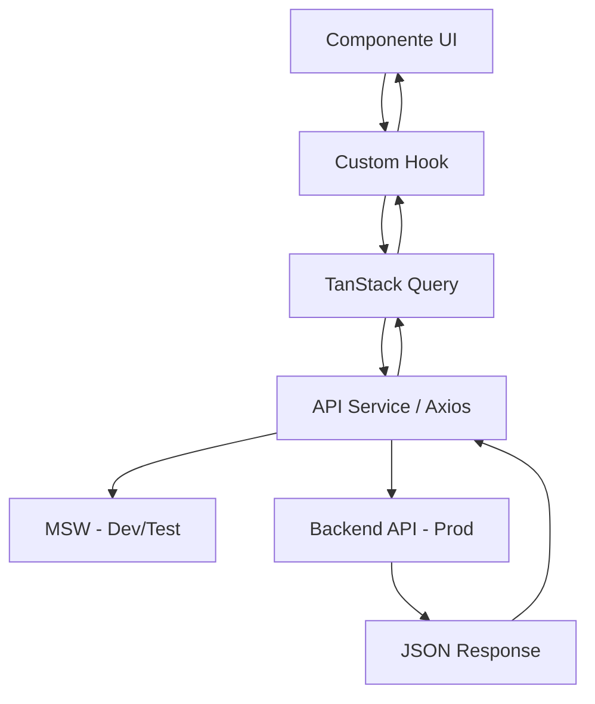

# Admin Portal - Arquitetura (React)

O Admin Portal é uma aplicação web moderna construída com **React 19** e **Next.js 15 (App Router)**, focada na gestão administrativa do ecossistema MeAjudaAi.

## 🏗️ Visão Geral Arquitetural

A arquitetura baseia-se em estados descentralizados e cache inteligente usando **TanStack Query (React Query)**, eliminando a necessidade de Redux/Fluxor para a maioria dos casos de uso.

## 🔄 Fluxo de Dados


```mermaid
graph TD
    A[Componente UI] --> B[Custom Hook]
    B --> C[TanStack Query]
    C --> D[API Service / Axios]
    D --> E[MSW - Dev/Test]
    D --> F[Backend API - Prod]
    F --> G[JSON Response]
    G --> D
    D --> C
    C --> B
    B --> A
```

## 📁 Estrutura do Projeto

```text
MeAjudaAi.Web.Admin/
├── app/                    # Next.js App Router (Páginas e Layouts)
├── components/             # Componentes React (UI, Layout, Feature-based)
│   ├── ui/                 # Componentes base (Shadcn/UI)
│   └── admin/              # Componentes específicos de negócio
├── hooks/                  # Custom Hooks (Lógica e Data Fetching)
│   └── admin/              # Hooks de integração com API
├── lib/                    # Utilitários, tipos e clientes API
│   ├── api/                # Cliente API gerado via OpenAPI
│   └── utils.ts            # Utilitários gerais
└── __tests__/              # Suíte de testes (Vitest + MSW)
    ├── components/         # Testes de componentes
    ├── hooks/              # Testes de hooks
    └── mocks/              # Handlers MSW
```

## 🔌 Integração com API

A integração é feita através de um SDK TypeScript gerado automaticamente a partir da especificação OpenAPI do backend.

### Custom Hooks Pattern

Centralizamos a lógica de fetching em hooks para promover reuso e isolamento de efeitos:

```typescript
// hooks/admin/use-services.ts
export function useServices(categoryId?: string) {
  const queryClient = useQueryClient();

  // Query: Get Services
  const { data, isLoading } = useQuery({
    queryKey: ['admin', 'services', categoryId],
    queryFn: () => getServices(categoryId),
  });

  // Mutation: Create Service
  const createMutation = useMutation({
    mutationFn: (newService: CreateServiceRequest) => postService(newService),
    onSuccess: () => queryClient.invalidateQueries({ queryKey: ['admin', 'services'] }),
  });

  return { services: data?.items ?? [], isLoading, createService: createMutation.mutate };
}
```

## 🧪 Estratégia de Testes

### Unitários e Integração (Vitest + Testing Library)
- **Componentes**: Validam renderização, estados de loading e interações do usuário.
- **Hooks**: Validam lógica de estado e chamadas de API usando MSW.
- **Mocks**: Handlers MSW simulam o backend com validação estrita de payloads e IDs.

### E2E (Playwright)
- Validam fluxos críticos como login administrativo, gestão de prestadores e categorias.
- Executados em ambiente isolado (`ci` project) com os 3 apps rodando simultaneamente.

## 🛡️ Governança e Qualidade
- **Threshold de Cobertura**: 70% Global (obrigatório no pipeline).
- **Linting**: Regras estritas de ESLint e Prettier.
- **TypeScript**: Modo `strict` habilitado para máxima segurança de tipos.

## 🔗 Referências
- [Next.js Documentation](https://nextjs.org/docs)
- [TanStack Query](https://tanstack.com/query/latest)
- [Vitest](https://vitest.dev/)
- [Mock Service Worker (MSW)](https://mswjs.io/)
