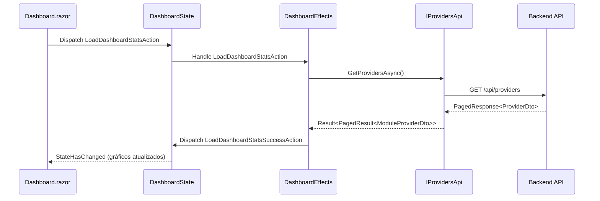

# Admin Portal - Dashboard

## 📊 Visão Geral

O Dashboard é a página inicial do Admin Portal, fornecendo uma visão consolidada das métricas e estatísticas da plataforma.

## 🎯 Componentes do Dashboard

### 1. Cards de Estatísticas

Exibe métricas principais em cards destacados:

- **Total de Prestadores**: Contagem total de providers cadastrados
- **Prestadores Ativos**: Providers com status "Active"
- **Documentos Pendentes**: Documentos aguardando verificação
- **Verificações Pendentes**: Providers aguardando aprovação

```razor
<MudGrid>
    <MudItem xs="12" sm="6" md="3">
        <MudCard>
            <MudCardContent>
                <MudText Typo="Typo.h5">@DashboardState.Value.TotalProviders</MudText>
                <MudText Typo="Typo.body2">Total de Prestadores</MudText>
            </MudCardContent>
        </MudCard>
    </MudItem>
    <!-- Outros cards... -->
</MudGrid>
```

### 2. Gráfico de Status de Verificação

**Tipo**: Gráfico de Pizza (Pie Chart)  
**Biblioteca**: MudBlazor MudChart  
**Dados**: Distribuição de providers por status de verificação

**Status Mapeados**:
- Pendente (Warning - Amarelo)
- Em Progresso (Info - Azul)
- Verificado (Success - Verde)
- Rejeitado (Error - Vermelho)
- Suspenso (Default - Cinza)

```csharp
// Lógica de agrupamento
var statusGroups = providers
    .Where(p => !string.IsNullOrEmpty(p.VerificationStatus))
    .GroupBy(p => p.VerificationStatus)
    .OrderBy(g => Array.IndexOf(StatusOrder, g.Key));

verificationStatusLabels = statusGroups
    .Select(g => VerificationStatus.ToDisplayName(int.Parse(g.Key)))
    .ToArray();

verificationStatusData = statusGroups
    .Select(g => (double)g.Count())
    .ToArray();
```

### 3. Gráfico de Tipos de Prestadores

**Tipo**: Gráfico de Pizza (Pie Chart)  
**Dados**: Distribuição de providers por tipo (Pessoa Física vs Pessoa Jurídica)

**Implementação**:
```csharp
var typeGroups = providers
    .Where(p => !string.IsNullOrEmpty(p.ProviderType))
    .GroupBy(p => p.ProviderType)
    .OrderBy(g => g.Key);

providerTypeLabels = typeGroups.Select(g => {
    if (Enum.TryParse<ProviderType>(g.Key, true, out var typeEnum))
    {
        return GetProviderTypeDisplayName(typeEnum);
    }
    return g.Key ?? "Desconhecido";
}).ToArray();

providerTypeData = typeGroups
    .Select(g => (double)g.Count())
    .ToArray();
```

**Helper Method**:
```csharp
private string GetProviderTypeDisplayName(ProviderType type)
{
    return type switch
    {
        ProviderType.Individual => "Pessoa Física",
        ProviderType.Company => "Pessoa Jurídica",
        _ => type.ToString()
    };
}
```

### 4. Atividades Recentes (Placeholder)

**Status**: Planejado para Fase 3+  
**Descrição**: Feed de atividades recentes do sistema

> [!NOTE]
> Esta funcionalidade está planejada para implementação futura. Ver [Roadmap - Recent Activity Widget](../roadmap.md#-recent-activity-widget-prioridade-média)

## 🔄 Fluxo de Dados



## 🛠️ State Management (Fluxor)

### DashboardState

```csharp
[FeatureState]
public record DashboardState
{
    public int TotalProviders { get; init; }
    public int ActiveProviders { get; init; }
    public int PendingDocuments { get; init; }
    public int PendingVerifications { get; init; }
    public bool IsLoading { get; init; }
    public string? ErrorMessage { get; init; }
}
```

### Actions

```csharp
public record LoadDashboardStatsAction;
public record LoadDashboardStatsSuccessAction(
    int TotalProviders,
    int ActiveProviders,
    int PendingDocuments,
    int PendingVerifications);
public record LoadDashboardStatsFailureAction(string ErrorMessage);
```

### Effects

```csharp
[EffectMethod]
public async Task HandleLoadDashboardStatsAction(
    LoadDashboardStatsAction action,
    IDispatcher dispatcher)
{
    var result = await _errorHandler.ExecuteWithErrorHandlingAsync(
        ct => _providersApi.GetProvidersAsync(1, 1000, ct),
        "Load dashboard stats");

    if (result.IsSuccess)
    {
        var stats = CalculateStats(result.Value.Items);
        dispatcher.Dispatch(new LoadDashboardStatsSuccessAction(
            stats.Total,
            stats.Active,
            stats.PendingDocs,
            stats.PendingVerifications));
    }
    else
    {
        dispatcher.Dispatch(new LoadDashboardStatsFailureAction(
            result.Error?.Message ?? "Erro ao carregar estatísticas"));
    }
}
```

## 🐛 Problemas Resolvidos

### Sprint 7.20 - Dashboard Charts Fixes

#### Problema 1: Gráfico "Provedores por Tipo" Vazio

**Causa**: Property name mismatch entre backend (`type`) e frontend (`ProviderType`)

**Solução**: Adicionado `[JsonPropertyName("type")]` em `ModuleProviderDto`

```csharp
public sealed record ModuleProviderDto(
    // ...
    [property: JsonPropertyName("type")]
    string ProviderType,
    // ...
);
```

#### Problema 2: Mensagens de Debug Visíveis

**Causa**: Código de debug não removido antes do merge

**Solução**: Removidas linhas `<MudText>Chart disabled for debugging</MudText>`

## 📈 Métricas de Performance

| Operação | Tempo Médio |
|----------|-------------|
| Carregar Dashboard | ~500ms |
| Renderizar Gráficos | ~150ms |
| Atualizar Stats | ~300ms |

## 🔮 Melhorias Futuras

- [ ] **Gráfico de Distribuição Geográfica**: Mapa com providers por cidade
- [ ] **Gráfico de Documentos Pendentes**: Timeline de uploads
- [ ] **Filtros de Data**: Selecionar período para estatísticas
- [ ] **Export de Dados**: Download de relatórios em CSV/PDF
- [ ] **Real-time Updates**: SignalR para atualização automática
- [ ] **Drill-down**: Clicar em gráfico para ver detalhes

## 🔗 Referências

- [MudBlazor Charts](https://mudblazor.com/components/chart)
- [Fluxor State Management](https://github.com/mrpmorris/Fluxor)
- [Roadmap - Sprint 7.20](../roadmap.md#-sprint-720---dashboard-charts--data-mapping-fixes-5-fev-2026)
