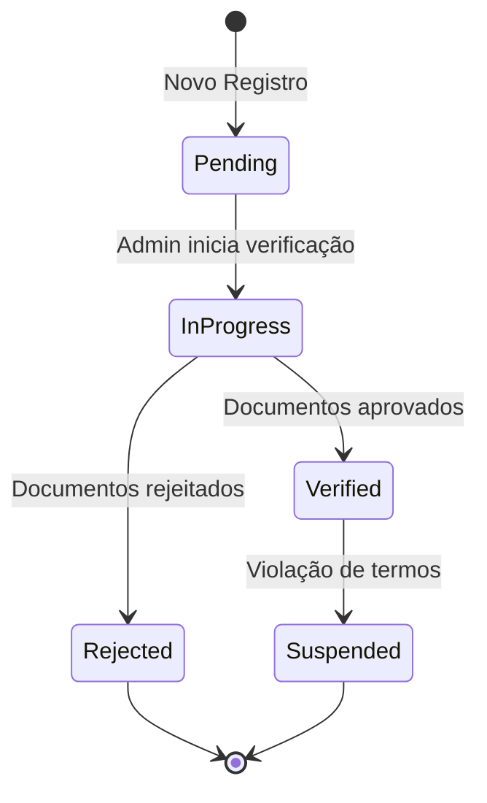

# Admin Portal - Funcionalidades

## 📋 Módulos Implementados

O Admin Portal oferece gerenciamento completo dos seguintes módulos:

### 1. 👥 Gestão de Prestadores (Providers)

**Página**: `Providers.razor`  
**Permissões**: `ProvidersRead`, `ProvidersUpdate`, `ProvidersApprove`, `ProvidersDelete`

#### Funcionalidades

- ✅ **Listagem Paginada**: DataGrid com 20 providers por página
- ✅ **Busca**: Filtro por nome (debounced 300ms)
- ✅ **Visualização de Detalhes**: Modal com informações completas
- ✅ **Edição de Perfil**: Atualizar nome, email, telefone, endereço
- ✅ **Verificação de Status**: Aprovar/Rejeitar/Suspender providers
- ✅ **Exclusão**: Remover provider do sistema (soft delete)

#### Fluxo de Verificação



#### Componentes

- `Providers.razor`: Página principal
- `CreateProviderDialog.razor`: Formulário de criação (removido - seed data)
- `EditProviderDialog.razor`: Formulário de edição
- `VerifyProviderDialog.razor`: Modal de verificação de status
- `ProviderSelectorDialog.razor`: Seletor de provider para associações

---

### 2. 📄 Gestão de Documentos (Documents)

**Página**: `Documents.razor`  
**Permissões**: `DocumentsRead`, `DocumentsUpdate`, `DocumentsApprove`

#### Funcionalidades

- ✅ **Listagem de Documentos**: Todos os documentos enviados
- ✅ **Filtros**: Por provider, tipo, status
- ✅ **Upload**: Enviar documentos (PDF, JPEG, PNG, max 10MB)
- ✅ **Verificação**: Aprovar/Rejeitar documentos
- ✅ **Download**: Baixar documento para análise
- ✅ **Histórico**: Ver todas as versões de um documento

#### Tipos de Documentos

| Tipo | Descrição | Obrigatório |
|------|-----------|-------------|
| IdentityDocument | RG, CNH, Passaporte | ✅ Sim |
| ProofOfResidence | Comprovante de endereço | ✅ Sim |
| CriminalRecord | Certidão de antecedentes | ⚠️ Condicional |
| Other | Outros documentos | ❌ Não |

#### Status de Documentos

- **Uploaded**: Enviado, aguardando análise
- **PendingVerification**: Em análise pelo admin
- **Verified**: Aprovado
- **Rejected**: Rejeitado (com motivo)
- **Failed**: Falha no upload

---

### 3. 🗂️ Catálogo de Serviços

**Páginas**: `Categories.razor`, `Services.razor`  
**Permissões**: `ServiceCatalogsRead`, `ServiceCatalogsUpdate`

#### Categories (Categorias)

**Funcionalidades**:
- ✅ Criar/Editar/Excluir categorias
- ✅ Ativar/Desativar categorias
- ✅ Ordenação customizada
- ✅ Validação de dependências (não deletar se tem serviços)

**Exemplo de Categorias**:
- Serviços Domésticos
- Manutenção e Reparos
- Saúde e Bem-Estar
- Educação e Treinamento

#### Services (Serviços)

**Funcionalidades**:
- ✅ Criar/Editar/Excluir serviços
- ✅ Associar a categorias
- ✅ Ativar/Desativar serviços
- ✅ Descrição detalhada

**Exemplo de Serviços**:
- Limpeza Residencial (Categoria: Serviços Domésticos)
- Eletricista (Categoria: Manutenção e Reparos)
- Personal Trainer (Categoria: Saúde e Bem-Estar)

---

### 4. 📍 Gestão de Localizações (Allowed Cities)

**Página**: `AllowedCities.razor`  
**Permissões**: `LocationsManage`

#### Funcionalidades

- ✅ **Listagem de Cidades Permitidas**: Cidades do piloto
- ✅ **Adicionar Cidade**: Busca via API IBGE + Geocoding automático
- ✅ **Editar Raio de Serviço**: Atualizar raio em km (inline editing)
- ✅ **Excluir Cidade**: Remover cidade do piloto
- ✅ **Ativar/Desativar**: Habilitar/desabilitar temporariamente

#### Cidades do Piloto (Inicial)

| Cidade | Estado | Código IBGE | Raio (km) |
|--------|--------|-------------|-----------|
| Muriaé | MG | 3143906 | 50 |
| Itaperuna | RJ | 3302205 | 50 |
| Linhares | ES | 3203205 | 50 |

#### Geocoding Automático

Ao adicionar uma cidade, o sistema:
1. Busca coordenadas via API IBGE
2. Valida coordenadas (latitude/longitude)
3. Calcula raio de serviço padrão (50km)
4. Armazena no banco de dados

---

### 5. 📊 Dashboard

**Página**: `Dashboard.razor`  
**Permissões**: `ViewerPolicy` (acesso básico)

Ver [Dashboard Documentation](dashboard.md) para detalhes completos.

**Métricas Exibidas**:
- Total de Prestadores
- Prestadores Ativos
- Documentos Pendentes
- Verificações Pendentes
- Gráfico de Status de Verificação
- Gráfico de Tipos de Prestadores

---

## 🎨 Padrões de UI/UX

### MudBlazor Components

Todos os módulos utilizam componentes MudBlazor para consistência:

- **MudDataGrid**: Tabelas paginadas com ordenação e filtros
- **MudDialog**: Modais para criação/edição
- **MudForm**: Formulários com validação
- **MudTextField**: Campos de texto com máscaras
- **MudSelect**: Dropdowns para seleção
- **MudChip**: Status badges coloridos
- **MudButton**: Botões de ação

### Status Chips

```razor
<MudChip Color="@VerificationStatus.ToColor(provider.VerificationStatus)">
    @VerificationStatus.ToDisplayName(provider.VerificationStatus)
</MudChip>
```

**Cores Padrão**:
- Success (Verde): Verified, Active
- Warning (Amarelo): Pending, PendingVerification
- Error (Vermelho): Rejected, Failed
- Info (Azul): InProgress
- Default (Cinza): Suspended, Inactive

### Confirmações de Exclusão

Todas as operações destrutivas requerem confirmação:

```csharp
var result = await DialogService.ShowMessageBox(
    "Confirmar Exclusão",
    "Tem certeza que deseja excluir este item?",
    yesText: "Excluir",
    cancelText: "Cancelar");

if (result == true)
{
    // Executar exclusão
}
```

---

## 🔐 Controle de Acesso

### Políticas por Funcionalidade

| Funcionalidade | Política Requerida |
|----------------|-------------------|
| Visualizar Providers | `ViewerPolicy` |
| Editar Provider | `ManagerPolicy` |
| Aprovar/Rejeitar Provider | `AdminPolicy` |
| Deletar Provider | `AdminPolicy` |
| Gerenciar Documentos | `ManagerPolicy` |
| Gerenciar Catálogo | `ManagerPolicy` |
| Gerenciar Localizações | `AdminPolicy` |

### Exemplo de Uso

```razor
<AuthorizeView Policy="@PolicyNames.AdminPolicy">
    <Authorized>
        <MudIconButton Icon="@Icons.Material.Filled.Delete"
                      OnClick="@(() => DeleteProvider(provider.Id))" />
    </Authorized>
</AuthorizeView>
```

---

## 🔮 Funcionalidades Futuras

Ver [Roadmap](../roadmap.md) para planejamento completo.

### Fase 3+ (Pós-MVP)

- [ ] **Recent Activity Widget**: Feed de atividades em tempo real
- [ ] **Bulk Operations**: Aprovar múltiplos documentos de uma vez
- [ ] **Advanced Analytics**: Dashboards com Grafana
- [ ] **Fraud Detection**: Sistema de scoring para perfis suspeitos
- [ ] **Audit Trail**: Histórico completo de ações administrativas
- [ ] **Export de Dados**: Relatórios em CSV/PDF
- [ ] **Notificações Push**: Alertas para ações críticas

---

## 🔗 Referências

- [Architecture](architecture.md) - Padrões arquiteturais
- [Dashboard](dashboard.md) - Detalhes do Dashboard
- [Roadmap](../roadmap.md) - Planejamento de features
