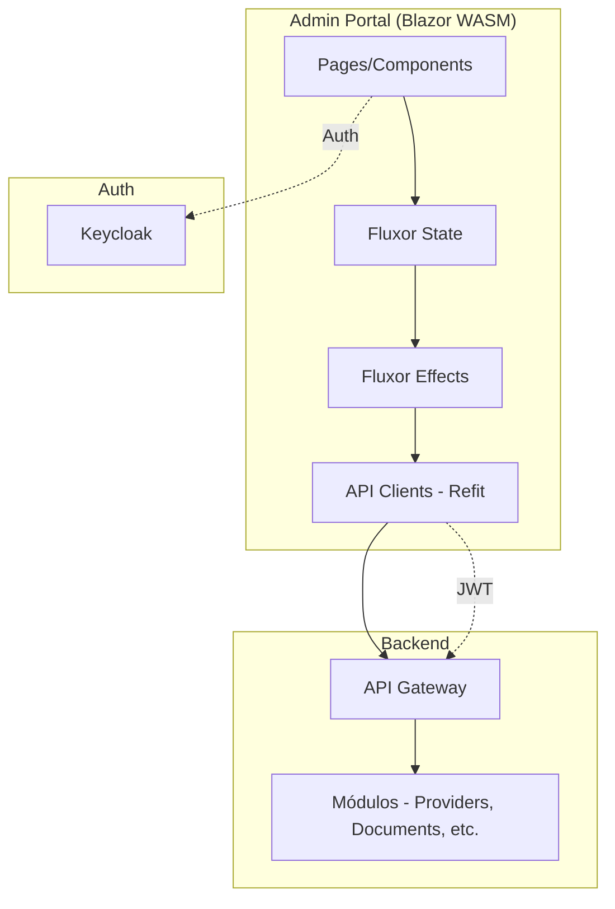

# Admin Portal - Visão Geral

## 📋 Introdução

O **Admin Portal** é a interface administrativa da plataforma MeAjudaAi, construída com Blazor WebAssembly para fornecer uma experiência de gerenciamento moderna, responsiva e eficiente.

## 🎯 Propósito

O Admin Portal permite que administradores da plataforma gerenciem:

- **Prestadores de Serviços**: Aprovação, verificação e moderação de perfis
- **Documentos**: Verificação de documentos enviados pelos prestadores
- **Catálogo de Serviços**: Gerenciamento de categorias e serviços oferecidos
- **Localizações**: Configuração de cidades permitidas no piloto
- **Dashboard**: Visualização de métricas e estatísticas do sistema

## 🛠️ Stack Tecnológica

### Frontend
- **Blazor WebAssembly (.NET 10)**: Framework principal para SPA
- **MudBlazor 8.0**: Biblioteca de componentes UI Material Design
- **Fluxor**: State management (padrão Flux/Redux)

### Autenticação
- **Keycloak**: Identity Provider (OIDC/OAuth 2.0)
- **PKCE Flow**: Autenticação segura para aplicações públicas

### Comunicação
- **Refit**: Cliente HTTP tipado para APIs
- **System.Text.Json**: Serialização JSON

## 🏗️ Arquitetura



## 📁 Estrutura de Diretórios

```
src/Web/MeAjudaAi.Web.Admin/
├── Pages/                    # Páginas principais
│   ├── Dashboard.razor
│   ├── Providers.razor
│   ├── Documents.razor
│   ├── Categories.razor
│   ├── Services.razor
│   └── AllowedCities.razor
├── Components/               # Componentes reutilizáveis
│   ├── Dialogs/             # Modais de criação/edição
│   ├── Common/              # Componentes compartilhados
│   └── Accessibility/       # Componentes de acessibilidade
├── Features/                # Fluxor Features (State/Actions/Effects/Reducers)
│   ├── Modules/
│   │   ├── Providers/
│   │   ├── Documents/
│   │   └── ServiceCatalogs/
│   ├── Dashboard/
│   └── Theme/
├── Services/                # Serviços auxiliares
│   ├── ErrorHandlingService.cs
│   ├── LocalizationService.cs
│   └── LiveRegionService.cs
├── Constants/               # Constantes centralizadas
│   ├── ProviderConstants.cs
│   ├── DocumentConstants.cs
│   └── CommonConstants.cs
├── Helpers/                 # Métodos auxiliares
│   ├── AccessibilityHelper.cs
│   ├── PerformanceHelper.cs
│   └── DebounceHelper.cs
└── Layout/                  # Layouts e navegação
    ├── MainLayout.razor
    └── NavMenu.razor
```

## 🔐 Autenticação e Autorização

### Keycloak Configuration

**Realm**: `meajudaai`  
**Client ID**: `admin-portal`  
**Flow**: Authorization Code + PKCE  
**Redirect URIs**:
- `https://localhost:7001/authentication/login-callback`
- `https://localhost:7001/authentication/logout-callback`

### Políticas de Autorização

| Política | Permissões Requeridas | Descrição |
|----------|----------------------|-----------|
| `ViewerPolicy` | `ProvidersRead` | Visualizar dados |
| `ManagerPolicy` | `ProvidersUpdate` | Editar dados |
| `AdminPolicy` | `ProvidersApprove`, `ProvidersDelete` | Aprovar/rejeitar/deletar |

### Uso em Componentes

```razor
@attribute [Authorize(Policy = PolicyNames.AdminPolicy)]

<AuthorizeView Policy="@PolicyNames.ManagerPolicy">
    <Authorized>
        <MudButton>Editar</MudButton>
    </Authorized>
    <NotAuthorized>
        <MudText>Sem permissão</MudText>
    </NotAuthorized>
</AuthorizeView>
```

## 🌐 Localização (i18n)

O Admin Portal suporta múltiplos idiomas:

- **pt-BR** (Português Brasil) - Padrão
- **en-US** (English US)

### Uso

```razor
@inject LocalizationService L

<MudButton>@L.GetString("Common.Save")</MudButton>
<MudText>@L.GetString("Providers.ItemsFound", count)</MudText>
```

## ♿ Acessibilidade

O Admin Portal segue as diretrizes **WCAG 2.1 AA**:

- ✅ ARIA labels em todos os elementos interativos
- ✅ Navegação completa por teclado
- ✅ Skip-to-content link
- ✅ Live regions para anúncios de leitores de tela
- ✅ Contrast ratio 4.5:1+

## 📊 Performance

### Otimizações Implementadas

- **Virtualization**: MudDataGrid renderiza apenas linhas visíveis
- **Debouncing**: Search com delay de 300ms
- **Memoization**: Cache de resultados filtrados (30s)
- **Lazy Loading**: Componentes carregados sob demanda

### Métricas

| Métrica | Valor |
|---------|-------|
| Render 1000 items | ~180ms |
| Search API calls | 3/sec (com debounce) |
| Memory usage | ~22 MB |
| Scroll FPS | 60 fps |

## 🧪 Testes

### Cobertura de Testes bUnit

- **43 testes** implementados
- Testes de páginas, dialogs e componentes
- Integração com Fluxor state

### Executar Testes

```bash
dotnet test tests/MeAjudaAi.Web.Admin.Tests/
```

## 🚀 Executando Localmente

### Pré-requisitos

1. .NET SDK 10.0.101+
2. Docker Desktop (para Keycloak)
3. Keycloak configurado (ver [Keycloak Setup](../keycloak-admin-portal-setup.md))

### Comandos

```bash
# Via Aspire AppHost (recomendado)
dotnet run --project src/Aspire/MeAjudaAi.AppHost

# Standalone (desenvolvimento)
dotnet run --project src/Web/MeAjudaAi.Web.Admin
```

Acesse: `https://localhost:7001`

## 📚 Documentação Adicional

- [Dashboard](dashboard.md) - Detalhes sobre gráficos e métricas
- [Features](features.md) - Funcionalidades por módulo
- [Architecture](architecture.md) - Padrões arquiteturais (Flux, componentes)

## 🔗 Links Úteis

- [MudBlazor Documentation](https://mudblazor.com/)
- [Fluxor Documentation](https://github.com/mrpmorris/Fluxor)
- [Blazor WebAssembly Guide](https://learn.microsoft.com/en-us/aspnet/core/blazor/)
