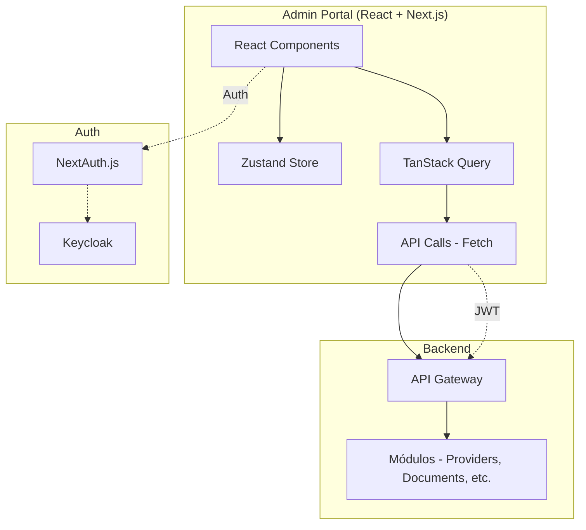

# Admin Portal - Visão Geral

## 📋 Introdução

O **Admin Portal** é a interface administrativa da plataforma MeAjudaAi, construída com React + Next.js para fornecer uma experiência de gerenciamento moderna, responsiva e eficiente.

## 🎯 Propósito

O Admin Portal permite que administradores da plataforma gerenciem:

- **Prestadores de Serviços**: Aprovação, verificação e moderação de perfis
- **Documentos**: Verificação de documentos enviados pelos prestadores
- **Catálogo de Serviços**: Gerenciamento de categorias e serviços oferecidos
- **Localizações**: Configuração de cidades permitidas no piloto
- **Dashboard**: Visualização de métricas e estatísticas do sistema

## 🛠️ Stack Tecnológica

### Frontend
- **React 19 + Next.js 15**: Framework principal para SPA
- **Tailwind CSS v4**: Biblioteca de estilização
- **Zustand**: State management
- **TanStack Query**: Server state management

### Autenticação
- **Keycloak**: Identity Provider (OIDC/OAuth 2.0)
- **NextAuth.js**: Autenticação para Next.js

### Comunicação
- **Axios / Fetch**: Cliente HTTP
- **TanStack Query**: Data fetching e caching

## 🏗️ Arquitetura


```mermaid
graph TB
    subgraph "Admin Portal (React + Next.js)"
        UI[React Components]
        Store[Zustand Store]
        Query[TanStack Query]
        API[API Calls - Fetch]
    end
    
    subgraph "Backend"
        Gateway[API Gateway]
        Modules[Módulos - Providers, Documents, etc.]
    end
    
    subgraph "Auth"
        Keycloak[Keycloak]
        NextAuth[NextAuth.js]
    end
    
    UI --> Store
    UI --> Query
    Query --> API
    API --> Gateway
    Gateway --> Modules
    
    UI -.Auth.-> NextAuth
    NextAuth -.-> Keycloak
    API -.JWT.-> Gateway
```

## 📁 Estrutura de Diretórios

```text
src/Web/MeAjudaAi.Web.Admin/
├── app/                       # Next.js App Router
│   ├── (auth)/                # Authentication routes
│   │   ├── login/
│   │   └── layout.tsx
│   ├── (dashboard)/           # Protected routes
│   │   ├── providers/
│   │   ├── documents/
│   │   ├── services/
│   │   ├── cities/
│   │   ├── dashboard/
│   │   └── layout.tsx
│   ├── layout.tsx
│   └── page.tsx
├── components/                # Reusable components
│   ├── ui/                   # Base UI components (Button, Text, etc.)
│   ├── providers/            # Provider-specific components
│   ├── documents/            # Document-specific components
│   └── common/               # Shared components
├── hooks/                    # Custom React hooks
│   ├── useProviders.ts
│   ├── useDocuments.ts
│   └── useTranslation.ts
├── stores/                   # Zustand stores
│   ├── providersStore.ts
│   └── uiStore.ts
├── lib/                      # Utilities
│   ├── api.ts                # API client
│   └── utils.ts
└── types/                    # TypeScript types
```

### Testes E2E

Localização: `tests/MeAjudaAi.Web.Admin.Tests/e2e/`

**Estrutura:**
```text
tests/MeAjudaAi.Web.Admin.Tests/
└── e2e/
    ├── auth.spec.ts
    ├── providers.spec.ts
    ├── configs.spec.ts
    ├── dashboard.spec.ts
    └── mobile-responsiveness.spec.ts
```

**Fixtures compartilhadas:** `tests/MeAjudaAi.Web.Shared.Tests/base.ts`
- `loginAsAdmin(page)`
- `loginAsProvider(page)`
- `loginAsCustomer(page)`
- `logout(page)`

## 🔐 Autenticação e Autorização

### Keycloak Configuration (NextAuth.js v4)

**Realm**: `meajudaai`  
**Client ID**: `admin-portal`  
**Flow**: Authorization Code + PKCE  
**Redirect URIs**:
- `https://localhost:7001/api/auth/callback/keycloak`
- `https://localhost:7001/api/auth/logout`

### Políticas de Autorização

| Política | Permissões Requeridas | Descrição |
|----------|----------------------|-----------|
| `ViewerPolicy` | `ProvidersRead` | Visualizar dados |
| `ManagerPolicy` | `ProvidersUpdate` | Editar dados |
| `AdminPolicy` | `ProvidersApprove`, `ProvidersDelete` | Aprovar/rejeitar/deletar |

### Uso em Componentes

```tsx
// Using NextAuth.js useSession for auth
'use client';
import { useSession } from 'next-auth/react';

export function EditButton({ providerId }: { providerId: string }) {
  const { data: session } = useSession();
  
  if (session?.user?.role !== 'admin' && session?.user?.role !== 'manager') {
    return <span className="text-gray-500">Sem permissão</span>;
  }
  
  return <Button>Editar</Button>;
}

// Protected route wrapper
'use client';
import { useRouter } from 'next/navigation';
import { useSession } from 'next-auth/react';
import { useEffect } from 'react';

function AdminProtected({ children }: { children: React.ReactNode }) {
  const { data: session, status } = useSession();
  const router = useRouter();

  useEffect(() => {
    if (status !== 'loading' && !session) {
      router.push('/login');
    }
  }, [status, session, router]);

  if (status === 'loading') return <Spinner />;
  if (!session) return null;
  if (session.user.role !== 'admin') return <AccessDenied />;

  return <>{children}</>;
}
```

## 🌐 Localização (i18n)

O Admin Portal suporta múltiplos idiomas:

- **pt-BR** (Português Brasil) - Padrão
- **en-US** (English US)

### Uso

```tsx
'use client';
import { useTranslation } from '@/hooks/useTranslation';

export function SaveButton() {
  const { t } = useTranslation();
  
  return <Button>{t('Common.Save')}</Button>;
}

// With interpolation
function ProvidersCount({ count }: { count: number }) {
  const { t } = useTranslation();
  return <Text>{t('Providers.ItemsFound', { count })}</Text>;
}
```

## ♿ Acessibilidade

O Admin Portal segue as diretrizes **WCAG 2.1 AA**:

- ✅ ARIA labels em todos os elementos interativos
- ✅ Navegação completa por teclado
- ✅ Skip-to-content link
- ✅ Live regions para anúncios de leitores de tela
- ✅ Contrast ratio 4.5:1+

## 📊 Performance

### Otimizações Implementadas

- **Virtualization**: TanStack Table com virtualização para renderizar apenas linhas visíveis
- **Debouncing**: Search com delay de 300ms via TanStack Query
- **Memoization**: Cache de resultados filtrados (30s via TanStack Query)
- **Lazy Loading**: Next.js App Router com code splitting automático

### Métricas

| Métrica | Valor |
|---------|-------|
| Render 1000 items | ~180ms |
| Search API calls | 3/sec (com debounce) |
| Memory usage | ~22 MB |
| Scroll FPS | 60 fps |

## 🧪 Testes

### E2E Tests com Playwright

- Testes end-to-end para todos os fluxos principais
- Localização: `src/Web/MeAjudaAi.Web.Admin/e2e/`
- Os testes exercitam o fluxo OAuth via Keycloak (signIn('keycloak')) em vez de formulários de email/senha

### Executar Testes

```bash
cd src/Web
npx playwright test --grep "admin"
```

## 🚀 Executando Localmente

### Pré-requisitos

1. .NET SDK 10.0.101+
2. Docker Desktop (para Keycloak)
3. Keycloak configurado (ver [Keycloak Setup](../keycloak-admin-portal-setup.md))

### Comandos

```bash
# Via Aspire AppHost (recomendado)
dotnet run --project src/Aspire/MeAjudaAi.AppHost

# Standalone (desenvolvimento)
dotnet run --project src/Web/MeAjudaAi.Web.Admin
```

Acesse: `https://localhost:7001`

## 📚 Documentação Adicional

- [Dashboard](dashboard.md) - Detalhes sobre gráficos e métricas
- [Features](features.md) - Funcionalidades por módulo
- [Architecture](architecture.md) - Padrões arquiteturais (Flux, componentes)

## 🔗 Links Úteis

- [Documentação React](https://react.dev/) - Biblioteca de UI
- [Documentação Next.js](https://nextjs.org/docs) - Framework React full-stack
- [Documentação Tailwind CSS](https://tailwindcss.com/docs) - Framework de estilização
- [Documentação TanStack Query](https://tanstack.com/query/latest) - Gerenciamento de estado servidor
- [Documentação Radix UI](https://www.radix-ui.com/) - Componentes UI acessíveis
