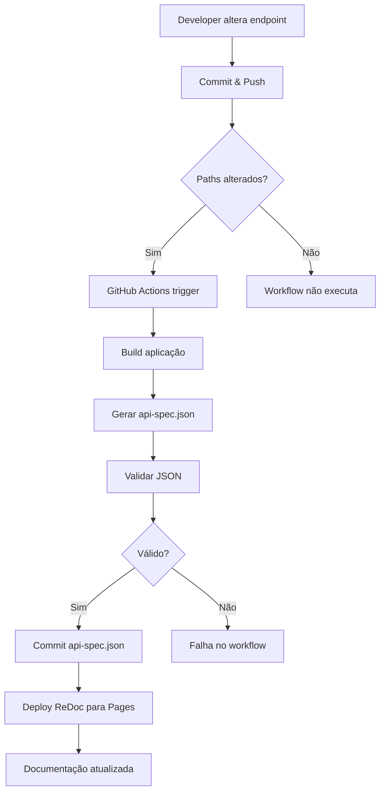

# 🤖 Automação de Documentação da API

## 📋 Visão Geral

Sistema de automação completo para manter a documentação da API **sempre atualizada** sem intervenção manual.

## 🎯 Objetivo

Garantir que o `api-spec.json` e a documentação no GitHub Pages reflitam **sempre** o estado atual dos endpoints da API.

## ⚙️ Como Funciona

### 1. Detecção de Mudanças

O workflow GitHub Actions (`.github/workflows/update-api-docs.yml`) é acionado quando há commits em:

```yaml
paths:
  - 'src/**/API/**/*.cs'          # Controllers e endpoints
  - 'src/**/Controllers/**/*.cs'  # Controllers
  - 'src/**/Endpoints/**/*.cs'    # Minimal APIs
  - 'src/**/DTOs/**/*.cs'         # Data Transfer Objects
  - 'src/**/Requests/**/*.cs'     # Request models
  - 'src/**/Responses/**/*.cs'    # Response models
  - 'src/Bootstrapper/MeAjudaAi.ApiService/**/*.cs'
```

**Exemplos de mudanças detectadas:**
- ✅ Novo endpoint criado
- ✅ Schema de request/response alterado
- ✅ Rota modificada
- ✅ Validações adicionadas
- ✅ Documentação XML atualizada

### 2. Geração do OpenAPI Spec

```bash
# Build da aplicação
dotnet build -c Release

# Instalação do Swashbuckle CLI
dotnet tool install -g Swashbuckle.AspNetCore.Cli

# Extração do OpenAPI spec
swagger tofile --output api/api-spec.json \
  src/Bootstrapper/MeAjudaAi.ApiService/bin/Release/net10.0/MeAjudaAi.ApiService.dll \
  v1
```

**Vantagens:**
- ✅ Não precisa rodar a API (sem PostgreSQL, Keycloak, etc.)
- ✅ Usa assemblies compiladas
- ✅ Reflete exatamente o código atual

### 3. Validação

O workflow valida o spec gerado:

```bash
# Validar JSON
jq empty api/api-spec.json

# Contar endpoints
PATH_COUNT=$(jq '.paths | length' api/api-spec.json)

# Validar mínimo de paths
if [ "$PATH_COUNT" -lt 5 ]; then
  echo "⚠️ Spec incompleto"
  exit 1
fi
```

### 4. Commit Automático

```yaml
- uses: stefanzweifel/git-auto-commit-action@v5
  with:
    commit_message: 'docs(api): atualizar api-spec.json automaticamente [skip ci]'
    file_pattern: 'api/api-spec.json'
```

**Nota:** `[skip ci]` evita loop infinito de builds.

### 5. Deploy para GitHub Pages

```yaml
- name: Create ReDoc HTML
  # Cria docs/api/index.html com ReDoc
  
- name: Deploy to GitHub Pages
  uses: actions/deploy-pages@v4
```

## 🔄 Fluxo Completo



## 📚 URLs Publicadas

### GitHub Pages
- **ReDoc (navegável)**: https://frigini.github.io/MeAjudaAi/api/
- **OpenAPI JSON**: https://frigini.github.io/MeAjudaAi/api/api-spec.json

### Swagger UI (local)
- **Swagger UI**: http://localhost:5000/swagger
- **OpenAPI JSON**: http://localhost:5000/api-docs/v1/swagger.json

## 🛠️ Uso Local (Desenvolvimento)

### Opção 1: Script Batch/Shell (gera tudo)

```bash
# Windows
cd tools/api-collections
.\generate-all-collections.bat

# Linux/macOS
cd tools/api-collections
./generate-all-collections.sh
```

**O que faz:**
- ✅ Builda a aplicação
- ✅ Inicia API em background
- ✅ Aguarda API ficar pronta
- ✅ Gera `api-spec.json`
- ✅ Gera Postman Collections
- ✅ Cria Environments (dev/prod)
- ✅ Para a API

### Opção 2: Node.js apenas (só spec + collections)

```bash
# Pré-requisito: API rodando
cd src/Bootstrapper/MeAjudaAi.ApiService
dotnet run

# Terminal 2: Gerar
cd tools/api-collections
npm install
node generate-postman-collections.js
```

**Vantagens:**
- ✅ Gera api-spec.json
- ✅ Gera Postman Collections
- ✅ Cria environments (dev/prod)
- ✅ Testes automáticos incluídos

## 🔧 Configuração Inicial

### 1. Habilitar GitHub Pages

No repositório GitHub:
1. **Settings** → **Pages**
2. **Source**: GitHub Actions
3. **Branch**: main
4. Salvar

### 2. Permissões do Workflow

Garantir que o workflow tenha permissões:

```yaml
permissions:
  contents: write     # Commit do api-spec.json
  pages: write        # Deploy para Pages
  id-token: write     # Autenticação
```

### 3. Primeira Execução

```bash
# Fazer qualquer mudança em endpoint
git add .
git commit -m "feat: adicionar novo endpoint"
git push origin main

# Acompanhar em: Actions → Update API Documentation
```

## 📊 Estatísticas

O workflow gera estatísticas automáticas:

```markdown
# 📊 API Statistics
- **Total Paths**: 42
- **Total Operations**: 87
- **API Version**: 1.0.0
- **Generated**: 2024-12-12 13:45:00 UTC
```

## ⚠️ Importante

### Quando o Spec É Atualizado

**SIM - Atualização automática:**
- ✅ Novo endpoint criado
- ✅ Rota modificada
- ✅ Schema de request/response alterado
- ✅ Validações adicionadas/removidas
- ✅ Documentação XML atualizada
- ✅ Parâmetros de query/path modificados

**NÃO - Sem atualização:**
- ❌ Mudanças em lógica de negócio
- ❌ Alterações em repositórios
- ❌ Mudanças em services internos
- ❌ Configurações de appsettings.json

### Evitar Loops Infinitos

O commit automático usa `[skip ci]` para não acionar outro workflow:

```yaml
commit_message: 'docs(api): atualizar api-spec.json automaticamente [skip ci]'
```

## 🧪 Testes

### Testar Localmente

```bash
# Gerar spec + collections localmente
cd tools/api-collections
.\generate-all-collections.bat   # Windows
./generate-all-collections.sh    # Linux/macOS

# Verificar se spec foi gerado
ls -la ../../api/api-spec.json

# Validar JSON
cat ../../api/api-spec.json | jq '.'
```

### Testar ReDoc Localmente

```bash
# Servir docs localmente
cd docs
python -m http.server 8000

# Abrir no navegador
# http://localhost:8000/api/
```

## 🎉 Benefícios

### Para Desenvolvedores
- ✅ Documentação sempre atualizada
- ✅ Zero esforço manual
- ✅ Commits focados em features, não em docs

### Para Frontend
- ✅ Specs sempre refletem backend atual
- ✅ Importação fácil em clients (Postman, Insomnia)
- ✅ TypeScript types podem ser gerados do spec

### Para QA
- ✅ Collections Postman atualizadas
- ✅ Testes sempre alinhados com endpoints
- ✅ Documentação de schemas completa

### Para DevOps
- ✅ CI/CD integrado
- ✅ Validação automática
- ✅ Deploy sem intervenção

## 📝 Troubleshooting

### Workflow falhou

**Problema:** Build failed
```bash
# Verificar localmente
dotnet build src/Bootstrapper/MeAjudaAi.ApiService/MeAjudaAi.ApiService.csproj -c Release
```

**Problema:** Spec inválido
```bash
# Validar JSON
jq empty api/api-spec.json
```

**Problema:** Poucas paths detectadas
```bash
# Verificar se endpoints têm XML docs e atributos corretos
# Verificar se [ApiController] e [Route] estão presentes
```

### GitHub Pages não atualizou

**Solução:**
1. Verificar em **Actions** se deploy ocorreu
2. Aguardar ~5 minutos (cache do GitHub Pages)
3. Force refresh no navegador (Ctrl+Shift+R)
4. Verificar se **Settings** → **Pages** está habilitado

## 🔗 Links Úteis

- [Swashbuckle Documentation](https://github.com/domaindrivendev/Swashbuckle.AspNetCore)
- [ReDoc Documentation](https://github.com/Redocly/redoc)
- [GitHub Actions - Pages](https://github.com/actions/deploy-pages)
- [OpenAPI Specification](https://swagger.io/specification/)

---

**Última atualização:** 12/12/2024  
**Workflow:** `.github/workflows/update-api-docs.yml`  
**Responsável:** DevOps Team
