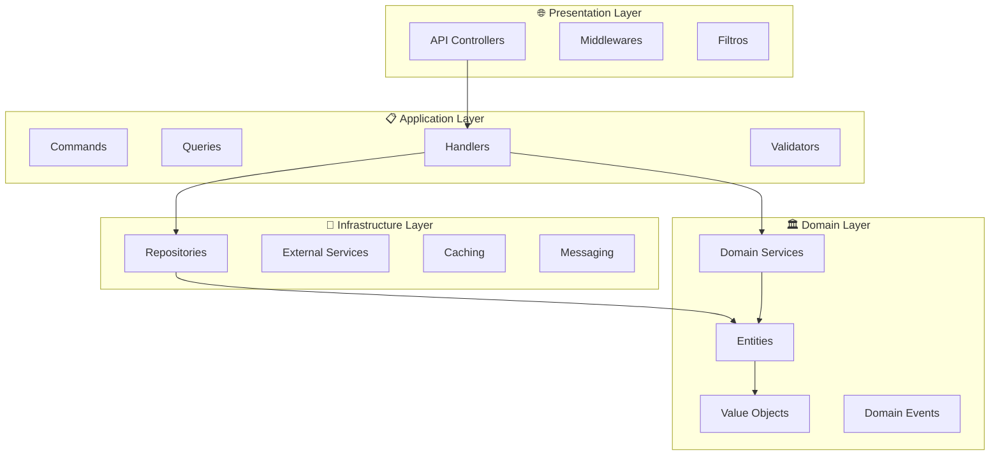

# Arquitetura e Padrões de Desenvolvimento - MeAjudaAi

Este documento detalha a arquitetura, padrões de design e diretrizes de desenvolvimento do projeto MeAjudaAi.

## 🏗️ Visão Geral da Arquitetura

### **Clean Architecture + DDD**
O MeAjudaAi implementa Clean Architecture combinada com Domain-Driven Design (DDD) para máxima testabilidade e manutenibilidade.



### **Modular Monolith**
Estrutura modular que facilita futuras extrações para microserviços.

```
src/
├── Modules/                    # Módulos de domínio
│   ├── Users/                  # Gestão de usuários
│   ├── Services/               # Catálogo de serviços (futuro)
│   ├── Bookings/               # Agendamentos (futuro)
│   └── Payments/               # Pagamentos (futuro)
├── Shared/                     # Componentes compartilhados
│   └── MeAjudaAi.Shared/       # Primitivos e abstrações
├── Bootstrapper/               # Configuração e startup
│   └── MeAjudaAi.ApiService/   # API principal
└── Aspire/                     # Orquestração de desenvolvimento
    ├── MeAjudaAi.AppHost/      # Host Aspire
    └── MeAjudaAi.ServiceDefaults/ # Configurações padrão
```

## 🎯 Domain-Driven Design (DDD)

### **Bounded Contexts**

#### 1. **Users Context** 
**Responsabilidade**: Gestão completa de identidade e perfis de usuário

```csharp
namespace MeAjudaAi.Modules.Users.Domain;

/// <summary>
/// Contexto delimitado para gestão de usuários e identidade
/// </summary>
public class UsersContext
{
    // Entidades principais
    public DbSet<User> Users { get; set; }
    
    // Agregados relacionados
    public DbSet<UserProfile> UserProfiles { get; set; }
    public DbSet<UserPreferences> UserPreferences { get; set; }
}
```

**Conceitos do Domínio**:
- **User**: Agregado raiz para dados básicos de identidade
- **UserProfile**: Perfil detalhado (experiência, habilidades, localização)
- **UserPreferences**: Preferências e configurações personalizadas

#### 2. **Services Context** (Futuro)
**Responsabilidade**: Catálogo e gestão de serviços oferecidos

**Conceitos Planejados**:
- **Service**: Serviço oferecido por prestadores
- **Category**: Categorização hierárquica de serviços
- **Pricing**: Modelos de precificação flexíveis

#### 3. **Bookings Context** (Futuro)
**Responsabilidade**: Agendamento e execução de serviços

**Conceitos Planejados**:
- **Booking**: Agregado raiz para agendamentos
- **Schedule**: Disponibilidade de prestadores
- **ServiceExecution**: Execução e acompanhamento do serviço

### **Agregados e Entidades**

#### Agregado User

```csharp
/// <summary>
/// Agregado raiz para gestão de usuários do sistema
/// Responsável por manter a consistência dos dados do usuário
/// </summary>
public class User : AggregateRoot<UserId>
{
    /// <summary>Identificador único externo (Keycloak)</summary>
    public ExternalUserId ExternalId { get; private set; }
    
    /// <summary>Email do usuário (único)</summary>
    public Email Email { get; private set; }
    
    /// <summary>Nome completo do usuário</summary>
    public FullName FullName { get; private set; }
    
    /// <summary>Tipo do usuário no sistema</summary>
    public UserType UserType { get; private set; }
    
    /// <summary>Status atual do usuário</summary>
    public UserStatus Status { get; private set; }
    
    /// <summary>Perfil detalhado do usuário</summary>
    public UserProfile Profile { get; private set; }
    
    /// <summary>Preferências do usuário</summary>  
    public UserPreferences Preferences { get; private set; }
}
```

### **Value Objects**

```csharp
/// <summary>
/// Value Object para identificador de usuário
/// Garante type safety e validação de identificadores
/// </summary>
public sealed record UserId(Guid Value) : EntityId(Value)
{
    public static UserId New() => new(Guid.NewGuid());
    public static UserId From(Guid value) => new(value);
    public static UserId From(string value) => new(Guid.Parse(value));
}

/// <summary>
/// Value Object para email com validação
/// </summary>
public sealed record Email
{
    private static readonly EmailAddressAttribute EmailValidator = new();
    
    public string Value { get; }
    
    public Email(string value)
    {
        if (string.IsNullOrWhiteSpace(value))
            throw new ArgumentException("Email não pode ser vazio");
            
        if (!EmailValidator.IsValid(value))
            throw new ArgumentException($"Email inválido: {value}");
            
        Value = value.ToLowerInvariant();
    }
    
    public static implicit operator string(Email email) => email.Value;
    public static implicit operator Email(string email) => new(email);
}
```

### **Domain Events**

```csharp
/// <summary>
/// Evento disparado quando um novo usuário é registrado
/// </summary>
public sealed record UserRegisteredDomainEvent(
    UserId UserId,
    Email Email,
    UserType UserType,
    DateTime OccurredAt
) : DomainEvent(OccurredAt);

/// <summary>
/// Evento disparado quando perfil do usuário é atualizado
/// </summary>
public sealed record UserProfileUpdatedDomainEvent(
    UserId UserId,
    UserProfile UpdatedProfile,
    DateTime OccurredAt
) : DomainEvent(OccurredAt);
```

## ⚡ CQRS (Command Query Responsibility Segregation)

### **Estrutura de Commands**

```csharp
/// <summary>
/// Command para registro de novo usuário
/// </summary>
public sealed record RegisterUserCommand(
    string ExternalId,
    string Email,
    string FirstName,
    string LastName,
    UserType UserType
) : ICommand<RegisterUserResult>;

/// <summary>
/// Handler para processamento do command RegisterUser
/// </summary>
public sealed class RegisterUserCommandHandler 
    : ICommandHandler<RegisterUserCommand, RegisterUserResult>
{
    private readonly IUsersRepository _usersRepository;
    private readonly IUserProfileService _profileService;
    private readonly IEventBus _eventBus;

    public async Task<RegisterUserResult> Handle(
        RegisterUserCommand command, 
        CancellationToken cancellationToken)
    {
        // 1. Validar se usuário já existe
        var existingUser = await _usersRepository
            .GetByExternalIdAsync(command.ExternalId, cancellationToken);
            
        if (existingUser is not null)
            return RegisterUserResult.UserAlreadyExists(command.ExternalId);

        // 2. Criar agregado User
        var user = User.Create(
            ExternalUserId.From(command.ExternalId),
            new Email(command.Email),
            new FullName(command.FirstName, command.LastName),
            command.UserType
        );

        // 3. Criar perfil inicial
        await _profileService.CreateInitialProfileAsync(user.Id, cancellationToken);

        // 4. Persistir
        await _usersRepository.AddAsync(user, cancellationToken);

        // 5. Publicar eventos de domínio
        await _eventBus.PublishAsync(user.DomainEvents, cancellationToken);

        return RegisterUserResult.Success(user.Id);
    }
}
```

### **Estrutura de Queries**

```csharp
/// <summary>
/// Query para buscar usuário por ID
/// </summary>
public sealed record GetUserByIdQuery(UserId UserId) : IQuery<UserDto?>;

/// <summary>
/// Handler para query GetUserById
/// </summary>
public sealed class GetUserByIdQueryHandler 
    : IQueryHandler<GetUserByIdQuery, UserDto?>
{
    private readonly IUsersReadRepository _repository;

    public async Task<UserDto?> Handle(
        GetUserByIdQuery query, 
        CancellationToken cancellationToken)
    {
        return await _repository.GetUserByIdAsync(query.UserId, cancellationToken);
    }
}
```

### **DTOs e Mapeamento**

```csharp
/// <summary>
/// DTO para transferência de dados de usuário
/// </summary>
public sealed record UserDto(
    string Id,
    string ExternalId,
    string Email,
    string FirstName,
    string LastName,
    string UserType,
    string Status,
    UserProfileDto? Profile,
    DateTime CreatedAt,
    DateTime? UpdatedAt
);

/// <summary>
/// Mapper para conversão entre entidades e DTOs
/// </summary>
public static class UserMapper
{
    public static UserDto ToDto(User user)
    {
        return new UserDto(
            Id: user.Id.Value.ToString(),
            ExternalId: user.ExternalId.Value,
            Email: user.Email.Value,
            FirstName: user.FullName.FirstName,
            LastName: user.FullName.LastName,
            UserType: user.UserType.ToString(),
            Status: user.Status.ToString(),
            Profile: user.Profile?.ToDto(),
            CreatedAt: user.CreatedAt,
            UpdatedAt: user.UpdatedAt
        );
    }
}
```

## 🔌 Dependency Injection e Modularização

### **Registro de Serviços por Módulo**

```csharp
/// <summary>
/// Extensão para registro dos serviços do módulo Users
/// </summary>
public static class UsersModuleServiceCollectionExtensions
{
    public static IServiceCollection AddUsersModule(
        this IServiceCollection services,
        IConfiguration configuration)
    {
        // Contexto de banco
        services.AddDbContext<UsersDbContext>(options =>
            options.UseNpgsql(configuration.GetConnectionString("Users")));

        // Repositórios
        services.AddScoped<IUsersRepository, UsersRepository>();
        services.AddScoped<IUsersReadRepository, UsersReadRepository>();

        // Serviços de domínio
        services.AddScoped<IUserProfileService, UserProfileService>();
        services.AddScoped<IUserValidationService, UserValidationService>();

        // Handlers CQRS
        services.AddMediatR(cfg => 
            cfg.RegisterServicesFromAssembly(typeof(RegisterUserCommandHandler).Assembly));

        // Validators
        services.AddValidatorsFromAssembly(typeof(RegisterUserCommandValidator).Assembly);

        // Event Handlers
        services.AddScoped<INotificationHandler<UserRegisteredDomainEvent>, 
                          SendWelcomeEmailHandler>();

        return services;
    }
}
```

### **Configuração no Program.cs**

```csharp
public class Program
{
    public static void Main(string[] args)
    {
        var builder = WebApplication.CreateBuilder(args);

        // Service Defaults (Aspire)
        builder.AddServiceDefaults();

        // Módulos de domínio
        builder.Services.AddUsersModule(builder.Configuration);
        // builder.Services.AddServicesModule(builder.Configuration); // Futuro
        // builder.Services.AddBookingsModule(builder.Configuration); // Futuro

        // Shared services
        builder.Services.AddSharedServices(builder.Configuration);

        // Infrastructure
        builder.Services.AddInfrastructure(builder.Configuration);

        var app = builder.Build();

        // Middleware pipeline
        app.UseSharedMiddleware();
        app.MapUsersEndpoints();
        app.MapDefaultEndpoints();

        app.Run();
    }
}
```

## 📡 Event-Driven Architecture

### **Domain Events**

```csharp
/// <summary>
/// Classe base para eventos de domínio
/// </summary>
public abstract record DomainEvent(DateTime OccurredAt) : IDomainEvent;

/// <summary>
/// Interface para eventos de domínio
/// </summary>
public interface IDomainEvent : INotification
{
    DateTime OccurredAt { get; }
}

/// <summary>
/// Agregado base com suporte a eventos de domínio
/// </summary>
public abstract class AggregateRoot<TId> : Entity<TId> where TId : EntityId
{
    private readonly List<IDomainEvent> _domainEvents = new();

    public IReadOnlyList<IDomainEvent> DomainEvents => _domainEvents.AsReadOnly();

    protected void RaiseDomainEvent(IDomainEvent domainEvent)
    {
        _domainEvents.Add(domainEvent);
    }

    public void ClearDomainEvents()
    {
        _domainEvents.Clear();
    }
}
```

### **Event Bus Implementation**

```csharp
/// <summary>
/// Event Bus para publicação de eventos
/// </summary>
public interface IEventBus
{
    Task PublishAsync<T>(T @event, CancellationToken cancellationToken = default) 
        where T : IDomainEvent;
    
    Task PublishAsync(IEnumerable<IDomainEvent> events, CancellationToken cancellationToken = default);
}

/// <summary>
/// Implementação do Event Bus usando MediatR
/// </summary>
public sealed class MediatREventBus : IEventBus
{
    private readonly IMediator _mediator;

    public MediatREventBus(IMediator mediator)
    {
        _mediator = mediator;
    }

    public async Task PublishAsync<T>(T @event, CancellationToken cancellationToken = default) 
        where T : IDomainEvent
    {
        await _mediator.Publish(@event, cancellationToken);
    }

    public async Task PublishAsync(IEnumerable<IDomainEvent> events, CancellationToken cancellationToken = default)
    {
        foreach (var @event in events)
        {
            await _mediator.Publish(@event, cancellationToken);
        }
    }
}
```

### **Event Handlers**

```csharp
/// <summary>
/// Handler para evento de usuário registrado
/// </summary>
public sealed class SendWelcomeEmailHandler 
    : INotificationHandler<UserRegisteredDomainEvent>
{
    private readonly IEmailService _emailService;
    private readonly ILogger<SendWelcomeEmailHandler> _logger;

    public async Task Handle(
        UserRegisteredDomainEvent notification, 
        CancellationToken cancellationToken)
    {
        try
        {
            var welcomeEmail = new WelcomeEmail(
                To: notification.Email,
                UserType: notification.UserType
            );

            await _emailService.SendAsync(welcomeEmail, cancellationToken);

            _logger.LogInformation(
                "Email de boas-vindas enviado para {Email} (UserId: {UserId})",
                notification.Email, notification.UserId);
        }
        catch (Exception ex)
        {
            _logger.LogError(ex,
                "Erro ao enviar email de boas-vindas para {Email} (UserId: {UserId})",
                notification.Email, notification.UserId);
        }
    }
}
```

## 🛡️ Padrões de Segurança

### **Authentication & Authorization**

```csharp
/// <summary>
/// Serviço de autenticação integrado com Keycloak
/// </summary>
public interface IAuthenticationService
{
    Task<AuthenticationResult> AuthenticateAsync(string token, CancellationToken cancellationToken = default);
    Task<UserContext> GetCurrentUserAsync(CancellationToken cancellationToken = default);
    Task<bool> HasPermissionAsync(string permission, CancellationToken cancellationToken = default);
}

/// <summary>
/// Contexto do usuário atual autenticado
/// </summary>
public sealed record UserContext(
    string ExternalId,
    string Email,
    IReadOnlyList<string> Roles,
    IReadOnlyList<string> Permissions
);

/// <summary>
/// Filtro de autorização customizado
/// </summary>
public sealed class RequirePermissionAttribute : AuthorizeAttribute, IAuthorizationRequirement
{
    public string Permission { get; }

    public RequirePermissionAttribute(string permission)
    {
        Permission = permission;
        Policy = $"RequirePermission:{permission}";
    }
}
```

### **Validation Pattern**

```csharp
/// <summary>
/// Validator para command de registro de usuário
/// </summary>
public sealed class RegisterUserCommandValidator : AbstractValidator<RegisterUserCommand>
{
    public RegisterUserCommandValidator()
    {
        RuleFor(x => x.ExternalId)
            .NotEmpty()
            .WithMessage("ExternalId é obrigatório");

        RuleFor(x => x.Email)
            .NotEmpty()
            .EmailAddress()
            .WithMessage("Email deve ser válido");

        RuleFor(x => x.FirstName)
            .NotEmpty()
            .MaximumLength(100)
            .WithMessage("Nome deve ter entre 1 e 100 caracteres");

        RuleFor(x => x.LastName)
            .NotEmpty()
            .MaximumLength(100)
            .WithMessage("Sobrenome deve ter entre 1 e 100 caracteres");

        RuleFor(x => x.UserType)
            .IsInEnum()
            .WithMessage("Tipo de usuário inválido");
    }
}
```

## 🔄 Padrões de Resilência

### **Retry Pattern**

```csharp
/// <summary>
/// Política de retry para operações críticas
/// </summary>
public static class RetryPolicies
{
    public static readonly RetryPolicy DatabaseRetryPolicy = Policy
        .Handle<PostgresException>()
        .Or<TimeoutException>()
        .WaitAndRetryAsync(
            retryCount: 3,
            sleepDurationProvider: retryAttempt => 
                TimeSpan.FromSeconds(Math.Pow(2, retryAttempt)),
            onRetry: (outcome, timespan, retryCount, context) =>
            {
                var logger = context.GetLogger();
                logger?.LogWarning(
                    "Tentativa {RetryCount} falhou. Tentando novamente em {Delay}ms",
                    retryCount, timespan.TotalMilliseconds);
            });

    public static readonly RetryPolicy ExternalServiceRetryPolicy = Policy
        .Handle<HttpRequestException>()
        .Or<TaskCanceledException>()
        .WaitAndRetryAsync(
            retryCount: 2,
            sleepDurationProvider: _ => TimeSpan.FromMilliseconds(500));
}
```

### **Circuit Breaker Pattern**

```csharp
/// <summary>
/// Circuit Breaker para serviços externos
/// </summary>
public static class CircuitBreakerPolicies
{
    public static readonly CircuitBreakerPolicy ExternalServiceCircuitBreaker = Policy
        .Handle<HttpRequestException>()
        .CircuitBreakerAsync(
            handledEventsAllowedBeforeBreaking: 3,
            durationOfBreak: TimeSpan.FromSeconds(30),
            onBreak: (exception, duration) =>
            {
                // Log circuit breaker opened
            },
            onReset: () =>
            {
                // Log circuit breaker closed
            });
}
```

## 📊 Observabilidade e Monitoramento

### **Logging Structure**

```csharp
/// <summary>
/// Logger estruturado para operações de usuário
/// </summary>
public static partial class UserLogMessages
{
    [LoggerMessage(
        EventId = 1001,
        Level = LogLevel.Information,
        Message = "Usuário {UserId} registrado com sucesso (Email: {Email}, Type: {UserType})")]
    public static partial void UserRegistered(
        this ILogger logger, string userId, string email, string userType);

    [LoggerMessage(
        EventId = 1002,
        Level = LogLevel.Warning,
        Message = "Tentativa de registro de usuário duplicado (ExternalId: {ExternalId})")]
    public static partial void DuplicateUserRegistration(
        this ILogger logger, string externalId);

    [LoggerMessage(
        EventId = 1003,
        Level = LogLevel.Error,
        Message = "Erro ao registrar usuário (ExternalId: {ExternalId})")]
    public static partial void UserRegistrationFailed(
        this ILogger logger, string externalId, Exception exception);
}
```

### **Métricas Personalizadas**

```csharp
/// <summary>
/// Métricas customizadas para o módulo Users
/// </summary>
public sealed class UserMetrics
{
    private readonly Counter<int> _userRegistrationsCounter;
    private readonly Histogram<double> _registrationDuration;
    private readonly ObservableGauge<int> _activeUsersGauge;

    public UserMetrics(IMeterFactory meterFactory)
    {
        var meter = meterFactory.Create("MeAjudaAi.Users");

        _userRegistrationsCounter = meter.CreateCounter<int>(
            "user_registrations_total",
            description: "Total number of user registrations");

        _registrationDuration = meter.CreateHistogram<double>(
            "user_registration_duration_ms",
            description: "Duration of user registration process");

        _activeUsersGauge = meter.CreateObservableGauge<int>(
            "active_users_total",
            description: "Current number of active users");
    }

    public void RecordUserRegistration(UserType userType, double durationMs)
    {
        _userRegistrationsCounter.Add(1, 
            new KeyValuePair<string, object?>("user_type", userType.ToString()));
        
        _registrationDuration.Record(durationMs,
            new KeyValuePair<string, object?>("user_type", userType.ToString()));
    }
}
```

## 🧪 Padrões de Teste

### **Test Structure**

```csharp
/// <summary>
/// Classe base para testes de unidade do domínio
/// </summary>
public abstract class DomainTestBase
{
    protected static User CreateValidUser(
        string externalId = "test-external-id",
        string email = "test@example.com",
        UserType userType = UserType.Customer)
    {
        return User.Create(
            ExternalUserId.From(externalId),
            new Email(email),
            new FullName("Test", "User"),
            userType
        );
    }
}

/// <summary>
/// Testes para o agregado User
/// </summary>
public sealed class UserTests : DomainTestBase
{
    [Fact]
    public void Create_ValidData_ShouldCreateUser()
    {
        // Arrange
        var externalId = ExternalUserId.From("test-id");
        var email = new Email("test@example.com");
        var fullName = new FullName("Test", "User");
        var userType = UserType.Customer;

        // Act
        var user = User.Create(externalId, email, fullName, userType);

        // Assert
        user.Should().NotBeNull();
        user.ExternalId.Should().Be(externalId);
        user.Email.Should().Be(email);
        user.FullName.Should().Be(fullName);
        user.UserType.Should().Be(userType);
        user.Status.Should().Be(UserStatus.Active);
        user.DomainEvents.Should().ContainSingle()
            .Which.Should().BeOfType<UserRegisteredDomainEvent>();
    }
}
```

### **Integration Tests**

```csharp
/// <summary>
/// Classe base para testes de integração
/// </summary>
public abstract class IntegrationTestBase : IClassFixture<TestWebApplicationFactory>
{
    protected readonly TestWebApplicationFactory Factory;
    protected readonly HttpClient Client;
    protected readonly IServiceScope Scope;

    protected IntegrationTestBase(TestWebApplicationFactory factory)
    {
        Factory = factory;
        Client = factory.CreateClient();
        Scope = factory.Services.CreateScope();
    }

    protected T GetService<T>() where T : notnull
        => Scope.ServiceProvider.GetRequiredService<T>();
}

/// <summary>
/// Testes de integração para endpoints de usuário
/// </summary>
public sealed class UserEndpointsTests : IntegrationTestBase
{
    public UserEndpointsTests(TestWebApplicationFactory factory) : base(factory) { }

    [Fact]
    public async Task RegisterUser_ValidData_ShouldReturnCreated()
    {
        // Arrange
        var request = new RegisterUserRequest(
            ExternalId: "test-external-id",
            Email: "test@example.com",
            FirstName: "Test",
            LastName: "User",
            UserType: "Customer"
        );

        // Act
        var response = await Client.PostAsJsonAsync("/api/users/register", request);

        // Assert
        response.StatusCode.Should().Be(HttpStatusCode.Created);
        
        var result = await response.Content.ReadFromJsonAsync<RegisterUserResponse>();
        result.Should().NotBeNull();
        result!.UserId.Should().NotBeEmpty();
    }
}
```

---

📖 **Próximos Passos**: Este documento serve como base para o desenvolvimento. Consulte também a [documentação de infraestrutura](./infrastructure.md) e [guia de CI/CD](./ci_cd.md) para informações complementares.