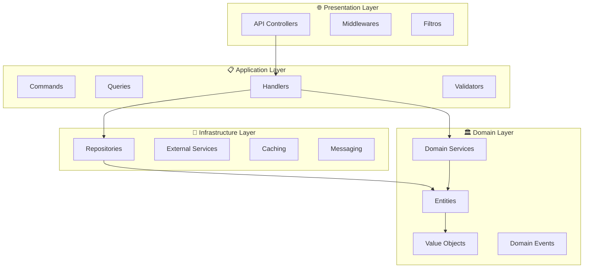
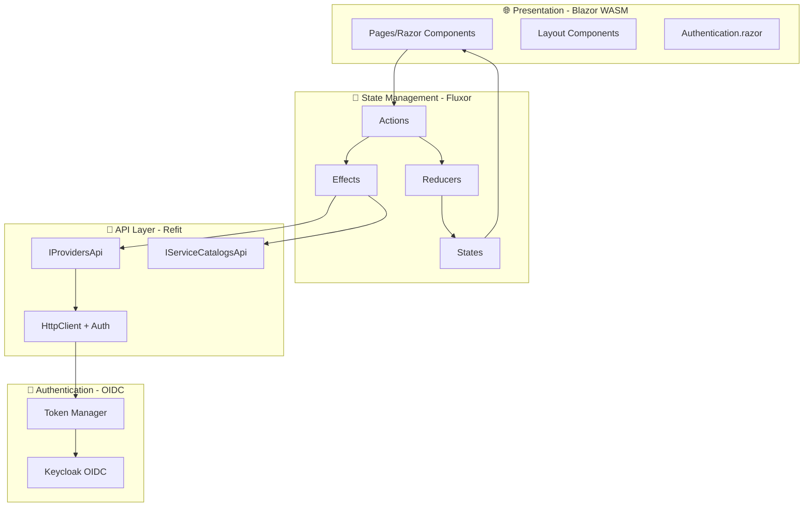

# Arquitetura e Padrões de Desenvolvimento - MeAjudaAi

Este documento detalha a arquitetura, padrões de design e diretrizes de desenvolvimento do projeto MeAjudaAi.

## 🏗️ Visão Geral da Arquitetura

### **Clean Architecture + DDD**
O MeAjudaAi implementa Clean Architecture combinada com Domain-Driven Design (DDD) para máxima testabilidade e manutenibilidade.



### **Modular Monolith**
Estrutura modular que facilita futuras extrações para microserviços.

```
src/
├── Modules/                    # Módulos de domínio
│   ├── Users/                  # Gestão de usuários
│   ├── Providers/              # Prestadores de serviços
│   ├── Services/               # Catálogo de serviços (futuro)
│   ├── Bookings/               # Agendamentos (futuro)
│   └── Payments/               # Pagamentos (futuro)
├── Shared/                     # Componentes compartilhados
│   └── MeAjudaAi.Shared/       # Primitivos e abstrações
├── Bootstrapper/               # Configuração e startup
│   └── MeAjudaAi.ApiService/   # API principal
└── Aspire/                     # Orquestração de desenvolvimento
    ├── MeAjudaAi.AppHost/      # Host Aspire
    └── MeAjudaAi.ServiceDefaults/ # Configurações padrão
```

---

## 🎨 Design Patterns Implementados

Este projeto implementa diversos padrões de design consolidados para garantir manutenibilidade, testabilidade e escalabilidade.

### 1. **Repository Pattern**

**Propósito**: Abstrair acesso a dados, permitindo testes unitários e troca de implementação.

**Implementação Real**:

```csharp
// Interface do repositório (Domain Layer)
public interface IAllowedCityRepository
{
    Task<AllowedCity?> GetByIdAsync(Guid id, CancellationToken cancellationToken = default);
    Task<AllowedCity?> GetByCityAndStateAsync(string cityName, string stateSigla, CancellationToken cancellationToken = default);
    Task<bool> ExistsAsync(string cityName, string stateSigla, CancellationToken cancellationToken = default);
    Task<bool> IsCityAllowedAsync(string cityName, string stateSigla, CancellationToken cancellationToken = default);
    Task AddAsync(AllowedCity allowedCity, CancellationToken cancellationToken = default);
    Task UpdateAsync(AllowedCity allowedCity, CancellationToken cancellationToken = default);
    Task DeleteAsync(AllowedCity allowedCity, CancellationToken cancellationToken = default);
}

// Implementação EF Core (Infrastructure Layer)
internal sealed class AllowedCityRepository(LocationsDbContext context) : IAllowedCityRepository
{
    public async Task<AllowedCity?> GetByIdAsync(Guid id, CancellationToken cancellationToken = default)
    {
        return await context.AllowedCities
            .FirstOrDefaultAsync(x => x.Id == id, cancellationToken);
    }

    public async Task<bool> IsCityAllowedAsync(string cityName, string stateSigla, CancellationToken cancellationToken = default)
    {
        var normalizedCity = cityName?.Trim() ?? string.Empty;
        var normalizedState = stateSigla?.Trim().ToUpperInvariant() ?? string.Empty;

        return await context.AllowedCities
            .AnyAsync(x =>
                EF.Functions.ILike(x.CityName, normalizedCity) &&
                x.StateSigla == normalizedState &&
                x.IsActive,
                cancellationToken);
    }
}
```

**Benefícios**:
- ✅ Testes unitários sem banco de dados (mocks)
- ✅ Encapsulamento de queries complexas
- ✅ Possibilidade de cache transparente

---

### 2. **CQRS (Command Query Responsibility Segregation)**

**Propósito**: Separar operações de leitura (queries) das de escrita (commands).

**Implementação Real - Command**:

```csharp
// Command (Application Layer)
public sealed record CreateAllowedCityCommand(
    string CityName,
    string StateSigla,
    string? IbgeCode = null
) : ICommand<Result<Guid>>;

// Handler (Application Layer)
internal sealed class CreateAllowedCityCommandHandler(
    IAllowedCityRepository repository,
    IUnitOfWork unitOfWork,
    ILogger<CreateAllowedCityCommandHandler> logger)
    : ICommandHandler<CreateAllowedCityCommand, Result<Guid>>
{
    public async Task<Result<Guid>> HandleAsync(
        CreateAllowedCityCommand command,
        CancellationToken cancellationToken)
    {
        // 1. Validar duplicação
        if (await repository.ExistsAsync(command.CityName, command.StateSigla, cancellationToken))
        {
            return Result<Guid>.Failure(LocationsErrors.CityAlreadyExists(command.CityName, command.StateSigla));
        }

        // 2. Criar entidade de domínio
        var allowedCity = AllowedCity.Create(
            command.CityName,
            command.StateSigla,
            command.IbgeCode
        );

        // 3. Persistir
        await repository.AddAsync(allowedCity, cancellationToken);
        await unitOfWork.CommitAsync(cancellationToken);

        logger.LogInformation("Cidade permitida criada: {CityName}/{State}", command.CityName, command.StateSigla);

        return Result<Guid>.Success(allowedCity.Id);
    }
}
```

**Implementação Real - Query**:

```csharp
// Query (Application Layer)
public sealed record GetServiceCategoryByIdQuery(Guid CategoryId) : IQuery<Result<ServiceCategoryDto?>>;

// Handler (Application Layer)
internal sealed class GetServiceCategoryByIdQueryHandler(
    IServiceCategoryRepository repository)
    : IQueryHandler<GetServiceCategoryByIdQuery, Result<ServiceCategoryDto?>>
{
    public async Task<Result<ServiceCategoryDto?>> HandleAsync(
        GetServiceCategoryByIdQuery query,
        CancellationToken cancellationToken)
    {
        var category = await repository.GetByIdAsync(query.CategoryId, cancellationToken);
        
        if (category is null)
        {
            return Result<ServiceCategoryDto?>.Success(null);
        }

        var dto = ServiceCategoryMapper.ToDto(category);
        return Result<ServiceCategoryDto?>.Success(dto);
    }
}
```

**Benefícios**:
- ✅ Separação clara de responsabilidades
- ✅ Otimização independente de leitura vs escrita
- ✅ Testabilidade individual de cada operação
- ✅ Escalabilidade (queries podem usar read replicas)

---

### 3. **Domain Events**

**Propósito**: Comunicação desacoplada entre agregados e módulos.

**Implementação Real**:

```csharp
// Evento de Domínio
public sealed record ProviderRegisteredDomainEvent(
    Guid ProviderId,
    Guid UserId,
    string Name,
    EProviderType Type
) : IDomainEvent
{
    public DateTime OccurredAt { get; init; } = DateTime.UtcNow;
}

// Handler do Evento (Infrastructure Layer)
internal sealed class ProviderRegisteredDomainEventHandler(
    IMessageBus messageBus,
    ILogger<ProviderRegisteredDomainEventHandler> logger)
    : IDomainEventHandler<ProviderRegisteredDomainEvent>
{
    public async Task Handle(ProviderRegisteredDomainEvent notification, CancellationToken cancellationToken)
    {
        try
        {
            // Publicar evento de integração para outros módulos
            var integrationEvent = new ProviderRegisteredIntegrationEvent(
                notification.ProviderId,
                notification.UserId,
                notification.Name,
                notification.Type.ToString()
            );

            await messageBus.PublishAsync(integrationEvent, cancellationToken);
            
            logger.LogInformation(
                "Evento de integração publicado para Provider {ProviderId}",
                notification.ProviderId);
        }
        catch (Exception ex)
        {
            logger.LogError(ex, "Erro ao processar evento ProviderRegisteredDomainEvent");
            throw;
        }
    }
}

// Uso no Agregado
public class Provider : AggregateRoot<Guid>
{
    public static Provider Create(Guid userId, string name, EProviderType type, /* ... */)
    {
        var provider = new Provider
        {
            Id = UuidGenerator.NewId(),
            UserId = userId,
            Name = name,
            Type = type,
            // ...
        };

        // Adicionar evento de domínio
        provider.AddDomainEvent(new ProviderRegisteredDomainEvent(
            provider.Id,
            userId,
            name,
            type
        ));

        return provider;
    }
}
```

**Benefícios**:
- ✅ Desacoplamento entre agregados
- ✅ Auditoria automática de mudanças
- ✅ Integração assíncrona entre módulos
- ✅ Extensibilidade (novos handlers sem alterar código existente)

---

### 4. **Unit of Work Pattern**

**Propósito**: Coordenar mudanças em múltiplos repositórios com transações.

**Implementação Real**:

```csharp
// Interface (Shared Layer)
public interface IUnitOfWork
{
    Task<int> CommitAsync(CancellationToken cancellationToken = default);
    Task RollbackAsync(CancellationToken cancellationToken = default);
}

// Implementação EF Core (Infrastructure Layer)
internal sealed class UnitOfWork(DbContext context) : IUnitOfWork
{
    public async Task<int> CommitAsync(CancellationToken cancellationToken = default)
    {
        // EF Core já gerencia transação implicitamente
        return await context.SaveChangesAsync(cancellationToken);
    }

    public async Task RollbackAsync(CancellationToken cancellationToken = default)
    {
        await context.Database.RollbackTransactionAsync(cancellationToken);
    }
}

// Uso em Handler
internal sealed class UpdateProviderProfileCommandHandler(
    IProviderRepository providerRepository,
    IDocumentsModuleApi documentsApi,
    IUnitOfWork unitOfWork)
{
    public async Task<Result> HandleAsync(UpdateProviderProfileCommand command, CancellationToken ct)
    {
        // 1. Buscar provider
        var provider = await providerRepository.GetByIdAsync(command.ProviderId, ct);
        
        // 2. Atualizar aggregate
        provider.UpdateProfile(/* ... */);
        
        // 3. Atualizar no repositório
        await providerRepository.UpdateAsync(provider, ct);
        
        // 4. Commit atômico (transação)
        await unitOfWork.CommitAsync(ct);
        
        return Result.Success();
    }
}
```

**Benefícios**:
- ✅ Transações atômicas
- ✅ Coordenação de múltiplas mudanças
- ✅ Rollback automático em caso de erro

---

### 5. **Factory Pattern**

**Propósito**: Encapsular lógica de criação de objetos complexos.

**Implementação Real**:

```csharp
// UuidGenerator Factory (Shared/Time)
public static class UuidGenerator
{
    public static Guid NewId()
    {
        return Guid.CreateVersion7(); // UUID v7 com timestamp ordenável
    }
}

// SerilogConfigurator Factory (Shared/Logging)
public static class SerilogConfigurator
{
    public static ILogger CreateLogger(IConfiguration configuration, string environmentName)
    {
        var loggerConfig = new LoggerConfiguration()
            .ReadFrom.Configuration(configuration)
            .Enrich.WithProperty("Application", "MeAjudaAi")
            .Enrich.WithProperty("Environment", environmentName)
            .Enrich.WithMachineName()
            .Enrich.WithThreadId();

        if (environmentName == "Development")
        {
            loggerConfig.WriteTo.Console();
        }

        loggerConfig.WriteTo.File(
            "logs/app-.log",
            rollingInterval: RollingInterval.Day,
            retainedFileCountLimit: 7
        );

        return loggerConfig.CreateLogger();
    }
}
```

**Benefícios**:
- ✅ Encapsulamento de lógica de criação
- ✅ Configuração centralizada
- ✅ Fácil substituição de implementação

---

### 6. **Strategy Pattern**

**Propósito**: Selecionar algoritmo/implementação em runtime.

**Implementação Real** (MessageBus):

```csharp
// Interface comum (Shared/Messaging)
public interface IMessageBus
{
    Task PublishAsync<T>(T message, CancellationToken cancellationToken = default);
    Task SubscribeAsync<T>(Func<T, CancellationToken, Task> handler, CancellationToken cancellationToken = default);
}

// Estratégia 1: RabbitMQ
public class RabbitMqMessageBus : IMessageBus
{
    public async Task PublishAsync<T>(T message, CancellationToken ct)
    {
        // Implementação RabbitMQ
    }
}

// Estratégia 2: Azure Service Bus
public class ServiceBusMessageBus : IMessageBus
{
    public async Task PublishAsync<T>(T message, CancellationToken ct)
    {
        // Implementação Azure Service Bus
    }
}

// Seleção em runtime (Program.cs)
var messageBusProvider = builder.Configuration["MessageBus:Provider"];

if (messageBusProvider == "ServiceBus")
{
    builder.Services.AddSingleton<IMessageBus, ServiceBusMessageBus>();
}
else
{
    builder.Services.AddSingleton<IMessageBus, RabbitMqMessageBus>();
}
```

**Benefícios**:
- ✅ Troca de implementação sem alterar código cliente
- ✅ Suporte a múltiplos providers (RabbitMQ, Azure, Kafka)
- ✅ Testabilidade (mocks)

---

### 7. **Decorator Pattern** (via Pipeline Behaviors)

**Propósito**: Adicionar comportamentos cross-cutting (logging, validação, cache) transparentemente.

**Implementação Real**:

```csharp
// Behavior para Caching (Shared/Behaviors)
public class CachingBehavior<TRequest, TResponse>(
    ICacheService cacheService,
    ILogger<CachingBehavior<TRequest, TResponse>> logger)
    : IPipelineBehavior<TRequest, TResponse>
    where TRequest : IRequest<TResponse>
{
    public async Task<TResponse> Handle(
        TRequest request,
        RequestHandlerDelegate<TResponse> next,
        CancellationToken cancellationToken)
    {
        // Só aplica cache se query implementa ICacheableQuery
        if (request is not ICacheableQuery cacheableQuery)
        {
            return await next();
        }

        var cacheKey = cacheableQuery.GetCacheKey();
        var cacheExpiration = cacheableQuery.GetCacheExpiration();

        // Tentar buscar no cache
        var (cachedResult, isCached) = await cacheService.GetAsync<TResponse>(cacheKey, cancellationToken);
        if (isCached)
        {
            logger.LogDebug("Cache hit for key: {CacheKey}", cacheKey);
            return cachedResult;
        }

        // Executar query e cachear resultado
        var result = await next();
        
        if (result is not null)
        {
            await cacheService.SetAsync(cacheKey, result, cacheExpiration, cancellationToken);
        }

        return result;
    }
}

// Registro (Application Layer Extensions)
services.AddScoped(typeof(IPipelineBehavior<,>), typeof(CachingBehavior<,>));
services.AddScoped(typeof(IPipelineBehavior<,>), typeof(ValidationBehavior<,>));
services.AddScoped(typeof(IPipelineBehavior<,>), typeof(LoggingBehavior<,>));
```

**Benefícios**:
- ✅ Concerns cross-cutting sem poluir handlers
- ✅ Ordem de execução configurável
- ✅ Adição/remoção de behaviors sem alterar código

---

### 8. **Options Pattern**

**Propósito**: Configuração fortemente tipada via injeção de dependência.

**Implementação Real**:

```csharp
// Opções fortemente tipadas (Shared/Messaging)
public sealed class MessageBusOptions
{
    public const string SectionName = "MessageBus";
    
    public string Provider { get; set; } = "RabbitMQ"; // ou "ServiceBus"
    public string ConnectionString { get; set; } = string.Empty;
    public int RetryCount { get; set; } = 3;
    public int RetryDelaySeconds { get; set; } = 5;
}

// Registro no Program.cs
builder.Services.Configure<MessageBusOptions>(
    builder.Configuration.GetSection(MessageBusOptions.SectionName));

// Uso via injeção
public class RabbitMqMessageBus(
    IOptions<MessageBusOptions> options,
    ILogger<RabbitMqMessageBus> logger)
{
    private readonly MessageBusOptions _options = options.Value;

    public async Task PublishAsync<T>(T message, CancellationToken ct)
    {
        // Usa _options.ConnectionString, _options.RetryCount, etc.
    }
}
```

**Benefícios**:
- ✅ Configuração fortemente tipada (compile-time safety)
- ✅ Validação via Data Annotations
- ✅ Hot reload de configurações (IOptionsSnapshot)

---

### 9. **Middleware Pipeline Pattern**

**Propósito**: Processar requisições HTTP em cadeia com responsabilidades isoladas.

**Implementação Real**:

```csharp
// Middleware customizado (ApiService/Middlewares)
public class GeographicRestrictionMiddleware(
    RequestDelegate next,
    ILocationsModuleApi locationsApi,
    ILogger<GeographicRestrictionMiddleware> logger)
{
    public async Task InvokeAsync(HttpContext context)
    {
        // 1. Verificar se endpoint requer restrição geográfica
        var endpoint = context.GetEndpoint();
        var restrictionAttribute = endpoint?.Metadata
            .GetMetadata<RequireGeographicRestrictionAttribute>();

        if (restrictionAttribute is null)
        {
            await next(context);
            return;
        }

        // 2. Extrair cidade/estado da requisição
        var city = context.Request.Headers["X-City"].ToString();
        var state = context.Request.Headers["X-State"].ToString();

        if (string.IsNullOrEmpty(city) || string.IsNullOrEmpty(state))
        {
            context.Response.StatusCode = 400;
            await context.Response.WriteAsJsonAsync(new { error = "City and State required" });
            return;
        }

        // 3. Validar via LocationsModuleApi
        var isAllowed = await locationsApi.IsCityAllowedAsync(city, state);
        
        if (!isAllowed.IsSuccess || !isAllowed.Value)
        {
            context.Response.StatusCode = 403;
            await context.Response.WriteAsJsonAsync(new { error = "City not allowed" });
            return;
        }

        // 4. Continuar pipeline
        await next(context);
    }
}

// Registro no pipeline (Program.cs)
app.UseMiddleware<GeographicRestrictionMiddleware>();
```

**Benefícios**:
- ✅ Separação de concerns (logging, auth, validação)
- ✅ Ordem de execução clara
- ✅ Reutilização entre endpoints

---

## 🚫 Anti-Patterns Evitados

### ❌ **Anemic Domain Model**
**Evitado**: Entidades ricas com comportamento encapsulado.

```csharp
// ❌ ANTI-PATTERN: Anemic Domain
public class Provider
{
    public Guid Id { get; set; }
    public string Name { get; set; }
    public string Status { get; set; } // string sem validação
}

// ✅ PATTERN CORRETO: Rich Domain Model
public class Provider : AggregateRoot<Guid>
{
    public string Name { get; private set; }
    public EProviderStatus Status { get; private set; }
    
    public void Activate(string adminEmail)
    {
        if (Status != EProviderStatus.PendingApproval)
            throw new InvalidOperationException("Provider must be pending approval");
            
        Status = EProviderStatus.Active;
        AddDomainEvent(new ProviderActivatedDomainEvent(Id, adminEmail));
    }
}
```

### ❌ **Repository Anti-Patterns**
**Evitado**: Repositórios genéricos com métodos desnecessários.

```csharp
// ❌ ANTI-PATTERN: Generic Repository com métodos inutilizados
public interface IRepository<T>
{
    Task<T> GetByIdAsync(Guid id);
    Task<IEnumerable<T>> GetAllAsync(); // Perigoso: pode retornar milhões de registros
    Task AddAsync(T entity);
    Task UpdateAsync(T entity);
    Task DeleteAsync(T entity);
}

// ✅ PATTERN CORRETO: Repositórios específicos por agregado
public interface IProviderRepository
{
    Task<Provider?> GetByIdAsync(Guid id, CancellationToken ct);
    Task<Provider?> GetByUserIdAsync(Guid userId, CancellationToken ct);
    Task<IReadOnlyList<Provider>> GetByCityAsync(string city, int pageSize, int page, CancellationToken ct);
    // Apenas métodos realmente necessários
}
```

### ❌ **Service Locator**
**Evitado**: Dependency Injection explícita via construtor.

```csharp
// ❌ ANTI-PATTERN: Service Locator
public class ProviderService
{
    public void RegisterProvider(RegisterProviderDto dto)
    {
        var repository = ServiceLocator.GetService<IProviderRepository>();
        var logger = ServiceLocator.GetService<ILogger>();
        // Dependências ocultas, difícil de testar
    }
}

// ✅ PATTERN CORRETO: Constructor Injection
public class RegisterProviderCommandHandler(
    IProviderRepository repository,
    IUnitOfWork unitOfWork,
    ILogger<RegisterProviderCommandHandler> logger)
{
    // Dependências explícitas e testáveis
}
```

---

## 📚 Referências e Boas Práticas

- **Clean Architecture**: Uncle Bob (Robert C. Martin)
- **Domain-Driven Design**: Eric Evans, Vaughn Vernon
- **CQRS**: Greg Young, Udi Dahan
- **Modular Monolith**: Milan Jovanovic, Kamil Grzybek
- **Repository Pattern**: Martin Fowler
- **.NET Design Patterns**: Microsoft Docs

---

## 🎯 Domain-Driven Design (DDD)

### **Bounded Contexts**

#### 1. **Users Context** 
**Responsabilidade**: Gestão completa de identidade e perfis de usuário

```csharp
namespace MeAjudaAi.Modules.Users.Domain;

/// <summary>
/// Contexto delimitado para gestão de usuários e identidade
/// </summary>
public class UsersContext
{
    // Entidades principais
    public DbSet<User> Users { get; set; }
    
    // Agregados relacionados
    public DbSet<UserProfile> UserProfiles { get; set; }
    public DbSet<UserPreferences> UserPreferences { get; set; }
}
```bash
**Conceitos do Domínio**:
- **User**: Agregado raiz para dados básicos de identidade
- **UserProfile**: Perfil detalhado (experiência, habilidades, localização)
- **UserPreferences**: Preferências e configurações personalizadas

#### 2. **Providers Context** 
**Responsabilidade**: Gestão completa de prestadores de serviços

```csharp
namespace MeAjudaAi.Modules.Providers.Domain;

/// <summary>
/// Contexto delimitado para gestão de prestadores de serviços
/// </summary>
public class ProvidersContext
{
    // Entidades principais
    public DbSet<Provider> Providers { get; set; }
}
```

**Conceitos do Domínio**:
- **Provider**: Agregado raiz para prestadores de serviços com perfil empresarial
- **BusinessProfile**: Perfil empresarial detalhado (razão social, contato, endereço)
- **Document**: Documentos de verificação (CPF, CNPJ, certificações)
- **Qualification**: Qualificações e habilitações profissionais
- **VerificationStatus**: Status de verificação (Pending, Verified, Rejected, etc.)

#### 3. **ServiceCatalogs Context** (Implementado)
**Responsabilidade**: Catálogo administrativo de categorias e serviços

**Conceitos Implementados**:
- **ServiceCategory**: Categorias hierárquicas de serviços (aggregate root)
- **Service**: Serviços oferecidos vinculados a categorias (aggregate root)
- **DisplayOrder**: Ordenação customizada para apresentação
- **Activation/Deactivation**: Controle de visibilidade no catálogo

**Schema**: `service_catalogs` (isolado no PostgreSQL)

#### 4. **Location Context** (Implementado)
**Responsabilidade**: Geolocalização e lookup de CEP brasileiro

**Conceitos Implementados**:
- **Cep**: Value object para CEP validado
- **Coordinates**: Latitude/Longitude para geolocalização
- **Address**: Endereço completo com dados estruturados
- **CepLookupService**: Integração com ViaCEP, BrasilAPI, OpenCEP (fallback)

**Observação**: Módulo stateless (sem schema próprio), fornece serviços via Module API

#### 5. **Bookings Context** (Futuro)
**Responsabilidade**: Agendamento e execução de serviços

**Conceitos Planejados**:
- **Booking**: Agregado raiz para agendamentos
- **Schedule**: Disponibilidade de prestadores
- **ServiceExecution**: Execução e acompanhamento do serviço

### **Agregados e Entidades**

#### Agregado User

```csharp
/// <summary>
/// Agregado raiz para gestão de usuários do sistema
/// Responsável por manter a consistência dos dados do usuário
/// </summary>
public class User : AggregateRoot<UserId>
{
    /// <summary>Identificador único externo (Keycloak)</summary>
    public ExternalUserId ExternalId { get; private set; }
    
    /// <summary>Email do usuário (único)</summary>
    public Email Email { get; private set; }
    
    /// <summary>Nome completo do usuário</summary>
    public FullName FullName { get; private set; }
    
    /// <summary>Tipo do usuário no sistema</summary>
    public UserType UserType { get; private set; }
    
    /// <summary>Status atual do usuário</summary>
    public UserStatus Status { get; private set; }
    
    /// <summary>Perfil detalhado do usuário</summary>
    public UserProfile Profile { get; private set; }
    
    /// <summary>Preferências do usuário</summary>  
    public UserPreferences Preferences { get; private set; }
}
```

#### Agregado Provider

```csharp
/// <summary>
/// Agregado raiz para gestão de prestadores de serviços
/// Responsável por manter a consistência dos dados do prestador
/// </summary>
public class Provider : AggregateRoot<ProviderId>
{
    /// <summary>Identificador do usuário associado</summary>
    public Guid UserId { get; private set; }
    
    /// <summary>Nome do prestador</summary>
    public string Name { get; private set; }
    
    /// <summary>Tipo do prestador (Individual ou Company)</summary>
    public EProviderType Type { get; private set; }
    
    /// <summary>Perfil empresarial completo</summary>
    public BusinessProfile BusinessProfile { get; private set; }
    
    /// <summary>Status de verificação atual</summary>
    public EVerificationStatus VerificationStatus { get; private set; }
    
    /// <summary>Documentos de verificação</summary>
    public IReadOnlyCollection<Document> Documents { get; }
    
    /// <summary>Qualificações profissionais</summary>  
    public IReadOnlyCollection<Qualification> Qualifications { get; }
}
```

### **Value Objects**

```csharp
/// <summary>
/// Value Object para identificador de usuário
/// Garante type safety e validação de identificadores
/// </summary>
public sealed record UserId(Guid Value) : EntityId(Value)
{
    public static UserId New() => new(Guid.NewGuid());
    public static UserId From(Guid value) => new(value);
    public static UserId From(string value) => new(Guid.Parse(value));
}

/// <summary>
/// Value Object para email com validação
/// </summary>
public sealed record Email
{
    private static readonly EmailAddressAttribute EmailValidator = new();
    
    public string Value { get; }
    
    public Email(string value)
    {
        if (string.IsNullOrWhiteSpace(value))
            throw new ArgumentException("Email não pode ser vazio");
            
        if (!EmailValidator.IsValid(value))
            throw new ArgumentException($"Email inválido: {value}");
            
        Value = value.ToLowerInvariant();
    }
    
    public static implicit operator string(Email email) => email.Value;
    public static implicit operator Email(string email) => new(email);
}
```

#### Value Objects do Módulo Providers

```csharp
/// <summary>
/// Value Object para identificador de prestador
/// </summary>
public sealed record ProviderId(Guid Value) : EntityId(Value)
{
    public static ProviderId New() => new(Guid.NewGuid());
    public static ProviderId From(Guid value) => new(value);
}

/// <summary>
/// Value Object para perfil empresarial
/// </summary>
public class BusinessProfile : ValueObject
{
    public string LegalName { get; private set; }
    public string? FantasyName { get; private set; }
    public string? Description { get; private set; }
    public ContactInfo ContactInfo { get; private set; }
    public Address PrimaryAddress { get; private set; }

    public BusinessProfile(
        string legalName,
        ContactInfo contactInfo,
        Address primaryAddress,
        string? fantasyName = null,
        string? description = null)
    {
        // Validações e inicialização
    }
}

/// <summary>
/// Value Object para documentos
/// </summary>
public class Document : ValueObject
{
    public string Number { get; private set; }
    public EDocumentType DocumentType { get; private set; }
    
    public Document(string number, EDocumentType documentType)
    {
        // Validações e inicialização
    }
}
```

### **Domain Events**

```csharp
/// <summary>
/// Evento disparado quando um novo usuário é registrado
/// </summary>
public sealed record UserRegisteredDomainEvent(
    UserId UserId,
    Email Email,
    UserType UserType,
    DateTime OccurredAt
) : DomainEvent(OccurredAt);

/// <summary>
/// Evento disparado quando perfil do usuário é atualizado
/// </summary>
public sealed record UserProfileUpdatedDomainEvent(
    UserId UserId,
    UserProfile UpdatedProfile,
    DateTime OccurredAt
) : DomainEvent(OccurredAt);
```

#### Domain Events do Módulo Providers

```csharp
/// <summary>
/// Evento disparado quando um novo prestador é registrado
/// </summary>
public sealed record ProviderRegisteredDomainEvent(
    Guid AggregateId,
    int Version,
    Guid UserId,
    string Name,
    EProviderType Type,
    string Email
) : DomainEvent(AggregateId, Version);

/// <summary>
/// Evento disparado quando um documento é adicionado
/// </summary>
public sealed record ProviderDocumentAddedDomainEvent(
    Guid AggregateId,
    int Version,
    string DocumentNumber,
    EDocumentType DocumentType
) : DomainEvent(AggregateId, Version);

/// <summary>
/// Evento disparado quando o status de verificação é atualizado
/// </summary>
public sealed record ProviderVerificationStatusUpdatedDomainEvent(
    Guid AggregateId,
    int Version,
    EVerificationStatus OldStatus,
    EVerificationStatus NewStatus,
    string? UpdatedBy
) : DomainEvent(AggregateId, Version);

/// <summary>
/// Evento disparado quando um prestador é excluído
/// </summary>
public sealed record ProviderDeletedDomainEvent(
    Guid AggregateId,
    int Version,
    string Reason
) : DomainEvent(AggregateId, Version);
```

## ⚡ CQRS (Command Query Responsibility Segregation)

### Estrutura de Commands

```csharp
/// <summary>
/// Command para registro de novo usuário
/// </summary>
public sealed record RegisterUserCommand(
    string ExternalId,
    string Email,
    string FirstName,
    string LastName,
    UserType UserType
) : ICommand<RegisterUserResult>;

/// <summary>
/// Handler para processamento do command RegisterUser
/// </summary>
public sealed class RegisterUserCommandHandler 
    : ICommandHandler<RegisterUserCommand, RegisterUserResult>
{
    private readonly IUsersRepository _usersRepository;
    private readonly IUserProfileService _profileService;
    private readonly IEventBus _eventBus;

    public async Task<RegisterUserResult> Handle(
        RegisterUserCommand command, 
        CancellationToken cancellationToken)
    {
        // 1. Validar se usuário já existe
        var existingUser = await _usersRepository
            .GetByExternalIdAsync(command.ExternalId, cancellationToken);
            
        if (existingUser is not null)
            return RegisterUserResult.UserAlreadyExists(command.ExternalId);

        // 2. Criar agregado User
        var user = User.Create(
            ExternalUserId.From(command.ExternalId),
            new Email(command.Email),
            new FullName(command.FirstName, command.LastName),
            command.UserType
        );

        // 3. Criar perfil inicial
        await _profileService.CreateInitialProfileAsync(user.Id, cancellationToken);

        // 4. Persistir
        await _usersRepository.AddAsync(user, cancellationToken);

        // 5. Publicar eventos de domínio
        await _eventBus.PublishAsync(user.DomainEvents, cancellationToken);

        return RegisterUserResult.Success(user.Id);
    }
}
```

### Estrutura de Queries

```csharp
/// <summary>
/// Query para buscar usuário por ID
/// </summary>
public sealed record GetUserByIdQuery(UserId UserId) : IQuery<UserDto?>;

/// <summary>
/// Handler para query GetUserById
/// </summary>
public sealed class GetUserByIdQueryHandler 
    : IQueryHandler<GetUserByIdQuery, UserDto?>
{
    private readonly IUsersReadRepository _repository;

    public async Task<UserDto?> Handle(
        GetUserByIdQuery query, 
        CancellationToken cancellationToken)
    {
        return await _repository.GetUserByIdAsync(query.UserId, cancellationToken);
    }
}
```

### DTOs e Mapeamento

```csharp
/// <summary>
/// DTO para transferência de dados de usuário
/// </summary>
public sealed record UserDto(
    string Id,
    string ExternalId,
    string Email,
    string FirstName,
    string LastName,
    string UserType,
    string Status,
    UserProfileDto? Profile,
    DateTime CreatedAt,
    DateTime? UpdatedAt
);

/// <summary>
/// Mapper para conversão entre entidades e DTOs
/// </summary>
public static class UserMapper
{
    public static UserDto ToDto(User user)
    {
        return new UserDto(
            Id: user.Id.Value.ToString(),
            ExternalId: user.ExternalId.Value,
            Email: user.Email.Value,
            FirstName: user.FullName.FirstName,
            LastName: user.FullName.LastName,
            UserType: user.UserType.ToString(),
            Status: user.Status.ToString(),
            Profile: user.Profile?.ToDto(),
            CreatedAt: user.CreatedAt,
            UpdatedAt: user.UpdatedAt
        );
    }
}
```

## 🔌 Dependency Injection e Modularização

### **Registro de Serviços por Módulo**

```csharp
/// <summary>
/// Extensão para registro dos serviços do módulo Users
/// </summary>
public static class UsersModuleServiceCollectionExtensions
{
    public static IServiceCollection AddUsersModule(
        this IServiceCollection services,
        IConfiguration configuration)
    {
        // Contexto de banco
        services.AddDbContext<UsersDbContext>(options =>
            options.UseNpgsql(configuration.GetConnectionString("Users")));

        // Repositórios
        services.AddScoped<IUsersRepository, UsersRepository>();
        services.AddScoped<IUsersReadRepository, UsersReadRepository>();

        // Serviços de domínio
        services.AddScoped<IUserProfileService, UserProfileService>();
        services.AddScoped<IUserValidationService, UserValidationService>();

        // Handlers CQRS (registrados via Scrutor em cada módulo)
        // Consulte ModuleExtensions.AddApplicationModule() para detalhes

        // Validators
        services.AddValidatorsFromAssembly(typeof(RegisterUserCommandValidator).Assembly);

        // Event Handlers
        services.AddScoped<INotificationHandler<UserRegisteredDomainEvent>, 
                          SendWelcomeEmailHandler>();

        return services;
    }
}
```

### **Configuração no Program.cs**

```csharp
public class Program
{
    public static void Main(string[] args)
    {
        var builder = WebApplication.CreateBuilder(args);

        // Service Defaults (Aspire)
        builder.AddServiceDefaults();

        // Módulos de domínio
        builder.Services.AddUsersModule(builder.Configuration);
        // builder.Services.AddServicesModule(builder.Configuration); // Futuro
        // builder.Services.AddBookingsModule(builder.Configuration); // Futuro

        // Shared services
        builder.Services.AddSharedServices(builder.Configuration);

        // Infrastructure
        builder.Services.AddInfrastructure(builder.Configuration);

        var app = builder.Build();

        // Middleware pipeline
        app.UseSharedMiddleware();
        app.MapUsersEndpoints();
        app.MapDefaultEndpoints();

        app.Run();
    }
}
```

## 📡 Event-Driven Architecture

### **Domain Events**

```csharp
/// <summary>
/// Classe base para eventos de domínio
/// </summary>
public abstract record DomainEvent(DateTime OccurredAt) : IDomainEvent;

/// <summary>
/// Interface para eventos de domínio
/// </summary>
public interface IDomainEvent : INotification
{
    DateTime OccurredAt { get; }
}

/// <summary>
/// Agregado base com suporte a eventos de domínio
/// </summary>
public abstract class AggregateRoot<TId> : Entity<TId> where TId : EntityId
{
    private readonly List<IDomainEvent> _domainEvents = new();

    public IReadOnlyList<IDomainEvent> DomainEvents => _domainEvents.AsReadOnly();

    protected void RaiseDomainEvent(IDomainEvent domainEvent)
    {
        _domainEvents.Add(domainEvent);
    }

    public void ClearDomainEvents()
    {
        _domainEvents.Clear();
    }
}
```

### **Implementação do Event Bus**

```csharp
/// <summary>
/// Event Bus para publicação de eventos
/// </summary>
public interface IEventBus
{
    Task PublishAsync<T>(T @event, CancellationToken cancellationToken = default) 
        where T : IDomainEvent;
    
    Task PublishAsync(IEnumerable<IDomainEvent> events, CancellationToken cancellationToken = default);
}

/// <summary>
/// Implementação do Event Bus usando sistema próprio de eventos
/// </summary>
public sealed class DomainEventBus : IEventBus
{
    private readonly IServiceProvider _serviceProvider;

    public DomainEventBus(IServiceProvider serviceProvider)
    {
        _serviceProvider = serviceProvider;
    }

    public async Task PublishAsync<T>(T @event, CancellationToken cancellationToken = default) 
        where T : IDomainEvent
    {
        await _mediator.Publish(@event, cancellationToken);
    }

    public async Task PublishAsync(IEnumerable<IDomainEvent> events, CancellationToken cancellationToken = default)
    {
        foreach (var @event in events)
        {
            await _mediator.Publish(@event, cancellationToken);
        }
    }
}
```

### **Event Handlers**

```csharp
/// <summary>
/// Handler para evento de usuário registrado
/// </summary>
public sealed class SendWelcomeEmailHandler 
    : INotificationHandler<UserRegisteredDomainEvent>
{
    private readonly IEmailService _emailService;
    private readonly ILogger<SendWelcomeEmailHandler> _logger;

    public async Task Handle(
        UserRegisteredDomainEvent notification, 
        CancellationToken cancellationToken)
    {
        try
        {
            var welcomeEmail = new WelcomeEmail(
                To: notification.Email,
                UserType: notification.UserType
            );

            await _emailService.SendAsync(welcomeEmail, cancellationToken);

            _logger.LogInformation(
                "Email de boas-vindas enviado para {Email} (UserId: {UserId})",
                notification.Email, notification.UserId);
        }
        catch (Exception ex)
        {
            _logger.LogError(ex,
                "Erro ao enviar email de boas-vindas para {Email} (UserId: {UserId})",
                notification.Email, notification.UserId);
        }
    }
}
```

## 🛡️ Padrões de Segurança

### **Autenticação e Autorização**

```csharp
/// <summary>
/// Serviço de autenticação integrado com Keycloak
/// </summary>
public interface IAuthenticationService
{
    Task<AuthenticationResult> AuthenticateAsync(string token, CancellationToken cancellationToken = default);
    Task<UserContext> GetCurrentUserAsync(CancellationToken cancellationToken = default);
    Task<bool> HasPermissionAsync(string permission, CancellationToken cancellationToken = default);
}

/// <summary>
/// Contexto do usuário atual autenticado
/// </summary>
public sealed record UserContext(
    string ExternalId,
    string Email,
    IReadOnlyList<string> Roles,
    IReadOnlyList<string> Permissions
);

/// <summary>
/// Filtro de autorização customizado
/// </summary>
public sealed class RequirePermissionAttribute : AuthorizeAttribute, IAuthorizationRequirement
{
    public string Permission { get; }

    public RequirePermissionAttribute(string permission)
    {
        Permission = permission;
        Policy = $"RequirePermission:{permission}";
    }
}
```

### **Validation Pattern**

```csharp
/// <summary>
/// Validator para command de registro de usuário
/// </summary>
public sealed class RegisterUserCommandValidator : AbstractValidator<RegisterUserCommand>
{
    public RegisterUserCommandValidator()
    {
        RuleFor(x => x.ExternalId)
            .NotEmpty()
            .WithMessage("ExternalId é obrigatório");

        RuleFor(x => x.Email)
            .NotEmpty()
            .EmailAddress()
            .WithMessage("Email deve ser válido");

        RuleFor(x => x.FirstName)
            .NotEmpty()
            .MaximumLength(100)
            .WithMessage("Nome deve ter entre 1 e 100 caracteres");

        RuleFor(x => x.LastName)
            .NotEmpty()
            .MaximumLength(100)
            .WithMessage("Sobrenome deve ter entre 1 e 100 caracteres");

        RuleFor(x => x.UserType)
            .IsInEnum()
            .WithMessage("Tipo de usuário inválido");
    }
}
```

## 🔄 Padrões de Resilência

### **Retry Pattern**

```csharp
/// <summary>
/// Política de retry para operações críticas
/// </summary>
public static class RetryPolicies
{
    public static readonly RetryPolicy DatabaseRetryPolicy = Policy
        .Handle<PostgresException>()
        .Or<TimeoutException>()
        .WaitAndRetryAsync(
            retryCount: 3,
            sleepDurationProvider: retryAttempt => 
                TimeSpan.FromSeconds(Math.Pow(2, retryAttempt)),
            onRetry: (outcome, timespan, retryCount, context) =>
            {
                var logger = context.GetLogger();
                logger?.LogWarning(
                    "Tentativa {RetryCount} falhou. Tentando novamente em {Delay}ms",
                    retryCount, timespan.TotalMilliseconds);
            });

    public static readonly RetryPolicy ExternalServiceRetryPolicy = Policy
        .Handle<HttpRequestException>()
        .Or<TaskCanceledException>()
        .WaitAndRetryAsync(
            retryCount: 2,
            sleepDurationProvider: _ => TimeSpan.FromMilliseconds(500));
}
```

### **Circuit Breaker Pattern**

```csharp
/// <summary>
/// Circuit Breaker para serviços externos
/// </summary>
public static class CircuitBreakerPolicies
{
    public static readonly CircuitBreakerPolicy ExternalServiceCircuitBreaker = Policy
        .Handle<HttpRequestException>()
        .CircuitBreakerAsync(
            handledEventsAllowedBeforeBreaking: 3,
            durationOfBreak: TimeSpan.FromSeconds(30),
            onBreak: (exception, duration) =>
            {
                // Log circuit breaker opened
            },
            onReset: () =>
            {
                // Log circuit breaker closed
            });
}
```

## 📊 Observabilidade e Monitoramento

### **Logging Structure**

```csharp
/// <summary>
/// Logger estruturado para operações de usuário
/// </summary>
public static partial class UserLogMessages
{
    [LoggerMessage(
        EventId = 1001,
        Level = LogLevel.Information,
        Message = "Usuário {UserId} registrado com sucesso (Email: {Email}, Type: {UserType})")]
    public static partial void UserRegistered(
        this ILogger logger, string userId, string email, string userType);

    [LoggerMessage(
        EventId = 1002,
        Level = LogLevel.Warning,
        Message = "Tentativa de registro de usuário duplicado (ExternalId: {ExternalId})")]
    public static partial void DuplicateUserRegistration(
        this ILogger logger, string externalId);

    [LoggerMessage(
        EventId = 1003,
        Level = LogLevel.Error,
        Message = "Erro ao registrar usuário (ExternalId: {ExternalId})")]
    public static partial void UserRegistrationFailed(
        this ILogger logger, string externalId, Exception exception);
}
`	ext

### **Métricas Personalizadas**

```csharp
/// <summary>
/// Métricas customizadas para o módulo Users
/// </summary>
public sealed class UserMetrics
{
    private readonly Counter<int> _userRegistrationsCounter;
    private readonly Histogram<double> _registrationDuration;
    private readonly ObservableGauge<int> _activeUsersGauge;

    public UserMetrics(IMeterFactory meterFactory)
    {
        var meter = meterFactory.Create("MeAjudaAi.Users");

        _userRegistrationsCounter = meter.CreateCounter<int>(
            "user_registrations_total",
            description: "Total de registros de usuários");

        _registrationDuration = meter.CreateHistogram<double>(
            "user_registration_duration_ms",
            description: "Duração do processo de registro de usuário");

        _activeUsersGauge = meter.CreateObservableGauge<int>(
            "active_users_total",
            description: "Número atual de usuários ativos");
    }

    public void RecordUserRegistration(UserType userType, double durationMs)
    {
        _userRegistrationsCounter.Add(1, 
            new KeyValuePair<string, object?>("user_type", userType.ToString()));
        
        _registrationDuration.Record(durationMs,
            new KeyValuePair<string, object?>("user_type", userType.ToString()));
    }
}
```

## 🧪 Padrões de Teste

### **Test Structure**

```csharp
/// <summary>
/// Classe base para testes de unidade do domínio
/// </summary>
public abstract class DomainTestBase
{
    protected static User CreateValidUser(
        string externalId = "test-external-id",
        string email = "test@example.com",
        UserType userType = UserType.Customer)
    {
        return User.Create(
            ExternalUserId.From(externalId),
            new Email(email),
            new FullName("Test", "User"),
            userType
        );
    }
}

/// <summary>
/// Testes para o agregado User
/// </summary>
public sealed class UserTests : DomainTestBase
{
    [Fact]
    public void Create_ValidData_ShouldCreateUser()
    {
        // Arrange
        var externalId = ExternalUserId.From("test-id");
        var email = new Email("test@example.com");
        var fullName = new FullName("Test", "User");
        var userType = UserType.Customer;

        // Act
        var user = User.Create(externalId, email, fullName, userType);

        // Assert
        user.Should().NotBeNull();
        user.ExternalId.Should().Be(externalId);
        user.Email.Should().Be(email);
        user.FullName.Should().Be(fullName);
        user.UserType.Should().Be(userType);
        user.Status.Should().Be(UserStatus.Active);
        user.DomainEvents.Should().ContainSingle()
            .Which.Should().BeOfType<UserRegisteredDomainEvent>();
    }
}
```

### **Integration Tests**

```csharp
/// <summary>
/// Classe base para testes de integração
/// </summary>
public abstract class IntegrationTestBase : IClassFixture<TestWebApplicationFactory>
{
    protected readonly TestWebApplicationFactory Factory;
    protected readonly HttpClient Client;
    protected readonly IServiceScope Scope;

    protected IntegrationTestBase(TestWebApplicationFactory factory)
    {
        Factory = factory;
        Client = factory.CreateClient();
        Scope = factory.Services.CreateScope();
    }

    protected T GetService<T>() where T : notnull
        => Scope.ServiceProvider.GetRequiredService<T>();
}

/// <summary>
/// Testes de integração para endpoints de usuário
/// </summary>
public sealed class UserEndpointsTests : IntegrationTestBase
{
    public UserEndpointsTests(TestWebApplicationFactory factory) : base(factory) { }

    [Fact]
    public async Task RegisterUser_ValidData_ShouldReturnCreated()
    {
        // Arrange
        var request = new RegisterUserRequest(
            ExternalId: "test-external-id",
            Email: "test@example.com",
            FirstName: "Test",
            LastName: "User",
            UserType: "Customer"
        );

        // Act
        var response = await Client.PostAsJsonAsync("/api/users/register", request);

        // Assert
        response.StatusCode.Should().Be(HttpStatusCode.Created);
        
        var result = await response.Content.ReadFromJsonAsync<RegisterUserResponse>();
        result.Should().NotBeNull();
        result!.UserId.Should().NotBeEmpty();
    }
}
```

---

### **Integration Test Infrastructure - Performance Optimization**

**Problema Identificado (Sprint 7.6 - Jan 2026)**:

Testes de integração aplicavam migrations de TODOS os 6 módulos (Users, Providers, Documents, ServiceCatalogs, Locations, SearchProviders) para CADA teste, causando:
- ❌ Timeout frequente (~60-70s de inicialização)
- ❌ PostgreSQL pool exhaustion (erro 57P01)
- ❌ Testes quebrando sem mudança de código (race condition)

**Solução: On-Demand Migrations Pattern**

Implementado sistema de flags para aplicar migrations apenas dos módulos necessários:

```csharp
/// <summary>
/// Enum de flags para especificar quais módulos o teste necessita.
/// Use bitwise OR para combinar múltiplos módulos.
/// </summary>
[Flags]
public enum TestModule
{
    None = 0,                 // Sem migrations (testes de DI/configuração apenas)
    Users = 1 << 0,           // 1
    Providers = 1 << 1,       // 2
    Documents = 1 << 2,       // 4
    ServiceCatalogs = 1 << 3, // 8
    Locations = 1 << 4,       // 16
    SearchProviders = 1 << 5, // 32
    All = Users | Providers | Documents | ServiceCatalogs | Locations | SearchProviders // 63
}

/// <summary>
/// Classe base otimizada para testes de integração.
/// Override RequiredModules para especificar quais módulos são necessários.
/// </summary>
public abstract class BaseApiTest : IAsyncLifetime
{
    /// <summary>
    /// Override this property to specify which modules are required for your tests.
    /// Default is TestModule.All for backward compatibility.
    /// </summary>
    protected virtual TestModule RequiredModules => TestModule.All;

    public async Task InitializeAsync()
    {
        // Aplica migrations apenas para módulos especificados
        await ApplyRequiredModuleMigrationsAsync(scope.ServiceProvider, logger);
    }

    private async Task ApplyRequiredModuleMigrationsAsync(
        IServiceProvider serviceProvider, 
        ILogger? logger)
    {
        var modules = RequiredModules;
        if (modules == TestModule.None) return;

        // Limpa banco uma única vez
        await EnsureCleanDatabaseAsync(anyContext, logger);

        // Aplica migrations apenas para módulos requeridos
        if (modules.HasFlag(TestModule.Users))
        {
            var context = serviceProvider.GetRequiredService<UsersDbContext>();
            await ApplyMigrationForContextAsync(context, "Users", logger, "UsersDbContext");
            await context.Database.CloseConnectionAsync();
        }
        
        if (modules.HasFlag(TestModule.Providers))
        {
            var context = serviceProvider.GetRequiredService<ProvidersDbContext>();
            await ApplyMigrationForContextAsync(context, "Providers", logger, "ProvidersDbContext");
            await context.Database.CloseConnectionAsync();
        }
        
        // ... repeat for each module
    }
}
```

**Uso em Test Classes**:

```csharp
/// <summary>
/// Testes de integração do módulo Documents.
/// Otimizado para aplicar apenas migrations do módulo Documents.
/// </summary>
public class DocumentsIntegrationTests : BaseApiTest
{
    // Declara apenas os módulos necessários (83% faster)
    protected override TestModule RequiredModules => TestModule.Documents;

    [Fact]
    public void DocumentRepository_ShouldBeRegisteredInDI()
    {
        using var scope = Services.CreateScope();
        var repository = scope.ServiceProvider.GetService<IDocumentRepository>();
        repository.Should().NotBeNull();
    }
}

/// <summary>
/// Testes cross-module - usa múltiplos módulos.
/// </summary>
public class SearchProvidersApiTests : BaseApiTest
{
    // SearchProviders depende de Providers e ServiceCatalogs para denormalização
    protected override TestModule RequiredModules => 
        TestModule.SearchProviders | 
        TestModule.Providers | 
        TestModule.ServiceCatalogs;

    [Fact]
    public async Task SearchProviders_ShouldReturnDenormalizedData()
    {
        // Test implementation
    }
}
```

**Benefícios da Otimização**:

| Cenário | Antes (All Modules) | Depois (Required Only) | Improvement |
|---------|---------------------|------------------------|-------------|
| Inicialização | ~60-70s | ~10-15s | **83% faster** |
| Migrations aplicadas | 6 módulos sempre | Apenas necessárias | Mínimo necessário |
| Timeouts | Frequentes | Raros/Eliminados | ✅ Estável |
| Pool de conexões | Esgotamento frequente | Isolado por módulo | ✅ Confiável |

**Quando Usar Cada Opção**:

- **`TestModule.None`**: Testes de DI/configuração sem banco de dados
- **Single Module** (ex: `TestModule.Documents`): Maioria dos casos - **RECOMENDADO**
- **Multiple Modules** (ex: `TestModule.Providers | TestModule.ServiceCatalogs`): Integração cross-module
- **`TestModule.All`**: Legado/testes E2E completos - **EVITAR quando possível**

**Fluxo de Migrations (Antes vs Depois)**:

```
ANTES (Todo teste - 60-70s):
┌─────────────────────────────────────────────────┐
│ BaseApiTest.InitializeAsync()                   │
├─────────────────────────────────────────────────┤
│ 1. Apply Users migrations         (~10s)        │
│ 2. Apply Providers migrations     (~10s)        │
│ 3. Apply Documents migrations     (~10s)        │
│ 4. Apply ServiceCatalogs migrations (~10s)      │
│ 5. Apply Locations migrations     (~10s)        │
│ 6. Apply SearchProviders migrations ❌ TIMEOUT  │
└─────────────────────────────────────────────────┘

DEPOIS (DocumentsIntegrationTests - 10s):
┌─────────────────────────────────────────────────┐
│ BaseApiTest.InitializeAsync()                   │
├─────────────────────────────────────────────────┤
│ RequiredModules = TestModule.Documents          │
│ 1. EnsureCleanDatabaseAsync       (~2s)         │
│ 2. Apply Documents migrations     (~8s) ✅      │
│ └─ CloseConnectionAsync                         │
└─────────────────────────────────────────────────┘
```

**Documentação Relacionada**:
- [tests/MeAjudaAi.Integration.Tests/README.md](../tests/MeAjudaAi.Integration.Tests/README.md) - Guia completo de uso
- [docs/development.md](development.md) - Best practices para desenvolvimento
- [Project roadmap](roadmap.md)

---

## 🔌 Module APIs - Comunicação Entre Módulos

### **Padrão Module APIs**

O padrão Module APIs é usado para comunicação síncrona e type-safe entre módulos. Cada módulo pode expor uma API pública através de uma interface bem definida, permitindo que outros módulos a consumam diretamente, sem acoplamento forte com a implementação interna.

### **Estrutura Recomendada**

```csharp
/// <summary>
/// Interface da API pública do módulo Users
/// Define contratos para comunicação síncrona entre módulos.
/// </summary>
public interface IUsersModuleApi : IModuleApi
{
    Task<Result<ModuleUserDto?>> GetUserByIdAsync(Guid userId, CancellationToken cancellationToken = default);
    Task<Result<bool>> CheckUserExistsAsync(Guid userId, CancellationToken cancellationToken = default);
}

/// <summary>
/// Implementação da API do módulo Users
/// Localizada em: src/Modules/Users/Application/ModuleApi/
/// </summary>
[ModuleApi("Users", "1.0")]
public sealed class UsersModuleApi : IUsersModuleApi
{
    // A implementação utiliza os handlers e serviços internos do módulo Users
    // para responder às solicitações, sem expor detalhes da camada de domínio.
}
```

---

## 📡 Integration Events - Comunicação Assíncrona

### **Padrão Integration Events**

Para comunicação assíncrona e desacoplada, o projeto utiliza o padrão de **Integration Events**. Um módulo publica um evento em um message bus (como RabbitMQ ou Azure Service Bus) quando um estado importante é alterado. Outros módulos podem se inscrever para receber notificações desses eventos e reagir a eles, sem que o publicador precise conhecê-los.

Este padrão é ideal para:
- Notificar outros módulos sobre a criação, atualização ou exclusão de entidades.
- Disparar fluxos de trabalho em background.
- Manter a consistência eventual entre diferentes Bounded Contexts.

### **Estrutura Recomendada**

```csharp
/// <summary>
/// Define um evento de integração que ocorreu no sistema.
/// Herda de IEvent e adiciona um campo 'Source' para identificar o módulo de origem.
/// </summary>
public interface IIntegrationEvent : IEvent
{
    string Source { get; }
}

/// <summary>
/// Exemplo de um evento de integração publicado quando um usuário é registrado.
/// Este evento carrega os dados essenciais para que outros módulos possam reagir.
/// </summary>
public sealed record UserRegisteredIntegrationEvent(
    Guid UserId,
    string Username,
    string Email,
    DateTime RegisteredAt
) : IIntegrationEvent;
```

---

## 🚦 Status Atual da Implementação

**Status**: ✅ **PARCIALMENTE IMPLEMENTADO** (Sprint 1 Dias 3-6, Nov 2025)

### Module APIs Implementados:

#### 1. **IDocumentsModuleApi** ✅ COMPLETO
**Localização**: `src/Shared/Contracts/Modules/Documents/IDocumentsModuleApi.cs`  
**Implementação**: `src/Modules/Documents/Application/ModuleApi/DocumentsModuleApi.cs`

**Métodos (7)**:
```csharp
Task<Result<ModuleDocumentDto?>> GetDocumentByIdAsync(Guid documentId, CancellationToken ct);
Task<Result<IReadOnlyList<ModuleDocumentDto>>> GetProviderDocumentsAsync(Guid providerId, CancellationToken ct);
Task<Result<ModuleDocumentStatusDto?>> GetDocumentStatusAsync(Guid documentId, CancellationToken ct);
Task<Result<bool>> HasVerifiedDocumentsAsync(Guid providerId, CancellationToken ct);
Task<Result<bool>> HasRequiredDocumentsAsync(Guid providerId, CancellationToken ct);
Task<Result<bool>> HasPendingDocumentsAsync(Guid providerId, CancellationToken ct);
Task<Result<bool>> HasRejectedDocumentsAsync(Guid providerId, CancellationToken ct);
```

**Usado por**: 
- ✅ `ActivateProviderCommandHandler` (Providers) - valida documentos antes de ativação

**Exemplo de Uso**:
```csharp
// src/Modules/Providers/Application/Handlers/Commands/ActivateProviderCommandHandler.cs
public sealed class ActivateProviderCommandHandler(
    IProviderRepository providerRepository,
    IDocumentsModuleApi documentsModuleApi, // ✅ Injetado
    ILogger<ActivateProviderCommandHandler> logger
) : ICommandHandler<ActivateProviderCommand, Result>
{
    public async Task<Result> HandleAsync(ActivateProviderCommand command, CancellationToken ct)
    {
        // Validar documentos via Documents module
        var hasRequiredResult = await documentsModuleApi.HasRequiredDocumentsAsync(command.ProviderId, ct);
        if (!hasRequiredResult.Value)
            return Result.Failure("Provider must have all required documents before activation");

        var hasVerifiedResult = await documentsModuleApi.HasVerifiedDocumentsAsync(command.ProviderId, ct);
        if (!hasVerifiedResult.Value)
            return Result.Failure("Provider must have verified documents before activation");

        var hasPendingResult = await documentsModuleApi.HasPendingDocumentsAsync(command.ProviderId, ct);
        if (hasPendingResult.Value)
            return Result.Failure("Provider cannot be activated while documents are pending verification");

        var hasRejectedResult = await documentsModuleApi.HasRejectedDocumentsAsync(command.ProviderId, ct);
        if (hasRejectedResult.Value)
            return Result.Failure("Provider cannot be activated with rejected documents");

        // Ativar provider
        provider.Activate(command.ActivatedBy);
        await providerRepository.UpdateAsync(provider, ct);
        return Result.Success();
    }
}
```

---

#### 2. **IServiceCatalogsModuleApi** ⏳ STUB IMPLEMENTADO
**Localização**: `src/Shared/Contracts/Modules/ServiceCatalogs/IServiceCatalogsModuleApi.cs`  
**Implementação**: `src/Modules/ServiceCatalogs/Application/ModuleApi/ServiceCatalogsModuleApi.cs`

**Métodos (3)**:
```csharp
Task<Result<ServiceValidationResult>> ValidateServicesAsync(IReadOnlyCollection<Guid> serviceIds, CancellationToken ct);
Task<Result<ServiceInfoDto?>> GetServiceByIdAsync(Guid serviceId, CancellationToken ct);
Task<Result<List<ServiceInfoDto>>> GetServicesByCategoryAsync(Guid categoryId, CancellationToken ct);
```

**Status**: Stub implementado, aguarda integração com Provider entity (ProviderServices many-to-many table)

**TODO**: 
- Criar tabela `ProviderServices` no módulo Providers
- Implementar validação de serviços ao associar provider

---

#### 3. **ISearchProvidersModuleApi** ✅ COMPLETO
**Localização**: `src/Shared/Contracts/Modules/SearchProviders/ISearchProvidersModuleApi.cs`  
**Implementação**: `src/Modules/SearchProviders/Application/ModuleApi/SearchProvidersModuleApi.cs`

**Métodos (3)**:
```csharp
Task<Result<ModulePagedSearchResultDto>> SearchProvidersAsync(
    double latitude, double longitude, double radiusInKm, Guid[]? serviceIds, 
    decimal? minRating, ESubscriptionTier[]? subscriptionTiers, 
    int pageNumber, int pageSize, CancellationToken ct);

Task<Result> IndexProviderAsync(Guid providerId, CancellationToken ct); // ✅ NOVO (Sprint 1)
Task<Result> RemoveProviderAsync(Guid providerId, CancellationToken ct); // ✅ NOVO (Sprint 1)
```

**Usado por**:
- ✅ `ProviderVerificationStatusUpdatedDomainEventHandler` (Providers) - indexa/remove providers em busca

**Exemplo de Uso**:
```csharp
// src/Modules/Providers/Infrastructure/Events/Handlers/ProviderVerificationStatusUpdatedDomainEventHandler.cs
public sealed class ProviderVerificationStatusUpdatedDomainEventHandler(
    IMessageBus messageBus,
    ProvidersDbContext context,
    ISearchModuleApi searchModuleApi, // ✅ Injetado
    ILogger<ProviderVerificationStatusUpdatedDomainEventHandler> logger
) : IEventHandler<ProviderVerificationStatusUpdatedDomainEvent>
{
    public async Task HandleAsync(ProviderVerificationStatusUpdatedDomainEvent domainEvent, CancellationToken ct)
    {
        var provider = await context.Providers.FirstOrDefaultAsync(p => p.Id == domainEvent.AggregateId, ct);

        // Integração com SearchProviders: indexar quando verificado
        if (domainEvent.NewStatus == EVerificationStatus.Verified)
        {
            var indexResult = await searchModuleApi.IndexProviderAsync(provider.Id.Value, ct);
            if (indexResult.IsFailure)
                logger.LogError("Failed to index provider {ProviderId}: {Error}", 
                    domainEvent.AggregateId, indexResult.Error);
        }
        // Remover do índice quando rejeitado/suspenso
        else if (domainEvent.NewStatus == EVerificationStatus.Rejected || 
                 domainEvent.NewStatus == EVerificationStatus.Suspended)
        {
            var removeResult = await searchModuleApi.RemoveProviderAsync(provider.Id.Value, ct);
            if (removeResult.IsFailure)
                logger.LogError("Failed to remove provider {ProviderId}: {Error}", 
                    domainEvent.AggregateId, removeResult.Error);
        }

        // Publicar integration event
        var integrationEvent = domainEvent.ToIntegrationEvent(provider.UserId, provider.Name);
        await messageBus.PublishAsync(integrationEvent, cancellationToken: ct);
    }
}
```

---

#### 4. **ILocationModuleApi** ✅ JÁ EXISTIA
**Localização**: `src/Shared/Contracts/Modules/Locations/ILocationModuleApi.cs`  
**Implementação**: `src/Modules/Locations/Application/ModuleApi/LocationModuleApi.cs`

**Métodos**: GetAddressFromCepAsync, ValidateCepAsync, GeocodeAddressAsync

**Status**: Pronto para uso, não utilizado ainda (baixa prioridade)

---

### Integration Events Implementados:

#### ProviderVerificationStatusUpdated
- **Publicado por**: `ProviderVerificationStatusUpdatedDomainEventHandler` (Providers)
- **Consumido por**: Nenhum módulo ainda (preparado para futura expansão)
- **Payload**: ProviderId, UserId, Name, OldStatus, NewStatus, UpdatedAt

---

### Padrão de Implementação (Resumo):

**1. Definir Interface em Shared/Contracts/Modules/[ModuleName]**
```csharp
public interface IDocumentsModuleApi : IModuleApi
{
    Task<Result<bool>> HasVerifiedDocumentsAsync(Guid providerId, CancellationToken ct);
}
```

##### 2. Implementar em Module/Application/ModuleApi

```csharp
[ModuleApi("Documents", "1.0")]
public sealed class DocumentsModuleApi(IQueryDispatcher queryDispatcher) : IDocumentsModuleApi
{
    public async Task<Result<bool>> HasVerifiedDocumentsAsync(Guid providerId, CancellationToken ct)
    {
        var query = new GetProviderDocumentsQuery(providerId);
        var result = await queryDispatcher.QueryAsync<GetProviderDocumentsQuery, Result<List<DocumentDto>>>(query, ct);
        return Result.Success(result.Value?.Any(d => d.Status == EDocumentStatus.Verified) ?? false);
    }
}
```

##### 3. Registrar em DI (Module/Application/Extensions.cs)

```csharp
services.AddScoped<IDocumentsModuleApi, DocumentsModuleApi>();
```

##### 4. Injetar e Usar em Outro Módulo

```csharp
public sealed class ActivateProviderCommandHandler(
    IDocumentsModuleApi documentsApi) // ✅ Cross-module dependency
{
    public async Task<Result> HandleAsync(...)
    {
        var hasVerified = await documentsApi.HasVerifiedDocumentsAsync(providerId, ct);
        if (!hasVerified.Value)
            return Result.Failure("Documents not verified");
    }
}
```

---

### Benefícios Alcançados:

✅ **Type-Safe**: Contratos bem definidos em Shared/Contracts  
✅ **Testável**: Fácil mockar IModuleApi em unit tests  
✅ **Desacoplado**: Módulos não conhecem implementação interna de outros  
✅ **Versionado**: Atributo [ModuleApi] permite versionamento  
✅ **Observável**: Logging integrado em todas as operações  
✅ **Resiliente**: Result pattern para error handling consistente  

---

### Próximos Passos (Sprint 2):

- [ ] Implementar full provider data sync (IndexProviderAsync com dados completos)
- [ ] Criar IProvidersModuleApi para SearchProviders consumir
- [ ] Implementar ProviderServices many-to-many table
- [ ] Integrar IServiceCatalogsModuleApi em Provider lifecycle
- [ ] Adicionar integration event handlers entre módulos

---

## 💡 Exemplos Conceituais de Implementação

A seguir, exemplos de como implementar os dois padrões de comunicação.

### 1. Exemplo de `IModuleApi` (Comunicação Síncrona)

**Cenário**: Ao criar um novo `Provider`, o módulo `Providers` precisa verificar se o `UserId` associado já existe no módulo `Users`.

**Passos de Implementação**:

1.  **Injetar `IUsersModuleApi`**: No `CreateProviderCommandHandler` do módulo `Providers`, injete a interface `IUsersModuleApi`.
2.  **Chamar o Método da API**: Utilize o método `CheckUserExistsAsync` para validar a existência do usuário.

**Exemplo de Código (Conceitual):**

```csharp
// Local: C:\Code\MeAjudaAi\src\Modules\Providers\Application\Providers\Commands\CreateProvider\CreateProviderCommandHandler.cs

// 1. Injetar a IUsersModuleApi
public class CreateProviderCommandHandler(IUsersModuleApi usersModuleApi, /* outras dependências */) 
    : IRequestHandler<CreateProviderCommand, Result<ProviderDto>>
{
    public async Task<Result<ProviderDto>> Handle(CreateProviderCommand request, CancellationToken cancellationToken)
    {
        // 2. Chamar a API para verificar se o usuário existe
        var userExistsResult = await _usersModuleApi.CheckUserExistsAsync(request.UserId, cancellationToken);

        if (userExistsResult.IsFailure || !userExistsResult.Value)
        {
            return Result.Failure<ProviderDto>(new Error("User.NotFound", "O usuário especificado não existe."));
        }

        // --- Lógica para criação do provider ---
        // ...
    }
}
```

### 2. Exemplo de `IIntegrationEvent` (Comunicação Assíncrona)

**Cenário**: Quando um novo usuário se registra, o módulo `Users` publica um `UserRegisteredIntegrationEvent`. O módulo `Search` escuta este evento para indexar o novo usuário em seu sistema de busca.

**Passos de Implementação**:

**A. Publicando o Evento (Módulo `Users`)**

1.  **Injetar `IMessageBus`**: No `CreateUserCommandHandler`, injete o serviço de message bus.
2.  **Publicar o Evento**: Após criar o usuário com sucesso, publique o evento no barramento.

**Exemplo de Código (Publicador):**

```csharp
// Local: C:\Code\MeAjudaAi\src\Modules\Users\Application\Users\Commands\CreateUser\CreateUserCommandHandler.cs

// 1. Injetar o message bus
public class CreateUserCommandHandler(IMessageBus messageBus, /* outras dependências */)
    : IRequestHandler<CreateUserCommand, Result<UserDto>>
{
    public async Task<Result<UserDto>> Handle(CreateUserCommand request, CancellationToken cancellationToken)
    {
        // --- Lógica para criar o usuário ---
        var user = new User(/* ... */);
        await _userRepository.AddAsync(user, cancellationToken);
        
        // 2. Criar e publicar o evento de integração
        var integrationEvent = new UserRegisteredIntegrationEvent(
            user.Id.Value,
            user.Username.Value,
            user.Email.Value,
            user.CreatedAt
        );
        await _messageBus.PublishAsync(integrationEvent, cancellationToken);

        return Result.Success(user.ToDto());
    }
}
```

**B. Consumindo o Evento (Módulo `Search`)**

1.  **Criar um Event Handler**: No módulo `Search`, crie uma classe que implementa `IEventHandler<UserRegisteredIntegrationEvent>`.
2.  **Implementar a Lógica**: No método `HandleAsync`, implemente a lógica para indexar o usuário.
3.  **Registrar o Handler**: Adicione o handler no contêiner de injeção de dependência do módulo `Search`.

**Exemplo de Código (Consumidor):**

```csharp
// Local: C:\Code\MeAjudaAi\src\Modules\SearchProviders\Application\EventHandlers\UserRegisteredIntegrationEventHandler.cs

// 1. Criar o handler
public class UserRegisteredIntegrationEventHandler : IEventHandler<UserRegisteredIntegrationEvent>
{
    private readonly ISearchIndexer _searchIndexer;
    public UserRegisteredIntegrationEventHandler(ISearchIndexer searchIndexer)
    {
        _searchIndexer = searchIndexer;
    }

    // 2. Implementar a lógica de tratamento
    public async Task HandleAsync(UserRegisteredIntegrationEvent @event, CancellationToken cancellationToken)
    {
        var userDocument = new SearchableUser
        {
            Id = @event.UserId,
            Username = @event.Username,
            Email = @event.Email
        };
        await _searchIndexer.IndexUserAsync(userDocument, cancellationToken);
    }
}

// Local: C:\Code\MeAjudaAi\src\Modules\SearchProviders\Infrastructure\Extensions.cs
public static IServiceCollection AddSearchInfrastructure(this IServiceCollection services, IConfiguration configuration)
{
    // ... outras configurações

    // 3. Registrar o handler
    services.AddScoped<IEventHandler<UserRegisteredIntegrationEvent>, UserRegisteredIntegrationEventHandler>();

    return services;
}
```

## 📡 API Collections e Documentação

### **Estratégia Multi-Formato**

O projeto utiliza múltiplos formatos de collections para diferentes necessidades:

#### **1. OpenAPI/Swagger (PRINCIPAL)**
- 🎯 **Documentação oficial** gerada automaticamente do código
- 🔄 **Sempre atualizada** com o código fonte
- 🌐 **Padrão da indústria** para APIs REST
- 📊 **UI interativa** disponível em `/api-docs`

```csharp
// Endpoints automaticamente documentados
[HttpPost("register")]
[ProducesResponseType<RegisterUserResponse>(201)]
[ProducesResponseType<ApiErrorResponse>(400)]
public async Task<IActionResult> RegisterUser([FromBody] RegisterUserCommand command)
{
    // Implementação...
}
```

#### **2. Bruno Collections (.bru) - DESENVOLVIMENTO**
- ✅ **Controle de versão** no Git
- ✅ **Leve e eficiente** para desenvolvedores
- ✅ **Variáveis de ambiente** configuráveis
- ✅ **Scripts pré/pós-request** em JavaScript

```
# Estrutura Bruno
src/Shared/API.Collections/
├── Common/
│   ├── GlobalVariables.bru
│   ├── StandardHeaders.bru
│   └── EnvironmentVariables.bru
├── Setup/
│   ├── SetupGetKeycloakToken.bru
│   └── HealthCheckAll.bru
└── Modules/
    └── Users/
        ├── CreateUser.bru
        ├── GetUsers.bru
        └── UpdateUser.bru
```

- 🤝 **Compartilhamento fácil** com QA, PO, clientes
- 🔄 **Geração automática** via OpenAPI
- 🧪 **Testes automáticos** integrados
- 📊 **Monitoring e reports** nativos

### **Geração Automática de Collections**

#### **Comandos Disponíveis**

```bash

# Gerar todas as collections
cd tools/api-collections
./generate-all-collections.sh        # Linux/Mac
./generate-all-collections.bat       # Windows

# Apenas Postman
npm run generate:postman

# Validar collections
npm run validate
```

#### **Estrutura de Output**

```text
src/Shared/API.Collections/Generated/
├── MeAjudaAi-API-Collection.json           # Collection principal
├── MeAjudaAi-development-Environment.json  # Ambiente desenvolvimento

├── MeAjudaAi-production-Environment.json   # Ambiente produção
└── README.md                               # Instruções de uso
```

### **Configurações Avançadas do Swagger**

#### **Filtros Personalizados**

```csharp
// Versionamento de API
options.OperationFilter<ApiVersionOperationFilter>();
```

#### **Melhorias Implementadas**

- **🔒 Segurança JWT**: Configuração automática de Bearer tokens
- **📊 Schemas Reutilizáveis**: Componentes comuns (paginação, erros)
- **🌍 Multi-ambiente**: URLs para dev/production

### **Boas Práticas para Collections**

#### **✅ RECOMENDADO**

1. **Manter OpenAPI como fonte única da verdade**
2. **Bruno para desenvolvimento diário**
3. **Postman para colaboração e testes**
4. **Regenerar collections após mudanças na API**
5. **Versionar Bruno collections no Git**

#### **❌ EVITAR**

1. **Edição manual de Postman collections geradas**
2. **Duplicação de documentação entre formatos**
3. **Collections desatualizadas sem regeneração**
4. **Hardcoding de URLs nos collections**

### **Workflow Recomendado**

1. **Desenvolver** API com documentação OpenAPI
2. **Testar** localmente com Bruno collections
3. **Gerar** Postman collections para colaboração
4. **Compartilhar** com equipe via Postman workspace
5. **Regenerar** collections em cada release

### **Exportação OpenAPI para Clientes REST**

#### **Comando Único**
```bash

# Gera especificação OpenAPI completa
.\scripts\export-openapi.ps1 -OutputPath "api/api-spec.json"
```

**Características:**
- ✅ **Funciona offline** (não precisa rodar aplicação)
- ✅ **Health checks incluídos** (/health, /health/ready, /health/live)  
- ✅ **Schemas com exemplos** realistas
- ✅ **Múltiplos ambientes** (dev, production)
- ⚠️ **Arquivo não versionado** (incluído no .gitignore)

#### **Importar em Clientes de API**

**APIDog**: Importar → Do Arquivo → Selecionar arquivo  
**Postman**: Importar → Arquivo → Fazer Envio de Arquivos → Selecionar arquivo  
**Insomnia**: Import/Export → Import Data → Selecionar arquivo  
**Bruno**: Import → OpenAPI → Selecionar arquivo  
**Thunder Client**: Import → OpenAPI → Selecionar arquivo  

### **Monitoramento e Testes**

Especificação OpenAPI inclui:

- ✅ **Health endpoints** para monitoramento
- ✅ **Schemas de erro** padronizados  
- ✅ **Paginação** consistente
- ✅ **Exemplos realistas** para desenvolvimento
- ✅ **Documentação rica** com descrições detalhadas

```json
// Health check response example
{
  "status": "Saudável",
  "timestamp": "2024-01-15T10:30:00Z",
  "version": "1.0.0",
  "environment": "Development",
  "checks": {
    "database": { "status": "Healthy", "duration": "00:00:00.0123456" },
    "cache": { "status": "Healthy", "duration": "00:00:00.0087432" }
  }
}
```
---

## 📋 C# Records Standardization

### **Positional Records vs Nominal Records**

O projeto C# 10+ suporta dois estilos de declaração de records:

#### **1. Positional Records (Construtor Primário)** - **PADRÃO RECOMENDADO**

```csharp
// ✅ RECOMENDADO: Conciso, imutável, parâmetros explícitos
public sealed record AllowedCityDto(
    Guid Id,
    string CityName,
    string StateSigla,
    int? IbgeCode,
    bool IsActive,
    DateTime CreatedAt,
    DateTime? UpdatedAt,
    string CreatedBy,
    string? UpdatedBy);
```

**Características**:
- ✅ Sintaxe concisa
- ✅ Todos parâmetros obrigatórios na construção
- ✅ Ideal para DTOs de resposta (dados completos)
- ✅ Pattern matching simplificado
- ✅ `with` expressions para cópias parciais

**Uso com `with`**:
```csharp
var updatedCity = existingCity with { IsActive = false };
```

#### **2. Nominal Records (Propriedades Init)** - **CASOS ESPECÍFICOS**

```csharp
// ⚠️ APENAS PARA: Requests com valores padrão, States, Configurations
public record GetUsersRequest
{
    public string? SearchTerm { get; init; }
    public int PageNumber { get; init; } = 1;    // Valor padrão
    public int PageSize { get; init; } = 20;     // Valor padrão
    public bool OnlyActive { get; init; } = true;
}
```

**Características**:
- ✅ Valores padrão úteis
- ✅ Construção parcial (propriedades opcionais)
- ✅ Ideal para Request DTOs e configuration objects
- ⚠️ Mais verboso que positional

---

### **Análise do Projeto Atual**

**Estatísticas** (199 records totais):
- **158 Positional Records** (79%) - `public sealed record Dto(...)`
- **41 Nominal Records** (21%) - `public record Request { ... init; }`

**Distribuição por Categoria**:

| Categoria | Padrão | Quantidade | Justificativa |
|-----------|--------|------------|---------------|
| **DTOs de Resposta** | Positional | ~100 | Dados completos conhecidos |
| **Commands/Queries** | Positional | ~50 | Parâmetros explícitos |
| **Domain Events** | Positional | ~20 | Payload imutável |
| **Request DTOs** | Nominal | ~15 | Valores padrão (pagination) |
| **Fluxor States** | Nominal | ~7 | Valores padrão + `with` |
| **Configurations** | Nominal | ~4 | Valores padrão de config |
| **Integration Events** | Positional | ~3 | Payload imutável |

---

### **Decisões de Padronização**

#### **SEMPRE use Positional Records para:**

1. **DTOs de Resposta/Visualização**
```csharp
public sealed record UserDto(
    Guid Id,
    string Username,
    string Email,
    DateTime CreatedAt);
```

2. **Commands/Queries (CQRS)**
```csharp
public sealed record CreateUserCommand(
    string Username,
    string Email) : ICommand<Result<Guid>>;

public sealed record GetUserByIdQuery(Guid UserId) : IQuery<Result<UserDto>>;
```

3. **Domain Events**
```csharp
public sealed record UserRegisteredDomainEvent(
    Guid UserId,
    string Email,
    DateTime OccurredAt) : IDomainEvent;
```

4. **Integration Events**
```csharp
public sealed record UserRegisteredIntegrationEvent(
    Guid UserId,
    string Email,
    DateTime RegisteredAt) : IIntegrationEvent;
```

5. **Value Objects**
```csharp
public sealed record Email(string Value)
{
    public static Email From(string value) => new(value);
}
```

#### **Use Nominal Records APENAS para:**

1. **Request DTOs com Valores Padrão**
```csharp
public record GetProvidersRequest
{
    public string? SearchTerm { get; init; }
    public int PageNumber { get; init; } = 1;
    public int PageSize { get; init; } = 20;
    public bool OnlyActive { get; init; } = true;
}
```

2. **Fluxor State (State Management)**
```csharp
public sealed record ProvidersState
{
    public List<ProviderDto> Providers { get; init; } = [];
    public bool IsLoading { get; init; }
    public string? ErrorMessage { get; init; }
    public int PageNumber { get; init; } = 1;
    public int PageSize { get; init; } = 20;
}
```

3. **Configuration Objects**
```csharp
public sealed record ClientConfiguration
{
    public string ApiBaseUrl { get; init; } = "https://localhost:7001";
    public int TimeoutSeconds { get; init; } = 30;
    public bool EnableRetry { get; init; } = true;
}
```

---

### **Migration Checklist**

**Categorias que PODEM ser convertidas para Positional** (15 records):

✅ **Response DTOs**:
- `ValidateServicesResponse` → `public sealed record ValidateServicesResponse(...)`
- `SearchableProviderDto` → `public sealed record SearchableProviderDto(...)`
- `LocationDto` → `public sealed record LocationDto(...)`
- `SearchResult` → `public sealed record SearchResult(...)`
- `ModuleProviderIndexingDto` → Converter
- `ModuleProviderDto` → Converter
- `DocumentStatusCountDto` → Converter
- `ModuleDocumentDto` → Converter
- `ModuleLocationDto` → Converter
- `ModulePagedSearchResultDto` → Converter
- `ModuleSearchableProviderDto` → Converter

✅ **Model DTOs**:
- `ModuleProviderBasicDto` → Converter
- `ModuleDocumentStatusDto` → Converter

⚠️ **MANTER Nominal (Valores Padrão/Config)**:
- `GeoPoint` (config object)
- `ExternalResources` (config)
- `FeatureFlags` (config)
- `UserDeletedIntegrationEvent` (empty by design)
- **Todos Request DTOs** (`CreateUserRequest`, `UpdateProviderProfileRequest`, etc.)
- **Todos Fluxor States** (`ErrorState`, `ThemeState`, `ServiceCatalogsState`, etc.)

---

### **Exemplo de Conversão**

**ANTES (Nominal)**:
```csharp
public sealed record SearchableProviderDto
{
    public Guid Id { get; init; }
    public string Name { get; init; } = string.Empty;
    public string? Description { get; init; }
    public LocationDto Location { get; init; } = null!;
    public List<Guid> ServiceIds { get; init; } = [];
}
```

**DEPOIS (Positional)**:
```csharp
public sealed record SearchableProviderDto(
    Guid Id,
    string Name,
    string? Description,
    LocationDto Location,
    IReadOnlyList<Guid> ServiceIds);
```

**Benefícios da Conversão**:
- 🔽 **6 linhas → 6 palavras** (87% redução)
- ✅ **Parâmetros obrigatórios** (compile-time safety)
- ✅ **Imutabilidade garantida** (IReadOnlyList)
- ✅ **Pattern matching** simplificado

---

### **Padrões de Naming e sealed**

#### **sealed modifier**

```csharp
// ✅ SEMPRE use sealed em records (exceto base classes)
public sealed record UserDto(...);
public sealed record CreateUserCommand(...) : ICommand<Result>;

// ❌ NÃO use sealed em:
// 1. Base records para herança (raros)
public record BaseResponse(bool Success, string Message);
public sealed record ErrorResponse(string ErrorCode) : BaseResponse(false, ErrorCode);

// 2. Integration events (podem ser estendidos por consumidores externos)
public record IntegrationEventBase(...);
```

**Benefícios do `sealed`**:
- ✅ **Performance**: JIT optimizations
- ✅ **Intenção clara**: "Este record não deve ser herdado"
- ✅ **Segurança**: Evita modificações não intencionadas

---

### **Checklist de Code Review**

Ao revisar PRs, verificar:

- [ ] DTOs de resposta usam positional records
- [ ] Commands/Queries usam positional records
- [ ] Domain/Integration events usam positional records
- [ ] Request DTOs com valores padrão usam nominal records
- [ ] Fluxor States usam nominal records (com `= []`, `= 1`, etc.)
- [ ] Records usam `sealed` (exceto base classes)
- [ ] Positional records usam IReadOnlyList/IReadOnlyCollection ao invés de List
- [ ] Propriedades nullable bem definidas (`string?` vs `string`)

---

## �🚀 C# 14 Features Utilizados

### Extension Members

O projeto utiliza **Extension Members**, um novo recurso do C# 14 que permite declarar não apenas métodos de extensão, mas também **propriedades de extensão**, **membros estáticos estendidos** e **operadores definidos pelo usuário**.

#### Padrão Adotado

**✅ Use Extension Members para**:
- Extension methods de domínio que se beneficiam de **extension properties**
- APIs fluentes com propriedades computadas
- Tipos que precisam de operadores definidos pelo usuário via extensão

**❌ Não use para**:
- Extensions de configuração DI (IServiceCollection, IApplicationBuilder) - manter padrão tradicional `[FolderName]Extensions.cs`
- Código legado que funciona bem com sintaxe tradicional

#### Implementação Atual

**EnumExtensions** - Migrado para Extension Members:
```csharp
public static class EnumExtensions
{
    extension<TEnum>(string value) where TEnum : struct, Enum
    {
        public TEnum ToEnum()
        {
            if (string.IsNullOrWhiteSpace(value))
                throw new ArgumentException("Value cannot be null or whitespace.", nameof(value));

            if (Enum.TryParse<TEnum>(value, ignoreCase: true, out var result))
                return result;

            throw new ArgumentException($"Unable to convert '{value}' to enum of type {typeof(TEnum)}.", nameof(value));
        }
    }
}

// Uso
var status = "Active".ToEnum<EProviderStatus>();
```

**Benefícios Observados**:
- ✅ 54/54 testes passando (100% compatibilidade)
- ✅ Sintaxe mais expressiva
- ✅ Melhor documentação via properties

---

## 🔧 Configurações e Opções

### Pattern: IOptions<T>

O projeto utiliza o padrão **IOptions** do ASP.NET Core para configurações fortemente tipadas.

#### DocumentUploadOptions

```csharp
public class DocumentUploadOptions
{
    public long MaxFileSizeBytes { get; set; } = 10 * 1024 * 1024; // 10MB
    public string[] AllowedContentTypes { get; set; } = 
    [
        "image/jpeg",
        "image/png", 
        "image/jpg",
        "application/pdf"
    ];
}
```

**Registro**:
```csharp
services.Configure<DocumentUploadOptions>(configuration.GetSection("DocumentUpload"));
```

**Uso em Handler**:
```csharp
public class UploadDocumentCommandHandler(
    IOptions<DocumentUploadOptions> uploadOptions)
{
    private readonly DocumentUploadOptions _options = uploadOptions.Value;
    
    public async Task HandleAsync(...)
    {
        if (command.FileSizeBytes > _options.MaxFileSizeBytes)
            throw new ArgumentException($"File too large...");
    }
}
```

**Vantagens**:
- Configuração por ambiente (dev/staging/prod)
- Tipagem forte
- Validação em tempo de compilação
- Facilita testes unitários (mock de IOptions)

---

## 🎨 Frontend Architecture (Sprint 6+)

### **Blazor WebAssembly + Fluxor + MudBlazor**

O Admin Portal utiliza Blazor WASM com padrão Flux/Redux para state management e Material Design UI.



### **Stack Tecnológica**

| Componente | Tecnologia | Versão | Propósito |
|-----------|-----------|--------|-----------|
| **Framework** | Blazor WebAssembly | .NET 10 | SPA client-side |
| **UI Library** | MudBlazor | 7.21.0 | Material Design components |
| **State Management** | Fluxor | 6.1.0 | Redux-pattern state |
| **HTTP Client** | Refit | 9.0.2 | Type-safe API clients |
| **Authentication** | OIDC | WASM.Authentication | Keycloak integration |
| **Testing** | bUnit + xUnit | 1.40.0 + v3.2.1 | Component tests |

### **Fluxor Pattern - State Management**

**Implementação do Padrão Flux/Redux**:

```csharp
// 1. STATE (Immutable)
public record ProvidersState
{
    public List<ModuleProviderDto> Providers { get; init; } = [];
    public bool IsLoading { get; init; }
    public string? ErrorMessage { get; init; }
    public int PageNumber { get; init; } = 1;
    public int PageSize { get; init; } = 20;
    public int TotalItems { get; init; }
}

// 2. ACTIONS (Commands)
public static class ProvidersActions
{
    public record LoadProvidersAction;
    public record LoadProvidersSuccessAction(List<ModuleProviderDto> Providers, int TotalItems);
    public record LoadProvidersFailureAction(string ErrorMessage);
    public record GoToPageAction(int PageNumber);
}

// 3. REDUCERS (Pure Functions)
public static class ProvidersReducers
{
    [ReducerMethod]
    public static ProvidersState OnLoadProviders(ProvidersState state, LoadProvidersAction _) =>
        state with { IsLoading = true, ErrorMessage = null };

    [ReducerMethod]
    public static ProvidersState OnLoadSuccess(ProvidersState state, LoadProvidersSuccessAction action) =>
        state with
        {
            Providers = action.Providers,
            TotalItems = action.TotalItems,
            IsLoading = false,
            ErrorMessage = null
        };

    [ReducerMethod]
    public static ProvidersState OnLoadFailure(ProvidersState state, LoadProvidersFailureAction action) =>
        state with { IsLoading = false, ErrorMessage = action.ErrorMessage };

    [ReducerMethod]
    public static ProvidersState OnGoToPage(ProvidersState state, GoToPageAction action) =>
        state with { PageNumber = action.PageNumber };
}

// 4. EFFECTS (Side Effects - API Calls)
public class ProvidersEffects
{
    private readonly IProvidersApi _providersApi;

    public ProvidersEffects(IProvidersApi providersApi)
    {
        _providersApi = providersApi;
    }

    [EffectMethod]
    public async Task HandleLoadProviders(LoadProvidersAction _, IDispatcher dispatcher)
    {
        try
        {
            var result = await _providersApi.GetProvidersAsync(pageNumber: 1, pageSize: 20);
            
            if (result.IsSuccess && result.Value is not null)
            {
                dispatcher.Dispatch(new LoadProvidersSuccessAction(
                    result.Value.Items, 
                    result.Value.TotalItems));
            }
            else
            {
                dispatcher.Dispatch(new LoadProvidersFailureAction(
                    result.Error?.Message ?? "Falha ao carregar fornecedores"));
            }
        }
        catch (Exception ex)
        {
            dispatcher.Dispatch(new LoadProvidersFailureAction(ex.Message));
        }
    }
}
```

**Fluxo de Dados Unidirecional**:
1. **User Interaction** → Componente dispara Action
2. **Action** → Fluxor enfileira ação
3. **Reducer** → Cria novo State (immutable)
4. **Effect** (se aplicável) → Chama API externa
5. **New State** → UI re-renderiza automaticamente

**Benefícios do Padrão**:
- ✅ **Previsibilidade**: Estado centralizado e immutable
- ✅ **Testabilidade**: Reducers são funções puras
- ✅ **Debug**: Redux DevTools integration
- ✅ **Time-travel**: Estado histórico para debugging

### **Refit - Type-Safe HTTP Clients (SDK)**

**MeAjudaAi.Client.Contracts é o SDK oficial .NET** para consumir a API REST, semelhante ao AWS SDK ou Stripe SDK.

**SDKs Disponíveis** (Sprint 6-7):

| Módulo | Interface | Funcionalidades | Status |
|--------|-----------|-----------------|--------|
| **Providers** | IProvidersApi | CRUD, verificação, filtros | ✅ Completo |
| **Documents** | IDocumentsApi | Upload, verificação, status | ✅ Completo |
| **ServiceCatalogs** | IServiceCatalogsApi | Listagem, categorias | ✅ Completo |
| **Locations** | ILocationsApi | CRUD AllowedCities | ✅ Completo |
| **Users** | IUsersApi | (Planejado) | ⏳ Sprint 8+ |

**Definição de API Contracts**:

```csharp
public interface IProvidersApi
{
    [Get("/api/v1/providers")]
    Task<Result<PagedResult<ModuleProviderDto>>> GetProvidersAsync(
        [Query] int pageNumber = 1,
        [Query] int pageSize = 20,
        CancellationToken cancellationToken = default);

    [Get("/api/v1/providers/verification-status/{status}")]
    Task<Result<List<ModuleProviderDto>>> GetProvidersByVerificationStatusAsync(
        string status,
        CancellationToken cancellationToken = default);
}

public interface IDocumentsApi
{
    [Multipart]
    [Post("/api/v1/providers/{providerId}/documents")]
    Task<Result<ModuleDocumentDto>> UploadDocumentAsync(
        Guid providerId,
        [AliasAs("file")] StreamPart file,
        [AliasAs("documentType")] string documentType,
        CancellationToken cancellationToken = default);
}

public interface ILocationsApi
{
    [Get("/api/v1/locations/allowed-cities")]
    Task<Result<IReadOnlyList<ModuleAllowedCityDto>>> GetAllAllowedCitiesAsync(
        [Query] bool onlyActive = true,
        CancellationToken cancellationToken = default);
}

public interface IServiceCatalogsApi
{
    [Get("/api/v1/service-catalogs/services")]
    Task<Result<IReadOnlyList<ModuleServiceListDto>>> GetAllServicesAsync(
        [Query] bool activeOnly = true,
        CancellationToken cancellationToken = default);
}
```

**Configuração com Autenticação**:

```csharp
// Program.cs - Registrar todos os SDKs
builder.Services.AddRefitClient<IProvidersApi>()
    .ConfigureHttpClient(c => c.BaseAddress = new Uri(apiBaseUrl))
    .AddHttpMessageHandler<BaseAddressAuthorizationMessageHandler>();

builder.Services.AddRefitClient<IDocumentsApi>()
    .ConfigureHttpClient(c => c.BaseAddress = new Uri(apiBaseUrl))
    .AddHttpMessageHandler<BaseAddressAuthorizationMessageHandler>();

builder.Services.AddRefitClient<IServiceCatalogsApi>()
    .ConfigureHttpClient(c => c.BaseAddress = new Uri(apiBaseUrl))
    .AddHttpMessageHandler<BaseAddressAuthorizationMessageHandler>();

builder.Services.AddRefitClient<ILocationsApi>()
    .ConfigureHttpClient(c => c.BaseAddress = new Uri(apiBaseUrl))
    .AddHttpMessageHandler<BaseAddressAuthorizationMessageHandler>();
```

**Arquitetura Interna do Refit**:

```text
Blazor Component → IProvidersApi (interface) → Refit CodeGen → HttpClient → API
```

**Vantagens**:
- ✅ Type-safe API calls (compile-time validation)
- ✅ Automatic serialization/deserialization
- ✅ Integration with HttpClientFactory + Polly
- ✅ Authentication header injection via message handler
- ✅ **20 linhas de código manual → 2 linhas (interface + atributo)**
- ✅ Reutilizável entre projetos (Blazor WASM, MAUI, Console)

**Documentação Completa**: `src/Client/MeAjudaAi.Client.Contracts/README.md`

### **MudBlazor - Material Design Components**

**Componentes Principais Utilizados**:

```razor
@* Layout Principal *@
<MudLayout>
    <MudAppBar Elevation="1">
        <MudIconButton Icon="@Icons.Material.Filled.Menu" 
                       OnClick="@DrawerToggle" 
                       Color="Color.Inherit" />
        <MudSpacer />
        <MudIconButton Icon="@(IsDarkMode ? Icons.Material.Filled.DarkMode : Icons.Material.Filled.LightMode)" 
                       OnClick="@ToggleDarkMode" 
                       Color="Color.Inherit" />
    </MudAppBar>
    
    <MudDrawer @bind-Open="_drawerOpen" Elevation="2">
        <NavMenu />
    </MudDrawer>
    
    <MudMainContent>
        @Body
    </MudMainContent>
</MudLayout>

@* Data Grid com Paginação *@
<MudDataGrid Items="@State.Value.Providers" 
             Loading="@State.Value.IsLoading" 
             Hover="true" 
             Dense="true">
    <Columns>
        <PropertyColumn Property="x => x.Name" Title="Nome" />
        <PropertyColumn Property="x => x.Email" Title="Email" />
        <TemplateColumn Title="Status">
            <CellTemplate>
                <MudChip Color="@GetStatusColor(context.Item.VerificationStatus)">
                    @context.Item.VerificationStatus
                </MudChip>
            </CellTemplate>
        </TemplateColumn>
    </Columns>
</MudDataGrid>

<MudPagination Count="@TotalPages" 
               Selected="@State.Value.PageNumber" 
               SelectedChanged="@OnPageChanged" />

@* KPI Cards *@
<MudCard>
    <MudCardHeader>
        <CardHeaderAvatar>
            <MudIcon Icon="@Icons.Material.Filled.People" Color="Color.Primary" />
        </CardHeaderAvatar>
        <CardHeaderContent>
            <MudText Typo="Typo.h6">Total de Fornecedores</MudText>
        </CardHeaderContent>
    </MudCardHeader>
    <MudCardContent>
        <MudText Typo="Typo.h3">@State.Value.TotalProviders</MudText>
    </MudCardContent>
</MudCard>
```

**Configuração de Tema**:

```csharp
// Program.cs
builder.Services.AddMudServices(config =>
{
    config.SnackbarConfiguration.PositionClass = Defaults.Classes.Position.BottomRight;
    config.SnackbarConfiguration.PreventDuplicates = false;
    config.SnackbarConfiguration.ShowCloseIcon = true;
    config.SnackbarConfiguration.VisibleStateDuration = 5000;
});

// App.razor - Dark Mode Binding
<MudThemeProvider @bind-IsDarkMode="@_isDarkMode" Theme="@_theme" />

@code {
    private bool _isDarkMode;
    private MudTheme _theme = new MudTheme();
}
```

### **Authentication - Keycloak OIDC**

**Configuração OIDC**:

```csharp
// Program.cs
builder.Services.AddOidcAuthentication(options =>
{
    builder.Configuration.Bind("Keycloak", options.ProviderOptions);
    options.UserOptions.RoleClaim = "roles";
});

// appsettings.json
{
  "Keycloak": {
    "Authority": "http://localhost:8080/realms/meajudaai",
    "ClientId": "admin-portal",
    "ResponseType": "code",
    "Scope": "openid profile email roles"
  }
}
```

**Authentication Flow**:

```razor
@* Authentication.razor *@
<RemoteAuthenticatorView Action="@Action">
    <LoggingIn>
        <MudProgressCircular Indeterminate="true" />
        <MudText>Entrando...</MudText>
    </LoggingIn>
    <CompletingLoggingIn>
        <MudText>Completando login...</MudText>
    </CompletingLoggingIn>
    <LogOut>
        <MudText>Você saiu com sucesso.</MudText>
    </LogOut>
    <LogInFailed>
        <MudAlert Severity="Severity.Error">
            <MudText Typo="Typo.h6">Falha na Autenticação</MudText>
            <MudText>Ocorreu um erro ao tentar fazer login.</MudText>
        </MudAlert>
    </LogInFailed>
</RemoteAuthenticatorView>
```

**Protected Routes**:

```razor
@* App.razor *@
<CascadingAuthenticationState>
    <Router AppAssembly="@typeof(App).Assembly">
        <Found Context="routeData">
            <AuthorizeRouteView RouteData="@routeData" DefaultLayout="@typeof(MainLayout)">
                <NotAuthorized>
                    <RedirectToLogin />
                </NotAuthorized>
            </AuthorizeRouteView>
        </Found>
    </Router>
</CascadingAuthenticationState>
```

### **Component Testing - bUnit**

**Setup de Testes**:

```csharp
public class ProvidersPageTests : Bunit.TestContext
{
    private readonly Mock<IProvidersApi> _mockProvidersApi;
    private readonly Mock<IDispatcher> _mockDispatcher;
    private readonly Mock<IState<ProvidersState>> _mockProvidersState;

    public ProvidersPageTests()
    {
        _mockProvidersApi = new Mock<IProvidersApi>();
        _mockDispatcher = new Mock<IDispatcher>();
        _mockProvidersState = new Mock<IState<ProvidersState>>();
        
        // Mock estado inicial
        _mockProvidersState.Setup(x => x.Value).Returns(new ProvidersState());
        
        // Registrar serviços
        Services.AddSingleton(_mockProvidersApi.Object);
        Services.AddSingleton(_mockDispatcher.Object);
        Services.AddSingleton(_mockProvidersState.Object);
        Services.AddMudServices();
        
        // Configurar JSInterop mock (CRÍTICO para MudBlazor)
        JSInterop.Mode = JSRuntimeMode.Loose;
    }

    [Fact]
    public void Providers_Should_Dispatch_LoadAction_OnInitialized()
    {
        // Act
        var cut = RenderComponent<Providers>();

        // Assert
        _mockDispatcher.Verify(
            x => x.Dispatch(It.IsAny<LoadProvidersAction>()), 
            Times.Once);
    }

    [Fact]
    public void Providers_Should_Display_Loading_State()
    {
        // Arrange
        _mockProvidersState.Setup(x => x.Value)
            .Returns(new ProvidersState { IsLoading = true });

        // Act
        var cut = RenderComponent<Providers>();

        // Assert
        var progressElements = cut.FindAll(".mud-progress-circular");
        progressElements.Should().NotBeEmpty();
    }
}
```

**JSInterop Mock Pattern** (CRÍTICO):

```csharp
// SEMPRE configurar JSInterop.Mode para MudBlazor
public class MyComponentTests : Bunit.TestContext
{
    public MyComponentTests()
    {
        Services.AddMudServices();
        JSInterop.Mode = JSRuntimeMode.Loose; // <-- OBRIGATÓRIO
    }
}
```

**Padrões de Teste bUnit**:
1. **AAA Pattern**: Arrange → Act → Assert (comentários em inglês)
2. **Mock States**: Sempre mockar IState<T> para testar renderização
3. **Mock Dispatcher**: Verificar Actions disparadas
4. **JSInterop Mock**: Obrigatório para MudBlazor components
5. **FluentAssertions**: Usar para asserts expressivas

### **Estrutura de Arquivos**

```text
src/Web/MeAjudaAi.Web.Admin/
├── Pages/                      # Razor pages (rotas)
│   ├── Dashboard.razor
│   ├── Providers.razor
│   └── Authentication.razor
├── Features/                   # Fluxor stores por feature
│   ├── Providers/
│   │   ├── ProvidersState.cs
│   │   ├── ProvidersActions.cs
│   │   ├── ProvidersReducers.cs
│   │   └── ProvidersEffects.cs
│   ├── Dashboard/
│   │   └── ...
│   └── Theme/
│       └── ...
├── Layout/                     # Layout components
│   ├── MainLayout.razor
│   └── NavMenu.razor
├── wwwroot/                    # Static assets
│   ├── appsettings.json
│   └── index.html
├── Program.cs                  # Entry point + DI
└── App.razor                   # Root component

tests/MeAjudaAi.Web.Admin.Tests/
├── Pages/
│   ├── ProvidersPageTests.cs
│   └── DashboardPageTests.cs
└── Layout/
    └── DarkModeToggleTests.cs
```

### **Best Practices - Frontend**

#### **1. State Management**
- ✅ Use Fluxor para state compartilhado entre componentes
- ✅ Mantenha States immutable (record types)
- ✅ Reducers devem ser funções puras (sem side effects)
- ✅ Effects para chamadas assíncronas (API calls)
- ❌ Evite state local quando precisar compartilhar entre páginas

#### **2. API Integration**
- ✅ Use Refit para type-safe HTTP clients
- ✅ Defina interfaces em `Client.Contracts.Api`
- ✅ Configure authentication via `BaseAddressAuthorizationMessageHandler`
- ✅ Handle errors em Effects com try-catch
- ❌ Não chame API diretamente em components (use Effects)

#### **3. Component Design**
- ✅ Componentes pequenos e focados (Single Responsibility)
- ✅ Use MudBlazor components sempre que possível
- ✅ Bind state via `IState<T>` em components
- ✅ Dispatch actions via `IDispatcher`
- ❌ Evite lógica de negócio em components (mover para Effects)

#### **4. Testing**
- ✅ Sempre configure JSInterop.Mode = Loose
- ✅ Mock IState<T> para testar diferentes estados
- ✅ Verifique Actions disparadas via Mock<IDispatcher>
- ✅ Use FluentAssertions para asserts
- ❌ Não teste MudBlazor internals (confiar na biblioteca)

#### **5. Portuguese Localization**
- ✅ Todas mensagens de erro em português
- ✅ Comentários inline em português
- ✅ Labels e tooltips em português
- ✅ Technical terms podem ficar em inglês (OIDC, Refit, Fluxor)

---

📖 **Próximos Passos**: Este documento serve como base para o desenvolvimento. Consulte também a [documentação de infraestrutura](./infrastructure.md) e [guia de CI/CD](./ci-cd.md) para informações complementares.
