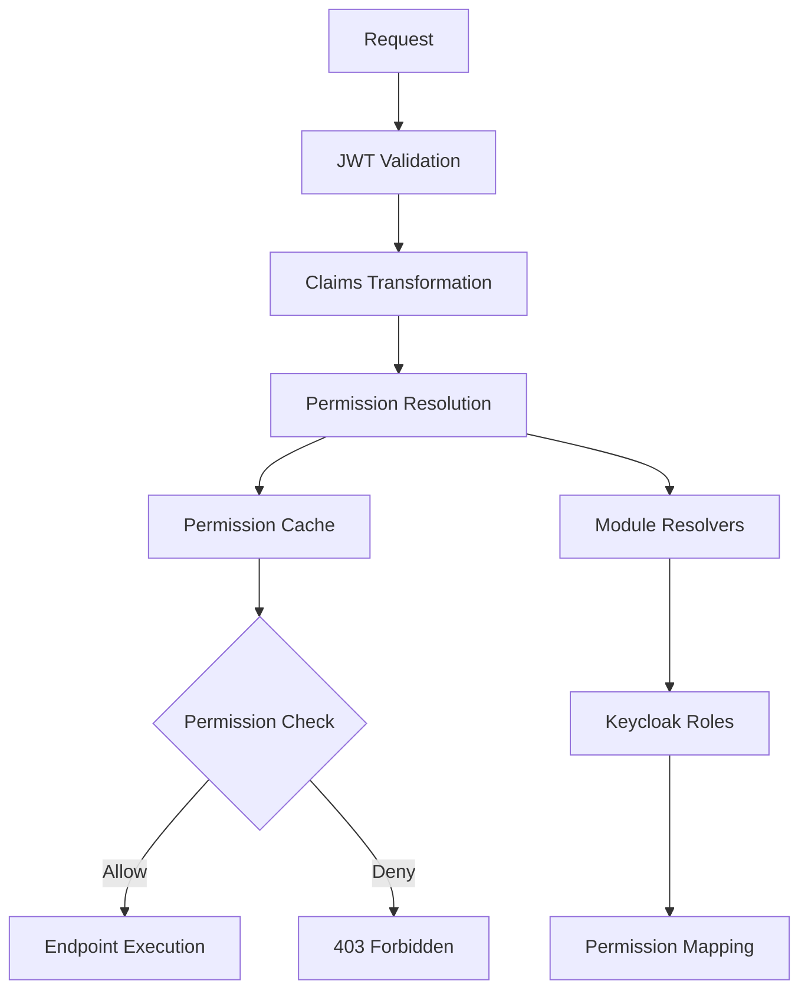

# Authentication and Authorization System

This document covers the complete authentication and authorization system of MeAjudaAi, including integration with Keycloak and the type-safe permission system.

## 📋 Visão Geral

MeAjudaAi uses a robust authentication and authorization system with the following features:

- **Authentication**: Integration with Keycloak using JWT tokens
- **Authorization**: Type-safe system based on enums (`EPermission`)
- **Modular Architecture**: Each module can implement its own permission rules
- **Intelligent Cache**: HybridCache for performance optimization
- **Extensibility**: Support for multiple permission providers

## 🏗️ Arquitetura do Sistema

### Main Components

```text
Authentication & Authorization System
├── Authentication (Keycloak + JWT)
│   ├── JWT Token Validation
│   ├── Claims Transformation
│   └── User Identity Management
│
└── Authorization (Type-Safe Permissions)
    ├── EPermission Enum (Type-Safe)
    ├── Permission Service (Caching + Resolution)
    ├── Module Permission Resolvers
    └── Authorization Handlers
```

### Authorization Flow



## 🔐 Type-Safe Permission System

The system is based on a type-safe enum (`EPermission`), modular architecture, and server-side resolution.

### 1. EPermission Enum

A unified system of type-safe permissions:

```csharp
public enum EPermission
{
    // ===== SYSTEM - GLOBAL =====
    [Display(Name = "system:read")]
    SystemRead,
    
    [Display(Name = "system:write")]
    SystemWrite,
    
    [Display(Name = "system:admin")]
    SystemAdmin,
    
    // ===== USERS MODULE =====
    [Display(Name = "users:read")]
    UsersRead,
    
    [Display(Name = "users:create")]
    UsersCreate,
    
    [Display(Name = "users:update")]
    UsersUpdate,
    
    [Display(Name = "users:delete")]
    UsersDelete,
    
    [Display(Name = "users:list")]
    UsersList,
    
    [Display(Name = "users:profile")]
    UsersProfile,
    
    // ===== ADMIN PERMISSIONS =====
    [Display(Name = "admin:system")]
    AdminSystem,
    
    [Display(Name = "admin:users")]
    AdminUsers,
    
    [Display(Name = "admin:reports")]
    AdminReports
}
```

### 2. IPermissionService

Main interface for permission resolution:

```csharp
public interface IPermissionService
{
    Task<IReadOnlyList<EPermission>> GetUserPermissionsAsync(string userId, CancellationToken cancellationToken = default);
    Task<bool> HasPermissionAsync(string userId, EPermission permission, CancellationToken cancellationToken = default);
    Task<bool> HasPermissionsAsync(string userId, IEnumerable<EPermission> permissions, bool requireAll = true, CancellationToken cancellationToken = default);
    Task<IReadOnlyList<EPermission>> GetUserPermissionsByModuleAsync(string userId, string moduleName, CancellationToken cancellationToken = default);
    Task InvalidateUserPermissionsCacheAsync(string userId, CancellationToken cancellationToken = default);
}
```

### 3. IModulePermissionResolver

Interface for modular permission resolution:

```csharp
public interface IModulePermissionResolver
{
    string ModuleName { get; }
    Task<IReadOnlyList<EPermission>> ResolvePermissionsAsync(string userId, CancellationToken cancellationToken = default);
    bool CanResolve(EPermission permission);
}
```

## 🚀 Implementation

### 1. Configuração Básica

```csharp
// Program.cs in ApiService
using MeAjudaAi.Shared.Authorization;

var builder = WebApplication.CreateBuilder(args);

// Configure the complete authorization system
builder.Services.AddPermissionBasedAuthorization(builder.Configuration);

// Register specific module resolvers
builder.Services.AddModulePermissionResolver<UsersPermissionResolver>();

var app = builder.Build();

// Apply authorization middleware
app.UsePermissionBasedAuthorization();

app.Run();
```

### 2. Module Resolver Implementation

```csharp
// Modules/Users/Application/Authorization/UsersPermissionResolver.cs
public class UsersPermissionResolver : IModulePermissionResolver
{
    private readonly ILogger<UsersPermissionResolver> _logger;
    
    public UsersPermissionResolver(ILogger<UsersPermissionResolver> logger)
    {
        _logger = logger;
    }
    
    public string ModuleName => "Users";
    
    public async Task<IReadOnlyList<EPermission>> ResolvePermissionsAsync(
        string userId, 
        CancellationToken cancellationToken = default)
    {
        try
        {
            // Fetch user roles (simplified example)
            var userRoles = await GetUserRolesAsync(userId, cancellationToken);
            
            var permissions = new HashSet<EPermission>();
            
            foreach (var role in userRoles)
            {
                var rolePermissions = MapRoleToUserPermissions(role);
                foreach (var permission in rolePermissions)
                {
                    permissions.Add(permission);
                }
            }
            
            return permissions.ToList();
        }
        catch (Exception ex)
        {
            _logger.LogError(ex, "Failed to resolve permissions for user {UserId}", userId);
            return Array.Empty<EPermission>();
        }
    }
    
    public bool CanResolve(EPermission permission)
    {
        return permission.GetModule().Equals("users", StringComparison.OrdinalIgnoreCase);
    }
    
    private async Task<IReadOnlyList<string>> GetUserRolesAsync(string userId, CancellationToken cancellationToken)
    {
        // Simulates fetching roles (replace with actual logic)
        await Task.Delay(10, cancellationToken);
        
        if (userId.Contains("admin", StringComparison.OrdinalIgnoreCase))
            return new[] { "admin", "user" };
        if (userId.Contains("manager", StringComparison.OrdinalIgnoreCase))
            return new[] { "manager", "user" };
        
        return new[] { "user" };
    }
    
    private static IEnumerable<EPermission> MapRoleToUserPermissions(string role)
    {
        return role.ToUpperInvariant() switch
        {
            "ADMIN" => new[]
            {
                EPermission.AdminUsers,
                EPermission.UsersRead, EPermission.UsersCreate, 
                EPermission.UsersUpdate, EPermission.UsersDelete, EPermission.UsersList
            },
            "MANAGER" => new[]
            {
                EPermission.UsersRead, EPermission.UsersUpdate, EPermission.UsersList
            },
            "USER" => new[]
            {
                EPermission.UsersRead, EPermission.UsersProfile
            },
            _ => Array.Empty<EPermission>()
        };
    }
}
```

### 3. Usage in Endpoints

```csharp
// Modules/Users/API/Endpoints/UsersEndpoints.cs
public static class UsersEndpoints
{
    public static void MapUsersEndpoints(this IEndpointRouteBuilder app)
    {
        var group = app.MapGroup("/api/users").WithTags("Users");
        
        // GET /api/users - Requires read permission
        group.MapGet("/", GetUsers)
             .RequirePermission(EPermission.UsersRead)
             .WithName("GetUsers")
             .WithSummary("Lists all users");
        
        // POST /api/users - Requires create permission
        group.MapPost("/", CreateUser)
             .RequirePermission(EPermission.UsersCreate)
             .WithName("CreateUser")
             .WithSummary("Creates a new user");
    }
}
```

## 🔍 Keycloak Integration

### Visão Geral

O `UsersPermissionResolver` suporta tanto uma implementação mock (para desenvolvimento/testes) quanto integração com Keycloak (para produção) através de configuração por variável de ambiente.

### Configuração

Defina a variável de ambiente `Authorization:UseKeycloak` no seu `appsettings.json`:

```json
{
  "Authorization": {
    "UseKeycloak": false  // true para usar Keycloak, false para mock
  }
}
```

**Production Configuration (Keycloak):**

```json
{
  "Authorization": {
    "UseKeycloak": true
  },
  "Keycloak": {
    "BaseUrl": "https://your-keycloak-instance.com",
    "Realm": "your-realm",
    "ClientId": "your-client-id",
    "ClientSecret": "your-client-secret",
    "AdminUsername": "admin-user",
    "AdminPassword": "admin-password"
  }
}
```

### Role Mapping

| Role | Permissions |
|------|-------------|
| `meajudaai-system-admin` | `UsersRead`, `UsersUpdate`, `UsersDelete`, `AdminUsers` |
| `meajudaai-user-admin` | `UsersRead`, `UsersUpdate`, `UsersList` |
| `meajudaai-user` | `UsersRead`, `UsersProfile` |

## 🚀 Performance and Caching

The system implements intelligent caching in multiple layers:

```csharp
// Cache per user (30 minutes)
var permissions = await permissionService.GetUserPermissionsAsync(userId);

// Cache per module (15 minutes)
var modulePermissions = await permissionService.GetUserPermissionsByModuleAsync(userId, "Users");

// Selective invalidation
await permissionService.InvalidateUserPermissionsCacheAsync(userId);
```

## 🧪 Testes

### Test Authentication Handler

For tests, use the dedicated authentication handler:

```csharp
// In integration tests
services.AddTestAuthentication(options =>
{
    options.DefaultUserId = "test-user";
    options.DefaultPermissions = new[] 
    { 
        EPermission.UsersRead, 
        EPermission.UsersCreate 
    };
});
```

## 🛠️ Troubleshooting

### Common Issues

1. **403 Forbidden unexpected**
   - Check if the user has the necessary permission
   - Confirm that the cache is not outdated
   - Validate the role mapping in Keycloak

2. **Slow performance**
   - Monitor cache hit ratio metrics
   - Check if modular resolvers are optimized
   - Consider adjusting cache TTL

3. **Invalid JWT tokens**
   - Confirm Keycloak configuration
   - Check if the realm is correct
   - Validate certificates and keys
