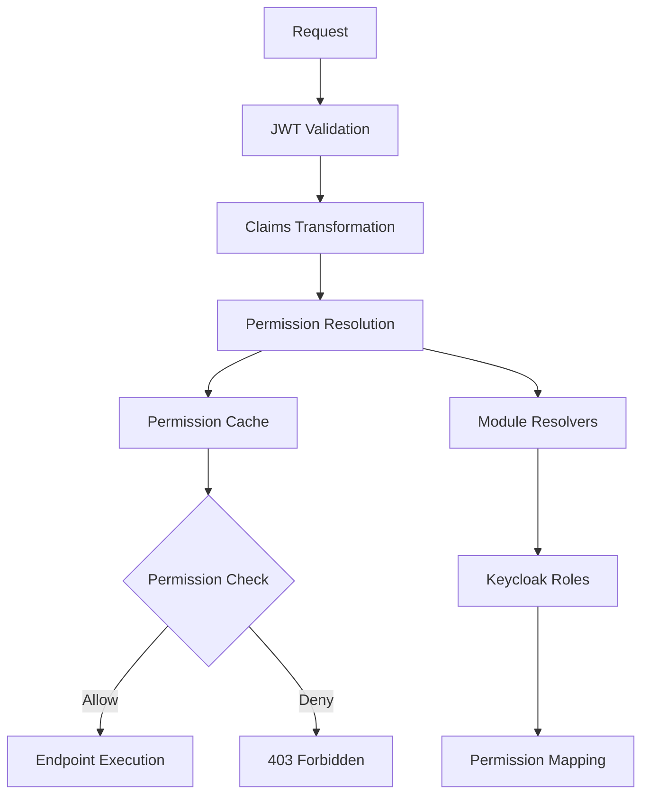

# Authentication and Authorization System

Este documento cobre o sistema completo de autenticação e autorização do MeAjudaAi, incluindo integração com Keycloak e sistema de permissões type-safe.

## 📋 Visão Geral

O MeAjudaAi utiliza um sistema robusto de autenticação e autorização com as seguintes características:

- **Autenticação**: Integração com Keycloak usando JWT tokens
- **Autorização**: Sistema type-safe baseado em enums (`EPermission`)
- **Arquitetura Modular**: Cada módulo pode implementar suas próprias regras de permissão
- **Cache Inteligente**: HybridCache para otimização de desempenho
- **Extensibilidade**: Suporte para múltiplos provedores de permissão

## 🏗️ Arquitetura do Sistema

### Componentes Principais

```
Authentication & Authorization System
├── Authentication (Keycloak + JWT)
│   ├── JWT Token Validation
│   ├── Claims Transformation
│   └── User Identity Management
│
└── Authorization (Type-Safe Permissions)
    ├── EPermission Enum (Type-Safe)
    ├── Permission Service (Caching + Resolution)
    ├── Module Permission Resolvers
    └── Authorization Handlers
```

### Fluxo de Autorização



## 🔐 Sistema de Permissões

### EPermission Enum

O sistema utiliza um enum type-safe para definir todas as permissões:

```
public enum EPermission
{
    // Sistema
    [Display(Name = "system:read")]
    SystemRead,
    
    [Display(Name = "system:admin")]
    SystemAdmin,
    
    // Usuários
    [Display(Name = "users:read")]
    UsersRead,
    
    [Display(Name = "users:create")]
    UsersCreate,
    
    [Display(Name = "users:update")]
    UsersUpdate,
    
    [Display(Name = "users:delete")]
    UsersDelete,
    
    // Administração
    [Display(Name = "admin:system")]
    AdminSystem,
    
    [Display(Name = "admin:users")]
    AdminUsers
}
```

### Uso em Endpoints

```
// Extension methods fluentes
app.MapGet("/api/users", GetUsers)
   .RequirePermission(EPermission.UsersRead);

app.MapPost("/api/users", CreateUser)
   .RequirePermissions(EPermission.UsersCreate, EPermission.UsersUpdate);

app.MapDelete("/api/users/{id}", DeleteUser)
   .RequirePermission(EPermission.UsersDelete);
```
### Verificação Programática

```
// Em controladores ou services
public async Task<IResult> GetUserData(
    ClaimsPrincipal user,
    IPermissionService permissionService)
{
    // Verificação simples
    if (!user.HasPermission(EPermission.UsersRead))
        return Results.Forbid();
    
    // Verificação assíncrona com service
    var userId = user.GetUserId();
    if (!await permissionService.HasPermissionAsync(userId, EPermission.UsersRead))
        return Results.Forbid();
        
    // Múltiplas permissões
    var hasAnyPermission = await permissionService.HasPermissionsAsync(
        userId, 
        [EPermission.UsersRead, EPermission.AdminUsers], 
        requireAll: false);
    
    return Results.Ok(/* data */);
}
```
## ⚙️ Configuração

### 1. Configuração Básica

```
// Program.cs
using MeAjudaAi.Shared.Authorization;

var builder = WebApplication.CreateBuilder(args);

// Adiciona o sistema completo de autorização
builder.Services.AddPermissionBasedAuthorization(builder.Configuration);

// Adiciona resolvers específicos de módulos
builder.Services.AddModulePermissionResolver<UsersPermissionResolver>();

var app = builder.Build();

// Aplica middleware de autorização
app.UsePermissionBasedAuthorization();
```
### 2. Configuração do Keycloak

```
// appsettings.json
{
  "Keycloak": {
    "BaseUrl": "http://localhost:8080",
    "Realm": "meajudaai",
    "AdminClientId": "admin-cli",
    "AdminClientSecret": "your-client-secret"
  },
  "Authentication": {
    "Keycloak": {
      "Authority": "http://localhost:8080/realms/meajudaai",
      "Audience": "account",
      "MetadataAddress": "http://localhost:8080/realms/meajudaai/.well-known/openid_configuration",
      "RequireHttpsMetadata": false
    }
  }
}
```

### 3. Configuração de Autenticação JWT

```
builder.Services.AddAuthentication(JwtBearerDefaults.AuthenticationScheme)
    .AddJwtBearer(options =>
    {
        options.Authority = "http://localhost:8080/realms/meajudaai";
        options.Audience = "meajudaai-client";
        options.RequireHttpsMetadata = false; // Apenas para desenvolvimento
    });
```

### 4. Setup Local com Docker

```
# Quick setup com Keycloak standalone
docker compose -f infrastructure/compose/standalone/keycloak-only.yml up -d

# Ou ambiente completo de desenvolvimento
docker compose -f infrastructure/compose/environments/development.yml up -d
```
## 🏗️ Implementação Modular

### Permission Resolver por Módulo

Cada módulo pode implementar sua própria lógica de resolução de permissões:

```
public class UsersPermissionResolver : IModulePermissionResolver
{
    public string ModuleName => "Users";
    
    public async Task<IReadOnlyList<EPermission>> ResolvePermissionsAsync(
        string userId, 
        CancellationToken cancellationToken = default)
    {
        // Lógica específica do módulo para resolver permissões
        var userRoles = await GetUserRolesAsync(userId, cancellationToken);
        
        var permissions = new HashSet<EPermission>();
        
        foreach (var role in userRoles)
        {
            var rolePermissions = role switch
            {
                "admin" => new[] 
                { 
                    EPermission.UsersRead, 
                    EPermission.UsersCreate, 
                    EPermission.UsersUpdate, 
                    EPermission.UsersDelete 
                },
                "manager" => new[] 
                { 
                    EPermission.UsersRead, 
                    EPermission.UsersUpdate 
                },
                "user" => new[] { EPermission.UsersRead },
                _ => Array.Empty<EPermission>()
            };
            
            foreach (var permission in rolePermissions)
            {
                permissions.Add(permission);
            }
        }
        
        return permissions.ToArray();
    }
    
    public bool CanResolve(EPermission permission)
    {
        // Verifica se este resolver pode lidar com a permissão
        return permission.GetModule().Equals("users", StringComparison.OrdinalIgnoreCase);
    }
    
    private IEnumerable<EPermission> MapRoleToPermissions(string role)
    {
        return role.ToLowerInvariant() switch
        {
            "user-admin" => new[] { 
                EPermission.UsersRead, 
                EPermission.UsersCreate, 
                EPermission.UsersUpdate, 
                EPermission.UsersDelete 
            },
            "user-operator" => new[] { 
                EPermission.UsersRead, 
                EPermission.UsersUpdate 
            },
            "user" => new[] { EPermission.UsersRead },
            _ => Array.Empty<EPermission>()
        };
    }
}
```
### Registro do Resolver

```
// Na configuração do módulo
public static class UsersModuleExtensions
{
    public static IServiceCollection AddUsersModule(this IServiceCollection services)
    {
        // Registra o resolver de permissões do módulo
        services.AddModulePermissionResolver<UsersPermissionResolver>();
        
        return services;
    }
}
```
## 🚀 Desempenho e Cache

### Sistema de Cache

O sistema implementa cache inteligente em múltiplas camadas:

```
// Cache por usuário (30 minutos)
var permissions = await permissionService.GetUserPermissionsAsync(userId);

// Cache por módulo (15 minutos)  
var modulePermissions = await permissionService.GetUserPermissionsByModuleAsync(userId, "Users");

// Invalidação seletiva
await permissionService.InvalidateUserPermissionsCacheAsync(userId);
```
### Métricas e Monitoramento

O sistema coleta métricas detalhadas:

- Tempo de resolução de permissões
- Taxa de acerto do cache
- Falhas de autorização
- Desempenho por módulo

```
// Métricas são coletadas automaticamente
// Consulte /metrics para Prometheus ou Application Insights
```
## 🔍 Keycloak Integration

### Setup do Realm

O realm do Keycloak inclui:
- **Realm**: `meajudaai`
- **Client ID**: `meajudaai-client`
- **Redirect URIs**: `http://localhost:*`
- **Usuários padrão**:
  - Admin: `admin@meajudaai.com` / `admin123`
  - User: `user@meajudaai.com` / `user123`

### Mapeamento de Roles

Roles do Keycloak são automaticamente mapeados para permissões:

```
// Configuração no KeycloakPermissionResolver
private static IEnumerable<EPermission> MapKeycloakRoleToPermissions(string roleName)
{
    return roleName.ToLowerInvariant() switch
    {
        "meajudaai-system-admin" => new[]
        {
            EPermission.AdminSystem,
            EPermission.AdminUsers,
            EPermission.UsersRead,
            EPermission.UsersCreate,
            EPermission.UsersUpdate,
            EPermission.UsersDelete
        },
        "meajudaai-user-admin" => new[]
        {
            EPermission.AdminUsers,
            EPermission.UsersRead,
            EPermission.UsersCreate,
            EPermission.UsersUpdate
        },
        "meajudaai-user" => new[]
        {
            EPermission.UsersRead
        },
        _ => Array.Empty<EPermission>()
    };
}
```
### Claims Mapping

O sistema mapeia claims do Keycloak:
- `sub` → User ID
- `email` → Email address
- `preferred_username` → Username
- `realm_access.roles` → User roles

## 🧪 Testing

### Test Authentication Handler

Para testes, utilize o handler de autenticação dedicado:

```
// Em testes de integração
services.AddTestAuthentication(options =>
{
    options.DefaultUserId = "test-user";
    options.DefaultPermissions = new[] 
    { 
        EPermission.UsersRead, 
        EPermission.UsersCreate 
    };
});
```
### Testes Unitários

```
[Test]
public async Task ShouldAllowUserWithPermission()
{
    // Arrange
    var user = CreateTestUser(EPermission.UsersRead);
    
    // Act
    var result = await endpoint.HandleAsync(user);
    
    // Assert
    result.Should().BeOfType<Ok<UserDto>>();
}
```
## 📚 Exemplos Avançados

### Permissões Contextuais

```
public async Task<IResult> UpdateUser(
    int userId,
    UpdateUserDto dto,
    ClaimsPrincipal currentUser,
    IPermissionService permissionService)
{
    var currentUserId = currentUser.GetUserId();
    
    // Admin pode editar qualquer usuário
    if (await permissionService.HasPermissionAsync(currentUserId, EPermission.AdminUsers))
        return await UpdateUserInternal(userId, dto);
    
    // Usuário pode editar apenas seu próprio perfil
    if (currentUserId == userId.ToString() && 
        await permissionService.HasPermissionAsync(currentUserId, EPermission.UsersProfile))
        return await UpdateUserInternal(userId, dto);
    
    return Results.Forbid();
}
```
### Extension Methods Customizados

```
public static class CustomPermissionExtensions
{
    public static bool CanManageUser(this ClaimsPrincipal user, string targetUserId)
    {
        // Admin pode gerenciar qualquer usuário
        if (user.HasPermission(EPermission.AdminUsers))
            return true;
        
        // Usuário pode gerenciar apenas a si mesmo
        return user.GetUserId() == targetUserId && 
               user.HasPermission(EPermission.UsersProfile);
    }
}
```
## 🛠️ Troubleshooting

### Problemas Comuns

1. **403 Forbidden inesperado**
   - Verifique se o usuário possui a permissão necessária
   - Confirme se o cache não está desatualizado
   - Valide o mapeamento de roles no Keycloak

2. **Desempenho lento**
   - Monitore métricas de cache hit ratio
   - Verifique se resolvers modulares estão otimizados
   - Considere ajustar TTL do cache

3. **Tokens JWT inválidos**
   - Confirme configuração do Keycloak
   - Verifique se o realm está correto
   - Valide certificados e chaves

### Debug e Logs

```
// Habilitar logs detalhados
builder.Logging.SetMinimumLevel(LogLevel.Debug);
builder.Logging.AddFilter("MeAjudaAi.Shared.Authorization", LogLevel.Trace);
```
## 📋 Checklist de Implementação

- [ ] Configurar Keycloak realm
- [ ] Implementar Permission Resolver do módulo
- [ ] Adicionar permissões nos endpoints
- [ ] Configurar cache e métricas
- [ ] Implementar testes de autorização
- [ ] Validar desempenho em produção

---

## Production Deployment

### Environment Configuration

In production, ensure the following environment variables are set:

```
Authentication__Keycloak__Authority=https://your-keycloak-domain/realms/meajudaai
Authentication__Keycloak__RequireHttpsMetadata=true
Authentication__Keycloak__Audience=account
```
### Security Considerations

1. **HTTPS Required**: Always use HTTPS in production
2. **Token Validation**: Ensure proper token signature validation
3. **Audience Validation**: Validate the token audience claim
4. **Issuer Validation**: Validate the token issuer claim

### SSL/TLS Configuration

For production deployments, configure SSL certificates:
- Use valid SSL certificates for Keycloak
- Configure proper trust store if using custom certificates
- Ensure certificate chain validation

## 📖 Documentação Relacionada

### Documentação Especializada
- **[Guia de Implementação de Autorização](./authorization_implementation.md)** - Guia completo para implementar autorização type-safe
- **[Sistema de Permissões Type-Safe](./type_safe_permissions.md)** - Detalhes do sistema baseado em EPermission
- **[Resolução Server-Side de Permissões](./server_side_permissions.md)** - Guia para resolução de permissões no servidor

### Desenvolvimento e Testes
- **[Test Authentication Handler](./development.md#3-test-authentication-handler)** - Handler configurável para cenários de teste
- **[Exemplos de Teste de Auth](./development.md#10-testing-best-practices)** - Exemplos práticos de autenticação em testes

### Arquitetura e Operações
- **[Guias de Desenvolvimento](./development.md)** - Diretrizes gerais de desenvolvimento
- **[Arquitetura do Sistema](./architecture.md)** - Visão geral da arquitetura
- **[CI/CD e Infraestrutura](./ci_cd.md)** - Configuração de pipeline e deploy

## Troubleshooting

### Common Issues

1. **Token Validation Errors**
   - Check authority URL configuration
   - Verify metadata endpoint accessibility
   - Ensure proper audience configuration

2. **CORS Issues**
   - Configure allowed origins in Keycloak client
   - Set proper CORS headers in application

3. **Certificate Issues**
   - Verify SSL certificate validity
   - Check certificate trust chain
   - Configure proper certificate validation

4. **Permission Resolution Errors**
   - Verify module permission resolvers are registered
   - Check EPermission enum mapping
   - Validate cache configuration

### Debug Logging

Enable authentication debug logging in `appsettings.Development.json`:

```
{
  "Logging": {
    "LogLevel": {
      "Microsoft.AspNetCore.Authentication": "Debug",
      "Microsoft.AspNetCore.Authorization": "Debug",
      "MeAjudaAi.Shared.Authorization": "Debug"
    }
  }
}
```
### Health Checks

The application includes authentication health checks:
- Keycloak connectivity
- Token validation endpoint
- Metadata endpoint accessibility
- Permission service availability

## API Documentation

The Swagger UI includes authentication support:
1. Click "Authorize" button
2. Enter JWT token in format: `Bearer <token>`
3. Test authenticated endpoints

For obtaining tokens during development, see the [testing documentation](./development.md#3-test-authentication-handler).