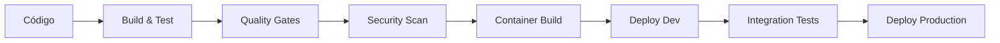

# Guia de Configuração de CI/CD e Segurança - MeAjudaAi

Este documento detalha a configuração, estratégias de CI/CD e correções de segurança para o projeto MeAjudaAi.

## 🔒 Correções de Segurança

### Problemas Corrigidos

#### 1. Requisito de Licença do Gitleaks
**Problema**: Gitleaks v2 agora requer uma licença para repositórios de organizações, causando falhas no pipeline de CI/CD.

**Solução**: 
- Adicionada execução condicional para Gitleaks baseada na disponibilidade de licença
- Adicionado TruffleHog como scanner de segredos alternativo que sempre executa
- Ambos os scanners falham o workflow quando segredos são detectados (aplicação rigorosa)

#### 2. Erro de Regex do Lychee Link Checker
**Problema**: Padrões regex inválidos no arquivo `.lycheeignore` causando erros de parse.

**Solução**: 
- Corrigidos padrões glob alterando `*/bin/*` para `**/bin/**`
- Atualizados todos os padrões para usar sintaxe glob adequada

#### 3. Ponto Cego de Segurança na Allowlist do Gitleaks
**Problema**: A configuração estava excluindo arquivos `appsettings.Development.json` da varredura de segredos.

**Solução**: 
- Removido `appsettings.Development.json` da allowlist do gitleaks
- Mantidos apenas arquivos de template/exemplo na allowlist
- Aprimorada cobertura de segurança para arquivos de configuração de desenvolvimento

#### 4. Aplicação do Workflow do Scanner de Segredos
**Problema**: Os scanners de segurança tinham `continue-on-error: true` permitindo que PRs passassem mesmo quando segredos eram detectados.

**Solução**: 
- Removido `continue-on-error: true` de ambos os passos Gitleaks e TruffleHog
- Atualizado branch base do TruffleHog para dinâmico `${{ github.event.pull_request.base.ref }}`
- **Crítico**: Validação de PR agora bloqueia merges quando segredos são detectados

### Configuração Atual de Varredura de Segurança

O pipeline de CI/CD agora inclui:

1. **Gitleaks** (execução condicional com modo de falha rigoroso)
   - Varre segredos no histórico git
   - Executa apenas quando o secret GITLEAKS_LICENSE está disponível
   - **FALHA o workflow se segredos são detectados**
   - Bloqueia merges de PR quando segredos são encontrados

2. **TruffleHog** (scanner complementar)
   - Scanner de segredos open-source gratuito
   - Executa independentemente do status da licença Gitleaks
   - Foca apenas em segredos verificados
   - **FALHA o workflow se segredos são detectados**

3. **Lychee Link Checker**
   - Valida links Markdown
   - Usa padrões glob adequados para exclusões
   - Cacheia resultados para performance

### Opcional: Adicionando Licença do Gitleaks

Se você deseja usar a funcionalidade completa do Gitleaks:

1. Adquira uma licença em [gitleaks.io](https://gitleaks.io)
2. Adicione a licença como um secret do repositório GitHub chamado `GITLEAKS_LICENSE`
3. O workflow automaticamente usará a versão licenciada quando disponível

### Configurando o Secret GITLEAKS_LICENSE

1. Vá para as Configurações do seu repositório
2. Navegue para Secrets and variables → Actions
3. Clique em "New repository secret"
4. Nome: `GITLEAKS_LICENSE`
5. Valor: Sua chave de licença adquirida
6. Clique em "Add secret"

### Monitorando Varreduras de Segurança

Ambos os scanners de segurança irão:
- Executar em cada pull request
- Gerar relatórios detalhados nos logs do workflow
- **FALHAR o workflow se segredos são detectados** 
- **BLOQUEAR merges de PR quando problemas de segurança são encontrados**
- Fornecer resumos na interface do GitHub Actions

Para visualizar resultados:
1. Vá para a aba Actions no seu repositório
2. Clique na execução específica do workflow
3. Verifique o job "Secret Detection" para resultados da varredura de segurança
4. **X vermelho indica que segredos foram encontrados e PR está bloqueado**
5. **Marca verde indica que nenhum segredo foi detectado**

## 🚀 Estratégia de CI/CD

### **Azure DevOps**: Pipeline Principal
- **Build**: Compilação, testes e análise de qualidade
- **Deploy**: Deploy automatizado para ambientes Azure
- **Integração**: Integração com Azure Developer CLI (azd)

### **GitHub Actions**: Pipeline Alternativo
- Configuração pronta para repositórios GitHub
- Workflows para PR validation e deployment
- Integração com GitHub Container Registry

## 🏗️ Arquitetura dos Pipelines


### Ambientes de Deploy

| Ambiente | Trigger | Aprovação | Recursos Azure |
|----------|---------|-----------|----------------|
| **Development** | Push to `develop` | Automático | Basic tier, reset diário |
| **Production** | Manual/Tag | Manual | Full production, alta disponibilidade |

## 📋 Configuração do Azure DevOps

### Service Connections

#### Azure Resource Manager
```yaml
# Configuração da Service Connection
connectionType: AzureRM
subscriptionId: "your-subscription-id"
subscriptionName: "Azure Subscription"
resourceGroupName: "rg-meajudaai"
servicePrincipalId: "app-id"
authenticationType: ServicePrincipal
```

#### Azure Container Registry
```yaml
# Connection para ACR
registryType: Azure Container Registry
azureSubscription: "Azure Subscription"
azureContainerRegistry: "acrmeajudaai.azurecr.io"

### Pipeline de Build (`azure-pipelines.yml`)

```yaml
trigger:
  branches:
    include:
      - main
      - develop
  paths:
    exclude:
      - README.md
      - docs/**

variables:
  - group: 'MeAjudaAi-Variables'
  - name: BuildConfiguration
    value: 'Release'
  - name: DotNetVersion
    value: '9.x'

stages:
  - stage: Build
    displayName: 'Build & Test'
    jobs:
      - job: BuildJob
        displayName: 'Build Solution'
        pool:
          vmImage: 'ubuntu-latest'
        
        steps:
          - task: UseDotNet@2
            displayName: 'Use .NET $(DotNetVersion)'
            inputs:
              packageType: 'sdk'
              version: '$(DotNetVersion)'
          
          - task: DotNetCoreCLI@2
            displayName: 'Restore NuGet Packages'
            inputs:
              command: 'restore'
              projects: '**/*.csproj'
          
          - task: DotNetCoreCLI@2
            displayName: 'Build Solution'
            inputs:
              command: 'build'
              projects: '**/*.csproj'
              arguments: '--configuration $(BuildConfiguration) --no-restore'
          
          - task: DotNetCoreCLI@2
            displayName: 'Run Unit Tests'
            inputs:
              command: 'test'
              projects: '**/tests/**/*.csproj'
              arguments: '--configuration $(BuildConfiguration) --no-build --collect:"XPlat Code Coverage" --logger trx --results-directory $(Agent.TempDirectory)'
          
          - task: PublishTestResults@2
            displayName: 'Publish Test Results'
            inputs:
              testResultsFormat: 'VSTest'
              testResultsFiles: '**/*.trx'
              searchFolder: '$(Agent.TempDirectory)'
          
          - task: PublishCodeCoverageResults@1
            displayName: 'Publish Code Coverage'
            inputs:
              codeCoverageTool: 'Cobertura'
              summaryFileLocation: '$(Agent.TempDirectory)/**/coverage.cobertura.xml'

  - stage: Security
    displayName: 'Security Analysis'
    dependsOn: Build
    jobs:
      - job: SecurityScan
        displayName: 'Security Scanning'
        pool:
          vmImage: 'ubuntu-latest'
        
        steps:
          - task: CredScan@3
            displayName: 'Credential Scanner'
          
          - task: SonarCloudPrepare@1
            displayName: 'Prepare SonarCloud Analysis'
            inputs:
              SonarCloud: 'SonarCloud-Connection'
              organization: 'meajudaai'
              scannerMode: 'MSBuild'
              projectKey: 'MeAjudaAi'
          
          - task: SonarCloudAnalyze@1
            displayName: 'Run SonarCloud Analysis'
          
          - task: SonarCloudPublish@1
            displayName: 'Publish SonarCloud Results'

  - stage: Package
    displayName: 'Package Application'
    dependsOn: Security
    jobs:
      - job: ContainerBuild
        displayName: 'Build Container Images'
        pool:
          vmImage: 'ubuntu-latest'
        
        steps:
          - task: Docker@2
            displayName: 'Build API Image'
            inputs:
              containerRegistry: 'ACR-Connection'
              repository: 'meajudaai/api'
              command: 'buildAndPush'
              Dockerfile: 'src/Bootstrapper/MeAjudaAi.ApiService/Dockerfile'
              tags: |
                $(Build.BuildNumber)
                latest

  - stage: DeployDev
    displayName: 'Deploy to Development'
    dependsOn: Package
    condition: and(succeeded(), eq(variables['Build.SourceBranch'], 'refs/heads/develop'))
    jobs:
      - deployment: DeployToDev
        displayName: 'Deploy to Development Environment'
        environment: 'Development'
        pool:
          vmImage: 'ubuntu-latest'
        
        strategy:
          runOnce:
            deploy:
              steps:
                - task: AzureCLI@2
                  displayName: 'Install Azure Developer CLI'
                  inputs:
                    azureSubscription: 'Azure-Connection'
                    scriptType: 'bash'
                    scriptLocation: 'inlineScript'
                    inlineScript: |
                      # Install Azure Developer CLI
                      echo "Installing Azure Developer CLI..."
                      curl -fsSL https://aka.ms/install-azd.sh | bash
                      
                      # Verify installation
                      if ! command -v azd &> /dev/null; then
                        echo "❌ Failed to install Azure Developer CLI"
                        exit 1
                      fi
                      
                      echo "✅ Azure Developer CLI installed successfully"
                      azd version
                
                - task: AzureCLI@2
                  displayName: 'Deploy Infrastructure'
                  inputs:
                    azureSubscription: 'Azure-Connection'
                    scriptType: 'bash'
                    scriptLocation: 'inlineScript'
                    inlineScript: |
                      azd provision --environment development
                
                - task: AzureCLI@2
                  displayName: 'Deploy Application'
                  inputs:
                    azureSubscription: 'Azure-Connection'
                    scriptType: 'bash'
                    scriptLocation: 'inlineScript'
                    inlineScript: |
                      azd deploy --environment development

  - stage: DeployProduction
    displayName: 'Deploy to Production'
    dependsOn: Package
    condition: and(succeeded(), eq(variables['Build.SourceBranch'], 'refs/heads/main'))
    jobs:
      - deployment: DeployToProduction
        displayName: 'Deploy to Production Environment'
        environment: 'Production'
        pool:
          vmImage: 'ubuntu-latest'
        
        strategy:
          runOnce:
            deploy:
              steps:
                - task: AzureCLI@2
                  displayName: 'Install Azure Developer CLI'
                  inputs:
                    azureSubscription: 'Azure-Connection'
                    scriptType: 'bash'
                    scriptLocation: 'inlineScript'
                    inlineScript: |
                      # Install Azure Developer CLI
                      echo "Installing Azure Developer CLI..."
                      curl -fsSL https://aka.ms/install-azd.sh | bash
                      
                      # Verify installation
                      if ! command -v azd &> /dev/null; then
                        echo "❌ Failed to install Azure Developer CLI"
                        exit 1
                      fi
                      
                      echo "✅ Azure Developer CLI installed successfully"
                      azd version
                
                - task: AzureCLI@2
                  displayName: 'Deploy to Production'
                  inputs:
                    azureSubscription: 'Azure-Connection'
                    scriptType: 'bash'
                    scriptLocation: 'inlineScript'
                    inlineScript: |
                      azd up --environment production

### Variable Groups

#### MeAjudaAi-Variables
```yaml
variables:
  # Azure Configuration
  - name: AzureSubscriptionId
    value: "your-subscription-id"
  - name: AzureResourceGroup
    value: "rg-meajudaai"
  - name: ContainerRegistry
    value: "acrmeajudaai.azurecr.io"
  
  # Application Configuration
  - name: ApplicationName
    value: "MeAjudaAi"
  - name: DotNetVersion
    value: "9.x"
  
  # Quality Gates
  - name: CodeCoverageThreshold
    value: "80"
  - name: SonarQualityGate
    value: "OK"

#### MeAjudaAi-Secrets (Key Vault)
```yaml
secrets:
  # Database
  - name: PostgresConnectionString
    source: KeyVault
    vault: "kv-meajudaai"
    secret: "postgres-connection-string"
  
  # Keycloak
  - name: KeycloakClientSecret
    source: KeyVault
    vault: "kv-meajudaai"
    secret: "keycloak-client-secret"
  
  # Monitoring
  - name: ApplicationInsightsKey
    source: KeyVault
    vault: "kv-meajudaai"
    secret: "appinsights-instrumentation-key"

## 🐙 Configuração do GitHub Actions

### Workflow Principal (`.github/workflows/ci-cd.yml`)

```yaml
name: CI/CD Pipeline

on:
  push:
    branches: [main, develop]
  pull_request:
    branches: [main]

env:
  DOTNET_VERSION: '9.x'
  AZURE_WEBAPP_NAME: 'meajudaai-api'
  REGISTRY: ghcr.io
  IMAGE_NAME: meajudaai/api

jobs:
  build-and-test:
    runs-on: ubuntu-latest
    
    steps:
      - name: Checkout code
        uses: actions/checkout@v6
      
      - name: Setup .NET
        uses: actions/setup-dotnet@v5
        with:
          dotnet-version: ${{ env.DOTNET_VERSION }}
      
      - name: Restore dependencies
        run: dotnet restore
      
      - name: Build solution
        run: dotnet build --no-restore --configuration Release
      
      - name: Run tests
        run: dotnet test --no-build --configuration Release --collect:"XPlat Code Coverage"
      
      - name: Upload coverage to Codecov
        uses: codecov/codecov-action@v3
        with:
          token: ${{ secrets.CODECOV_TOKEN }}
  
  security-scan:
    runs-on: ubuntu-latest
    needs: build-and-test
    
    steps:
      - name: Checkout code
        uses: actions/checkout@v6
      
      - name: Run CodeQL Analysis
        uses: github/codeql-action/init@v2
        with:
          languages: csharp
      
      - name: Autobuild
        uses: github/codeql-action/autobuild@v2
      
      - name: Perform CodeQL Analysis
        uses: github/codeql-action/analyze@v2
  
  build-container:
    runs-on: ubuntu-latest
    needs: [build-and-test, security-scan]
    if: github.ref == 'refs/heads/main' || github.ref == 'refs/heads/develop'
    
    permissions:
      contents: read
      packages: write
    
    steps:
      - name: Checkout code
        uses: actions/checkout@v6
      
      - name: Login to Container Registry
        uses: docker/login-action@v2
        with:
          registry: ${{ env.REGISTRY }}
          username: ${{ github.actor }}
          password: ${{ secrets.GITHUB_TOKEN }}
      
      - name: Extract metadata
        id: meta
        uses: docker/metadata-action@v4
        with:
          images: ${{ env.REGISTRY }}/${{ env.IMAGE_NAME }}
          tags: |
            type=ref,event=branch
            type=sha,prefix={{branch}}-
            type=raw,value=latest,enable={{is_default_branch}}
      
      - name: Build and push Docker image
        uses: docker/build-push-action@v4
        with:
          context: .
          file: src/Bootstrapper/MeAjudaAi.ApiService/Dockerfile
          push: true
          tags: ${{ steps.meta.outputs.tags }}
          labels: ${{ steps.meta.outputs.labels }}
  
  deploy-dev:
    runs-on: ubuntu-latest
    needs: build-container
    if: github.ref == 'refs/heads/develop'
    environment: development
    
    steps:
      - name: Checkout code
        uses: actions/checkout@v6
      
      - name: Azure Login
        uses: azure/login@v1
        with:
          creds: ${{ secrets.AZURE_CREDENTIALS }}
      
      - name: Install Azure Developer CLI
        run: |
          curl -fsSL https://aka.ms/install-azd.sh | bash
      
      - name: Deploy to Development
        run: |
          azd provision --environment development
          azd deploy --environment development
  
  deploy-production:
    runs-on: ubuntu-latest
    needs: build-container
    if: github.ref == 'refs/heads/main'
    environment: production
    
    steps:
      - name: Checkout code
        uses: actions/checkout@v6
      
      - name: Azure Login
        uses: azure/login@v1
        with:
          creds: ${{ secrets.AZURE_CREDENTIALS }}
      
      - name: Install Azure Developer CLI
        run: |
          curl -fsSL https://aka.ms/install-azd.sh | bash
      
      - name: Deploy to Production
        run: |
          azd up --environment production

### Workflow de PR Validation

```yaml
name: PR Validation

on:
  pull_request:
    branches: [main, develop]

jobs:
  validate:
    runs-on: ubuntu-latest
    
    steps:
      - name: Checkout code
        uses: actions/checkout@v6
      
      - name: Setup .NET
        uses: actions/setup-dotnet@v5
        with:
          dotnet-version: '9.x'
      
      - name: Restore dependencies
        run: dotnet restore
      
      - name: Build solution
        run: dotnet build --no-restore
      
      - name: Run tests
        run: dotnet test --no-build --collect:"XPlat Code Coverage"
      
      - name: Check code formatting
        run: dotnet format --verify-no-changes
      
      - name: Run static analysis
        run: dotnet run --project tools/StaticAnalysis

## 🔧 Scripts de Setup

### `setup-cicd.ps1` (Windows)

```powershell
# Setup completo de CI/CD para Windows
param(
    [string]$Environment = "development",
    [switch]$IncludeInfrastructure = $false
)

Write-Host "🚀 Configurando CI/CD para MeAjudaAi..." -ForegroundColor Green

# Verificar pré-requisitos
$requiredTools = @("az", "azd", "dotnet", "docker")
foreach ($tool in $requiredTools) {
    if (!(Get-Command $tool -ErrorAction SilentlyContinue)) {
        Write-Error "❌ $tool não encontrado. Instale antes de continuar."
        exit 1
    }
}

# Login no Azure
Write-Host "🔐 Fazendo login no Azure..." -ForegroundColor Yellow
az login

# Configurar Azure Developer CLI
Write-Host "⚙️ Configurando Azure Developer CLI..." -ForegroundColor Yellow
azd auth login
azd init --environment $Environment

if ($IncludeInfrastructure) {
    Write-Host "🏗️ Provisionando infraestrutura..." -ForegroundColor Yellow
    azd provision --environment $Environment
}

# Configurar secrets
Write-Host "🔑 Configurando secrets..." -ForegroundColor Yellow

# Generate secure random passwords using .NET cryptography
$rng = [System.Security.Cryptography.RandomNumberGenerator]::Create()

# Generate 32 bytes for POSTGRES_PASSWORD
$postgresBytes = New-Object byte[] 32
$rng.GetBytes($postgresBytes)
$postgresPassword = [Convert]::ToBase64String($postgresBytes)

# Generate 32 bytes for KEYCLOAK_ADMIN_PASSWORD  
$keycloakBytes = New-Object byte[] 32
$rng.GetBytes($keycloakBytes)
$keycloakPassword = [Convert]::ToBase64String($keycloakBytes)

# Generate 64 bytes for JWT_SECRET
$jwtBytes = New-Object byte[] 64
$rng.GetBytes($jwtBytes)
$jwtSecret = [Convert]::ToBase64String($jwtBytes)

$rng.Dispose()

$secrets = @{
    "POSTGRES_PASSWORD" = $postgresPassword
    "KEYCLOAK_ADMIN_PASSWORD" = $keycloakPassword
    "JWT_SECRET" = $jwtSecret
}

foreach ($secret in $secrets.GetEnumerator()) {
    azd env set $secret.Key $secret.Value --environment $Environment
}

Write-Host "✅ Setup de CI/CD concluído!" -ForegroundColor Green
Write-Host "🌐 Dashboard: https://portal.azure.com" -ForegroundColor Cyan

### `setup-ci-only.ps1` (Apenas CI)

```powershell
# Setup apenas para CI/CD sem provisioning
param(
    [string]$SubscriptionId,
    [string]$ResourceGroup = "rg-meajudaai",
    [string]$ServicePrincipalName = "sp-meajudaai-cicd"
)

Write-Host "🔧 Configurando CI/CD (apenas configuração)..." -ForegroundColor Green

# Criar Service Principal para CI/CD
Write-Host "👤 Criando Service Principal..." -ForegroundColor Yellow
$sp = az ad sp create-for-rbac --name $ServicePrincipalName --role Contributor --scopes "/subscriptions/$SubscriptionId" --sdk-auth | ConvertFrom-Json

# Configurar secrets para GitHub
$secrets = @{
    "AZURE_CREDENTIALS" = ($sp | ConvertTo-Json -Depth 10)
    "AZURE_SUBSCRIPTION_ID" = $SubscriptionId
    "AZURE_RESOURCE_GROUP" = $ResourceGroup
}

# Save secrets to secure temporary file instead of displaying in console
$secretsFile = Join-Path $env:TEMP "meajudaai-secrets-$(Get-Date -Format 'yyyyMMdd-HHmmss').json"
$secrets | ConvertTo-Json | Out-File -FilePath $secretsFile -Encoding UTF8

Write-Host "🔑 Secrets salvos com segurança em: $secretsFile" -ForegroundColor Cyan
Write-Host "📋 Configure os secrets no GitHub/Azure DevOps:" -ForegroundColor Yellow
Write-Host "   1. Abra: Settings > Secrets and variables > Actions" -ForegroundColor White
Write-Host "   2. Para cada secret no arquivo JSON, clique 'New repository secret'" -ForegroundColor White
Write-Host "   3. Copie o nome e valor do arquivo (não do console)" -ForegroundColor White
Write-Host "⚠️  Lembre-se de deletar o arquivo após uso: Remove-Item '$secretsFile'" -ForegroundColor Red

# Alternative: Direct GitHub CLI integration (if gh CLI is available)
if (Get-Command gh -ErrorAction SilentlyContinue) {
    Write-Host "" -ForegroundColor White
    Write-Host "💡 Alternativa com GitHub CLI:" -ForegroundColor Cyan
    
    # Create individual secret files to avoid credential exposure
    $azureCredsFile = Join-Path $env:TEMP "azure-creds-$(Get-Date -Format 'yyyyMMdd-HHmmss').json"
    $secrets['AZURE_CREDENTIALS'] | Out-File -FilePath $azureCredsFile -Encoding UTF8 -NoNewline
    
    Write-Host "   # Configure secrets automaticamente (execute uma por vez):" -ForegroundColor Gray
    Write-Host "   gh secret set AZURE_CREDENTIALS < `"$azureCredsFile`"" -ForegroundColor White
    Write-Host "   echo '$SubscriptionId' | gh secret set AZURE_SUBSCRIPTION_ID" -ForegroundColor White  
    Write-Host "   echo '$ResourceGroup' | gh secret set AZURE_RESOURCE_GROUP" -ForegroundColor White
    Write-Host "   Remove-Item `"$azureCredsFile`" # Limpar depois" -ForegroundColor Yellow
}

Write-Host "✅ Configuração de CI/CD (apenas setup) concluída!" -ForegroundColor Green

## 📊 Monitoramento e Métricas

### Quality Gates

#### Build Quality
- ✅ Compilação sem erros ou warnings
- ✅ Cobertura de código > 80%
- ✅ Testes unitários 100% passing
- ✅ Análise estática sem issues críticos

#### Security Quality
- ✅ Vulnerabilidades de segurança = 0
- ✅ Secrets não expostos no código
- ✅ Dependências atualizadas
- ✅ Container scan sem vulnerabilidades HIGH/CRITICAL

#### Performance Quality
- ✅ Build time < 10 minutos
- ✅ Deploy time < 5 minutos
- ✅ Health checks respondendo
- ✅ Startup time < 30 segundos

### Dashboards e Alertas

#### Azure DevOps Dashboards
```yaml
# Widget de build status
- title: "Build Status"
  type: "build-chart"
  configuration:
    buildDefinition: "MeAjudaAi-CI"
    chartType: "stacked-column"

# Widget de deployment frequency
- title: "Deployment Frequency"
  type: "deployment-frequency"
  configuration:
    environments: ["Development", "Production"]

#### GitHub Actions Status Badge
```markdown
[](https://github.com/frigini/MeAjudaAi/actions/workflows/ci-cd.yml)
```

## 🛡️ Melhores Práticas de Segurança

### Segurança dos Arquivos de Configuração

#### .gitleaks.toml
O arquivo de configuração do gitleaks define:
- Regras para detecção de segredos
- Arquivos/padrões permitidos (apenas templates/exemplos)
- Regras de detecção personalizadas

**Crítico**: Apenas arquivos de template (`appsettings.template.json`, `appsettings.example.json`) são excluídos da varredura.

#### lychee.toml
O arquivo de configuração do lychee define:
- Escopo de verificação de links (atualmente apenas links file://)
- Configurações de timeout e concorrência
- Códigos de status a aceitar como válidos

#### .lycheeignore
Padrões a excluir da verificação de links:
- Artefatos de build (`**/bin/**`, `**/obj/**`)
- Dependências (`**/node_modules/**`)
- Controle de versão (`**/.git/**`)
- Saídas de teste (`**/TestResults/**`)
- URLs localhost e de desenvolvimento

### Diretrizes de Monitoramento de Segurança

1. **Atualizações Regulares**: Mantenha as ferramentas de varredura de segurança atualizadas
2. **Gerenciamento de Licença**: Monitore a expiração da licença Gitleaks se usar versão paga
3. **Falsos Positivos**: Atualize `.gitleaks.toml` para lidar com falsos positivos legítimos
4. **Manutenção de Links**: Atualize `.lycheeignore` para novos padrões que devem ser excluídos
5. **Rotação de Segredos**: Rotacione regularmente segredos detectados em arquivos permitidos

### Solução de Problemas de Segurança

#### Problemas Comuns de Segurança

1. **Erros de licença**: Use a saída do TruffleHog se o Gitleaks falhar
2. **Erros de regex**: Certifique-se de que `.lycheeignore` usa padrões glob válidos (`**` para correspondência recursiva)
3. **Timeouts de links**: Ajuste as configurações de timeout em `lychee.toml`
4. **Detecção falsa de segredos**: Revise e atualize a allowlist do `.gitleaks.toml` cuidadosamente

#### Recursos de Suporte

Para problemas com:
- **Gitleaks**: Consulte a [documentação do gitleaks](https://github.com/gitleaks/gitleaks)
- **TruffleHog**: Consulte a [documentação do TruffleHog](https://github.com/trufflesecurity/trufflehog)
- **Lychee**: Consulte a [documentação do lychee](https://github.com/lycheeverse/lychee)

## 🚨 Solução de Problemas

### Problemas Comuns de CI/CD

#### 1. Build Failures
```bash
# Verificar logs detalhados
az pipelines run show --id <run-id> --output table

# Debug local
dotnet build --verbosity diagnostic
```bash
#### 2. Deploy Failures
```bash
# Verificar status do Azure Container Apps
az containerapp list --resource-group rg-meajudaai --output table

# Logs de deployment
azd show --environment production
```bash
#### 3. Test Failures
```bash
# Executar testes com mais verbosidade
dotnet test --logger "console;verbosity=detailed"

# Verificar cobertura
dotnet test --collect:"XPlat Code Coverage" --results-directory ./coverage
```bash
### Rollback Procedures

#### 1. Rollback de Aplicação
```bash
# Via Azure DevOps
az pipelines run create --definition-name "MeAjudaAi-Rollback" --parameters lastKnownGood=<build-number>

# Via azd
azd deploy --environment production --confirm --image-tag <previous-tag>
```bash
#### 2. Rollback de Infraestrutura
```bash
# Reverter para versão anterior do Bicep
git checkout <previous-commit> -- infrastructure/
azd provision --environment production
```bash
---

📞 **Suporte**: Para problemas de CI/CD, verifique os [logs de build](https://dev.azure.com/frigini/MeAjudaAi) ou abra uma [issue](https://github.com/frigini/MeAjudaAi/issues).
# GitHub Actions Workflows - Visão Geral

**Última Atualização**: 4 de Dezembro de 2025  
**Total de Workflows**: 7 workflows ativos

---

## 📋 Índice de Workflows

| Workflow | Propósito | Trigger | Tempo Médio |
|----------|-----------|---------|-------------|
| PR Validation | Validação de qualidade em PRs | PRs para master/develop | ~25-30 min |
| [CI/CD Pipeline](#2-cicd-pipeline) | Build, test e deploy contínuo | Push para master/develop | ~30-40 min |
| [Aspire CI/CD](#3-aspire-cicd) | Pipeline específico do Aspire | Push/PR em `src/Aspire/**` | ~15-20 min |
| [Check Dependencies](#4-check-dependencies) | Monitora pacotes desatualizados | Diário (09:00 UTC) | ~2-3 min |
| [Monitor Compatibility](#5-monitor-package-compatibility) | Monitora compatibilidade Aspire/Hangfire | Diário (13:00 UTC) | ~1-2 min |
| [Package Watch](#6-package-watch-notifications) | Observa repositórios upstream | Diário (11:00 UTC) | ~1-2 min |
| [Dependabot Auto-Merge](#7-dependabot-auto-merge) | Auto-merge de atualizações seguras | PRs do Dependabot | ~30 seg |

---

## 1. PR Validation

**Arquivo**: `.github/workflows/pr-validation.yml`

### Propósito
Workflow **crítico** que garante qualidade de código antes do merge. É o **gatekeeper** do projeto.

### Trigger
```yaml
on:
  pull_request:
    branches: [master, develop]
  workflow_dispatch:  # Manual trigger
```

### Principais Etapas
1. ✅ **Code Quality Checks** - Formatação, análise estática
2. 🧪 **Unit Tests** - Por módulo com cobertura
3. 🏗️ **Architecture Tests** - Validação de camadas DDD
4. 🔗 **Integration Tests** - Testes contra PostgreSQL real
5. 🌐 **E2E Tests** - Fluxos completos de API
6. 📊 **Coverage Report** - Agregação e publicação (meta: 70%)

### Serviços Docker
- PostgreSQL (PostGIS 16-3.4)
- Azurite (Azure Storage Emulator)

### Condições de Falha
- ❌ Build quebrado
- ❌ Testes falhando
- ❌ Coverage < 70% (quando `STRICT_COVERAGE=true`)
- ❌ Violação de regras arquiteturais

### Métricas Atuais
- **Cobertura**: 57.29% (meta: 70%)
- **Testes**: ~1,400 (Unit + Integration + E2E)
- **Tempo**: 25-30 minutos

---

## 2. CI/CD Pipeline

**Arquivo**: `.github/workflows/ci-cd.yml`

### Propósito
Pipeline completo de **Continuous Integration** e **Continuous Deployment** para master e develop.

### Trigger
```yaml
on:
  push:
    branches: [master, develop]
  workflow_dispatch:
    inputs:
      deploy_infrastructure: true/false
      cleanup_after_test: true/false
```

### Jobs

#### Job 1: Build and Test
- Compilação Release
- Unit tests com cobertura
- Exclusões: Migrations, Database, Contracts, código gerado

#### Job 2: Deploy to Development (opcional)
- Deploy de infraestrutura Azure
- Provisionamento de recursos (dev environment)
- Cleanup opcional após deploy

### Diferenças vs PR Validation
| Aspecto | PR Validation | CI/CD |
|---------|---------------|-------|
| **Foco** | Validação de qualidade | Build + Deploy |
| **Cobertura** | Detalhada (Unit+Integration+E2E) | Simplificada (Unit) |
| **Deploy** | Nunca | Opcional (dev environment) |
| **Tempo** | 25-30 min | 30-40 min (com deploy) |

### Azure Resources (Dev)
- Resource Group: `meajudaai-dev`
- Location: `brazilsouth`
- Services: App Service, PostgreSQL, Service Bus, etc.

---

## 3. Aspire CI/CD

**Arquivo**: `.github/workflows/aspire-ci-cd.yml`

### Propósito
Pipeline **especializado** para mudanças no projeto Aspire (AppHost, ServiceDefaults).

### Trigger
```yaml
on:
  push:
    paths:
      - 'src/Aspire/**'
      - '.github/workflows/aspire-ci-cd.yml'
  pull_request:
    paths:
      - 'src/Aspire/**'
```

**Otimização**: Só executa se arquivos Aspire mudarem (economia de recursos).

### Etapas Específicas

#### 1. Install Aspire Workload
```bash
dotnet workload install aspire \
  --skip-sign-check \
  --source https://api.nuget.org/v3/index.json
```
- Instala workload Aspire (templates, ferramentas)
- Suporte a .NET 10 preview packages

#### 2. Build Solution
- Foco em projetos Aspire:
  - `MeAjudaAi.AppHost`
  - `MeAjudaAi.ServiceDefaults`

#### 3. Run Tests
- Testes específicos de AppHost
- Validação de service discovery
- Health checks de recursos Aspire

### Quando Usar
- Modificações em `AppHost.csproj`
- Mudanças em `ServiceDefaults`
- Atualização de Aspire packages

---

## 4. Check Dependencies

**Arquivo**: `.github/workflows/check-dependencies.yml`

### Propósito
Monitora pacotes NuGet desatualizados e cria issues automaticamente.

### Trigger
```yaml
on:
  schedule:
    - cron: '0 9 * * *'  # Diário às 9h UTC (6h BRT)
  workflow_dispatch:
```

**Nota**: Durante Sprint 0 (.NET 10 migration) roda **diariamente**. Após merge para master, mudar para **semanal** (segundas-feiras).

### Ferramentas
- **dotnet-outdated-tool**: Detecta pacotes desatualizados
- Verifica atualizações **Major** (breaking changes)
- Ignora dependências transitivas (`--transitive:false`)

### Comportamento

#### 1. Detecção de Pacotes
```bash
dotnet outdated --upgrade:Major --transitive:false --fail-on-updates
```
- Exit code 0 = nenhum pacote desatualizado
- Exit code > 0 = updates disponíveis

#### 2. Criação de Issue
Se pacotes desatualizados encontrados:
- ✅ **Verifica issues existentes** (evita duplicação)
- 📝 **Cria/atualiza issue** com label `dependencies,automated`
- 📊 **Anexa relatório completo** do dotnet-outdated

#### 3. Issue Template
```markdown
## 📦 Pacotes Desatualizados Detectados

**Data**: [timestamp]

### Relatório dotnet-outdated
[output completo]

### Ações Recomendadas
1. Revisar breaking changes nas release notes
2. Testar em branch separada
3. Atualizar packages gradualmente
```

### Configuração Pós-Sprint 0
```yaml
# Alterar de diário para semanal
- cron: '0 9 * * 1'  # Segundas-feiras às 9h UTC
```

---

## 5. Monitor Package Compatibility

**Arquivo**: `.github/workflows/monitor-package-compatibility.yml`

### Propósito
Monitora **pacotes específicos** bloqueando a migração .NET 10.

### Trigger
```yaml
on:
  schedule:
    - cron: '0 13 * * *'  # Diário às 10h BRT (após Dependabot)
  workflow_dispatch:
```

### Pacotes Monitorados

#### 1. Aspire.Npgsql.EntityFrameworkCore.PostgreSQL
**Problema**: Versão atual usa EF Core 9.x, precisamos 10.x

**Ações**:
- 🔍 Query NuGet API para versões 13.x+
- ✅ Detecta lançamento de versão compatível
- 📝 Comenta em **Issue #38** com instruções de teste
- 🏷️ Adiciona label `ready-to-test`

**API Call**:
```bash
curl https://api.nuget.org/v3-flatcontainer/aspire.npgsql.entityframeworkcore.postgresql/index.json
```

#### 2. Hangfire.PostgreSql (futuro)
**Problema**: Npgsql 9.x dependency, precisamos 10.x

**Tracking**: Issue #39

### Template de Notificação
```markdown
## 🔔 Nova Versão Detectada!

**Versão**: `13.0.1`

### ✅ Próximos Passos
1. Verificar release notes
2. Testar em branch separada:
   git checkout -b test/aspire-efcore-13.0.1
   dotnet add package Aspire.Npgsql.EntityFrameworkCore.PostgreSQL --version 13.0.1
3. Validar integração

### 📦 Versões Disponíveis
[lista completa]
```

---

## 6. Package Watch Notifications

**Arquivo**: `.github/workflows/package-watch-notifications.yml`

### Propósito
Observa **repositórios upstream** para atividades relacionadas a EF Core 10 / Npgsql 10.

### Trigger
```yaml
on:
  schedule:
    - cron: '0 11 * * *'  # Diário às 8h BRT (antes do Dependabot)
  workflow_dispatch:
```

### Repositórios Monitorados

#### 1. dotnet/aspire
**Busca**: Commits mencionando "EF Core 10" ou "EntityFramework 10"

**GitHub API**:
```bash
gh api /repos/dotnet/aspire/commits \
  --field per_page=20 \
  -q '.[] | select(.commit.message | test("ef.*core.*10|efcore.*10"))'
```

**Notifica**: Issue #38

#### 2. frankhommers/Hangfire.PostgreSql
**Busca**: Issues/PRs sobre "v2" ou "Npgsql 10"

**GitHub Search API**:
```bash
gh api '/search/issues?q=repo:frankhommers/Hangfire.PostgreSql+npgsql+10+OR+version+2'
```

**Notifica**: Issue #39

### Fluxo de Notificação
1. 🔍 **Busca atividade** nos repositórios
2. 📊 **Extrai commits/issues** relevantes
3. 💬 **Comenta na issue** com detalhes
4. 🔗 **Links diretos** para commits/PRs

### Por que é Útil?
- ⏰ Detecta mudanças **antes** de releases oficiais
- 📣 Alerta sobre trabalho em progresso (WIP PRs)
- 🚀 Permite preparação antecipada para updates

---

## 7. Dependabot Auto-Merge

**Arquivo**: `.github/workflows/dependabot-auto-merge.yml`

### Propósito
Automatiza merge de atualizações **seguras** do Dependabot (patch updates).

### Trigger
```yaml
on:
  pull_request:  # Qualquer PR
  # Executa APENAS se github.actor == 'dependabot[bot]'
```

### Política de Auto-Merge

#### Pacotes Aprovados (Patch Updates)
```yaml
- Aspire.*                    # Aspire packages
- FluentAssertions           # Test utilities
- Bogus                      # Test data generation
- SonarAnalyzer.CSharp       # Code analysis
```

#### Critérios de Auto-Merge
1. ✅ **Update Type**: `semver-patch` (x.y.**Z**)
2. ✅ **Pacote na whitelist**: Aspire, FluentAssertions, Bogus
3. ✅ **CI passa**: PR Validation sucesso
4. ✅ **Auto-approve**: Workflow aprova automaticamente

### Fluxo
```
Dependabot cria PR (patch update)
    ↓
Workflow verifica metadata
    ↓
Se pacote seguro → Auto-approve
    ↓
PR Validation executa
    ↓
Se CI verde → Auto-merge (squash)
```

### Tipos de Update NÃO Auto-Merged
- ❌ **Minor updates** (x.**Y**.z) - Requer revisão manual
- ❌ **Major updates** (**X**.y.z) - Breaking changes, sempre manual
- ❌ Pacotes críticos (e.g., Npgsql, EF Core) - Sempre manual

### Configuração de Merge
```yaml
gh pr merge --auto --squash "$PR_URL"
```
- **Auto**: Merge quando CI passar
- **Squash**: Commits consolidados

---

## 🔄 Cronograma Diário dos Workflows

```
06:00 BRT (09:00 UTC) - Check Dependencies
    ↓ [1 hora]
08:00 BRT (11:00 UTC) - Package Watch Notifications
    ↓ [2 horas]
10:00 BRT (13:00 UTC) - Monitor Package Compatibility
```

**Ordem estratégica**:
1. **Check Dependencies**: Identifica updates disponíveis
2. **Package Watch**: Detecta atividade upstream
3. **Monitor Compatibility**: Verifica se pacotes bloqueadores foram lançados

---

## 🎯 Estratégia de Workflows por Ambiente

### Development (develop branch)
- ✅ PR Validation (em PRs)
- ✅ CI/CD Pipeline (em push)
- ✅ Aspire CI/CD (mudanças em Aspire)
- ❌ Deploy para produção (nunca)

### Production (master branch)
- ✅ PR Validation (em PRs)
- ✅ CI/CD Pipeline (em push)
- ✅ Deploy para produção (manual via workflow_dispatch)

### Scheduled Jobs (qualquer branch)
- ✅ Check Dependencies
- ✅ Monitor Compatibility
- ✅ Package Watch

---

## 🔐 Secrets Necessários

### Obrigatórios
| Secret | Uso | Workflows |
|--------|-----|-----------|
| `POSTGRES_PASSWORD` | Banco de teste | PR Validation, CI/CD, Aspire CI/CD |
| `POSTGRES_USER` | Usuário PostgreSQL | PR Validation, CI/CD, Aspire CI/CD |
| `POSTGRES_DB` | Nome do banco | PR Validation, CI/CD, Aspire CI/CD |

### Opcionais
| Secret | Uso | Workflows |
|--------|-----|-----------|
| `KEYCLOAK_ADMIN_PASSWORD` | Testes de autenticação | PR Validation |
| `AZURE_CREDENTIALS` | Deploy Azure | CI/CD (deploy jobs) |

### Fallbacks para Desenvolvimento
```yaml
POSTGRES_PASSWORD: ${{ secrets.POSTGRES_PASSWORD || 'test123' }}
POSTGRES_USER: ${{ secrets.POSTGRES_USER || 'postgres' }}
POSTGRES_DB: ${{ secrets.POSTGRES_DB || 'meajudaai_test' }}
```

---

## 📊 Métricas de Uso

### Execuções Mensais Estimadas

| Workflow | Frequência | Execuções/mês | Tempo Total |
|----------|------------|---------------|-------------|
| PR Validation | ~10 PRs/semana | ~40 | ~16-20 horas |
| CI/CD Pipeline | ~20 pushes/semana | ~80 | ~40-50 horas |
| Aspire CI/CD | ~2 pushes/semana | ~8 | ~2-3 horas |
| Check Dependencies | Diário | ~30 | ~1-1.5 horas |
| Monitor Compatibility | Diário | ~30 | ~30-60 min |
| Package Watch | Diário | ~30 | ~30-60 min |
| Dependabot Auto-Merge | ~5 PRs/semana | ~20 | ~10-15 min |

**Total Estimado**: ~60-75 horas de CI/CD por mês

### Otimizações de Custo
1. ✅ **Path filters** em Aspire CI/CD (evita execuções desnecessárias)
2. ✅ **Caching** de NuGet packages
3. ✅ **`--no-build`** em testes (reusa compilação)
4. ✅ **Scheduled jobs leves** (~1-3 min cada)

---

## 🚀 Próximos Passos e Melhorias

### Sprint 0 (Migração .NET 10)
- [ ] Habilitar `STRICT_COVERAGE: true` quando coverage >= 70%
- [ ] Migrar Check Dependencies para **semanal** (segundas-feiras)
- [ ] Remover Monitor Compatibility após upgrade de Aspire/Hangfire

### Melhorias de Infraestrutura
- [ ] **Matrix strategy**: Testar em Ubuntu + Windows
- [ ] **Reusable workflows**: Extrair jobs comuns
- [ ] **Composite actions**: Consolidar setup steps
- [ ] **GitHub Environments**: Separar dev/staging/prod

### Observabilidade
- [ ] **Badges no README**: Coverage, build status, dependencies
- [ ] **Dashboards**: Visualização de métricas de CI/CD
- [ ] **Alertas**: Notificações em Slack/Discord para falhas

---

## 📚 Documentação Relacionada

- **CI/CD Overview**: [CI/CD](./ci-cd.md)
- **Code Coverage**: [testing/coverage.md](./testing/coverage.md)
- **Architecture Tests**: (pending implementation)

---

## 💡 FAQ

### Qual a diferença entre PR Validation e CI/CD Pipeline?
**PR Validation** foca em **qualidade** (testes extensivos, coverage). **CI/CD** foca em **build + deploy** (testes simplificados).

### Por que 3 workflows de monitoramento de pacotes?
- **Check Dependencies**: Monitora **todos** os pacotes (dotnet-outdated)
- **Monitor Compatibility**: Monitora **pacotes específicos** bloqueadores (.NET 10)
- **Package Watch**: Monitora **repositórios upstream** (atividade de desenvolvimento)

### Posso desabilitar workflows temporariamente?
Sim, use `if: false` no job ou comente o arquivo. Evite deletar (perde histórico).

### Como testar mudanças em workflows?
Use `workflow_dispatch` para trigger manual ou crie branch `test/workflow-changes` e abra PR de teste.

---

**Última Atualização**: 4 de Dezembro de 2025  
**Mantenedor**: @frigini  
**Questões**: Abra uma issue com label `ci-cd`
# Pull Request Validation Workflow

**Arquivo**: `.github/workflows/pr-validation.yml`  
**Última Atualização**: 4 de Dezembro de 2025

---

## 📋 Visão Geral

O workflow de PR Validation é o **gatekeeper** do projeto - garante que todo código enviado ao repositório atende aos padrões de qualidade antes de ser mergeado. É executado automaticamente em Pull Requests para `master` e `develop`, e pode ser disparado manualmente via `workflow_dispatch`.

### Objetivos Principais

1. ✅ **Qualidade de Código**: Verificar formatação, análise estática e cobertura de testes
2. 🧪 **Testes Automatizados**: Executar Unit, Integration, Architecture e E2E tests
3. 📊 **Cobertura de Código**: Garantir cobertura mínima (objetivo: 70%)
4. 🏗️ **Validação Arquitetural**: Verificar organização de namespaces e dependências
5. 🔐 **Segurança**: Validar configurações e secrets

---

## 🔧 Configuração e Variáveis de Ambiente

### Variáveis Globais

```yaml
env:
  DOTNET_VERSION: '10.0.x'              # .NET 10 (migração de .NET 9)
  STRICT_COVERAGE: false                # Meta: true quando coverage >= 70%
  POSTGRES_PASSWORD: <secret/fallback>  # Senha do banco de dados
  POSTGRES_USER: <secret/fallback>      # Usuário PostgreSQL
  POSTGRES_DB: <secret/fallback>        # Nome do banco de testes
```

### Permissões Necessárias

```yaml
permissions:
  contents: read          # Ler código do repositório
  pull-requests: write    # Comentar no PR
  checks: write          # Publicar status checks
  statuses: write        # Atualizar status do PR
```

---

## 🎯 Estrutura do Workflow

O workflow é composto por **1 job principal** (`code-quality`) com **múltiplas etapas sequenciais**.

### Serviços Docker (Services)

Antes de executar os testes, o workflow provisiona serviços necessários:

#### 1. PostgreSQL (PostGIS)
```yaml
image: postgis/postgis:16-3.4
ports: 5432:5432
health-checks: pg_isready
```
- **Uso**: Integration/E2E tests, migrations
- **Configuração**: Variáveis de ambiente + health checks
- **Extensões**: PostGIS para funcionalidades geoespaciais

#### 2. Azurite (Azure Storage Emulator)
```yaml
image: mcr.microsoft.com/azure-storage/azurite
ports: 10000-10002
```
- **Uso**: Testes de armazenamento blob (opcional)
- **Substituição**: Pode ser removido se não houver testes de storage

---

## 📦 Etapas do Workflow

### 1️⃣ Setup e Preparação

#### **Checkout code**
```yaml
- uses: actions/checkout@v6
  with:
    fetch-depth: 0  # Clone completo para análise de diff
```
- Baixa o código do PR
- `fetch-depth: 0` permite diff com branch base

#### **Setup .NET**
```yaml
- uses: actions/setup-dotnet@v5
  with:
    dotnet-version: '10.0.x'
```
- Instala .NET SDK 10.0 (latest stable)
- Usa versão especificada em `global.json` se disponível

#### **Validate Secrets Configuration**
- Verifica se secrets obrigatórios estão configurados
- Exibe fallbacks para desenvolvimento local
- **Crítico**: POSTGRES_PASSWORD, POSTGRES_USER, POSTGRES_DB

#### **Check Keycloak Configuration**
- Valida secret `KEYCLOAK_ADMIN_PASSWORD` (opcional)
- Exibe mensagens informativas se não configurado
- Testes de autenticação podem ser skippados sem Keycloak

#### **Install PostgreSQL Client**
```bash
sudo apt-get install postgresql-client
```
- Necessário para comandos `pg_isready`, `psql`
- Usado para health checks e migrations

---

### 2️⃣ Build e Restauração

#### **Restore dependencies**
```bash
dotnet restore MeAjudaAi.sln --force-evaluate
```
- Restaura pacotes NuGet
- `--force-evaluate`: Força reavaliação de dependências

#### **Build solution**
```bash
dotnet build MeAjudaAi.sln --configuration Release --no-restore
```
- Compila todo o projeto em modo Release
- `--no-restore`: Usa pacotes já restaurados (economia de tempo)
- **Falha aqui**: Build quebrado, PR bloqueado

---

### 3️⃣ Infraestrutura e Database

#### **Wait for PostgreSQL to be ready**
```bash
while ! pg_isready -h localhost -p 5432; do
  sleep 1
  counter=$((counter+1))
  # Max 60 tentativas (1 minuto)
done
```
- Aguarda PostgreSQL aceitar conexões
- Timeout: 60 segundos
- **Falha aqui**: Problema de infraestrutura

#### **Setup PostgreSQL connection**
```bash
connection_string="Host=localhost;Port=5432;Database=$POSTGRES_DB;..."
echo "connection-string=$connection_string" >> $GITHUB_OUTPUT
```
- Monta connection string para testes
- Exporta como output `db.connection-string` para steps seguintes

---

### 4️⃣ Testes Automatizados

#### **Run Unit Tests**

**O que faz**:
- Executa testes unitários de **todos os módulos** (Providers, ServiceCatalogs, Users, etc.)
- Coleta cobertura de código usando Coverlet
- Exclui assemblies de teste, migrations, database e contracts

**Configuração de Coverage**:
```bash
INCLUDE_FILTER="[MeAjudaAi.*]*"
EXCLUDE_FILTER="[*]*Tests*;[*]*.Migrations.*;[*]*.Database;[*]*.Contracts"
EXCLUDE_BY_FILE="**/*OpenApi*.generated.cs,**/RegexGenerator.g.cs"
EXCLUDE_BY_ATTRIBUTE="Obsolete,GeneratedCode,CompilerGenerated"
```

**Por módulo**:
- Detecta automaticamente módulos em `src/Modules/*/Tests/Unit/`
- Gera runsettings XML com filtros de coverage
- Executa: `dotnet test` com `--collect:"XPlat Code Coverage"`
- Salva resultados em `./coverage/unit/<module>/`

**Exemplo de Output**:
```
🧪 UNIT TESTS - MODULE: Providers
================================
  Total tests: 156
  Passed: 156
  Failed: 0
  Skipped: 0
  Coverage: coverage.opencover.xml → ./coverage/unit/providers/
```

---

#### **Run Architecture Tests**

**O que faz**:
- Valida regras arquiteturais usando **NetArchTest**
- Verifica camadas (Domain, Application, Infrastructure, API)
- Garante que dependências seguem princípios DDD

**Regras Validadas**:
- ✅ Domain não depende de Infrastructure
- ✅ Application depende apenas de Domain
- ✅ Entities estão em `Domain.Entities`
- ✅ Repositories em `Infrastructure.Persistence`

**Comando**:
```bash
dotnet test tests/MeAjudaAi.ArchitectureTests/ \
  --configuration Release \
  --verbosity normal \
  --logger "trx;LogFileName=architecture-test-results.trx"
```

---

#### **Run Integration Tests**

**O que faz**:
- Testa integrações entre camadas (API ↔ Database ↔ MessageBus)
- Usa **TestContainers** para PostgreSQL isolado
- Executa migrations reais contra banco de teste

**Diferenças vs Unit Tests**:
- Sem `--no-build` (pode recompilar se necessário)
- Database real (não mocks)
- Tempo de execução maior (~5-10 minutos)

**Configuração**:
```bash
INTEGRATION_RUNSETTINGS="/tmp/integration.runsettings"
EXCLUDE_FILTER="[*.Tests]*,[testhost]*"
```

**Connection String**:
```bash
ConnectionStrings__DefaultConnection=${{ steps.db.outputs.connection-string }}
```

---

#### **Run E2E Tests**

**O que faz**:
- Testa fluxos completos end-to-end (API → Database → Response)
- Simula requests HTTP reais usando `WebApplicationFactory`
- Valida contratos de API (OpenAPI schemas)

**Cenários Testados**:
- Criar Provider → Buscar → Atualizar → Deletar
- Autenticação e autorização (se Keycloak configurado)
- Paginação e filtros de busca
- Validações de input e error handling

**Tempo**: ~10-15 minutos (mais lento que Integration)

---

### 5️⃣ Análise de Cobertura

#### **Generate Aggregated Coverage Report**

**Ferramentas**:
- **ReportGenerator**: Consolida múltiplos arquivos `coverage.opencover.xml`
- **Cobertura**: Tool de cobertura de linha de comando

**Processo**:
1. **Busca Coverage Files**:
   ```bash
   find ./coverage -name 'coverage.opencover.xml' -not -path '*/merged/*'
   ```

2. **Consolida com ReportGenerator**:
   ```bash
   dotnet tool run reportgenerator \
     -reports:"./coverage/**/coverage.opencover.xml" \
     -targetdir:"./coverage/merged" \
     -reporttypes:"Cobertura;HtmlInline_AzurePipelines;MarkdownSummaryGithub"
   ```
   
   **Outputs**:
   - `Cobertura.xml`: Formato para ferramentas de CI/CD
   - `HtmlInline_AzurePipelines`: Relatório visual
   - `MarkdownSummaryGithub`: Summary para comentar no PR

3. **Calcula Métricas**:
   ```bash
   Line Coverage:    57.29% (11,892 / 20,758)
   Branch Coverage:  45.12% (1,234 / 2,734)
   Method Coverage:  62.45% (3,456 / 5,534)
   ```

---

#### **Validate namespace reorganization**

**O que faz**:
- Verifica se arquivos seguem convenção de namespaces
- Exemplo: `src/Modules/Users/Domain/Entities/User.cs` → namespace `MeAjudaAi.Modules.Users.Domain.Entities`

**Falha se**:
- Namespace não corresponde ao caminho do arquivo
- Arquivos fora da estrutura esperada

---

### 6️⃣ Publicação de Resultados

#### **Upload coverage reports**
```yaml
- uses: actions/upload-artifact@v4
  with:
    name: coverage-report
    path: |
      ./coverage/merged/
      ./coverage/**/coverage.opencover.xml
```
- Disponibiliza relatórios para download
- Preserva por 30 dias (padrão GitHub)

#### **Upload Test Results**
```yaml
- uses: actions/upload-artifact@v4
  with:
    name: test-results
    path: ./coverage/**/*.trx
```
- Arquivos `.trx` contêm detalhes de cada teste
- Útil para debugar falhas

---

#### **Code Coverage Summary**

**Ferramenta**: `irongut/CodeCoverageSummary@v1.3.0`

**O que faz**:
1. Lê `./coverage/merged/Cobertura.xml`
2. Gera tabela Markdown com métricas
3. **Comenta automaticamente no PR** com:
   - Coverage por assembly
   - Coverage total (Line, Branch, Method)
   - Status: ✅ Pass ou ❌ Fail

**Exemplo de Comentário**:
```markdown
## Resumo de Cobertura de Código

| Assembly | Line | Branch | Method |
|----------|------|--------|--------|
| Providers.Domain | 78.4% | 65.2% | 82.1% |
| ServiceCatalogs.API | 45.3% | 38.7% | 51.2% |
| **TOTAL** | **57.29%** | **45.12%** | **62.45%** |

⚠️ Cobertura abaixo do limite de 70% (STRICT_COVERAGE=false)
```

**Thresholds**:
```yaml
thresholds: '60 80'  # Warning < 60%, Error < 80%
```

---

## ⚙️ Scripts Auxiliares

### `.github/scripts/generate-runsettings.sh`

**Criado**: 4 de Dezembro de 2025 (para eliminar duplicação)

**Funções**:

#### `escape_xml()`
```bash
escape_xml() {
  echo "$1" | sed 's/&/\&amp;/g; s/</\&lt;/g; s/>/\&gt;/g; ...'
}
```
- Escapa caracteres especiais XML (&, <, >, ", ')
- Previne XML malformado em runsettings

#### `generate_runsettings()`
```bash
generate_runsettings file exclude_filter exclude_by_file exclude_by_attr [include_filter]
```
- Gera arquivo XML de configuração Coverlet
- Parâmetros:
  1. `file`: Caminho do arquivo de saída
  2. `exclude_filter`: Assemblies a excluir (e.g., `[*]*Tests*`)
  3. `exclude_by_file`: Arquivos a excluir (glob patterns)
  4. `exclude_by_attr`: Atributos a excluir (e.g., `Obsolete,GeneratedCode`)
  5. `include_filter`: (Opcional) Assemblies a incluir explicitamente

**Exemplo de Uso**:
```bash
source ./.github/scripts/generate-runsettings.sh

generate_runsettings \
  "/tmp/unit.runsettings" \
  "[*]*Tests*;[*]*.Migrations.*" \
  "**/*OpenApi*.generated.cs" \
  "Obsolete,GeneratedCode" \
  "[MeAjudaAi.*]*"
```

---

## 🚨 Condições de Falha

O workflow **falha** (bloqueia merge) se:

1. ❌ **Build falhar** (erros de compilação)
2. ❌ **Testes falharem** (qualquer teste com status Failed)
3. ❌ **Architecture Tests falharem** (violação de regras)
4. ❌ **Coverage < threshold** (quando `STRICT_COVERAGE=true`)
5. ❌ **Namespace validation falhar** (arquivos fora do padrão)

---

## 📊 Métricas e Performance

### Tempos Típicos de Execução

| Etapa | Tempo Médio | Notas |
|-------|-------------|-------|
| Setup (Checkout, .NET, PostgreSQL) | ~2 min | Inclui download de imagens Docker |
| Build | ~3 min | Depende de cache NuGet |
| Unit Tests | ~5 min | Paralelizado por módulo |
| Architecture Tests | ~30 seg | Rápido, validação estática |
| Integration Tests | ~8 min | TestContainers + migrations |
| E2E Tests | ~12 min | Requests HTTP reais |
| Coverage Report | ~2 min | ReportGenerator consolidação |
| **TOTAL** | **~25-30 min** | Pode variar com carga do GitHub |

### Otimizações Aplicadas

1. ✅ **Caching de NuGet**: `actions/setup-dotnet` cacheia pacotes
2. ✅ **Paralelização**: Unit tests executam por módulo
3. ✅ **`--no-build`**: Testes usam binários já compilados
4. ✅ **`--no-restore`**: Build usa pacotes já restaurados
5. ✅ **Health checks**: Aguarda serviços antes de executar testes

---

## 🔐 Secrets Necessários

### Obrigatórios
- `POSTGRES_PASSWORD`: Senha do banco de teste (fallback: `test123`)
- `POSTGRES_USER`: Usuário PostgreSQL (fallback: `postgres`)
- `POSTGRES_DB`: Nome do banco (fallback: `meajudaai_test`)

### Opcionais
- `KEYCLOAK_ADMIN_PASSWORD`: Senha admin Keycloak (para testes de autenticação)

**Configuração**: `Settings → Secrets and variables → Actions → New repository secret`

---

## 📝 Coverage - Exclusões Importantes

### Assemblies Excluídos

```bash
[*]*Tests*              # Todos os assemblies de teste
[*]*.Migrations.*       # Entity Framework Migrations
[*]*.Database           # Configuração de database
[*]*.Contracts          # DTOs e contratos de API
[testhost]*            # Host de execução de testes
```

**Motivo**: Migrations tem 96-97% coverage artificial (código gerado), inflando métricas.

### Arquivos Excluídos

```bash
**/*OpenApi*.generated.cs       # Código gerado por OpenAPI
**/System.Runtime.CompilerServices*.cs  # Runtime do compilador
**/*RegexGenerator.g.cs         # Regex source generators
```

### Atributos Excluídos

```bash
[Obsolete]              # Código deprecado
[GeneratedCode]         # Código gerado
[CompilerGenerated]     # Gerado pelo compilador
```

---

## 🎯 Roadmap e Melhorias Futuras

### Sprint 2 (Meta: Coverage 70%)

- [ ] **Habilitar `STRICT_COVERAGE: true`**
  - Bloquear PRs com coverage < 70%
  - Tracking: [Issue #33](https://github.com/frigini/MeAjudaAi/issues/33)

- [ ] **Adicionar testes para módulos faltantes**:
  - SearchProviders (0% coverage atualmente)
  - Locations (coverage parcial)
  - Shared libraries

### Melhorias de Infraestrutura

- [ ] **Matrix strategy**: Testar em múltiplas versões .NET (9.x, 10.x)
- [ ] **Cache de Docker layers**: Acelerar startup de PostgreSQL
- [ ] **Mutation Testing**: Adicionar Stryker.NET para validar qualidade dos testes
- [ ] **SonarCloud**: Integração para análise estática avançada

### Developer Experience

- [ ] **Pre-commit hooks**: Executar formatação e testes locais
- [ ] **Coverage badges**: Adicionar badges no README
- [ ] **Comentários detalhados**: Diff de coverage (antes vs depois)

---

## 🔗 Referências

### Documentação Relacionada

- [Code Coverage Guide](./testing/coverage.md)
- [Integration Tests](./testing/integration-tests.md)
- Architecture tests (pending implementation)

### Ferramentas e Actions

- [actions/checkout@v6](https://github.com/actions/checkout)
- [actions/setup-dotnet@v5](https://github.com/actions/setup-dotnet)
- [irongut/CodeCoverageSummary](https://github.com/irongut/CodeCoverageSummary)
- [ReportGenerator](https://github.com/danielpalme/ReportGenerator)
- [Coverlet](https://github.com/coverlet-coverage/coverlet)

---

## 💡 FAQ

### Por que o workflow demora tanto?

**Resposta**: O workflow executa ~1,400 testes (Unit + Integration + E2E) contra um banco PostgreSQL real. E2E tests são particularmente lentos pois simulam requests HTTP completos. Tempo médio: 25-30 minutos.

### Por que STRICT_COVERAGE está false?

**Resposta**: Meta é 70% coverage. Atualmente estamos em **57.29%** (após correções de Migrations). Quando atingirmos 70%, habilitaremos `STRICT_COVERAGE: true` para bloquear PRs abaixo desse threshold.

### Posso rodar o workflow localmente?

**Resposta**: Parcialmente. Use:
```bash
# Unit Tests
dotnet test --collect:"XPlat Code Coverage"

# Com Docker Compose (PostgreSQL)
docker-compose up -d postgres
dotnet test --filter "Category=Integration"
```

Porém, o workflow completo (com artifacts, comentários no PR) só funciona no GitHub Actions.

### O que fazer se PostgreSQL não iniciar?

**Resposta**: 
1. Verificar health checks no step "Wait for PostgreSQL to be ready"
2. Verificar logs: `Actions → PR Validation → code-quality → Setup PostgreSQL connection`
3. Possível timeout (> 60s): Problema de infraestrutura GitHub

---

**Última Atualização**: 4 de Dezembro de 2025  
**Mantenedor**: @frigini  
**Questões**: Abra uma issue no repositório
