# Guia de CI/CD - MeAjudaAi

Este documento detalha a configuração e estratégias de CI/CD para o projeto MeAjudaAi.

## 🚀 Estratégia de CI/CD

### **Azure DevOps**: Pipeline Principal
- **Build**: Compilação, testes e análise de qualidade
- **Deploy**: Deploy automatizado para ambientes Azure
- **Integração**: Integração com Azure Developer CLI (azd)

### **GitHub Actions**: Pipeline Alternativo
- Configuração pronta para repositórios GitHub
- Workflows para PR validation e deployment
- Integração com GitHub Container Registry

## 🏗️ Arquitetura dos Pipelines

```mermaid
graph LR
    A[Código] --> B[Build & Test]
    B --> C[Quality Gates]
    C --> D[Security Scan]
    D --> E[Container Build]
    E --> F[Deploy Dev]
    F --> G[Integration Tests]
    G --> H[Deploy Production]
```



### Ambientes de Deploy

| Ambiente | Trigger | Aprovação | Recursos Azure |
|----------|---------|-----------|----------------|
| **Development** | Push to `develop` | Automático | Basic tier, reset diário |
| **Production** | Manual/Tag | Manual | Full production, alta disponibilidade |

## 📋 Configuração do Azure DevOps

### Service Connections

#### Azure Resource Manager
```yaml
# Configuração da Service Connection
connectionType: AzureRM
subscriptionId: "your-subscription-id"
subscriptionName: "Azure Subscription"
resourceGroupName: "rg-meajudaai"
servicePrincipalId: "app-id"
authenticationType: ServicePrincipal
```

#### Azure Container Registry
```yaml
# Connection para ACR
registryType: Azure Container Registry
azureSubscription: "Azure Subscription"
azureContainerRegistry: "acrmeajudaai.azurecr.io"
```

### Pipeline de Build (`azure-pipelines.yml`)

```yaml
trigger:
  branches:
    include:
      - main
      - develop
  paths:
    exclude:
      - README.md
      - docs/**

variables:
  - group: 'MeAjudaAi-Variables'
  - name: BuildConfiguration
    value: 'Release'
  - name: DotNetVersion
    value: '9.x'

stages:
  - stage: Build
    displayName: 'Build & Test'
    jobs:
      - job: BuildJob
        displayName: 'Build Solution'
        pool:
          vmImage: 'ubuntu-latest'
        
        steps:
          - task: UseDotNet@2
            displayName: 'Use .NET $(DotNetVersion)'
            inputs:
              packageType: 'sdk'
              version: '$(DotNetVersion)'
          
          - task: DotNetCoreCLI@2
            displayName: 'Restore NuGet Packages'
            inputs:
              command: 'restore'
              projects: '**/*.csproj'
          
          - task: DotNetCoreCLI@2
            displayName: 'Build Solution'
            inputs:
              command: 'build'
              projects: '**/*.csproj'
              arguments: '--configuration $(BuildConfiguration) --no-restore'
          
          - task: DotNetCoreCLI@2
            displayName: 'Run Unit Tests'
            inputs:
              command: 'test'
              projects: '**/tests/**/*.csproj'
              arguments: '--configuration $(BuildConfiguration) --no-build --collect:"XPlat Code Coverage" --logger trx --results-directory $(Agent.TempDirectory)'
          
          - task: PublishTestResults@2
            displayName: 'Publish Test Results'
            inputs:
              testResultsFormat: 'VSTest'
              testResultsFiles: '**/*.trx'
              searchFolder: '$(Agent.TempDirectory)'
          
          - task: PublishCodeCoverageResults@1
            displayName: 'Publish Code Coverage'
            inputs:
              codeCoverageTool: 'Cobertura'
              summaryFileLocation: '$(Agent.TempDirectory)/**/coverage.cobertura.xml'

  - stage: Security
    displayName: 'Security Analysis'
    dependsOn: Build
    jobs:
      - job: SecurityScan
        displayName: 'Security Scanning'
        pool:
          vmImage: 'ubuntu-latest'
        
        steps:
          - task: CredScan@3
            displayName: 'Credential Scanner'
          
          - task: SonarCloudPrepare@1
            displayName: 'Prepare SonarCloud Analysis'
            inputs:
              SonarCloud: 'SonarCloud-Connection'
              organization: 'meajudaai'
              scannerMode: 'MSBuild'
              projectKey: 'MeAjudaAi'
          
          - task: SonarCloudAnalyze@1
            displayName: 'Run SonarCloud Analysis'
          
          - task: SonarCloudPublish@1
            displayName: 'Publish SonarCloud Results'

  - stage: Package
    displayName: 'Package Application'
    dependsOn: Security
    jobs:
      - job: ContainerBuild
        displayName: 'Build Container Images'
        pool:
          vmImage: 'ubuntu-latest'
        
        steps:
          - task: Docker@2
            displayName: 'Build API Image'
            inputs:
              containerRegistry: 'ACR-Connection'
              repository: 'meajudaai/api'
              command: 'buildAndPush'
              Dockerfile: 'src/Bootstrapper/MeAjudaAi.ApiService/Dockerfile'
              tags: |
                $(Build.BuildNumber)
                latest

  - stage: DeployDev
    displayName: 'Deploy to Development'
    dependsOn: Package
    condition: and(succeeded(), eq(variables['Build.SourceBranch'], 'refs/heads/develop'))
    jobs:
      - deployment: DeployToDev
        displayName: 'Deploy to Development Environment'
        environment: 'Development'
        pool:
          vmImage: 'ubuntu-latest'
        
        strategy:
          runOnce:
            deploy:
              steps:
                - task: AzureCLI@2
                  displayName: 'Deploy Infrastructure'
                  inputs:
                    azureSubscription: 'Azure-Connection'
                    scriptType: 'bash'
                    scriptLocation: 'inlineScript'
                    inlineScript: |
                      azd provision --environment development
                
                - task: AzureCLI@2
                  displayName: 'Deploy Application'
                  inputs:
                    azureSubscription: 'Azure-Connection'
                    scriptType: 'bash'
                    scriptLocation: 'inlineScript'
                    inlineScript: |
                      azd deploy --environment development

  - stage: DeployProduction
    displayName: 'Deploy to Production'
    dependsOn: Package
    condition: and(succeeded(), eq(variables['Build.SourceBranch'], 'refs/heads/main'))
    jobs:
      - deployment: DeployToProduction
        displayName: 'Deploy to Production Environment'
        environment: 'Production'
        pool:
          vmImage: 'ubuntu-latest'
        
        strategy:
          runOnce:
            deploy:
              steps:
                - task: AzureCLI@2
                  displayName: 'Deploy to Production'
                  inputs:
                    azureSubscription: 'Azure-Connection'
                    scriptType: 'bash'
                    scriptLocation: 'inlineScript'
                    inlineScript: |
                      azd up --environment production
```

### Variable Groups

#### MeAjudaAi-Variables
```yaml
variables:
  # Azure Configuration
  - name: AzureSubscriptionId
    value: "your-subscription-id"
  - name: AzureResourceGroup
    value: "rg-meajudaai"
  - name: ContainerRegistry
    value: "acrmeajudaai.azurecr.io"
  
  # Application Configuration
  - name: ApplicationName
    value: "MeAjudaAi"
  - name: DotNetVersion
    value: "9.x"
  
  # Quality Gates
  - name: CodeCoverageThreshold
    value: "80"
  - name: SonarQualityGate
    value: "OK"
```

#### MeAjudaAi-Secrets (Key Vault)
```yaml
secrets:
  # Database
  - name: PostgresConnectionString
    source: KeyVault
    vault: "kv-meajudaai"
    secret: "postgres-connection-string"
  
  # Keycloak
  - name: KeycloakClientSecret
    source: KeyVault
    vault: "kv-meajudaai"
    secret: "keycloak-client-secret"
  
  # Monitoring
  - name: ApplicationInsightsKey
    source: KeyVault
    vault: "kv-meajudaai"
    secret: "appinsights-instrumentation-key"
```

## 🐙 Configuração do GitHub Actions

### Workflow Principal (`.github/workflows/ci-cd.yml`)

```yaml
name: CI/CD Pipeline

on:
  push:
    branches: [main, develop]
  pull_request:
    branches: [main]

env:
  DOTNET_VERSION: '9.x'
  AZURE_WEBAPP_NAME: 'meajudaai-api'
  REGISTRY: ghcr.io
  IMAGE_NAME: meajudaai/api

jobs:
  build-and-test:
    runs-on: ubuntu-latest
    
    steps:
      - name: Checkout code
        uses: actions/checkout@v4
      
      - name: Setup .NET
        uses: actions/setup-dotnet@v3
        with:
          dotnet-version: ${{ env.DOTNET_VERSION }}
      
      - name: Restore dependencies
        run: dotnet restore
      
      - name: Build solution
        run: dotnet build --no-restore --configuration Release
      
      - name: Run tests
        run: dotnet test --no-build --configuration Release --collect:"XPlat Code Coverage"
      
      - name: Upload coverage to Codecov
        uses: codecov/codecov-action@v3
        with:
          token: ${{ secrets.CODECOV_TOKEN }}
  
  security-scan:
    runs-on: ubuntu-latest
    needs: build-and-test
    
    steps:
      - name: Checkout code
        uses: actions/checkout@v4
      
      - name: Run CodeQL Analysis
        uses: github/codeql-action/init@v2
        with:
          languages: csharp
      
      - name: Autobuild
        uses: github/codeql-action/autobuild@v2
      
      - name: Perform CodeQL Analysis
        uses: github/codeql-action/analyze@v2
  
  build-container:
    runs-on: ubuntu-latest
    needs: [build-and-test, security-scan]
    if: github.ref == 'refs/heads/main' || github.ref == 'refs/heads/develop'
    
    permissions:
      contents: read
      packages: write
    
    steps:
      - name: Checkout code
        uses: actions/checkout@v4
      
      - name: Login to Container Registry
        uses: docker/login-action@v2
        with:
          registry: ${{ env.REGISTRY }}
          username: ${{ github.actor }}
          password: ${{ secrets.GITHUB_TOKEN }}
      
      - name: Extract metadata
        id: meta
        uses: docker/metadata-action@v4
        with:
          images: ${{ env.REGISTRY }}/${{ env.IMAGE_NAME }}
          tags: |
            type=ref,event=branch
            type=sha,prefix={{branch}}-
            type=raw,value=latest,enable={{is_default_branch}}
      
      - name: Build and push Docker image
        uses: docker/build-push-action@v4
        with:
          context: .
          file: src/Bootstrapper/MeAjudaAi.ApiService/Dockerfile
          push: true
          tags: ${{ steps.meta.outputs.tags }}
          labels: ${{ steps.meta.outputs.labels }}
  
  deploy-dev:
    runs-on: ubuntu-latest
    needs: build-container
    if: github.ref == 'refs/heads/develop'
    environment: development
    
    steps:
      - name: Checkout code
        uses: actions/checkout@v4
      
      - name: Azure Login
        uses: azure/login@v1
        with:
          creds: ${{ secrets.AZURE_CREDENTIALS }}
      
      - name: Install Azure Developer CLI
        run: |
          curl -fsSL https://aka.ms/install-azd.sh | bash
      
      - name: Deploy to Development
        run: |
          azd provision --environment development
          azd deploy --environment development
  
  deploy-production:
    runs-on: ubuntu-latest
    needs: build-container
    if: github.ref == 'refs/heads/main'
    environment: production
    
    steps:
      - name: Checkout code
        uses: actions/checkout@v4
      
      - name: Azure Login
        uses: azure/login@v1
        with:
          creds: ${{ secrets.AZURE_CREDENTIALS }}
      
      - name: Deploy to Production
        run: |
          azd up --environment production
```

### Workflow de PR Validation

```yaml
name: PR Validation

on:
  pull_request:
    branches: [main, develop]

jobs:
  validate:
    runs-on: ubuntu-latest
    
    steps:
      - name: Checkout code
        uses: actions/checkout@v4
      
      - name: Setup .NET
        uses: actions/setup-dotnet@v3
        with:
          dotnet-version: '9.x'
      
      - name: Restore dependencies
        run: dotnet restore
      
      - name: Build solution
        run: dotnet build --no-restore
      
      - name: Run tests
        run: dotnet test --no-build --collect:"XPlat Code Coverage"
      
      - name: Check code formatting
        run: dotnet format --verify-no-changes
      
      - name: Run static analysis
        run: dotnet run --project tools/StaticAnalysis
```

## 🔧 Scripts de Setup

### `setup-cicd.ps1` (Windows)

```powershell
# Setup completo de CI/CD para Windows
param(
    [string]$Environment = "development",
    [switch]$IncludeInfrastructure = $false
)

Write-Host "🚀 Configurando CI/CD para MeAjudaAi..." -ForegroundColor Green

# Verificar pré-requisitos
$requiredTools = @("az", "azd", "dotnet", "docker")
foreach ($tool in $requiredTools) {
    if (!(Get-Command $tool -ErrorAction SilentlyContinue)) {
        Write-Error "❌ $tool não encontrado. Instale antes de continuar."
        exit 1
    }
}

# Login no Azure
Write-Host "🔐 Fazendo login no Azure..." -ForegroundColor Yellow
az login

# Configurar Azure Developer CLI
Write-Host "⚙️ Configurando Azure Developer CLI..." -ForegroundColor Yellow
azd auth login
azd init --environment $Environment

if ($IncludeInfrastructure) {
    Write-Host "🏗️ Provisionando infraestrutura..." -ForegroundColor Yellow
    azd provision --environment $Environment
}

# Configurar secrets
Write-Host "🔑 Configurando secrets..." -ForegroundColor Yellow
$secrets = @{
    "POSTGRES_PASSWORD" = "$(openssl rand -base64 32)"
    "KEYCLOAK_ADMIN_PASSWORD" = "$(openssl rand -base64 32)"
    "JWT_SECRET" = "$(openssl rand -base64 64)"
}

foreach ($secret in $secrets.GetEnumerator()) {
    azd env set $secret.Key $secret.Value --environment $Environment
}

Write-Host "✅ Setup de CI/CD concluído!" -ForegroundColor Green
Write-Host "🌐 Dashboard: https://portal.azure.com" -ForegroundColor Cyan
```

### `setup-ci-only.ps1` (Apenas CI)

```powershell
# Setup apenas para CI/CD sem provisioning
param(
    [string]$SubscriptionId,
    [string]$ResourceGroup = "rg-meajudaai",
    [string]$ServicePrincipalName = "sp-meajudaai-cicd"
)

Write-Host "🔧 Configurando CI/CD (apenas configuração)..." -ForegroundColor Green

# Criar Service Principal para CI/CD
Write-Host "👤 Criando Service Principal..." -ForegroundColor Yellow
$sp = az ad sp create-for-rbac --name $ServicePrincipalName --role Contributor --scopes "/subscriptions/$SubscriptionId" --sdk-auth | ConvertFrom-Json

# Configurar secrets para GitHub
$secrets = @{
    "AZURE_CREDENTIALS" = ($sp | ConvertTo-Json -Depth 10)
    "AZURE_SUBSCRIPTION_ID" = $SubscriptionId
    "AZURE_RESOURCE_GROUP" = $ResourceGroup
}

Write-Host "🔑 Secrets para configurar no GitHub/Azure DevOps:" -ForegroundColor Cyan
foreach ($secret in $secrets.GetEnumerator()) {
    Write-Host "$($secret.Key): $($secret.Value)" -ForegroundColor White
}

Write-Host "✅ Configuração de CI/CD (apenas setup) concluída!" -ForegroundColor Green
```

## 📊 Monitoramento e Métricas

### Quality Gates

#### Build Quality
- ✅ Compilação sem erros ou warnings
- ✅ Cobertura de código > 80%
- ✅ Testes unitários 100% passing
- ✅ Análise estática sem issues críticos

#### Security Quality
- ✅ Vulnerabilidades de segurança = 0
- ✅ Secrets não expostos no código
- ✅ Dependências atualizadas
- ✅ Container scan sem vulnerabilidades HIGH/CRITICAL

#### Performance Quality
- ✅ Build time < 10 minutos
- ✅ Deploy time < 5 minutos
- ✅ Health checks respondendo
- ✅ Startup time < 30 segundos

### Dashboards e Alertas

#### Azure DevOps Dashboards
```yaml
# Widget de build status
- title: "Build Status"
  type: "build-chart"
  configuration:
    buildDefinition: "MeAjudaAi-CI"
    chartType: "stacked-column"

# Widget de deployment frequency
- title: "Deployment Frequency"
  type: "deployment-frequency"
  configuration:
    environments: ["Development", "Production"]
```

#### GitHub Actions Status Badge
```markdown
[](https://github.com/frigini/MeAjudaAi/actions/workflows/ci-cd.yml)
```

## 🚨 Troubleshooting

### Problemas Comuns de CI/CD

#### 1. Build Failures
```bash
# Verificar logs detalhados
az pipelines run show --id <run-id> --output table

# Debug local
dotnet build --verbosity diagnostic
```

#### 2. Deploy Failures
```bash
# Verificar status do Azure Container Apps
az containerapp list --resource-group rg-meajudaai --output table

# Logs de deployment
azd show --environment production
```

#### 3. Test Failures
```bash
# Executar testes com mais verbosidade
dotnet test --logger "console;verbosity=detailed"

# Verificar cobertura
dotnet test --collect:"XPlat Code Coverage" --results-directory ./coverage
```

### Rollback Procedures

#### 1. Rollback de Aplicação
```bash
# Via Azure DevOps
az pipelines run create --definition-name "MeAjudaAi-Rollback" --parameters lastKnownGood=<build-number>

# Via azd
azd deploy --environment production --confirm --image-tag <previous-tag>
```

#### 2. Rollback de Infraestrutura
```bash
# Reverter para versão anterior do Bicep
git checkout <previous-commit> -- infrastructure/
azd provision --environment production
```

---

📞 **Suporte**: Para problemas de CI/CD, verifique os [logs de build](https://dev.azure.com/frigini/MeAjudaAi) ou abra uma [issue](https://github.com/frigini/MeAjudaAi/issues).