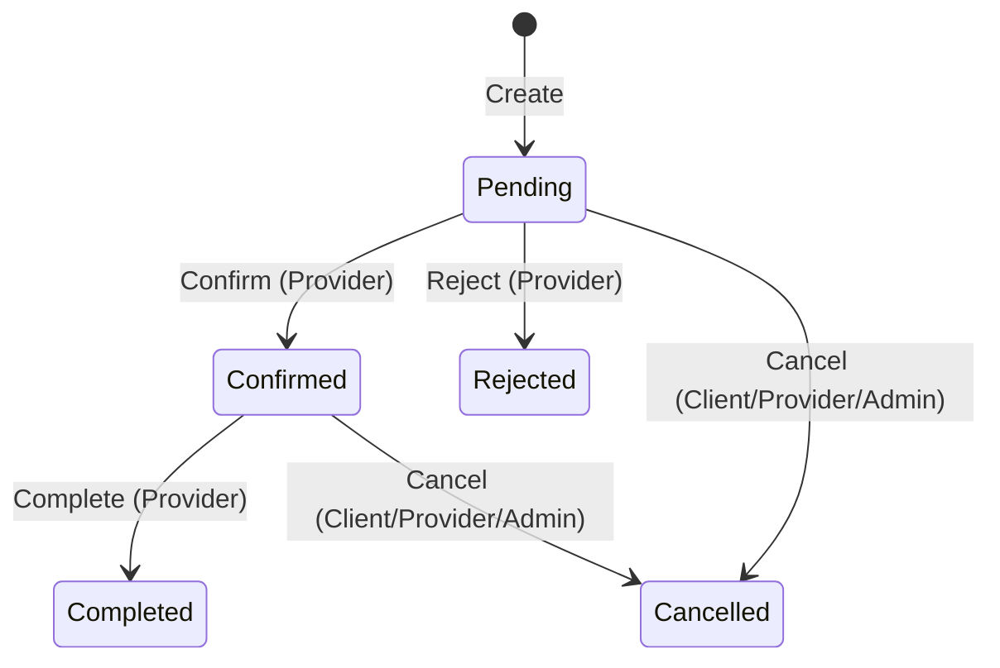

# 📅 Módulo de Agendamentos (Bookings)

## Visão Geral

O módulo de Bookings é responsável pela gestão completa do ciclo de vida de agendamentos entre clientes e prestadores de serviços na plataforma MeAjudaAi.

---

## Arquitetura

O módulo segue a Clean Architecture com separação em 4 camadas, adotando um padrão de Minimal API com manipuladores (handlers) estáticos privados para garantir encapsulamento e injeção de dependência fluida:

```text
Bookings/
├── Domain/           # Entidades, Value Objects, Domain Events
├── Application/      # Commands, Queries, Handlers, DTOs, Validators, Authorization
├── Infrastructure/   # DbContext, Repositórios, Migrações
├── API/              # Minimal API Endpoints (Private Static Handlers)
└── Tests/            # Unitários (AAA Pattern, BaseInMemoryDatabaseTest), Integração (Postgres), E2E
```

---

## Testes

Adotamos uma estratégia rigorosa de cobertura com meta > 90%:

| Tipo | Infraestrutura | Objetivo |
|------|-----------|----------|
| **Unit (Domain/App)** | `BaseInMemoryDatabaseTest<T>` | Lógica de negócio, Validadores, Handlers (rápido e isolado) |
| **Integration** | `BaseDatabaseTest` (Postgres) | Queries, Repositórios, Transações reais |
| **E2E** | `TestContainerTestBase` | Fluxos completos, SSE endpoints, Integração de módulos |

### Padrão de Testes
- **AAA Pattern**: Todos os testes devem seguir explicitamente as seções `// Arrange`, `// Act`, `// Assert`.
- **Determinismo**: Testes de validação de datas utilizam datas fixas para evitar flakiness.
- **Isolamento**: Testes unitários utilizam `InMemoryDatabase` com GUID único por teste.

---

## Entidades de Domínio

### Booking

Entidade principal que representa um agendamento.

| Propriedade | Tipo | Descrição |
|-------------|------|-----------|
| Id | Guid | Identificador único |
| ProviderId | Guid | ID do prestador |
| ClientId | Guid | ID do cliente |
| ServiceId | Guid | ID do serviço |
| Date | DateOnly | Data do agendamento |
| TimeSlot | TimeSlot (VO) | Intervalo de horário |
| Status | EBookingStatus | Estado atual |
| RejectionReason | string? | Motivo de rejeição |
| CancellationReason | string? | Motivo de cancelamento |
| Version | uint | Controle de concorrência otimista |

### ProviderSchedule

Configuração de agenda semanal do prestador.

| Propriedade | Tipo | Descrição |
|-------------|------|-----------|
| Id | Guid | Identificador único |
| ProviderId | Guid | ID do prestador |
| TimeZoneId | string | Fuso horário (padrão: "E. South America Standard Time") |
| Availabilities | List\<Availability\> | Disponibilidades por dia da semana |

---

## Value Objects

- **TimeSlot**: Intervalo de tempo (Start/End como `TimeOnly`). Validação: Start < End. Suporta detecção de sobreposição.
- **Availability**: Disponibilidade diária com múltiplos `TimeSlot`. Validação: sem sobreposição entre slots.

---

## Ciclo de Vida do Agendamento (State Machine)



### Enum `EBookingStatus`

| Valor | Nome | Descrição |
|-------|------|-----------|
| 0 | Pending | Aguardando confirmação do prestador |
| 1 | Confirmed | Confirmado pelo prestador |
| 2 | Cancelled | Cancelado por qualquer parte |
| 3 | Completed | Atendimento concluído |
| 4 | Rejected | Rejeitado pelo prestador |

---

## Domain Events

Todos emitidos automaticamente na transição de estado do `Booking`:

| Evento | Disparado em | Dados |
|--------|-------------|-------|
| BookingCreatedDomainEvent | Create | ProviderId, ClientId, ServiceId, Date |
| BookingConfirmedDomainEvent | Confirm | ProviderId, ClientId |
| BookingRejectedDomainEvent | Reject | ProviderId, ClientId, Reason |
| BookingCancelledDomainEvent | Cancel | ProviderId, ClientId, Reason |
| BookingCompletedDomainEvent | Complete | ProviderId, ClientId |

---

## API Endpoints

Todos sob o prefixo `/api/v1/bookings`, com autorização obrigatória.

### Operações CRUD

| Método | Rota | Descrição | Autorização |
|--------|------|-----------|-------------|
| POST | `/` | Cria agendamento | Cliente autenticado |
| GET | `/{id}` | Detalhes do agendamento | Autenticado |
| GET | `/my` | Lista agendamentos do cliente | Cliente autenticado |
| GET | `/provider/{providerId}` | Lista agendamentos do prestador | Autenticado |

### Transições de Estado

| Método | Rota | Descrição | Autorização |
|--------|------|-----------|-------------|
| PUT | `/{id}/confirm` | Confirma agendamento | Provider/Admin |
| PUT | `/{id}/reject` | Rejeita agendamento | Provider/Admin |
| PUT | `/{id}/cancel` | Cancela agendamento | Client/Provider/Admin |
| PUT | `/{id}/complete` | Conclui agendamento | Provider/Admin |

### Agenda e Disponibilidade

| Método | Rota | Descrição | Autorização |
|--------|------|-----------|-------------|
| POST | `/schedule` | Define agenda do prestador | Provider/Admin |
| GET | `/availability/{providerId}?date=YYYY-MM-DD` | Consulta disponibilidade | Autenticado |

---

## Repositórios

### IBookingRepository

- `GetByIdAsync(id)` — Obtém por ID (tracked para updates)
- `GetByProviderIdPagedAsync(providerId, from, to, page, pageSize)` — Lista paginada por prestador
- `GetByClientIdPagedAsync(clientId, from, to, page, pageSize)` — Lista paginada por cliente
- `GetActiveByProviderAndDateAsync(providerId, date)` — Obtém agendamentos ativos para uma data específica
- `AddIfNoOverlapAsync(booking)` — Adiciona com verificação atômica de sobreposição (Serializable Transaction)
- `UpdateAsync(booking)` — Atualiza com tratamento de `ConcurrencyConflictException`

### IProviderScheduleRepository

- `GetByProviderIdAsync(providerId)` — Obtém agenda do prestador
- `AddOrUpdateAsync(schedule)` — Cria ou atualiza agenda

---

## Concorrência e Integridade

- **Verificação Atômica de Sobreposição**: `AddIfNoOverlapAsync` utiliza `IsolationLevel.Serializable` com retry automático (até 3 tentativas) para prevenir double-booking.
- **Concorrência Otimista**: `UpdateAsync` captura `DbUpdateConcurrencyException` e lança `ConcurrencyConflictException` customizada.
- **Timezone-aware**: Todas as validações de disponibilidade consideram o fuso horário configurado pelo prestador (`TimeZoneId`).

---

## Coleções Bruno

Disponíveis em `src/Modules/Bookings/API/API.Client/Bookings/` com cobertura de todos os 10 endpoints.
