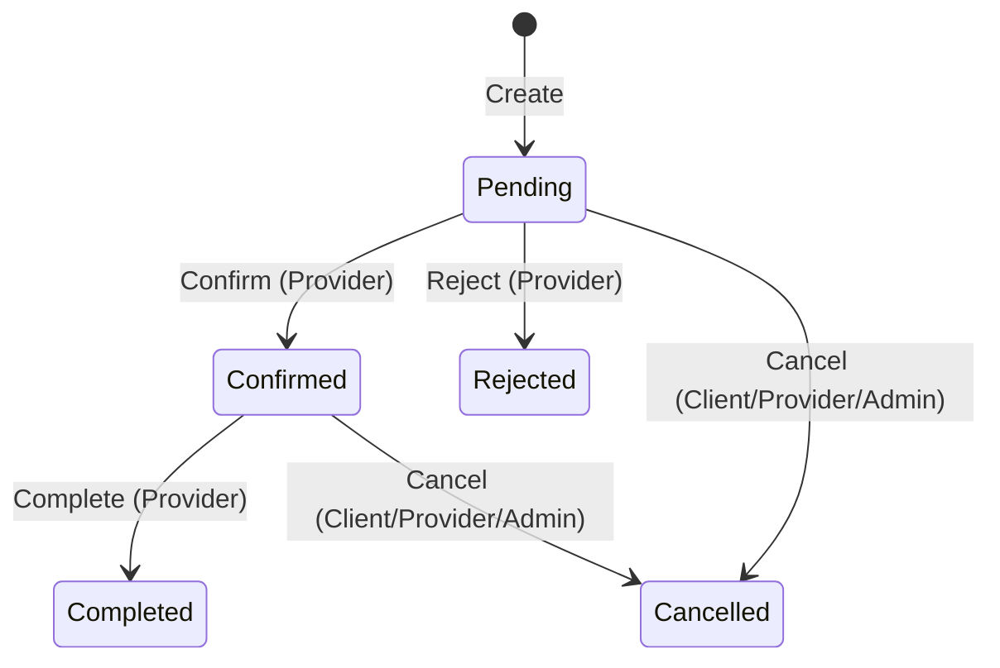

# 📅 Módulo de Agendamentos (Bookings)

## Visão Geral

O módulo de Bookings é responsável pela gestão completa do ciclo de vida de agendamentos entre clientes e prestadores de serviços na plataforma MeAjudaAi.

**Sprint**: 12 (Concluída em Abr 2026)

---

## Arquitetura

O módulo segue a Clean Architecture com separação em 4 camadas:

```
Bookings/
├── Domain/           # Entidades, Value Objects, Interfaces de Repositório, Domain Events
├── Application/      # Commands, Queries, Handlers, DTOs
├── Infrastructure/   # DbContext, Repositórios EF Core, Migrações
├── API/              # Minimal API Endpoints, DI Extensions
└── Tests/            # Unitários (Domain + Application) e Integração (Repositories)
```

---

## Entidades de Domínio

### Booking

Entidade principal que representa um agendamento.

| Propriedade | Tipo | Descrição |
|-------------|------|-----------|
| Id | Guid | Identificador único |
| ProviderId | Guid | ID do prestador |
| ClientId | Guid | ID do cliente |
| ServiceId | Guid | ID do serviço |
| Date | DateOnly | Data do agendamento |
| TimeSlot | TimeSlot (VO) | Intervalo de horário |
| Status | EBookingStatus | Estado atual |
| RejectionReason | string? | Motivo de rejeição |
| CancellationReason | string? | Motivo de cancelamento |
| Version | uint | Controle de concorrência otimista |

### ProviderSchedule

Configuração de agenda semanal do prestador.

| Propriedade | Tipo | Descrição |
|-------------|------|-----------|
| Id | Guid | Identificador único |
| ProviderId | Guid | ID do prestador |
| TimeZoneId | string | Fuso horário (padrão: "E. South America Standard Time") |
| Availabilities | List\<Availability\> | Disponibilidades por dia da semana |

---

## Value Objects

- **TimeSlot**: Intervalo de tempo (Start/End como `TimeOnly`). Validação: Start < End. Suporta detecção de sobreposição.
- **Availability**: Disponibilidade diária com múltiplos `TimeSlot`. Validação: sem sobreposição entre slots.

---

## Ciclo de Vida do Agendamento (State Machine)



### Enum `EBookingStatus`

| Valor | Nome | Descrição |
|-------|------|-----------|
| 0 | Pending | Aguardando confirmação do prestador |
| 1 | Confirmed | Confirmado pelo prestador |
| 2 | Cancelled | Cancelado por qualquer parte |
| 3 | Completed | Atendimento concluído |
| 4 | Rejected | Rejeitado pelo prestador |

---

## Domain Events

Todos emitidos automaticamente na transição de estado do `Booking`:

| Evento | Disparado em | Dados |
|--------|-------------|-------|
| BookingCreatedDomainEvent | Create | ProviderId, ClientId, ServiceId, Date |
| BookingConfirmedDomainEvent | Confirm | ProviderId, ClientId |
| BookingRejectedDomainEvent | Reject | ProviderId, ClientId, Reason |
| BookingCancelledDomainEvent | Cancel | ProviderId, ClientId, Reason |
| BookingCompletedDomainEvent | Complete | ProviderId, ClientId |

---

## API Endpoints

Todos sob o prefixo `/api/v1/bookings`, com autorização obrigatória.

### Operações CRUD

| Método | Rota | Descrição | Autorização |
|--------|------|-----------|-------------|
| POST | `/` | Cria agendamento | Cliente autenticado |
| GET | `/{id}` | Detalhes do agendamento | Autenticado |
| GET | `/my` | Lista agendamentos do cliente | Cliente autenticado |
| GET | `/provider/{providerId}` | Lista agendamentos do prestador | Autenticado |

### Transições de Estado

| Método | Rota | Descrição | Autorização |
|--------|------|-----------|-------------|
| PUT | `/{id}/confirm` | Confirma agendamento | Provider/Admin |
| PUT | `/{id}/reject` | Rejeita agendamento | Provider/Admin |
| PUT | `/{id}/cancel` | Cancela agendamento | Client/Provider/Admin |
| PUT | `/{id}/complete` | Conclui agendamento | Provider/Admin |

### Agenda e Disponibilidade

| Método | Rota | Descrição | Autorização |
|--------|------|-----------|-------------|
| POST | `/schedule` | Define agenda do prestador | Provider/Admin |
| GET | `/availability/{providerId}?date=YYYY-MM-DD` | Consulta disponibilidade | Autenticado |

---

## Repositórios

### IBookingRepository

- `GetByIdAsync(id)` — Obtém por ID (tracked para updates)
- `GetByProviderIdAsync(providerId)` — Lista por prestador
- `GetByClientIdAsync(clientId)` — Lista por cliente
- `GetByProviderAndStatusAsync(providerId, status)` — Filtra por status
- `AddAsync(booking)` — Adiciona simples
- `AddIfNoOverlapAsync(booking)` — Adiciona com verificação atômica de sobreposição (Serializable Transaction)
- `UpdateAsync(booking)` — Atualiza com tratamento de `ConcurrencyConflictException`

### IProviderScheduleRepository

- `GetByProviderIdAsync(providerId)` — Obtém agenda do prestador
- `AddOrUpdateAsync(schedule)` — Cria ou atualiza agenda

---

## Concorrência e Integridade

- **Verificação Atômica de Sobreposição**: `AddIfNoOverlapAsync` utiliza `IsolationLevel.Serializable` com retry automático (até 3 tentativas) para prevenir double-booking.
- **Concorrência Otimista**: `UpdateAsync` captura `DbUpdateConcurrencyException` e lança `ConcurrencyConflictException` customizada.
- **Timezone-aware**: Todas as validações de disponibilidade consideram o fuso horário configurado pelo prestador (`TimeZoneId`).

---

## Testes

| Tipo | Cobertura |
|------|-----------|
| **Unit (Domain)** | `BookingTests`, `ProviderScheduleTests`, `TimeSlotTests`, `AvailabilityTests` |
| **Unit (Application)** | Handlers: Create, Confirm, Cancel, Reject, Complete, GetById, GetByClient, GetByProvider, GetAvailability, SetSchedule |
| **Integration** | `BookingRepositoryTests`, `ProviderScheduleRepositoryTests` |
| **Architecture** | Coberto automaticamente via `ModuleDiscoveryHelper` (convention-based) |

---

## Coleções Bruno

Disponíveis em `src/Modules/Bookings/API/API.Client/Bookings/` com cobertura de todos os 10 endpoints.
