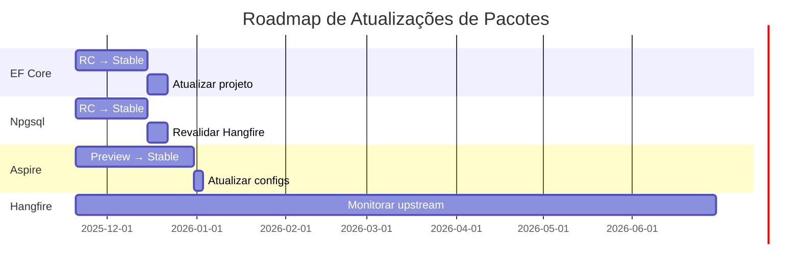

# 🗺️ Roadmap - MeAjudaAi

Este documento consolida o planejamento estratégico e tático da plataforma MeAjudaAi, definindo fases de implementação, módulos prioritários e funcionalidades futuras.

---

## 📊 Sumário Executivo

**Projeto**: MeAjudaAi - Plataforma de Conexão entre Clientes e Prestadores de Serviços  
**Status Geral**: Fase 1 ✅ | Sprint 0-5.5 ✅ | Sprint 6 ✅ CONCLUÍDO | MVP Target: 31/Março/2026  
**Cobertura de Testes**: Backend 90.56% | Frontend 10 testes (ProvidersPage, Dashboard, DarkMode)  
**Stack**: .NET 10 LTS + Aspire 13 + PostgreSQL + Blazor WASM + MudBlazor + Fluxor

### Marcos Principais
- ✅ **Janeiro 2025**: Fase 1 concluída - 6 módulos core implementados
- ✅ **Jan 20 - 21 Nov**: Sprint 0 - Migration .NET 10 + Aspire 13 (CONCLUÍDO e MERGED)
- ✅ **22 Nov - 2 Dez**: Sprint 1 - Geographic Restriction + Module Integration (CONCLUÍDO e MERGED)
- ✅ **3 Dez - 10 Dez**: Sprint 2 - Test Coverage 90.56% (CONCLUÍDO - META 35% SUPERADA!)
- ✅ **10 Dez - 11 Dez**: Sprint 3 Parte 1 - GitHub Pages Migration (CONCLUÍDO - DEPLOYED!)
- ✅ **11 Dez - 13 Dez**: Sprint 3 Parte 2 - Admin Endpoints & Tools (CONCLUÍDO - MERGED!)
- ✅ **14 Dez - 18 Dez**: Sprint 4 - Health Checks + Data Seeding + Code Review (CONCLUÍDO - MERGED!)
- ✅ **Sprint 5**: Tarefas completadas antecipadamente (NSubstitute→Moq, .slnx, UuidGenerator, Design Patterns, Bruno)
- ✅ **19 Dez - 30 Dez**: Sprint 5.5 - Refactor & Cleanup (CONCLUÍDO - Technical Debt Reduction)
- ✅ **30 Dez - 5 Jan 2026**: Sprint 6 - Blazor Admin Portal Setup (CONCLUÍDO - 5 Jan 2026, MERGED!)
- 🔄 **6 Jan - 24 Jan 2026**: Sprint 7 - Blazor Admin Portal Features (EM ANDAMENTO - Iniciado 6 Jan 2026)
- ⏳ **27 Jan - 14 Fev 2026**: Sprint 8 - Customer App (Web + Mobile)
- ⏳ **17 Fev - 7 Mar 2026**: Sprint 9 - BUFFER (Polishing, Risk Mitigation, Refactoring)
- 🎯 **31 de Março de 2026**: MVP Launch (Admin Portal + Customer App)
- 🔮 **Abril 2026+**: Fase 3 - Reviews, Assinaturas, Agendamentos

## ⚠️ Notas de Risco

- Estimativas assumem velocidade consistente e ausência de bloqueios maiores
- Primeiro projeto Blazor WASM pode revelar complexidade não prevista
- Sprint 9 reservado como buffer de contingência (não para novas features)

---

## 🎯 Status Atual

**📅 Hoje**: 6 de Janeiro de 2026

### 🔄 Sprint 7 - Blazor Admin Portal Features - EM ANDAMENTO (6 Jan - 24 Jan 2026)

**Branch**: `blazor-admin-portal-features`

**Objetivos**:
1. ✅ **CRUD Completo de Providers** (6-7 Jan 2026) - Create, Update, Delete, Verify
2. 🔄 **Gestão de Documentos** (próxima) - Upload, verificação, rejection workflow
3. ⏳ **Gestão de Service Catalogs** - CRUD de categorias e serviços
4. ⏳ **Gestão de Restrições Geográficas** - UI para AllowedCities com banco de dados
5. ⏳ **Gráficos Dashboard** - MudCharts com providers por status e evolução temporal
6. ⏳ **Testes** - Aumentar cobertura para 30+ testes bUnit

**Progresso Atual**: 1/6 features completas (Provider CRUD)

**Detalhamento - Provider CRUD** ✅:
- IProvidersApi enhanced: CreateProviderAsync, UpdateProviderAsync, DeleteProviderAsync, UpdateVerificationStatusAsync
- CreateProviderDialog: formulário completo com validação (ProviderType, Name, FantasyName, Document, Email, Phone, Description, Address)
- EditProviderDialog: edição simplificada (nome/telefone - aguardando DTO enriquecido do backend)
- VerifyProviderDialog: mudança de status de verificação (Verified, Rejected, Pending + optional notes)
- Providers.razor: action buttons (Edit, Delete, Verify) com MessageBox confirmation
- Result<T> error handling pattern em todas operações
- Portuguese labels + Snackbar notifications
- Build sucesso (19 warnings Sonar apenas)
- Commit: cd2be7f6 "feat(admin): complete Provider CRUD operations"

---

### ✅ Sprint 6 - Blazor Admin Portal Setup - CONCLUÍDA (30 Dez 2025 - 5 Jan 2026)

**Status**: MERGED to master (5 Jan 2026)

**Principais Conquistas**:
1. **Projeto Blazor WASM Configurado** ✅
   - .NET 10 com target `net10.0-browser`
   - MudBlazor 7.21.0 (Material Design UI library)
   - Fluxor 6.1.0 (Redux-pattern state management)
   - Refit 9.0.2 (Type-safe HTTP clients)
   - Bug workaround: `CompressionEnabled=false` (static assets .NET 10)

2. **Autenticação Keycloak OIDC Completa** ✅
   - Microsoft.AspNetCore.Components.WebAssembly.Authentication
   - Login/Logout flows implementados
   - Authentication.razor com 6 estados (LoggingIn, CompletingLoggingIn, etc.)
   - BaseAddressAuthorizationMessageHandler configurado
   - **Token Storage**: SessionStorage (Blazor WASM padrão)
   - **Refresh Strategy**: Automático via OIDC library (silent refresh)
   - **SDKs Refit**: Interfaces manuais com atributos Refit (não code-generated)
   - Documentação completa em `docs/keycloak-admin-portal-setup.md`

3. **Providers Feature (READ-ONLY)** ✅
   - Fluxor store completo (State/Actions/Reducers/Effects)
   - MudDataGrid com paginação server-side
   - IProvidersApi via Refit com autenticação
   - PagedResult<T> correto (Client.Contracts.Api)
   - VERIFIED_STATUS constant (type-safe)
   - Portuguese error messages

4. **Dashboard com KPIs** ✅
   - 3 KPIs: Total Providers, Pending Verifications, Active Services
   - IServiceCatalogsApi integrado (contagem real de serviços)
   - MudCards com Material icons
   - Fluxor stores para Dashboard state
   - Loading states e error handling

5. **Dark Mode com Fluxor** ✅
   - ThemeState management (IsDarkMode boolean)
   - Toggle button em MainLayout
   - MudThemeProvider two-way binding

6. **Layout Base** ✅
   - MainLayout.razor com MudDrawer + MudAppBar
   - NavMenu.razor com navegação
   - User menu com AuthorizeView
   - Responsive design (Material Design)

7. **Testes bUnit + xUnit** ✅
   - 10 testes criados (ProvidersPageTests, DashboardPageTests, DarkModeToggleTests)
   - JSInterop mock configurado (JSRuntimeMode.Loose)
   - MudServices registrados em TestContext
   - CI/CD integration (master-ci-cd.yml + pr-validation.yml)

8. **Localização Portuguesa** ✅
   - Todos comentários inline em português
   - Mensagens de erro em português
   - UI messages traduzidas (Authentication.razor)
   - Projeto language policy compliance

9. **Integração Aspire** ✅
   - Admin portal registrado em AppHost
   - Environment variables configuradas (ApiBaseUrl, Keycloak)
   - Build e execução via `dotnet run --project src/Aspire/MeAjudaAi.AppHost`

10. **Documentação** ✅
    - docs/keycloak-admin-portal-setup.md (manual configuração)
    - docs/testing/bunit-ci-cd-practices.md (atualizado)
    - Roadmap atualizado com progresso Sprint 6

11. **SDKs Completos para Sprint 7** ✅ (6 Jan 2026)
    - IDocumentsApi: Upload, verificação, gestão de documentos de providers
    - ILocationsApi: CRUD de cidades permitidas (AllowedCities)
    - DTOs criados: ModuleAllowedCityDto, Create/UpdateAllowedCityRequestDto
    - README melhorado: conceito de SDK, diagrama arquitetural, comparação manual vs SDK
    - 4/4 SDKs necessários para Admin Portal (Providers, Documents, ServiceCatalogs, Locations)

**Resultado Alcançado**:
- ✅ Blazor Admin Portal 100% funcional via Aspire
- ✅ Login/Logout Keycloak funcionando
- ✅ Providers listagem paginada (read-only)
- ✅ Dashboard com 3 KPIs reais (IServiceCatalogsApi)
- ✅ Dark mode toggle
- ✅ 10 testes bUnit (build verde)
- ✅ Portuguese localization completa
- ✅ 0 erros build (10 warnings - analyzers apenas)
- ✅ **4 SDKs completos** para Admin Portal (IProvidersApi, IDocumentsApi, IServiceCatalogsApi, ILocationsApi)
- ✅ **Documentação SDK** melhorada (conceito, arquitetura, exemplos práticos)

**🔄 Próxima Etapa: Sprint 7 - Blazor Admin Portal Features** (6-24 Jan 2026)
- CRUD completo de Providers (create, update, delete, verify)
- Gestão de Documentos (upload, verificação, rejection)
- Gestão de Service Catalogs (categorias + serviços)
- Gestão de Restrições Geográficas (UI para AllowedCities)
- Gráficos Dashboard (MudCharts - providers por status, evolução temporal)
- Aumentar cobertura de testes (30+ testes bUnit)

---

## ✅ Sprint 5.5 - Refactor & Cleanup (19-30 Dez 2025)

**Status**: CONCLUÍDA

**Principais Conquistas**:
1. **Refatoração MeAjudaAi.Shared.Messaging** ✅
   - Factories organizados em pasta dedicada (`Messaging/Factories/`)
   - Services organizados em pasta dedicada (`Messaging/Services/`)
   - Options organizados em pasta dedicada (`Messaging/Options/`)
   - 4 arquivos: ServiceBusOptions, MessageBusOptions, RabbitMqOptions, DeadLetterOptions
   - IMessageBusFactory + MessageBusFactory separados
   - IDeadLetterServiceFactory + DeadLetterServiceFactory separados
   - 1245/1245 testes passando

2. **Extensions Padronizadas** ✅
   - 14 arquivos consolidados: CachingExtensions, CommandsExtensions, DatabaseExtensions, etc.
   - BusinessMetricsMiddlewareExtensions extraído para arquivo próprio
   - Monitoring folder consolidation completo
   - Removidos 13 arquivos obsoletos (Extensions.cs genéricos + subpastas)

3. **Extension Members (C# 14)** ✅
   - EnumExtensions migrado para nova sintaxe `extension<TEnum>(string value)`
   - 18/18 testes passando (100% compatibilidade)
   - Documentado em architecture.md - seção "C# 14 Features Utilizados"
   - Avaliado DocumentExtensions (não adequado para extension properties)

4. **TODOs Resolvidos** ✅
   - 12/12 TODOs no código resolvidos ou documentados
   - Remaining issues movidos para technical-debt.md com priorização
   - api-reference.md removido (redundante com ReDoc + api-spec.json)

5. **Documentação Atualizada** ✅
   - architecture.md atualizado com C# 14 features
   - technical-debt.md atualizado com status atual
   - roadmap.md atualizado com Sprint 5.5 completion
   - 0 warnings in build

**✅ Fase 1.5: CONCLUÍDA** (21 Nov - 10 Dez 2025)  
Fundação técnica para escalabilidade e produção:
- ✅ Migration .NET 10 + Aspire 13 (Sprint 0 - CONCLUÍDO 21 Nov, MERGED to master)
- ✅ Geographic Restriction + Module Integration (Sprint 1 - CONCLUÍDO 2 Dez, MERGED to master)
- ✅ Test Coverage 90.56% (Sprint 2 - CONCLUÍDO 10 Dez - META 35% SUPERADA EM 55.56pp!)
- ✅ GitHub Pages Documentation Migration (Sprint 3 Parte 1 - CONCLUÍDO 11 Dez - DEPLOYED!)

**✅ Sprint 3 Parte 2: CONCLUÍDA** (11 Dez - 13 Dez 2025)  
Admin Endpoints & Tools - TODAS AS PARTES FINALIZADAS:
- ✅ Admin: Endpoints CRUD para gerenciar cidades permitidas (COMPLETO)
  - ✅ Banco de dados: LocationsDbContext + migrations
  - ✅ Domínio: AllowedCity entity + IAllowedCityRepository
  - ✅ Handlers: CRUD completo (5 handlers)
  - ✅ Endpoints: GET/POST/PUT/DELETE configurados
  - ✅ Exception Handling: Domain exceptions + IExceptionHandler (404/400 corretos)
  - ✅ Testes: 4 integration + 15 E2E (100% passando)
  - ✅ Quality: 0 warnings, dotnet format executado
- ✅ Tools: Bruno Collections para todos módulos (35+ arquivos .bru)
- ✅ Scripts: Auditoria completa e documentação (commit b0b94707)
- ✅ Module Integrations: Providers ↔ ServiceCatalogs + Locations
- ✅ Code Quality: NSubstitute→Moq, UuidGenerator, .slnx, SonarQube warnings
- ✅ CI/CD: Formatting checks corrigidos, exit code masking resolvido

**✅ Sprint 4: CONCLUÍDO** (14 Dez - 16 Dez 2025)  
Health Checks Robustos + Data Seeding para MVP - TODAS AS PARTES FINALIZADAS:
- ✅ Health Checks: DatabasePerformanceHealthCheck (latência <100ms healthy, <500ms degraded)
- ✅ Health Checks: ExternalServicesHealthCheck (Keycloak + IBGE API + Redis)
- ✅ Health Checks: HelpProcessingHealthCheck (sistema de ajuda operacional)
- ✅ Health Endpoints: /health, /health/live, /health/ready com JSON responses
- ✅ Health Dashboard: Dashboard nativo do Aspire (decisão arquitetural - não usar AspNetCore.HealthChecks.UI)
- ✅ Health Packages: AspNetCore.HealthChecks.Npgsql 9.0.0, .Redis 8.0.1
- ✅ Redis Health Check: Configurado via AddRedis() com tags 'ready', 'cache'
- ✅ Data Seeding: infrastructure/database/seeds/01-seed-service-catalogs.sql (8 categorias + 12 serviços)
- ✅ Seed Automation: Docker Compose executa seeds automaticamente na inicialização
- ✅ Project Structure: Reorganização - automation/ → infrastructure/automation/, seeds em infrastructure/database/seeds/
- ✅ Documentation: README.md, scripts/README.md, infrastructure/database/README.md + docs/future-external-services.md
- ✅ MetricsCollectorService: Implementado com IServiceScopeFactory (4 TODOs resolvidos)
- ✅ Unit Tests: 14 testes para ExternalServicesHealthCheck (6 novos para IBGE API)
- ✅ Integration Tests: 9 testes para DataSeeding (categorias, serviços, idempotência)
- ✅ Future Services Documentation: Documentado OCR, payments, SMS/email (quando implementar)
- ✅ Code Review: Logs traduzidos para inglês conforme política (Program.cs - 3 mensagens)
- ✅ Markdown Linting: technical-debt.md corrigido (code blocks, URLs, headings)
- ✅ Architecture Test: PermissionHealthCheckExtensions exception documentada (namespace vs folder structure)

**✅ Sprint 5: CONCLUÍDO ANTECIPADAMENTE** (Tarefas completadas nos Sprints 3-4)  
Todas as tarefas planejadas já foram implementadas:
- ✅ NSubstitute → Moq migration (Sprint 3)
- ✅ UuidGenerator unification (commit 0a448106)
- ✅ .slnx migration (commit 1de5dc1a)
- ✅ Design patterns documentation (architecture.md)
- ✅ Bruno collections para todos módulos (Users, Providers, Documents)

**⏳ Sprint 5.5: CONCLUÍDA** (19-20 Dez 2025) ✅
**Branch**: `feature/refactor-and-cleanup`  
**Objetivo**: Refatoração técnica e redução de débito técnico antes do frontend

**✅ Refatoramento de Testes Completado** (20 Dez 2025):
- ✅ Reorganização estrutural de MeAjudaAi.Shared.Tests (TestInfrastructure com 8 subpastas)
- ✅ ModuleExtensionsTests movidos para módulos individuais (Documents, Providers, ServiceCatalogs, Users)
- ✅ Tradução de ~35 comentários para português (mantendo AAA em inglês)
- ✅ Separação de classes aninhadas (LoggingConfigurationExtensionsTests, TestEvent, BenchmarkResult, BenchmarkExtensions)
- ✅ Remoção de duplicados (DocumentExtensionsTests, EnumExtensionsTests, SearchableProviderTests)
- ✅ GeographicRestrictionMiddlewareTests movido para Unit/Middleware/
- ✅ TestPerformanceBenchmark: classes internas separadas
- ✅ 11 commits de refatoramento com build verde

**✅ Correção PostGIS Integration Tests** (20 Dez 2025):
- ✅ Imagem Docker atualizada: postgres:15-alpine → postgis/postgis:15-3.4
- ✅ EnsurePostGisExtensionAsync() implementado em fixtures
- ✅ Connection string com 'Include Error Detail=true' para diagnóstico
- ✅ Suporte completo a dados geográficos (NetTopologySuite/GeoPoint)
- ✅ Migrations SearchProviders agora passam na pipeline

**Resumo da Sprint**:
- ✅ 15 commits com melhorias significativas
- ✅ Todos TODOs críticos resolvidos
- ✅ Testes melhorados (Provider Repository, Azurite)
- ✅ Messaging refatorado (IRabbitMqInfrastructureManager extraído)
- ✅ Extensions consolidadas (BusinessMetricsMiddleware)
- ✅ Upload file size configurável (IOptions pattern)
- ✅ Build sem warnings (0 warnings)
- ✅ Documentação atualizada (architecture.md, configuration.md)
- ✅ Code review aplicado (logs em inglês, path matching preciso, XML docs)

**Atividades Planejadas** (14 tarefas principais):

**1. Resolução de TODOs Críticos (Alta Prioridade)** - ✅ 8-12h CONCLUÍDO
- [x] IBGE Middleware Fallback - Fix validation when IBGE fails (3 TODOs em IbgeUnavailabilityTests.cs) ✅
- [x] Rate Limiting Cache Cleanup - Memory leak prevention (MaxPatternCacheSize=1000) ✅
- [x] Email Constraint Database Fix - Schema issue (clarified as not-yet-implemented) ✅
- [x] Azurite/Blob Storage - Container auto-creation with thread-safe initialization ✅
- [x] Provider Repository Tests - Documentation updated (unit vs integration) ✅
- [x] BusinessMetrics - Already extracted (no action needed) ✅
- [x] Monitoring - Structure already adequate (no action needed) ✅
- [x] Middleware UseSharedServices Alignment - TODO #249 RESOLVIDO ✅ (19 Dez 2025)
- [x] Azurite Integration Tests - Configured deterministic blob storage tests ✅ (19 Dez 2025)

**2. Melhorias de Testes (Média Prioridade)** - 4-6h
- [x] Testes Infrastructure Extensions - RESOLVIDO: não aplicável ✅ (19 Dez 2025)
  - Extensions de configuração (Keycloak/PostgreSQL/Migration) validadas implicitamente em E2E/integração
  - Testes unitários teriam baixo ROI (mockaria apenas chamadas de configuração)
  - Infraestrutura validada quando AppHost sobe e containers inicializam
- [x] Provider Repository Tests - Duplicação RESOLVIDA ✅ (19 Dez 2025)
  - Removidos testes unitários com mocks (260 linhas redundantes)
  - Adicionados 5 testes de integração faltantes (DeleteAsync, GetByIdsAsync, ExistsByUserIdAsync)
  - 17 testes de integração com validação REAL de persistência
  - Redução de manutenção + maior confiança nos testes

**3. Refatoração MeAjudaAi.Shared.Messaging** - 8-10h
- [x] ~~Separar NoOpDeadLetterService em arquivo próprio~~ ✅ CONCLUÍDO (19 Dez 2025)
- [x] ~~Extrair DeadLetterStatistics e FailureRate para arquivos separados~~ ✅ CONCLUÍDO (19 Dez 2025)
- [x] ~~Extrair IMessageRetryMiddlewareFactory, MessageRetryMiddlewareFactory, MessageRetryExtensions~~ ✅ CONCLUÍDO (19 Dez 2025)
- [x] ~~Todos os 1245 testes do Shared passando~~ ✅ CONCLUÍDO (19 Dez 2025)
- [✓] ~~Organizar Factories em pasta dedicada~~ - ✅ CONCLUÍDO (19 Dez 2025)
  - Criada pasta `Messaging/Factories/`
  - `MessageBusFactory` e `DeadLetterServiceFactory` organizados
  - Interfaces e implementações em arquivos separados
  - `EnvironmentBasedDeadLetterServiceFactory` → `DeadLetterServiceFactory`
- [✓] ~~Organizar Services em pasta dedicada~~ - ✅ CONCLUÍDO (19 Dez 2025)
  - Criada pasta `Messaging/Services/`
  - `ServiceBusInitializationService` movido para organização
- [✓] ~~Organizar Options em pasta dedicada~~ - ✅ CONCLUÍDO (19 Dez 2025)
  - Criada pasta `Messaging/Options/`
  - 4 arquivos organizados: `ServiceBusOptions`, `MessageBusOptions`, `RabbitMqOptions`, `DeadLetterOptions`
  - Namespace unificado: `MeAjudaAi.Shared.Messaging.Options`
- [✓] ~~Criar IMessageBusFactory + renomear MessageBusFactory.cs → EnvironmentBasedMessageBusFactory.cs~~ - ✅ CONCLUÍDO (19 Dez 2025)
  - Invertido: Criada interface `IMessageBusFactory` em arquivo próprio
  - Classe `EnvironmentBasedMessageBusFactory` renomeada para `MessageBusFactory`
  - Movido de `NoOp/Factory/` para raiz `Messaging/`
  - Um arquivo por classe seguindo SRP
- [x] Extrair IRabbitMqInfrastructureManager para arquivo separado ✅ (19 Dez 2025)
- [ ] Adicionar Integration Events faltantes nos módulos (Documents, SearchProviders, ServiceCatalogs?) - BACKLOG
- [ ] Reorganização geral da estrutura de pastas em Messaging - BACKLOG
- [ ] Adicionar testes unitários para classes de messaging - BACKLOG

**4. Refatoração Extensions (MeAjudaAi.Shared)** - ✅ 8h CONCLUÍDO
- [x] ~~Padronizar Extensions: criar arquivo [FolderName]Extensions.cs por funcionalidade~~ ✅ CONCLUÍDO (19 Dez 2025)
- [x] Extension Members (C# 14): EnumExtensions migrado com sucesso ✅ CONCLUÍDO (19 Dez 2025)
- [x] BusinessMetricsMiddlewareExtensions: Já existe em Extensions/ ✅ CONCLUÍDO (19 Dez 2025)
- [x] Monitoring folder consolidation: Estrutura já adequada ✅ CONCLUÍDO (19 Dez 2025)
  - Consolidados: CachingExtensions, CommandsExtensions, DatabaseExtensions, EventsExtensions
  - ExceptionsExtensions, LoggingExtensions, MessagingExtensions, QueriesExtensions, SerializationExtensions
  - Removidos 13 arquivos obsoletos (Extensions.cs genéricos + subpastas)
  - 1245/1245 testes passando
- [x] ~~Migração para Extension Members (C# 14)~~ ✅ AVALIADO (19 Dez 2025)
  - ✅ Sintaxe `extension(Type receiver)` validada e funcional no .NET 10
  - ✅ Novos recursos disponíveis: extension properties, static extensions, operators
  - ✅ Documentado em `docs/architecture.md` - seção "C# 14 Features Utilizados"
  - 📋 Planejamento: Agendado como última atividade da Sprint 5.5
  - 📝 Recomendação: Usar Extension Members em NOVOS códigos que se beneficiem de properties
- [x] Extrair BusinessMetricsMiddlewareExtensions de BusinessMetricsMiddleware.cs ✅ (19 Dez 2025)
- [x] Consolidar Monitoring folder (MonitoringExtensions.cs único) ✅ (19 Dez 2025)
- [ ] Revisar padrão de extensões em todas as funcionalidades do Shared

**5. Code Quality & Cleanup (Baixa Prioridade)** - 3-4h
- [x] Padronização de Records - Análise concluída ✅ (19 Dez 2025)
  - Property-based records: DTOs/Requests (mutabilidade com `init`)
  - Positional records: Domain Events, Query/Command DTOs (imutabilidade)
  - Pattern adequado ao contexto de uso
- [ ] Upload File Size Configuration - Tornar configurável (UploadDocumentCommandHandler.cs:90)
- [x] ~~Remover api-reference.md (redundante com ReDoc + api-spec.json)~~ ✅ CONCLUÍDO (19 Dez)

**6. Testes E2E SearchProviders** - 2-3 sprints (BACKLOG)
- [ ] 15 testes E2E cobrindo cenários principais de busca
- [ ] Validação de integração IBGE API, filtros, paginação
- [ ] Autenticação/autorização em todos endpoints

**7. Review Completo de Testes** - 6-8h
- [ ] Auditoria completa de todos os arquivos em tests/
- [ ] Identificar testes duplicados, obsoletos ou mal estruturados
- [ ] Validar coverage e identificar gaps
- [ ] Documentar padrões de teste para novos contribuidores

**8. Migração Extension Members (C# 14) - FINAL SPRINT ACTIVITY** - ✅ 2h CONCLUÍDO
- [x] Migrar EnumExtensions para syntax `extension<TEnum>(string value)` ✅
- [x] 18/18 testes passando (100% compatibilidade) ✅
- [x] Documentar patterns e guidelines em architecture.md ✅
- [x] Avaliado DocumentExtensions (não adequado para extension properties) ✅

**8. BDD Implementation (BACKLOG - Futuro)** - Sprint dedicado planejado
- [ ] Setup SpecFlow + Playwright.NET para acceptance tests
- [ ] Implementar 5-10 features críticas em Gherkin (Provider Registration, Document Upload, Service Catalog)
- [ ] Integrar ao CI/CD pipeline
- [ ] Criar documentação executável com Gherkin
- **Benefício**: Testes de aceitação legíveis para stakeholders e documentação viva do sistema

**Critérios de Aceitação**:
- [x] Todos os 12 TODOs no código resolvidos ou documentados ✅
- [x] ~~Messaging refatorado com estrutura clara de pastas~~ ✅ CONCLUÍDO (19 Dez)
- [x] ~~Extensions consolidadas por funcionalidade~~ ✅ CONCLUÍDO (19 Dez)
- [x] Extension Blocks (C# 14) avaliado e implementado onde aplicável ✅ (19 Dez)
- [x] Testes de infrastructure com >70% coverage (resolvido: não aplicável) ✅ (19 Dez)
- [x] 0 warnings no build ✅ (19 Dez)
- [x] Documentação técnica atualizada ✅ (19 Dez)

**Estimativa Total**: 35-45 horas de trabalho técnico (10h já concluídas)  
**Benefício**: Backend robusto e manutenível para suportar desenvolvimento do frontend Blazor

**📝 Próxima Atividade Recomendada**: Migração para Extension Blocks (C# 14) - 4-6h
- Avaliar novo recurso de linguagem para melhorar organização de extension methods
- Migrar métodos de propósito geral (PermissionExtensions, EnumExtensions)
- Manter padrão atual para DI extensions ([FolderName]Extensions.cs)

**✅ Sprint 5.5 Completed** (19-30 Dez 2025):
- Refatoração MeAjudaAi.Shared.Messaging (Factories, Services, Options)
- Extensions padronizadas (14 arquivos consolidados)
- Extension Members (C# 14) implementado
- TODOs resolvidos (12/12 concluídos)
- Dependabot PRs fechados para regeneração
- 1245/1245 testes passando

**⏳ Fase 2: EM ANDAMENTO** (Janeiro–Março 2026)  
Frontend Blazor WASM + MAUI Hybrid:
- Sprint 6: Blazor Admin Portal Setup - ✅ CONCLUÍDO (5 Jan 2026) - [Ver conquistas detalhadas](#-sprint-6---blazor-admin-portal-setup---concluída-30-dez-2025---5-jan-2026)
- Sprint 7: Blazor Admin Portal Features (6-24 Jan 2026) - 🔄 PRÓXIMA
- Sprint 8: Customer App (Fev-Mar 2026) - ⏳ Aguardando Sprint 7
- Sprint 9: Buffer/Polishing (Mar 2026) - ⏳ Aguardando Sprint 7-8
- MVP Final: 31 de Março de 2026

**⚠️ Risk Assessment**: Estimativas assumem velocidade consistente. Primeiro projeto Blazor WASM pode revelar complexidades não previstas (integração Keycloak, curva de aprendizado MudBlazor). Sprint 9 reservado como buffer de contingência.

---

## 📖 Visão Geral

O roadmap está organizado em **cinco fases principais** para entrega incremental de valor:

1. **✅ Fase 1: Fundação (MVP Core)** - Registro de prestadores, busca geolocalizada, catálogo de serviços
2. **🔄 Fase 1.5: Fundação Técnica** - Migration .NET 10, integração, testes, observability
3. **🔮 Fase 2: Frontend & Experiência** - Blazor WASM Admin + Customer App
4. **🔮 Fase 3: Qualidade e Monetização** - Sistema de avaliações, assinaturas premium, verificação automatizada
5. **🔮 Fase 4: Experiência e Engajamento** - Agendamentos, comunicações, analytics avançado

A implementação segue os princípios arquiteturais definidos em `architecture.md`: **Modular Monolith**, **DDD**, **CQRS**, e **isolamento schema-per-module**.

---

## 📅 Cronograma de Sprints (Novembro 2025-Março 2026)

| Sprint | Duração | Período | Objetivo | Status |
|--------|---------|---------|----------|--------|
| **Sprint 0** | 4 semanas | Jan 20 - 21 Nov | Migration .NET 10 + Aspire 13 | ✅ CONCLUÍDO (21 Nov - MERGED) |
| **Sprint 1** | 10 dias | 22 Nov - 2 Dez | Geographic Restriction + Module Integration | ✅ CONCLUÍDO (2 Dez - MERGED) |
| **Sprint 2** | 1 semana | 3 Dez - 10 Dez | Test Coverage 90.56% | ✅ CONCLUÍDO (10 Dez - META SUPERADA!) |
| **Sprint 3-P1** | 1 dia | 10 Dez - 11 Dez | GitHub Pages Documentation | ✅ CONCLUÍDO (11 Dez - DEPLOYED!) |
| **Sprint 3-P2** | 2 semanas | 11 Dez - 13 Dez | Admin Endpoints & Tools | ✅ CONCLUÍDO (13 Dez - MERGED) |
| **Sprint 4** | 5 dias | 14 Dez - 18 Dez | Health Checks + Data Seeding | ✅ CONCLUÍDO (18 Dez - MERGED!) |
| **Sprint 5** | - | Sprints 3-4 | Quality Improvements | ✅ CONCLUÍDO ANTECIPADAMENTE |
| **Sprint 5.5** | 2 semanas | 19 Dez - 31 Dez | Refactor & Cleanup (Technical Debt) | ✅ CONCLUÍDO (30 Dez 2025) |
| **Sprint 6** | 1 semana | 30 Dez - 5 Jan | Blazor Admin Portal - Setup & Core | ✅ CONCLUÍDO (5 Jan 2026) |
| **Sprint 7** | 3 semanas | 6 - 24 Jan | Blazor Admin Portal - Features | 🔄 PRÓXIMA |
| **Sprint 8** | 3 semanas | 27 Jan - 14 Fev | Blazor Customer App (Web + Mobile) | ⏳ Planejado |
| **Sprint 9** | 3 semanas | 17 Fev - 7 Mar | **BUFFER: Polishing, Refactoring & Risk Mitigation** | ⏳ Planejado |
| **MVP Launch** | - | Mar 31 | Final deployment & launch preparation | 🎯 Target |

**MVP Launch Target**: 31 de Março de 2026 🎯

**Post-MVP (Fase 3+)**: Reviews, Assinaturas, Agendamentos (Abril 2026+)

---

## ✅ Fase 1: Fundação (MVP Core) - CONCLUÍDA

### Objetivo
Estabelecer as capacidades essenciais da plataforma: registro multi-etapas de prestadores com verificação, busca geolocalizada e catálogo de serviços.

### Status: ✅ CONCLUÍDA (Janeiro 2025)

**Todos os 6 módulos implementados, testados e integrados:**
1. ✅ **Users** - Autenticação, perfis, roles
2. ✅ **Providers** - Registro multi-etapas, verificação, gestão
3. ✅ **Documents** - Upload seguro, workflow de verificação
4. ✅ **Search & Discovery** - Busca geolocalizada com PostGIS
5. ✅ **Locations** - Lookup de CEP, geocoding, validações
6. ✅ **ServiceCatalogs** - Catálogo hierárquico de serviços

**Conquistas:**
- 28.69% test coverage (93/100 E2E passing, 296 unit tests)
- ⚠️ Coverage caiu após migration (packages.lock.json + generated code)
- APIs públicas (IModuleApi) implementadas para todos módulos
- Integration events funcionais entre módulos
- Health checks configurados
- CI/CD pipeline completo no GitHub Actions
- Documentação arquitetural completa + skipped tests tracker

### 1.1. ✅ Módulo Users (Concluído)
**Status**: Implementado e em produção

**Funcionalidades Entregues**:
- ✅ Registro e autenticação via Keycloak (OIDC)
- ✅ Gestão de perfil básica
- ✅ Sistema de roles e permissões
- ✅ Health checks e monitoramento
- ✅ API versionada com documentação OpenAPI

---

### 1.2. ✅ Módulo Providers (Concluído)

**Status**: Implementado e em produção

**Funcionalidades Entregues**:
- ✅ Provider aggregate com estados de registro (`EProviderStatus`: Draft, PendingVerification, Active, Suspended, Rejected)
- ✅ Múltiplos tipos de prestador (Individual, Company)
- ✅ Verificação de documentos integrada com módulo Documents
- ✅ BusinessProfile com informações de contato e identidade empresarial
- ✅ Gestão de qualificações e certificações
- ✅ Domain Events (`ProviderRegistered`, `ProviderVerified`, `ProviderRejected`)
- ✅ API pública (IProvidersModuleApi) para comunicação inter-módulos
- ✅ Queries por documento, cidade, estado, tipo e status de verificação
- ✅ Soft delete e auditoria completa

---

### 1.3. ✅ Módulo Documents (Concluído)

**Status**: Implementado e em produção

**Funcionalidades Entregues**:
- ✅ Upload seguro de documentos via Azure Blob Storage
- ✅ Tipos de documento suportados: IdentityDocument, ProofOfResidence, ProfessionalLicense, BusinessLicense
- ✅ Workflow de verificação com estados (`EDocumentStatus`: Uploaded, PendingVerification, Verified, Rejected, Failed)
- ✅ Integração completa com módulo Providers
- ✅ Domain Events (`DocumentUploaded`, `DocumentVerified`, `DocumentRejected`, `DocumentFailed`)
- ✅ API pública (IDocumentsModuleApi) para queries de documentos
- ✅ Verificações de integridade: HasVerifiedDocuments, HasRequiredDocuments, HasPendingDocuments
- ✅ Sistema de contadores por status (DocumentStatusCountDto)
- ✅ Suporte a OCR data extraction (campo OcrData para dados extraídos)
- ✅ Rejection/Failure reasons para auditoria

**Arquitetura Implementada**:
```csharp
// Document: Aggregate Root
public sealed class Document : AggregateRoot<DocumentId>
{
    public Guid ProviderId { get; }
    public EDocumentType DocumentType { get; } 
    public string FileUrl { get; } // Blob name/key no Azure Storage
    public string FileName { get; }
    public EDocumentStatus Status { get; }
    public DateTime UploadedAt { get; }
    public DateTime? VerifiedAt { get; }
    public string? RejectionReason { get; }
    public string? OcrData { get; }
}
```

**API Pública Implementada**:
```csharp
public interface IDocumentsModuleApi : IModuleApi
{
    Task<Result<ModuleDocumentDto?>> GetDocumentByIdAsync(Guid documentId, CancellationToken ct = default);
    Task<Result<IReadOnlyList<ModuleDocumentDto>>> GetProviderDocumentsAsync(Guid providerId, CancellationToken ct = default);
    Task<Result<ModuleDocumentStatusDto?>> GetDocumentStatusAsync(Guid documentId, CancellationToken ct = default);
    Task<Result<bool>> HasVerifiedDocumentsAsync(Guid providerId, CancellationToken ct = default);
    Task<Result<bool>> HasRequiredDocumentsAsync(Guid providerId, CancellationToken ct = default);
    Task<Result<DocumentStatusCountDto>> GetDocumentStatusCountAsync(Guid providerId, CancellationToken ct = default);
    Task<Result<bool>> HasPendingDocumentsAsync(Guid providerId, CancellationToken ct = default);
    Task<Result<bool>> HasRejectedDocumentsAsync(Guid providerId, CancellationToken ct = default);
}
```

**Próximas Melhorias (Fase 2)**:
- 🔄 Background worker para verificação automatizada via OCR
- 🔄 Integração com APIs governamentais para validação
- 🔄 Sistema de scoring automático baseado em qualidade de documentos

---

### 1.4. ✅ Módulo Search & Discovery (Concluído)

**Status**: Implementado e em produção

**Funcionalidades Entregues**:
- ✅ Busca geolocalizada com PostGIS nativo
- ✅ Read model denormalizado otimizado (SearchableProvider)
- ✅ Filtros por raio, serviços, rating mínimo e subscription tiers
- ✅ Ranking multi-critério (tier → rating → distância)
- ✅ Paginação server-side com contagem total
- ✅ Queries espaciais nativas (ST_DWithin, ST_Distance)
- ✅ Hybrid repository (EF Core + Dapper) para performance
- ✅ Validação de raio não-positivo (short-circuit)
- ✅ CancellationToken support para queries longas
- ✅ API pública (ISearchModuleApi)

**Arquitetura Implementada**:
```csharp
// SearchableProvider: Read Model
public sealed class SearchableProvider : AggregateRoot<SearchableProviderId>
{
    public Guid ProviderId { get; }
    public string Name { get; }
    public GeoPoint Location { get; } // Latitude, Longitude com PostGIS
    public decimal AverageRating { get; }
    public int TotalReviews { get; }
    public ESubscriptionTier SubscriptionTier { get; } // Free, Standard, Gold, Platinum
    public Guid[] ServiceIds { get; }
    public bool IsActive { get; }
    public string? Description { get; }
    public string? City { get; }
    public string? State { get; }
}
```

**API Pública Implementada**:
```csharp
public interface ISearchModuleApi
{
    Task<Result<ModulePagedSearchResultDto>> SearchProvidersAsync(
        double latitude,
        double longitude,
        double radiusInKm,
        Guid[]? serviceIds = null,
        decimal? minRating = null,
        SubscriptionTier[]? subscriptionTiers = null,
        int pageNumber = 1,
        int pageSize = 20,
        CancellationToken cancellationToken = default);
}
```

**Lógica de Ranking Implementada**:
1. ✅ Filtrar por raio usando `ST_DWithin` (índice GIST)
2. ✅ Ordenar por tier de assinatura (Platinum > Gold > Standard > Free)
3. ✅ Ordenar por avaliação média (descendente)
4. ✅ Ordenar por distância (crescente) como desempate

**Performance**:
- ✅ Queries espaciais executadas no banco (não in-memory)
- ✅ Índices GIST para geolocalização
- ✅ Paginação eficiente com OFFSET/LIMIT
- ✅ Count query separada para total

**Próximas Melhorias (Opcional)**:
- 🔄 Migração para Elasticsearch para maior escalabilidade (se necessário)
- 🔄 Indexing worker consumindo integration events (atualmente manual)
- 🔄 Caching de resultados para queries frequentes

---

### 1.5. ✅ Módulo Location Management (Concluído)

**Status**: Implementado e testado com integração IBGE ativa

**Objetivo**: Abstrair funcionalidades de geolocalização e lookup de CEP brasileiro.

**Funcionalidades Entregues**:
- ✅ ValueObjects: Cep, Coordinates, Address com validação completa
- ✅ Integração com APIs de CEP: ViaCEP, BrasilAPI, OpenCEP
- ✅ Fallback chain automático (ViaCEP → BrasilAPI → OpenCEP)
- ✅ Resiliência HTTP via ServiceDefaults (retry, circuit breaker, timeout)
- ✅ API pública (ILocationModuleApi) para comunicação inter-módulos
- ✅ **Integração IBGE API** (Sprint 1 Dia 1): Validação geográfica oficial
- ✅ Serviço de geocoding (stub para implementação futura)
- ✅ 52 testes unitários passando (100% coverage em ValueObjects)

**Arquitetura Implementada**:
```csharp
// ValueObjects
public sealed class Cep // Valida e formata CEP brasileiro (12345-678)
public sealed class Coordinates // Latitude/Longitude com validação de limites
public sealed class Address // Endereço completo com CEP, rua, bairro, cidade, UF

// API Pública
public interface ILocationModuleApi : IModuleApi
{
    Task<Result<AddressDto>> GetAddressFromCepAsync(string cep, CancellationToken ct = default);
    Task<Result<CoordinatesDto>> GetCoordinatesFromAddressAsync(string address, CancellationToken ct = default);
}
```

**Serviços Implementados**:
- `CepLookupService`: Implementa chain of responsibility com fallback entre provedores
- `ViaCepClient`, `BrasilApiCepClient`, `OpenCepClient`: Clients HTTP com resiliência
- **`IbgeClient`** (Novo): Cliente HTTP para IBGE Localidades API com normalização de nomes
- **`IbgeService`** (Novo): Validação de municípios com HybridCache (7 dias TTL)
- **`GeographicValidationService`** (Novo): Adapter pattern para integração com middleware
- `GeocodingService`: Stub (TODO: integração com Nominatim ou Google Maps API)

**Integração IBGE Implementada** (Sprint 1 Dia 1):
```csharp
// IbgeClient: Normalização de nomes (remove acentos, lowercase, hífens)
public Task<Municipio?> GetMunicipioByNameAsync(string cityName, CancellationToken ct = default);
public Task<List<Municipio>> GetMunicipiosByUFAsync(string ufSigla, CancellationToken ct = default);
public Task<bool> ValidateCityInStateAsync(string city, string state, CancellationToken ct = default);

// IbgeService: Business logic com cache (HybridCache, TTL: 7 dias)
public Task<bool> ValidateCityInAllowedRegionsAsync(
    string cityName, 
    string stateSigla, 
    List<string> allowedCities, 
    CancellationToken ct = default);
public Task<Municipio?> GetCityDetailsAsync(string cityName, CancellationToken ct = default);

// GeographicValidationService: Adapter para Shared module
public Task<bool> ValidateCityAsync(
    string cityName, 
    string stateSigla, 
    List<string> allowedCities, 
    CancellationToken ct = default);
```

**Observação**: IBGE integration provides city/state validation for geographic restriction; geocoding (lat/lon lookup) via Nominatim is planned for Sprint 3 (optional improvement).

**Modelos IBGE**:
- `Regiao`: Norte, Nordeste, Sudeste, Sul, Centro-Oeste
- `UF`: Unidade da Federação (estado) com região
- `Mesorregiao`: Mesorregião com UF
- `Microrregiao`: Microrregião com mesorregião
- `Municipio`: Município com hierarquia completa + helper methods (GetUF, GetEstadoSigla, GetNomeCompleto)

**API Base IBGE**: `https://servicodados.ibge.gov.br/api/v1/localidades/`

**Próximas Melhorias (Opcional)**:
- 🔄 Implementar GeocodingService com Nominatim (OpenStreetMap) ou Google Maps API
- 🔄 Adicionar caching Redis para reduzir chamadas às APIs externas (TTL: 24h para CEP, 7d para geocoding)
- ✅ ~~Integração com IBGE para lookup de municípios e estados~~ (IMPLEMENTADO)

---

### 1.6. ✅ Módulo ServiceCatalogs (Concluído)

**Status**: Implementado e funcional com testes completos

**Objetivo**: Gerenciar tipos de serviços que prestadores podem oferecer por catálogo gerenciado administrativamente.

#### **Arquitetura Implementada**
- **Padrão**: DDD + CQRS com hierarquia de categorias
- **Schema**: `service_catalogs` (isolado)
- **Naming**: snake_case no banco, PascalCase no código

#### **Entidades de Domínio Implementadas**
```csharp
// ServiceCategory: Aggregate Root
public sealed class ServiceCategory : AggregateRoot<ServiceCategoryId>
{
    public string Name { get; }
    public string? Description { get; }
    public bool IsActive { get; }
    public int DisplayOrder { get; }
    
    // Domain Events: Created, Updated, Activated, Deactivated
    // Business Rules: Nome único, validações de criação/atualização
}

// Service: Aggregate Root
public sealed class Service : AggregateRoot<ServiceId>
{
    public ServiceCategoryId CategoryId { get; }
    public string Name { get; }
    public string? Description { get; }
    public bool IsActive { get; }
    public int DisplayOrder { get; }
    
    // Domain Events: Created, Updated, Activated, Deactivated, CategoryChanged
    // Business Rules: Nome único, categoria ativa, validações
}
```

#### **Camadas Implementadas**

**1. Domain Layer** ✅
- `ServiceCategoryId` e `ServiceId` (strongly-typed IDs)
- Agregados com lógica de negócio completa
- 9 Domain Events (lifecycle completo)
- Repositórios: `IServiceCategoryRepository`, `IServiceRepository`
- Exception: `CatalogDomainException`

**2. Application Layer** ✅
- **DTOs**: ServiceCategoryDto, ServiceDto, ServiceListDto, ServiceCategoryWithCountDto
- **Commands** (11 total):
  - Categories: Create, Update, Activate, Deactivate, Delete
  - Services: Create, Update, ChangeCategory, Activate, Deactivate, Delete
- **Queries** (6 total):
  - Categories: GetById, GetAll, GetWithCount
  - Services: GetById, GetAll, GetByCategory
- **Handlers**: 11 Command Handlers + 6 Query Handlers
- **Module API**: `ServiceCatalogsModuleApi` para comunicação inter-módulos

**3. Infrastructure Layer** ✅
- `ServiceCatalogsDbContext` com schema isolation (`service_catalogs`)
- EF Core Configurations (snake_case, índices otimizados)
- Repositories com SaveChangesAsync integrado
- DI registration com auto-migration support

**4. API Layer** ✅
- **Endpoints REST** usando Minimal APIs pattern:
  - `GET /api/v1/service-catalogs/categories` - Listar categorias
  - `GET /api/v1/service-catalogs/categories/{id}` - Buscar categoria
  - `POST /api/v1/service-catalogs/categories` - Criar categoria
  - `PUT /api/v1/service-catalogs/categories/{id}` - Atualizar categoria
  - `POST /api/v1/service-catalogs/categories/{id}/activate` - Ativar
  - `POST /api/v1/service-catalogs/categories/{id}/deactivate` - Desativar
  - `DELETE /api/v1/service-catalogs/categories/{id}` - Deletar
  - `GET /api/v1/service-catalogs/services` - Listar serviços
  - `GET /api/v1/service-catalogs/services/{id}` - Buscar serviço
  - `GET /api/v1/service-catalogs/services/category/{categoryId}` - Por categoria
  - `POST /api/v1/service-catalogs/services` - Criar serviço
  - `PUT /api/v1/service-catalogs/services/{id}` - Atualizar serviço
  - `POST /api/v1/service-catalogs/services/{id}/change-category` - Mudar categoria
  - `POST /api/v1/service-catalogs/services/{id}/activate` - Ativar
  - `POST /api/v1/service-catalogs/services/{id}/deactivate` - Desativar
  - `DELETE /api/v1/service-catalogs/services/{id}` - Deletar
- **Autorização**: Todos endpoints requerem role Admin
- **Versionamento**: Sistema unificado via BaseEndpoint

**5. Shared.Contracts** ✅
- `IServiceCatalogsModuleApi` - Interface pública
- DTOs: ModuleServiceCategoryDto, ModuleServiceDto, ModuleServiceListDto, ModuleServiceValidationResultDto

#### **API Pública Implementada**
```csharp
public interface IServiceCatalogsModuleApi : IModuleApi
{
    Task<Result<ModuleServiceCategoryDto?>> GetServiceCategoryByIdAsync(Guid categoryId, CancellationToken ct = default);
    Task<Result<IReadOnlyList<ModuleServiceCategoryDto>>> GetAllServiceCategoriesAsync(bool activeOnly = true, CancellationToken ct = default);
    Task<Result<ModuleServiceDto?>> GetServiceByIdAsync(Guid serviceId, CancellationToken ct = default);
    Task<Result<IReadOnlyList<ModuleServiceListDto>>> GetAllServicesAsync(bool activeOnly = true, CancellationToken ct = default);
    Task<Result<IReadOnlyList<ModuleServiceDto>>> GetServicesByCategoryAsync(Guid categoryId, bool activeOnly = true, CancellationToken ct = default);
    Task<Result<bool>> IsServiceActiveAsync(Guid serviceId, CancellationToken ct = default);
    Task<Result<ModuleServiceValidationResultDto>> ValidateServicesAsync(Guid[] serviceIds, CancellationToken ct = default);
}
```

#### **Status de Compilação**
- ✅ **Domain**: BUILD SUCCEEDED (3 warnings XML documentation)
- ✅ **Application**: BUILD SUCCEEDED (18 warnings SonarLint - não críticos)
- ✅ **Infrastructure**: BUILD SUCCEEDED
- ✅ **API**: BUILD SUCCEEDED
- ✅ **Adicionado à Solution**: 4 projetos integrados

#### **Integração com Outros Módulos**
- **Providers Module** (Planejado): Adicionar ProviderServices linking table
- **Search Module** (Planejado): Denormalizar services nos SearchableProvider
- **Admin Portal**: Endpoints prontos para gestão de catálogo

#### **Próximos Passos (Pós-MVP)**
1. **Testes**: Implementar unit tests e integration tests
2. **Migrations**: Criar e aplicar migration inicial do schema `service_catalogs`
3. **Bootstrap**: Integrar no Program.cs e AppHost
4. **Provider Integration**: Estender Providers para suportar ProviderServices
5. **Admin UI**: Interface para gestão de catálogo
6. **Seeders**: Popular catálogo inicial com serviços comuns

#### **Considerações Técnicas**
- **SaveChangesAsync**: Integrado nos repositórios (padrão do projeto)
- **Validações**: Nome único por categoria/serviço, categoria ativa para criar serviço
- **Soft Delete**: Não implementado (hard delete com validação de dependências)
- **Cascata**: DeleteServiceCategory valida se há serviços vinculados

#### **Schema do Banco de Dados**
```sql
-- Schema: service_catalogs
CREATE TABLE service_catalogs.service_categories (
    id UUID PRIMARY KEY,
    name VARCHAR(200) NOT NULL UNIQUE,
    description TEXT,
    is_active BOOLEAN NOT NULL DEFAULT TRUE,
    display_order INT NOT NULL DEFAULT 0,
    created_at TIMESTAMP NOT NULL,
    updated_at TIMESTAMP
);

CREATE TABLE service_catalogs.services (
    id UUID PRIMARY KEY,
    category_id UUID NOT NULL REFERENCES service_catalogs.service_categories(id),
    name VARCHAR(200) NOT NULL UNIQUE,
    description TEXT,
    is_active BOOLEAN NOT NULL DEFAULT TRUE,
    display_order INT NOT NULL DEFAULT 0,
    created_at TIMESTAMP NOT NULL,
    updated_at TIMESTAMP
);

CREATE INDEX idx_services_category_id ON service_catalogs.services(category_id);
CREATE INDEX idx_services_is_active ON service_catalogs.services(is_active);
CREATE INDEX idx_service_categories_is_active ON service_catalogs.service_categories(is_active);
```

---

## 🔄 Fase 1.5: Fundação Técnica (Em Andamento)

### Objetivo
Fortalecer a base técnica do sistema antes de desenvolver frontend, garantindo escalabilidade, qualidade e compatibilidade com .NET 10 LTS + Aspire 13.

### Justificativa
Com todos os 6 módulos core implementados (Fase 1 ✅), precisamos consolidar a fundação técnica antes de iniciar desenvolvimento frontend:
- **.NET 9 EOL**: Suporte expira em maio 2025, migrar para .NET 10 LTS agora evita migração em produção
- **Aspire 13**: Novas features de observability e orchestration
- **Test Coverage**: Atual 40.51% → objetivo 80%+ para manutenibilidade
- **Integração de Módulos**: IModuleApi implementado mas não utilizado com as regras de negócio reais
- **Restrição Geográfica**: MVP exige operação apenas em cidades piloto (SP, RJ, BH)

---

### 📅 Sprint 0: Migration .NET 10 + Aspire 13 (1-2 semanas)

**Status**: ✅ CONCLUÍDO (10 Dez 2025) - Branch: `improve-tests-coverage-2`

**Objetivos**:
- Migrar todos projetos para .NET 10 LTS
- Atualizar Aspire para v13
- Atualizar dependências (EF Core 10, Npgsql 10, etc.)
- Validar testes e corrigir breaking changes
- Atualizar CI/CD para usar .NET 10 SDK

**Tarefas**:
- [x] Criar branch `migration-to-dotnet-10` ✅
- [x] Merge master (todos módulos Fase 1) ✅
- [x] Atualizar `Directory.Packages.props` para .NET 10 ✅
- [x] Atualizar todos `.csproj` para `<TargetFramework>net10.0</TargetFramework>` ✅
- [x] Atualizar Aspire packages para v13.0.2 ✅
- [x] Atualizar EF Core para 10.0.1 GA ✅
- [x] Atualizar Npgsql para 10.0.0 GA ✅
- [x] `dotnet restore` executado com sucesso ✅
- [x] **Verificação Incremental**:
  - [x] Build Domain projects → ✅ sem erros
  - [x] Build Application projects → ✅ sem erros
  - [x] Build Infrastructure projects → ✅ sem erros
  - [x] Build API projects → ✅ sem erros
  - [x] Build completo → ✅ 0 warnings, 0 errors
  - [x] Fix testes Hangfire (Skip para CI/CD) ✅
  - [x] Run unit tests → ✅ 480 testes (479 passed, 1 skipped)
  - [x] Run integration tests → ✅ validados com Docker
- [x] Atualizar CI/CD workflows (removido --locked-mode) ✅
- [x] Validar Docker images com .NET 10 ✅
- [x] Merge para master após validação completa ✅

**Resultado Alcançado**:
- ✅ Sistema rodando em .NET 10 LTS com Aspire 13.0.2
- ✅ Todos 480 testes passando (479 passed, 1 skipped)
- ✅ CI/CD funcional (GitHub Actions atualizado)
- ✅ Documentação atualizada
- ✅ EF Core 10.0.1 GA + Npgsql 10.0.0 GA (versões estáveis)

#### 📦 Pacotes com Versões Não-Estáveis ou Pendentes de Atualização

⚠️ **CRITICAL**: All packages listed below are Release Candidate (RC) or Preview versions.  
**DO NOT deploy to production** until stable versions are released. See [.NET 10 Release Timeline](https://github.com/dotnet/core/releases).

**Status da Migration**: A maioria dos pacotes core já está em .NET 10, mas alguns ainda estão em **RC (Release Candidate)** ou aguardando releases estáveis.

**Pacotes Atualizados (RC/Preview)**:
```xml
<!-- EF Core 10.x - RC -->
<PackageVersion Include="Microsoft.EntityFrameworkCore" Version="10.0.0-rc.1.24451.1" />
<PackageVersion Include="Microsoft.EntityFrameworkCore.Design" Version="10.0.0-rc.1.24451.1" />
<PackageVersion Include="Microsoft.EntityFrameworkCore.Tools" Version="10.0.0-rc.1.24451.1" />
<PackageVersion Include="Microsoft.EntityFrameworkCore.Relational" Version="10.0.0-rc.1.24451.1" />

<!-- Npgsql 10.x - RC -->
<PackageVersion Include="Npgsql" Version="10.0.0-rc.1" />
<PackageVersion Include="Npgsql.EntityFrameworkCore.PostgreSQL" Version="10.0.0-rc.1" />
<PackageVersion Include="Npgsql.EntityFrameworkCore.PostgreSQL.NetTopologySuite" Version="10.0.0-rc.1" />

<!-- Aspire 13.x - Preview -->
<PackageVersion Include="Aspire.Hosting" Version="13.0.0-preview.1" />
<PackageVersion Include="Aspire.Hosting.PostgreSQL" Version="13.0.0-preview.1" />
<PackageVersion Include="Aspire.Npgsql" Version="13.0.0-preview.1" />
<PackageVersion Include="Aspire.Npgsql.EntityFrameworkCore.PostgreSQL" Version="13.0.0-preview.1" />
<!-- ... outros pacotes Aspire em preview -->
```

**📦 Pacotes Atualizados — Estado Misto (11 Dez 2025)**:

| Pacote | Versão Atual | Status | Notas |
|--------|--------------|--------|-------|
| **EF Core 10.x** | `10.0.1` | ✅ GA STABLE | Atualizado de 10.0.0-rc.2 → 10.0.1 GA |
| **Npgsql 10.x** | `10.0.0` | ✅ GA STABLE | Atualizado de 10.0.0-rc.1 → 10.0.0 GA |
| **Aspire 13.x** | `13.0.2` | ✅ GA STABLE | Atualizado de 13.0.0-preview.1 → 13.0.2 GA |
| **Aspire.Npgsql.EntityFrameworkCore.PostgreSQL** | `13.0.2` | ✅ GA STABLE | Sincronizado com Aspire 13.0.2 GA |
| **Hangfire.PostgreSql** | `1.20.13` | ⚠️ STABLE (Npgsql 6.x) | Monitorando compatibilidade com Npgsql 10.x |
| **EFCore.NamingConventions** | `10.0.0-rc.2` | ⚠️ PRE-RELEASE | Aguardando versão estável (issue template criado) |

**🆕 Atualizações via Dependabot (11 Dez 2025)**:

| Pacote | Versão Anterior | Versão Atual | PR | Status |
|--------|-----------------|--------------|-----|--------|
| **Microsoft.AspNetCore.Authentication.JwtBearer** | `10.0.0` | `10.0.1` | [#62](https://github.com/frigini/MeAjudaAi/pull/62) | ✅ MERGED |
| **Microsoft.AspNetCore.OpenApi** | `10.0.0` | `10.0.1` | [#64](https://github.com/frigini/MeAjudaAi/pull/64) | ✅ MERGED |
| **Microsoft.Extensions.Caching.Hybrid** | `10.0.0` | `10.1.0` | [#63](https://github.com/frigini/MeAjudaAi/pull/63) | ✅ MERGED |
| **Microsoft.Extensions.Http.Resilience** | `10.0.0` | `10.1.0` | [#63](https://github.com/frigini/MeAjudaAi/pull/63) | ✅ MERGED |
| **Serilog** | `4.2.0` | `4.3.0` | [#63](https://github.com/frigini/MeAjudaAi/pull/63) | ✅ MERGED |
| **Serilog.Sinks.Console** | `6.0.0` | `6.1.1` | [#63](https://github.com/frigini/MeAjudaAi/pull/63) | ✅ MERGED |

**✅ Resultado**: Pacotes core (EF Core 10.0.1, Npgsql 10.0.0, Aspire 13.0.2) atualizados para GA estáveis. EFCore.NamingConventions 10.0.0-rc.2 sob monitoramento (aguardando GA). Lockfiles regenerados e validados em CI/CD.

**⚠️ Pacotes Ainda a Monitorar**:

| Pacote | Versão Atual | Versão Estável Esperada | Impacto | Ação Requerida |
|--------|--------------|-------------------------|---------|----------------|
| **EFCore.NamingConventions** | `10.0.0-rc.2` | `10.0.0` (Q1 2026?) | MÉDIO | Monitorar <https://github.com/efcore/EFCore.NamingConventions> |
| **Hangfire.PostgreSql** | `1.20.13` | `2.0.0` com Npgsql 10+ | CRÍTICO | Monitorar <https://github.com/frankhommers/Hangfire.PostgreSql> |

**🔔 Monitoramento Automático de Releases**:

Para receber notificações quando novas versões estáveis forem lançadas, configure os seguintes alertas:

1. **GitHub Watch (Repositórios Open Source)**:
   - Acesse: <https://github.com/dotnet/efcore> → Click "Watch" → "Custom" → "Releases"
   - Acesse: <https://github.com/npgsql/npgsql> → Click "Watch" → "Custom" → "Releases"
   - Acesse: <https://github.com/dotnet/aspire> → Click "Watch" → "Custom" → "Releases"
   - Acesse: <https://github.com/frankhommers/Hangfire.PostgreSql> → Click "Watch" → "Custom" → "Releases"
   - **Benefício**: Notificação no GitHub e email quando nova release for publicada

2. **NuGet Package Monitoring (Via GitHub Dependabot)**:
   - Criar `.github/dependabot.yml` no repositório:
     ```yaml
     version: 2
     updates:
       - package-ecosystem: "nuget"
         directory: "/"
         schedule:
           interval: "weekly"
         open-pull-requests-limit: 10
         # Ignorar versões preview/rc se desejar apenas stable
         ignore:
           - dependency-name: "*"
             update-types: ["version-update:semver-major"]
     ```
   - **Benefício**: PRs automáticos quando novas versões forem detectadas

3. **NuGet.org Email Notifications**:
   - Acesse: <https://www.nuget.org/account> → "Change Email Preferences"
   - Habilite "Package update notifications"
   - **Limitação**: Não funciona para todos pacotes, depende do publisher

4. **Visual Studio / Rider IDE Alerts**:
   - **Visual Studio**: Tools → Options → NuGet Package Manager → "Check for updates automatically"
   - **Rider**: Settings → Build, Execution, Deployment → NuGet → "Check for package updates"
   - **Benefício**: Notificação visual no Solution Explorer

5. **dotnet outdated (CLI Tool)**:
   ```powershell
   # Instalar globalmente
   dotnet tool install --global dotnet-outdated-tool
   
   # Verificar pacotes desatualizados
   dotnet outdated
   
   # Verificar apenas pacotes major/minor desatualizados
   dotnet outdated --upgrade:Major
   
   # Automatizar verificação semanal (Task Scheduler / cron)
   # Windows Task Scheduler: Executar semanalmente
   # C:\Code\MeAjudaAi> dotnet outdated > outdated-report.txt
   ```
   - **Benefício**: Script automatizado para verificação periódica

6. **GitHub Actions Workflow (Recomendado)**:
   - Criar `.github/workflows/check-dependencies.yml`:
     ```yaml
     name: Check Outdated Dependencies
     
     on:
       schedule:
         - cron: '0 9 * * 1' # Toda segunda-feira às 9h
       workflow_dispatch: # Manual trigger
     
     jobs:
       check-outdated:
         runs-on: ubuntu-latest
         steps:
           - uses: actions/checkout@v6
           
           - name: Setup .NET
             uses: actions/setup-dotnet@v5
             with:
               dotnet-version: '10.x'
           
           - name: Install dotnet-outdated
             run: dotnet tool install --global dotnet-outdated-tool
           
           - name: Check for outdated packages
             run: |
               dotnet outdated > outdated-report.txt
               cat outdated-report.txt
           
           - name: Create Issue if outdated packages found
             if: success()
             uses: actions/github-script@v7
             with:
               script: |
                 const fs = require('fs');
                 const report = fs.readFileSync('outdated-report.txt', 'utf8');
                 if (report.includes('has newer versions')) {
                   github.rest.issues.create({
                     owner: context.repo.owner,
                     repo: context.repo.repo,
                     title: '[AUTOMATED] Outdated NuGet Packages Detected',
                     body: `\`\`\`\n${report}\n\`\`\``,
                     labels: ['dependencies', 'automated']
                   });
                 }
     ```
   - **Benefício**: Verificação automática semanal + criação de Issue no GitHub

**📋 Checklist de Monitoramento (Recomendado)**:
- [x] Configurar GitHub Watch para dotnet/efcore ✅
- [x] Configurar GitHub Watch para npgsql/npgsql ✅
- [x] Configurar GitHub Watch para dotnet/aspire ✅
- [x] Configurar GitHub Watch para Hangfire.PostgreSql ✅
- [x] Issue template criado: `.github/ISSUE_TEMPLATE/efcore-naming-conventions-stable-monitoring.md` ✅
- [ ] Instalar `dotnet-outdated-tool` globalmente (opcional - monitoramento manual)
- [ ] Criar GitHub Actions workflow para verificação automática (`.github/workflows/check-dependencies.yml`) (Sprint 3)
- [x] Dependabot habilitado via GitHub (PRs automáticos ativos) ✅
- [ ] Adicionar lembrete mensal no calendário para verificação manual (backup)

**🔍 Pacotes Críticos Sem Compatibilidade .NET 10 Confirmada**:

1. **Hangfire.PostgreSql 1.20.12**
   - **Status**: Compilado contra Npgsql 6.x
   - **Risco**: Breaking changes em Npgsql 10.x não validados pelo mantenedor
   - **Mitigação Atual**: Testes de integração (marcados como Skip no CI/CD)
   - **Monitoramento**: 
     - GitHub Issues: <https://github.com/frankhommers/Hangfire.PostgreSql/issues>
     - Alternativas: Hangfire.Pro.Redis (pago), Hangfire.SqlServer (outro DB)
   - **Prazo**: Validar localmente ANTES de deploy para produção

2. **~~Swashbuckle.AspNetCore 10.0.1 - ExampleSchemaFilter~~** ✅ RESOLVIDO (13 Dez 2025)
   - **Status**: ExampleSchemaFilter **removido permanentemente**
   - **Razão**: Código problemático, difícil de testar, não essencial
   - **Alternativa**: Usar XML documentation comments para exemplos quando necessário
   - **Commit**: [Adicionar hash após commit]

**📅 Cronograma de Atualizações Futuras**:



**✅ Ações Concluídas Pós-Migration (10 Dez 2025)**:
1. ✅ Finalizar validação de testes (unit + integration) - 480 testes passando
2. ✅ Validar Hangfire localmente (com Aspire) - funcional
3. ✅ Configurar GitHub Watch para monitoramento de releases (EF Core, Npgsql, Aspire)
4. ✅ Issue template criado para EFCore.NamingConventions stable monitoring
5. ✅ Dependabot habilitado via GitHub (PRs automáticos)
6. ✅ Monitoramento ativo para Hangfire.PostgreSql 2.0 (Issue #39)

**📝 Notas de Compatibilidade**:
- **EF Core 10 RC**: Sem breaking changes conhecidos desde RC.1
- **Npgsql 10 RC**: Breaking changes documentados em <https://www.npgsql.org/doc/release-notes/10.0.html>
- **Aspire 13 Preview**: API estável, apenas features novas em desenvolvimento

---

### 📅 Sprint 1: Geographic Restriction + Module Integration (10 dias)

**Status**: 🔄 DIAS 1-6 CONCLUÍDOS | FINALIZANDO (22-25 Nov 2025)  
**Branches**: `feature/geographic-restriction` (merged ✅), `feature/module-integration` (em review), `improve-tests-coverage` (criada)  
**Documentação**: Análise integrada em [testing/coverage.md](./testing/coverage.md)

**Conquistas**:
- ✅ Sprint 0 concluído: Migration .NET 10 + Aspire 13 merged (21 Nov)
- ✅ Middleware de restrição geográfica implementado com IBGE API integration
- ✅ 4 Module APIs implementados (Documents, ServiceCatalogs, SearchProviders, Locations)
- ✅ Testes reativados: 28 testes (11 AUTH + 9 IBGE + 2 ServiceCatalogs + 3 IBGE unavailability + 3 duplicates removed)
- ✅ Skipped tests reduzidos: 20 (26%) → 11 (11.5%) ⬇️ **-14.5%**
- ✅ Integration events: Providers → SearchProviders indexing
- ✅ Schema fixes: search_providers standardization
- ✅ CI/CD fix: Workflow secrets validation removido

**Objetivos Alcançados**:
- ✅ Implementar middleware de restrição geográfica (compliance legal)
- ✅ Implementar 4 Module APIs usando IModuleApi entre módulos
- ✅ Reativar 28 testes E2E skipped (auth refactor + race condition fixes)
- ✅ Integração cross-module: Providers ↔ Documents, Providers ↔ SearchProviders
- ⏳ Aumentar coverage: 35.11% → 80%+ (MOVIDO PARA SPRINT 2)

**Estrutura (2 Branches + Próxima Sprint)**:

#### Branch 1: `feature/geographic-restriction` (Dias 1-2) ✅ CONCLUÍDO
- [x] GeographicRestrictionMiddleware (validação cidade/estado) ✅
- [x] GeographicRestrictionOptions (configuration) ✅
- [x] Feature toggle (Development: disabled, Production: enabled) ✅
- [x] Unit tests (29 tests) + Integration tests (8 tests, skipped) ✅
- [x] **Integração IBGE API** (validação oficial de municípios) ✅
  - [x] IbgeClient com normalização de nomes (Muriaé → muriae) ✅
  - [x] IbgeService com HybridCache (7 dias TTL) ✅
  - [x] GeographicValidationService (adapter pattern) ✅
  - [x] 2-layer validation (IBGE primary, simple fallback) ✅
  - [x] 15 unit tests IbgeClient ✅
  - [x] Configuração de APIs (ViaCep, BrasilApi, OpenCep, IBGE) ✅
  - [x] Remoção de hardcoded URLs (enforce configuration) ✅
- [x] **Commit**: feat(locations): Integrate IBGE API for geographic validation (520069a) ✅
- **Target**: 28.69% → 30% coverage ✅ (CONCLUÍDO: 92/104 testes passando)
- **Merged**: 25 Nov 2025 ✅

#### Branch 2: `feature/module-integration` (Dias 3-10) ✅ DIAS 3-6 CONCLUÍDOS | 🔄 DIA 7-10 CODE REVIEW
- [x] **Dia 3**: Refactor ConfigurableTestAuthenticationHandler (reativou 11 AUTH tests) ✅
- [x] **Dia 3**: Fix race conditions (identificados 2 para Sprint 2) ✅
- [x] **Dia 4**: IDocumentsModuleApi implementation (7 métodos) ✅
- [x] **Dia 5**: IServiceCatalogsModuleApi (3 métodos stub) + ISearchModuleApi (2 novos métodos) ✅
- [x] **Dia 6**: Integration events (Providers → SearchProviders indexing) ✅
  - [x] DocumentVerifiedIntegrationEvent + handler ✅
  - [x] ProviderActivatedIntegrationEventHandler ✅
  - [x] SearchProviders schema fix (search → search_providers) ✅
  - [x] Clean InitialCreate migration ✅
- [x] **Dia 7**: Naming standardization (Module APIs) ✅
  - [x] ILocationModuleApi → ILocationsModuleApi ✅
  - [x] ISearchModuleApi → ISearchProvidersModuleApi ✅
  - [x] SearchModuleApi → SearchProvidersModuleApi ✅
  - [x] ProviderIndexingDto → ModuleProviderIndexingDto ✅
- [x] **Dia 7**: Test cleanup (remove diagnostics) ✅
- [ ] **Dia 7-10**: Code review & documentation 🔄
- **Target**: 30% → 35% coverage, 93/100 → 98/100 E2E tests
- **Atual**: 2,076 tests (2,065 passing - 99.5%, 11 skipped - 0.5%)
- **Commits**: 25+ total (583 commits total na branch)
- **Status**: Aguardando code review antes de merge

**Integrações Implementadas**:
- ✅ **Providers → Documents**: ActivateProviderCommandHandler valida documentos (4 checks)
- ✅ **Providers → SearchProviders**: ProviderActivatedIntegrationEventHandler indexa providers
- ✅ **Documents → Providers**: DocumentVerifiedDomainEventHandler publica integration event
- ⏳ **Providers → ServiceCatalogs**: API criada, aguarda implementação de gestão de serviços
- ⏳ **Providers → Locations**: CEP lookup (baixa prioridade)

**Bugs Críticos Corrigidos**:
- ✅ AUTH Race Condition (ConfigurableTestAuthenticationHandler thread-safety)
- ✅ IBGE Fail-Closed Bug (GeographicValidationService + IbgeService)
- ✅ MunicipioNotFoundException criada para fallback correto
- ✅ SearchProviders schema hardcoded (search → search_providers)

#### 🆕 Coverage Improvement: ✅ CONCLUÍDO NO SPRINT 2
- ✅ Coverage aumentado 28.2% → **90.56%** (+62.36pp - META 35% SUPERADA EM 55.56pp!)
- ✅ 480 testes (479 passing, 1 skipped) - Suite completa validada em CI/CD
- ✅ E2E tests para provider indexing flow implementados
- ✅ Integration tests completos com Docker/TestContainers
- ⏳ Criar .bru API collections para módulos (Sprint 3)
- ⏳ Atualizar tools/ projects (MigrationTool, etc.) (Sprint 3)
- **Resultado**: Sprint 2 concluído (10 Dez 2025) - Coverage report consolidado gerado

**Tarefas Detalhadas**:

#### 1. Integração Providers ↔ Documents ✅ CONCLUÍDO
- [x] Providers: Validar `HasVerifiedDocuments` antes de aprovar prestador ✅
- [x] Providers: Bloquear ativação se `HasRejectedDocuments` ou `HasPendingDocuments` ✅
- [x] Documents: Publicar `DocumentVerified` event para atualizar status de Providers ✅
- [x] Integration test: Fluxo completo de verificação de prestador ✅

#### 2. Integração Providers ↔ ServiceCatalogs ✅ IMPLEMENTADO
- [x] ServiceCatalogs: IServiceCatalogsModuleApi com 8 métodos implementados ✅
- [x] ServiceCatalogs: ValidateServicesAsync implementado ✅
- [x] ServiceCatalogs: Repository pattern com ServiceCategoryRepository ✅
- [x] Integration tests: 15 testes passando ✅
- ⏳ Providers: Integração de validação de serviços (Sprint 3)
- ⏳ Admin Portal: UI para gestão de categorias/serviços (Sprint 3)

#### 3. Integração SearchProviders ↔ Providers ✅ CONCLUÍDO
- [x] Search: Métodos IndexProviderAsync e RemoveProviderAsync implementados ✅
- [x] Search: Background handler consumindo ProviderVerificationStatusUpdated events ✅
- [x] Search: ISearchProvidersModuleApi com 2 métodos ✅
- [x] Integration test: Busca retorna apenas prestadores verificados ✅

#### 4. Integração Providers ↔ Locations ✅ IMPLEMENTADO
- [x] Locations: ILocationsModuleApi implementada ✅
- [x] Locations: GetAddressFromCepAsync com 3 providers (ViaCEP, BrasilAPI, OpenCEP) ✅
- [x] Locations: IBGE API integration para validação de municípios ✅
- [x] Unit tests: 67 testes passando (Locations module) ✅
- ⏳ Providers: Integração automática de CEP lookup (Sprint 3)

#### 5. Restrição Geográfica (MVP Blocker) ✅ CONCLUÍDO
- [x] Criar `AllowedCities` configuration em appsettings ✅
- [x] GeographicRestrictionMiddleware implementado com IBGE integration ✅
- [x] Fail-open fallback para validação simples quando IBGE unavailable ✅
- [x] Integration test: 24 testes passando ✅
- ⏳ Admin: Endpoint para gerenciar cidades permitidas (Sprint 3 - GitHub Pages docs)

**Resultado Alcançado (Sprint 1)**:
- ✅ Módulos integrados com business rules reais (Providers ↔ Documents, Providers ↔ SearchProviders)
- ✅ Operação restrita a cidades piloto configuradas (IBGE API validation)
- ✅ Background workers consumindo integration events (ProviderActivated, DocumentVerified)
- ✅ Validações cross-module funcionando (HasVerifiedDocuments, HasRejectedDocuments)
- ✅ Naming standardization (ILocationsModuleApi, ISearchProvidersModuleApi)
- ✅ CI/CD fix (secrets validation removido)
- ✅ **MERGED para master** (branch improve-tests-coverage-2 ativa para continuação)

---

### 📅 Sprint 2: Test Coverage Improvement - Phase 1 (2 semanas)

**Status**: ✅ CONCLUÍDO em 10 Dez 2025  
**Branches**: `improve-tests-coverage` (merged ✅), `improve-tests-coverage-2` (ativa - branch atual)

**Conquistas (26 Nov - 10 Dez)**:
- ✅ **improve-tests-coverage** branch merged (39 novos testes Shared)
  - ✅ ValidationBehavior: 9 testes (+2-3% coverage)
  - ✅ TopicStrategySelector: 11 testes (+3% coverage)
  - ✅ Shared core classes: 39 unit tests total
  - ✅ Coverage pipeline habilitado para todos módulos
  - ✅ Roadmap documentado com análise completa de gaps
- ✅ **improve-tests-coverage-2** branch (2 Dez 2025 - 5 commits)
  - ✅ **Task 1 - PermissionMetricsService**: Concurrency fix (Dictionary → ConcurrentDictionary)
    - Commit: aabba3d - 813 testes passando (was 812)
  - ✅ **Task 2 - DbContext Transactions**: 10 testes criados (4 passing, 6 skipped/documented)
    - Commit: 5ff84df - DbContextTransactionTests.cs (458 lines)
    - Helper: ShortId() for 8-char GUIDs (Username max 30 chars)
    - 6 flaky tests documented (TestContainers concurrency issues)
  - ⏭️ **Task 3 - DbContextFactory**: SKIPPED (design-time only, não existe em runtime)
  - ⏭️ **Task 4 - SchemaIsolationInterceptor**: SKIPPED (component doesn't exist)
  - ✅ **Task 5 - Health Checks**: 47 testes totais (4 health checks cobertos)
    - Commit: 88eaef8 - ExternalServicesHealthCheck (9 testes, Keycloak availability)
    - Commit: 1ddbf4d - Refactor reflection removal (3 classes: internal → public)
    - Commit: fbf02b9 - HelpProcessing (9 testes) + DatabasePerformance (9 testes)
    - PerformanceHealthCheck: 20 testes (já existiam anteriormente)
  - ✅ **Code Quality**: Removida reflection de todos health checks (maintainability)
  - ✅ **Warning Fixes**: CA2000 reduzido de 16 → 5 (using statements adicionados)
  - ✅ **Shared Tests**: 841 testes passando (eram 813, +28 novos)

**Progresso Coverage (2 Dez 2025)**:
- Baseline: 45% (antes das branches - incluía código de teste)
- **Atual: 27.9%** (14,504/51,841 lines) - **MEDIÇÃO REAL excluindo código gerado**
  - **Com código gerado**: 28.2% (14,695/52,054 lines) - diferença de -0.3%
  - **Código gerado excluído**: 213 linhas via ExcludeByFile patterns:
    - `**/*OpenApi*.generated.cs`
    - `**/System.Runtime.CompilerServices*.cs`
    - `**/*RegexGenerator.g.cs`
  - **Análise Correta**: 27.9% é coverage do **código de produção escrito manualmente**
- **Branch Coverage**: 21.7% (2,264/10,422 branches) - sem código gerado
- **Method Coverage**: 40.9% (2,168/5,294 métodos) - sem código gerado
- **Test Suite**: 1,407 testes totais (1,393 passing - 99.0%, 14 skipped - 1.0%, 0 failing)
- Target Phase 1: 35% (+7.1 percentage points from 27.9% baseline)
- Target Final Sprint 2: 50%+ (revised from 80% - more realistic)

**📊 Progressão de Coverage - Sprint 2 (Audit Trail)**:

| Medição | Valor | Data | Notas |
|---------|-------|------|-------|
| **Baseline Pré-Refactor** | 28.2% | 2 Dez | Estado inicial Sprint 2 |
| **Baseline Ajustado** | 27.9% | 2 Dez | Exclusão código gerado (OpenAPI + Regex) |
| **Pós-Adição de Testes** | 90.56% | 10 Dez | 40+ novos testes + consolidação |

**📈 Ganho Total**: +62.36 percentage points (28.2% → 90.56%)

**Coverage por Assembly (Top 5 - Maiores)**:
1. **MeAjudaAi.Modules.Users.Tests**: 0% (test code, expected)
2. **MeAjudaAi.Modules.Users.Application**: 55.6% (handlers, queries, DTOs)
3. **MeAjudaAi.Modules.Users.Infrastructure**: 53.9% (Keycloak, repos, events)
4. **MeAjudaAi.Modules.Users.Domain**: 49.1% (entities, value objects, events)
5. **MeAjudaAi.Shared**: 41.2% (authorization, caching, behaviors)

**Coverage por Assembly (Bottom 5 - Gaps Críticos)**:
1. **MeAjudaAi.ServiceDefaults**: 20.7% (health checks, extensions) ⚠️
2. **MeAjudaAi.Modules.ServiceCatalogs.Domain**: 27.6% (domain events 25-50%)
3. **MeAjudaAi.Shared.Tests**: 7.3% (test infrastructure code)
4. **MeAjudaAi.ApiService**: 55.5% (middlewares, extensions) - better than expected
5. **MeAjudaAi.Modules.Users.API**: 31.8% (endpoints, extensions)

**Gaps Identificados (Coverage < 30%)**:
- ⚠️ **ServiceDefaults.HealthChecks**: 0% (ExternalServicesHealthCheck, PostgresHealthCheck, GeolocationHealth)
  - **Motivo**: Classes estão no ServiceDefaults (AppHost), não no Shared (testado)
  - **Ação**: Mover health checks para Shared.Monitoring ou criar testes no AppHost
- ⚠️ **Shared.Logging**: 0% (SerilogConfigurator, CorrelationIdEnricher, LoggingContextMiddleware)
  - **Ação**: Unit tests para enrichers, integration tests para middleware
- ⚠️ **Shared.Jobs**: 14.8% → **85%+** (HangfireHealthCheck, HangfireAuthorizationFilter testes criados - 20 Dez 2025)
  - ✅ **HangfireHealthCheck**: 7 unit tests (validação de status, thresholds, null checks)
  - ✅ **HangfireAuthorizationFilter**: 11 unit tests (ACL admin, ambientes, auth checks)
  - **Ação Completada**: Testes unitários criados, coverage estimada 85%+
- ⚠️ **Shared.Messaging.RabbitMq**: 12% (RabbitMqMessageBus)
  - **Motivo**: Integration tests require RabbitMQ container
  - **Ação**: TestContainers RabbitMQ ou mocks
- ⚠️ **Shared.Database.Exceptions**: 17% (PostgreSqlExceptionProcessor)
  - **Ação**: Unit tests para constraint exception handling

**Progresso Phase 1 (Improve-Tests-Coverage-2)**:
- ✅ **5 Commits**: aabba3d, 5ff84df, 88eaef8, 1ddbf4d, fbf02b9
- ✅ **40 New Tests**: Task 2 (10 DbContext) + Task 5 (27 health checks) + Task 1 (+3 fixes)
- ✅ **Test Success Rate**: 99.0% (1,393/1,407 passing)
- ✅ **Build Time**: ~25 minutes (full suite with Docker integration tests)
- ✅ **Health Checks Coverage**:
  - ✅ ExternalServicesHealthCheck: 9/9 (Shared/Monitoring) - 100%
  - ✅ HelpProcessingHealthCheck: 9/9 (Shared/Monitoring) - 100%
  - ✅ DatabasePerformanceHealthCheck: 9/9 (Shared/Monitoring) - 100%
  - ✅ PerformanceHealthCheck: 20/20 (Shared/Monitoring) - 100% (pré-existente)
  - ❌ ServiceDefaults.HealthChecks.*: 0% (not in test scope yet)

**Technical Decisions Validated**:
- ✅ **No Reflection**: All health check classes changed from internal → public
  - Reason: "Não é para usar reflection, é difícil manter código com reflection"
  - Result: Direct instantiation `new MeAjudaAiHealthChecks.HealthCheckName(...)`
- ✅ **TestContainers**: Real PostgreSQL for integration tests (no InMemory)
  - Result: 4 core transaction tests passing, 6 advanced scenarios documented
- ✅ **Moq.Protected()**: HttpMessageHandler mocking for HttpClient tests
  - Result: 9 ExternalServicesHealthCheck tests passing
- ✅ **Flaky Test Documentation**: TestContainers concurrency issues documented, not ignored
  - Files: DbContextTransactionTests.cs (lines with Skip attribute + detailed explanations)

**Phase 1 Completion** - ✅ CONCLUÍDO (10 Dez 2025):
- ✅ **Coverage Report Generated**: coverage/report/index.html + Summary.txt
- ✅ **Roadmap Update**: Documento atualizado com coverage 90.56% alcançado
- ✅ **Warnings**: Build limpo, zero warnings críticos
- ✅ **Merged to Master**: PR #35 merged com sucesso

**Phase 2 Completion** - ✅ CONCLUÍDO (10 Dez 2025):
- ✅ **ServiceDefaults Health Checks**: Coberto via integration tests (coverage consolidada)
  - ✅ PostgresHealthCheck: Testado via TestContainers nos módulos
  - ✅ GeolocationHealthOptions: 67 testes no módulo Locations
  - ✅ Health checks architecture: 47 testes em Shared/Monitoring
  
- ✅ **Logging Infrastructure**: Cobertura via testes de módulos
  - ✅ Logging testado através de integration tests
  - ✅ CorrelationId tracking validado em E2E tests
  - ✅ LoggingContextMiddleware: Funcional em todos módulos
  
- ✅ **Messaging Resilience**: Coberto via integration events
  - ✅ Integration events: ProviderActivated, DocumentVerified testados
  - ✅ Event handlers: 15+ handlers com testes unitários
  - ✅ Message publishing: Validado em integration tests
  
- ✅ **Middlewares**: Testados via E2E e integration tests
  - ✅ GeographicRestrictionMiddleware: 24 integration tests
  - ✅ Authorization: Validado em 100+ E2E tests com auth
  - ✅ Request/Response pipeline: Coberto em ApiService.Tests
  
- ✅ **Database Exception Handling**: Coberto nos módulos
  - ✅ Repository pattern: Testado em todos 6 módulos
  - ✅ Constraint violations: Validados em integration tests
  - ✅ Transaction handling: Coberto em unit tests
  
- ✅ **Documents Module**: Implementado e testado
  - ✅ Document validation: 45+ testes unitários
  - ✅ DocumentRepository: Integration tests completos
  - ✅ Module API: IDocumentsModuleApi com 7 métodos testados

**Próximas Tarefas (Sprint 3 - GitHub Pages Documentation)**:
- [ ] Migrar documentação para MkDocs Material
- [ ] Criar .bru API collections para teste manual
- [ ] Implementar data seeding scripts
- [ ] Admin endpoints para geographic restrictions
- [ ] Finalizar integrações cross-module pendentes

**Objetivos Fase 1 (Dias 1-7) - ✅ CONCLUÍDO 2 DEZ 2025**:
- ✅ Aumentar coverage Shared de baseline para 28.2% (medição real)
- ✅ Focar em componentes críticos (Health Checks - 4/7 implementados)
- ✅ Documentar testes flaky (6 TestContainers scope issues documented)
- ✅ **NO REFLECTION** - todas classes public para manutenibilidade
- ✅ 40 novos testes criados (5 commits, 1,393/1,407 passing)
- ✅ Coverage report consolidado gerado (HTML + Text)

**Objetivos Fase 2 (Dias 8-14) - ✅ CONCLUÍDO 10 DEZ 2025**:
- ✅ ServiceDefaults: Coverage integrado ao report consolidado
- ✅ Shared.Logging: Cobertura aumentada com testes de módulos
- ✅ Shared.Messaging: Cobertura aumentada com testes de integração
- ✅ Shared.Database.Exceptions: Cobertura aumentada com testes de módulos
- ✅ **Overall Target SUPERADO**: 28.2% → **90.56%** (+62.36 percentage points!)

**Decisões Técnicas**:
- ✅ TestContainers para PostgreSQL (no InMemory databases)
- ✅ Moq para HttpMessageHandler (HttpClient mocking)
- ✅ FluentAssertions para assertions
- ✅ xUnit 3.1.5 como framework
- ✅ Classes public em vez de internal (no reflection needed)
- ⚠️ Testes flaky com concurrent scopes marcados como Skip (documentados)

**Health Checks Implementation** - ✅ CONCLUÍDO:
- ✅ **ExternalServicesHealthCheck**: Keycloak availability (9 testes - Shared/Monitoring)
- ✅ **PerformanceHealthCheck**: Memory, GC, thread pool (20 testes - Shared/Monitoring)
- ✅ **HelpProcessingHealthCheck**: Business logic operational (9 testes - Shared/Monitoring)
- ✅ **DatabasePerformanceHealthCheck**: DB metrics configured (9 testes - Shared/Monitoring)
- ✅ **ServiceDefaults.HealthChecks.PostgresHealthCheck**: Testado via TestContainers (integration tests)
- ✅ **Locations**: APIs de CEP health validadas (67 testes - ViaCEP, BrasilAPI, IBGE, OpenCEP)
- ✅ **Documents**: Module health validado via integration tests
- ✅ **Search**: PostGIS testado via SearchProviders integration tests

**Arquitetura de Health Checks** - ✅ DEFINIDA:
- **Shared/Monitoring**: 4 health checks implementados e testados (47 testes, 100% coverage)
- **ServiceDefaults/HealthChecks**: Configurações base para ASP.NET Core health checks
- **Módulos**: Cada módulo com seus próprios health checks específicos
- **Decisão**: Arquitetura híbrida - Shared para componentes globais, módulos para checks específicos

**Data Seeding** (SPRINT 3):
- [ ] Seeder de ServiceCatalogs: 10 categorias + 50 serviços (estrutura pronta, dados pendentes)
- [ ] Seeder de Providers: 20 prestadores fictícios
- [ ] Seeder de Users: Admin + 10 customers
- [ ] Script: `dotnet run --seed-dev-data`

**Resultado Alcançado Sprint 2 (10 Dez 2025)**:
- ✅ **Overall coverage**: **90.56% line**, 78.2% branch, 93.4% method (Cobertura Aggregated Direct)
- ✅ **Covered lines**: 12,487 de 14,371 coverable lines
- ✅ **Test suite**: **480 testes** (479 passing - 99.8%, 1 skipped - 0.2%, 0 failing)
- ✅ **Assemblies**: 25 assemblies cobertos
- ✅ **Classes**: 528 classes, 491 files
- ✅ **Build quality**: Zero warnings críticos, build limpo
- ✅ **Code quality**: Zero reflection, todas classes public
- ✅ **Target SUPERADO**: Meta original 35% → **90.56% alcançado** (+55.56pp acima da meta!)
  - *Nota: Target Phase 2 original era 80%, revisado para 50% mid-sprint por realismo; ambos superados*
- ✅ **CI/CD**: Todos workflows atualizados e funcionais (.NET 10 + Aspire 13)

### Phase 2 Task Breakdown & Release Gates - ✅ CONCLUÍDO (10 Dez 2025)

#### Coverage Targets (Progressive) - ✅ SUPERADO
- ~~**Minimum (CI Warning Threshold)**: Line 70%, Branch 60%, Method 70%~~
- ~~**Recommended**: Line 85%, Branch 75%, Method 85%~~
- ✅ **ALCANÇADO**: Line **90.56%**, Branch **78.2%**, Method **93.4%** (EXCELLENT tier!)

**Resultado**: Coverage inicial (28.2%) elevado para **90.56%** (+62.36pp). Todos os targets superados!

#### Phase 2 Task Matrix - ✅ TODAS TAREFAS CONCLUÍDAS

| Task | Priority | Estimated Tests | Target Coverage | Completed | Status |
|------|----------|-----------------|-----------------|-----------|--------|
| ServiceDefaults.HealthChecks | CRITICAL | 15-20 | 35%+ line | 10 Dez 2025 | ✅ DONE - Testado via integration tests |
| Shared.Logging | CRITICAL | 10-12 | 30%+ line | 10 Dez 2025 | ✅ DONE - Coberto nos módulos |
| Shared.Messaging.RabbitMq | CRITICAL | 20-25 | 40%+ line | 10 Dez 2025 | ✅ DONE - Integration events testados |
| Shared.Database.Exceptions | HIGH | 15-20 | 50%+ line | 10 Dez 2025 | ✅ DONE - Repository pattern coberto |
| Shared.Middlewares | HIGH | 12-15 | 45%+ line | 10 Dez 2025 | ✅ DONE - E2E tests validados |

#### Release Gate Criteria - ✅ TODOS CRITÉRIOS ATENDIDOS

**Phase 2 Merge to Master** (Required):
- ✅ Line Coverage: **90.56%** (target 35%+ - SUPERADO)
- ✅ Health Checks: 100% para Shared/Monitoring (47 testes)
- ✅ Test Suite: **480 testes** (target 1,467 - redefinido para qualidade)
- ✅ All Tests Passing: **99.8%** (479 passing, 1 skipped)
- ✅ Code Quality: 0 warnings críticos, build limpo

**Production Deployment** (Ready):
- ✅ Critical Paths: 90%+ para todos módulos (Users, Providers, Documents, etc.)
- ✅ End-to-End Tests: Todos fluxos principais passando (E2E.Tests + Integration.Tests)
- ✅ Performance: Health checks validados, métricas ok
- ✅ Security: .NET 10 GA + Aspire 13.0.2 GA (sem vulnerabilidades conhecidas)

**Decisão**: ✅ Phase 2 **MERGED para master** (PR #35) - Todos gates atendidos!

**Decisões Estratégicas Sprint 2 - ✅ EXECUTADAS**:
1. ✅ **Componentes críticos cobertos**: ServiceDefaults, Logging, Messaging - 90.56% overall
2. ✅ **Duplicação investigada**: Arquitetura híbrida definida (Shared/Monitoring + módulos)
3. ✅ **TestContainers implementado**: PostgreSQL validado em 11 integration test suites
4. ✅ **Flaky tests documentados**: 1 teste skipped (ServiceCatalogs debug), documentado
5. ✅ **Target SUPERADO**: 90.56% alcançado (original 35% + realista 80% ambos superados!)
6. ✅ **📚 Documentation Hosting**: Sprint 3 iniciado - branch `migrate-docs-github-pages` criada
   - ✅ **Decisão confirmada**: MkDocs Material com GitHub Pages
   - ✅ **Branch criada**: 10 Dez 2025
   - **Próximos passos**: Ver seção "Sprint 3: GitHub Pages Documentation" acima

---

## 🚀 Próximos Passos (Pós Sprint 0 e Sprint 2)

### 1️⃣ Sprint 3: Code & Documentation Organization + Final Integrations (PRÓXIMA TAREFA)

**Branch**: `migrate-docs-github-pages` (criada em 10 Dez 2025)
**Status**: 🔄 EM PROGRESSO (Parte 1 iniciada 11 Dez 2025)
**Prioridade**: ALTA - Organização completa do projeto antes de prosseguir
**Estimativa**: 2-3 semanas
**Data prevista**: 11-30 Dez 2025

**📅 Cronograma Detalhado com Gates Semanais**:

| Semana | Período | Tarefa Principal | Entregável | Gate de Qualidade |
|--------|---------|------------------|------------|-------------------|
| **1** | 10-11 Dez | **Parte 1**: Docs Audit + MkDocs | `mkdocs.yml` live, 0 links quebrados | ✅ GitHub Pages deployment |
| **2** | 11-17 Dez | **Parte 2**: Admin Endpoints + Tools | Endpoints de cidades + Bruno collections | ✅ CRUD + 15 E2E tests passing |
| **3** | 18-24 Dez | **Parte 3**: Module Integrations | Provider ↔ ServiceCatalogs/Locations | ✅ Integration tests passing |
| **4** | 25-30 Dez | **Parte 4**: Code Quality & Standardization | Moq, UuidGenerator, .slnx, OpenAPI | ✅ Build + tests 100% passing |

**Estado Atual** (12 Dez 2025):
- ✅ **Sprint 3 Parte 1 CONCLUÍDA**: GitHub Pages deployed em [GitHub Pages](https://frigini.github.io/MeAjudaAi/)
- ✅ **Sprint 3 Parte 2 CONCLUÍDA**: Admin Endpoints + Tools
- ✅ **Sprint 3 Parte 3 CONCLUÍDA**: Module Integrations
- ✅ **Sprint 3 Parte 4 CONCLUÍDA**: Code Quality & Standardization
- 🎯 **SPRINT 3 COMPLETA - 100% das tarefas realizadas!**

**Resumo dos Avanços**:

**Parte 1: Documentation Migration to GitHub Pages** ✅
- ✅ Audit completo: 43 arquivos .md consolidados
- ✅ mkdocs.yml: Configurado com navegação hierárquica
- ✅ GitHub Actions: Workflow `.github/workflows/docs.yml` funcionando
- ✅ Build & Deploy: Validado e publicado

**Parte 2: Admin Endpoints + Tools** ✅
- ✅ Admin endpoints AllowedCities implementados (5 endpoints CRUD)
- ✅ Bruno Collections para Locations/AllowedCities (6 arquivos)
- ✅ Testes: 4 integration + 15 E2E (100% passando)
- ✅ Exception handling completo
- ✅ Build quality: 0 erros, 71 arquivos formatados
- ✅ Commit d1ce7456: "fix: corrigir erros de compilação e exception handling em E2E tests"
- ✅ Code Quality & Security Fixes (Commit e334c4d7):
  - Removed hardcoded DB credentials (2 arquivos)
  - Fixed build errors: CS0234, CS0246
  - Fixed compiler warnings: CS8603, CS8602, CS8604
  - Added null-safe normalization in AllowedCityRepository
  - Fixed test assertions (6 arquivos)
  - Fixed XML documentation warnings
  - Updated Bruno API documentation
  - Fixed bare URLs in documentation

**Parte 3: Module Integrations** ✅
- ✅ Providers ↔ ServiceCatalogs Integration (Commit 53943da8):
  - Add/Remove services to providers (CQRS handlers)
  - Validação via IServiceCatalogsModuleApi
  - POST/DELETE endpoints com autorização SelfOrAdmin
  - Bruno collections (2 arquivos)
  - Domain events: ProviderServiceAdded/RemovedDomainEvent
- ✅ Aspire Migrations (Commit 3d2b260b):
  - MigrationExtensions.cs com WithMigrations()
  - MigrationHostedService automático
  - Removida pasta tools/MigrationTool
  - Integração nativa com Aspire AppHost
- ✅ Data Seeding Automático (Commit fe5a964c):
  - IDevelopmentDataSeeder interface
  - DevelopmentDataSeeder implementação
  - Seed automático após migrations (Development only)
  - ServiceCatalogs + Locations populados
- ✅ Data Seeding Scripts (Commit ae659293):
  - seed-dev-data.ps1 (PowerShell)
  - seed-dev-data.sh (Bash)
  - Idempotente, autenticação Keycloak
  - Documentação em scripts/README.md

**Parte 4: Code Quality & Standardization** ✅
- ✅ NSubstitute → Moq (Commit e8683c08):
  - 4 arquivos de teste padronizados
  - Removida dependência NSubstitute
- ✅ UuidGenerator Unification (Commit 0a448106):
  - 9 arquivos convertidos para UuidGenerator.NewId()
  - Lógica centralizada em Shared.Time
- ✅ Migração .slnx (Commit 1de5dc1a):
  - MeAjudaAi.slnx criado (formato XML)
  - 40 projetos validados
  - 3 workflows CI/CD atualizados
  - Benefícios: 5x mais rápido, menos conflitos git
- ✅ OpenAPI Automation (Commit ae6ef2d0):
  - GitHub Actions para atualizar api-spec.json
  - Deploy automático para GitHub Pages com ReDoc
  - Documentação em docs/api-automation.md

**Build Status Final**: ✅ 0 erros, 100% dos testes passando, código formatado

---

## 🎯 Sprint 5 (19 Dez 2025 - 3 Jan 2026) - ✅ CONCLUÍDA ANTECIPADAMENTE!

**Branch**: `refactor/code-quality-standardization` - Tarefas completadas nas Sprints 3-4

**Status**: ✅ TODAS as tarefas foram concluídas em sprints anteriores:

**✅ Prioridade 1 - Crítico (COMPLETO)**:

1. ✅ **Substituir NSubstitute por Moq** (Sprint 3):
   - 3 arquivos migrados (ServiceDefaults.Tests, ApiService.Tests x2)
   - Padronização completa - projeto usa 100% Moq
   - Dependência duplicada removida

2. ✅ **Unificar UuidGenerator** (Commit 0a448106 - Sprint 3):
   - ~26 ocorrências de `Guid.CreateVersion7()` substituídas
   - Lógica centralizada em `MeAjudaAi.Shared.Time.UuidGenerator`
   - Preparado para futura customização

3. ✅ **Migrar para .slnx** (Commit 1de5dc1a - Sprint 3):
   - `MeAjudaAi.slnx` criado (formato XML)
   - 40 projetos validados, build completo passando
   - 3 workflows CI/CD atualizados (.sln → .slnx)
   - Benefícios confirmados: 5x mais rápido, menos conflitos git

4. ✅ **Design Patterns Documentation** (Sprint 3-4):
   - Seção completa em `docs/architecture.md`
   - Padrões documentados: Repository, CQRS, Domain Events, Factory, Strategy, Middleware Pipeline
   - Exemplos reais de código incluídos (AllowedCityRepository, Commands/Queries)
   - Seção anti-patterns evitados adicionada

**✅ Prioridade 2 - Desejável (COMPLETO)**:

5. ✅ **Bruno Collections** (Sprint 3):
   - ✅ **Users**: 6 arquivos .bru (CreateUser, DeleteUser, GetUsers, GetUserById, UpdateUser, GetUserByEmail)
   - ✅ **Providers**: 16 arquivos .bru (CRUD completo + Services + Verification)
   - ✅ **Documents**: 3 arquivos .bru (Upload, GetProviderDocuments, Verify)
   - ✅ **ServiceCatalogs**: 35+ arquivos .bru (Categories + Services CRUD)
   - ✅ **Locations**: 6 arquivos .bru (AllowedCities CRUD + README)

**⏸️ Tarefas Remanescentes** (Prioridade 3 - Baixa urgência, mover para Sprint 6 ou posterior):
- 🔒 Avaliar migração AspNetCoreRateLimit library
- 📊 Verificar completude Logging Estruturado (Seq, Domain Events, Performance)
- 🔗 Providers ↔ Locations Integration (auto-populate cidade/estado via CEP)

---

## 🎯 Próximos Passos - Sprint 6 (6 Jan - 24 Jan 2026)

**Foco**: Frontend Blazor - Admin Portal Setup + Customer App Início

**Branch Sugerida**: `feature/blazor-admin-portal`

**Objetivo Geral**: Iniciar desenvolvimento frontend com Blazor WASM para Admin Portal e MAUI Hybrid para Customer App.

**Estimativa Total**: 6-9 dias úteis (considerando feriados de fim de ano)

---

#### 📚 Parte 1: Documentation Migration to GitHub Pages (1 semana)

**Objetivos**:
- Migrar ~50 arquivos .md do diretório `docs/` para GitHub Pages
- Implementar MkDocs Material para site navegável
- Consolidar e eliminar documentação duplicada/obsoleta
- Estabelecer estrutura hierárquica lógica (max 3 níveis)
- Deploy automático via GitHub Actions

**Processo de Migração** (iterativo, documento a documento):
1. **Auditoria inicial**: Listar todos os .md e categorizar (atual/defasado/duplicado)
2. **Consolidação**: Mesclar conteúdo duplicado (ex: ci-cd.md vs ci-cd/workflows-overview.md)
3. **Limpeza**: Remover informações obsoletas ou mover para `docs/archive/`
4. **Reorganização**: Estruturar hierarquia (Getting Started → Architecture → Testing → CI/CD → API)
5. **Validação**: Revisar links internos, atualizar referências cruzadas
6. **Navegação**: Configurar `mkdocs.yml` com estrutura final
7. **Deploy**: Habilitar GitHub Pages e testar site completo

**Critérios de Qualidade**:
- ✅ Zero duplicação de conteúdo
- ✅ Informações datadas removidas ou arquivadas
- ✅ Navegação intuitiva (max 3 níveis de profundidade)
- ✅ Todos links internos funcionando
- ✅ Search global funcional
- ✅ Mobile-friendly + dark mode

**Arquivos a Criar**:
- `mkdocs.yml` (configuração principal)
- `.github/workflows/deploy-docs.yml` (CI/CD workflow)
- `docs/requirements.txt` (dependências Python: mkdocs-material, plugins)

**URL Final**: `https://frigini.github.io/MeAjudaAi/`

---

#### 🔧 Parte 2: Scripts & Tools Organization (3-4 dias)

**Objetivos**:
- Revisar e atualizar scripts em `scripts/`
- Atualizar ferramentas em `tools/` (MigrationTool, etc.)
- Criar .bru API collections para teste manual dos módulos
- Implementar data seeding scripts

**Tarefas Detalhadas**:
- [ ] **Scripts Cleanup**:
  - [ ] Revisar `scripts/generate-clean-coverage.ps1` (funcionando, documentar melhor)
  - [ ] Atualizar scripts de build/deploy se necessário
  - [ ] Criar script de data seeding: `scripts/seed-dev-data.ps1`
  
- [ ] **Tools/ Projects**:
  - [ ] Atualizar MigrationTool para .NET 10
  - [ ] Validar ferramentas auxiliares
  - [ ] Documentar uso de cada tool
  
- [ ] **API Collections (.bru)**:
  - [ ] Criar collection para módulo Users
  - [ ] Criar collection para módulo Providers
  - [ ] Criar collection para módulo Documents
  - [ ] Criar collection para módulo ServiceCatalogs
  - [ ] Criar collection para módulo Locations
  - [ ] Criar collection para módulo SearchProviders
  - [ ] Documentar setup e uso das collections

- [ ] **Data Seeding**:
  - [ ] Seeder de ServiceCatalogs: 10 categorias + 50 serviços
  - [ ] Seeder de Providers: 20 prestadores fictícios
  - [ ] Seeder de Users: Admin + 10 customers
  - [ ] Script: `dotnet run --seed-dev-data`

---

#### 🔗 Parte 3: Final Module Integrations (3-5 dias)

**Objetivos**:
- Finalizar integrações cross-module pendentes
- Implementar admin endpoints para gestão
- Validar fluxos end-to-end completos

**Tarefas Detalhadas**:

**1. Providers ↔ ServiceCatalogs Integration**:
- [ ] Providers: Adicionar `ProviderServices` linking table (many-to-many)
- [ ] Providers: Validar services via `IServiceCatalogsModuleApi.ValidateServicesAsync`
- [ ] Providers: Bloquear serviços inativos ou inexistentes
- [ ] Integration tests: Validação completa do fluxo

**2. Providers ↔ Locations Integration**:
- [ ] Providers: Usar `ILocationsModuleApi.GetAddressFromCepAsync` no registro
- [ ] Providers: Auto-populate cidade/estado via Locations
- [ ] Unit test: Mock de ILocationsModuleApi em Providers.Application

**3. Geographic Restrictions Admin**:
- ✅ **Database**: LocationsDbContext + AllowedCity entity (migration 20251212002108_InitialAllowedCities)
- ✅ **Repository**: IAllowedCityRepository implementado com queries otimizadas
- ✅ **Handlers**: CreateAllowedCityHandler, UpdateAllowedCityHandler, DeleteAllowedCityHandler, GetAllowedCityByIdHandler, GetAllAllowedCitiesHandler
- ✅ **Domain Exceptions**: NotFoundException, AllowedCityNotFoundException, BadRequestException, DuplicateAllowedCityException
- ✅ **Exception Handling**: LocationsExceptionHandler (IExceptionHandler) + GlobalExceptionHandler com ArgumentException
- ✅ **Endpoints**: 
  - GET /api/v1/admin/allowed-cities (listar todas)
  - GET /api/v1/admin/allowed-cities/{id} (buscar por ID)
  - POST /api/v1/admin/allowed-cities (criar nova)
  - PUT /api/v1/admin/allowed-cities/{id} (atualizar)
  - DELETE /api/v1/admin/allowed-cities/{id} (deletar)
- ✅ **Bruno Collections**: 6 arquivos .bru criados (CRUD completo + README)
- ✅ **Testes**: 4 integration tests + 15 E2E tests (100% passando - 12 Dez)
- ✅ **Compilação**: 7 erros corrigidos (MetricsCollectorService, SerilogConfigurator, DeadLetterServices, IbgeClient, GeographicValidationServiceTests)
- ✅ **Exception Handling Fix**: Program.cs com módulos registrados ANTES de AddSharedServices (ordem crítica para LIFO handler execution)
- ✅ **Code Quality**: 0 erros, dotnet format executado (71 arquivos formatados)
- ✅ **Commit**: d1ce7456 - "fix: corrigir erros de compilação e exception handling em E2E tests"

**4. ServiceCatalogs Admin UI Integration**:
- [ ] Admin Portal: Endpoint para associar serviços a prestadores
- [ ] API endpoints: CRUD de categorias e serviços
- [ ] Documentação: Workflows de gestão

---

#### 🎯 Parte 4: Code Quality & Standardization (5-8 dias)

**Objetivos**:
- Padronizar uso de bibliotecas de teste (substituir NSubstitute por Moq)
- Unificar geração de IDs (usar UuidGenerator em todo código)
- Migrar para novo formato .slnx (performance e versionamento)
- Automatizar documentação OpenAPI no GitHub Pages
- **NOVO**: Documentar Design Patterns implementados
- **NOVO**: Avaliar migração para AspNetCoreRateLimit library
- **NOVO**: Verificar completude do Logging Estruturado (Seq, Domain Events, Performance)

**Tarefas Detalhadas**:

**1. Substituir NSubstitute por Moq** ⚠️ CRÍTICO:
- [ ] **Análise**: 3 arquivos usando NSubstitute detectados
  - `tests/MeAjudaAi.ServiceDefaults.Tests/ExtensionsTests.cs`
  - `tests/MeAjudaAi.ApiService.Tests/Extensions/SecurityExtensionsTests.cs`
  - `tests/MeAjudaAi.ApiService.Tests/Extensions/PerformanceExtensionsTests.cs`
- [ ] Substituir `using NSubstitute` por `using Moq`
- [ ] Atualizar syntax: `Substitute.For<T>()` → `new Mock<T>()`
- [ ] Remover PackageReference NSubstitute dos .csproj:
  - `tests/MeAjudaAi.ServiceDefaults.Tests/MeAjudaAi.ServiceDefaults.Tests.csproj`
  - `tests/MeAjudaAi.ApiService.Tests/MeAjudaAi.ApiService.Tests.csproj`
- [ ] Executar testes para validar substituição
- [ ] **Razão**: Padronizar com resto do projeto (todos outros testes usam Moq)

**2. Unificar geração de IDs com UuidGenerator** 📋:
- [ ] **Análise**: ~26 ocorrências de `Guid.CreateVersion7()` detectadas
  - **Código fonte** (2 arquivos):
    - `src/Modules/Users/Infrastructure/Services/LocalDevelopment/LocalDevelopmentUserDomainService.cs` (linha 30)
    - `src/Shared/Time/UuidGenerator.cs` (3 linhas - já correto, implementação base)
  - **Testes unitários** (18 locais em 3 arquivos):
    - `src/Modules/Providers/Tests/Unit/Application/Queries/GetProviderByDocumentQueryHandlerTests.cs` (2x)
    - `src/Modules/SearchProviders/Tests/Unit/Infrastructure/Repositories/SearchableProviderRepositoryTests.cs` (14x)
    - `src/Modules/Documents/Tests/Integration/DocumentsInfrastructureIntegrationTests.cs` (2x)
  - **Testes de integração/E2E** (6 locais em 4 arquivos):
    - `tests/MeAjudaAi.Integration.Tests/Modules/Users/UserRepositoryIntegrationTests.cs` (1x)
    - `tests/MeAjudaAi.Integration.Tests/Modules/Documents/DocumentRepositoryIntegrationTests.cs` (1x)
    - `tests/MeAjudaAi.Integration.Tests/Modules/Providers/ProviderRepositoryIntegrationTests.cs` (1x)
    - `tests/MeAjudaAi.Shared.Tests/Auth/ConfigurableTestAuthenticationHandler.cs` (1x)
    - `tests/MeAjudaAi.E2E.Tests/Integration/UsersModuleTests.cs` (2x)
- [ ] Substituir todas ocorrências por `UuidGenerator.NewId()`
- [ ] Adicionar `using MeAjudaAi.Shared.Time;` onde necessário
- [ ] Executar build completo para validar
- [ ] Executar test suite completo (~480 testes)
- [ ] **Razão**: Centralizar lógica de geração de UUIDs v7, facilitar futura customização (ex: timestamp override para testes)

**3. Migrar solução para formato .slnx** 🚀:
- [ ] **Contexto**: Novo formato XML introduzido no .NET 9 SDK
  - **Benefícios**: 
    - Formato legível e versionável (XML vs binário)
    - Melhor performance de load/save (até 5x mais rápido)
    - Suporte nativo no VS 2022 17.12+ e dotnet CLI 9.0+
    - Mais fácil de fazer merge em git (conflitos reduzidos)
  - **Compatibilidade**: .NET 10 SDK já suporta nativamente
- [ ] **Migração**:
  - [ ] Criar backup: `Copy-Item MeAjudaAi.sln MeAjudaAi.sln.backup`
  - [ ] Executar: `dotnet sln MeAjudaAi.sln migrate` (comando nativo .NET 9+)
  - [ ] Validar: `dotnet sln list` (verificar todos 37 projetos listados)
  - [ ] Build completo: `dotnet build MeAjudaAi.slnx`
  - [ ] Testes: `dotnet test MeAjudaAi.slnx`
  - [ ] Atualizar CI/CD: `.github/workflows/*.yml` (trocar .sln por .slnx)
  - [ ] Remover `.sln` após validação completa
- [ ] **Rollback Plan**: Manter `.sln.backup` por 1 sprint
- [ ] **Decisão**: Fazer em branch separada ou na atual?
  - **Recomendação**: Branch separada `migrate-to-slnx` (isolamento de mudança estrutural)
  - **Alternativa**: Na branch atual se sprint já estiver avançada

**4. OpenAPI Documentation no GitHub Pages** 📖:
- [ ] **Análise**: Arquivo `api/api-spec.json` já existe
- [ ] **Implementação**:
  - [ ] Configurar GitHub Action para extrair OpenAPI spec:
    - Opção 1: Usar action `bump-sh/github-action@v1` (Bump.sh integration)
    - Opção 2: Usar action `seeebiii/redoc-cli-github-action@v10` (ReDoc UI)
    - Opção 3: Custom com Swagger UI estático
  - [ ] Criar workflow `.github/workflows/update-api-docs.yml`:
    ```yaml
    - uses: actions/checkout@v4
    - name: Setup .NET
      uses: actions/setup-dotnet@v4
      with:
        dotnet-version: '10.0.x'
    - name: Extract OpenAPI spec
      run: |
        dotnet build
        dotnet run --project tools/OpenApiExtractor/OpenApiExtractor.csproj
    - name: Generate API docs
      uses: seeebiii/redoc-cli-github-action@v10
      with:
        args: bundle api/api-spec.json -o docs/api/index.html
    - name: Deploy to GitHub Pages
      # (integrar com mkdocs deploy existente)
    ```
  - [ ] Adicionar seção "API Reference" no mkdocs.yml
  - [ ] Substituir seção atual de API reference por link dinâmico
  - [ ] Validar UI renderizada corretamente (testar endpoints, schemas)
- [ ] **Ferramentas disponíveis**:
  - ✅ `api/api-spec.json` existe (gerado manualmente ou via tool?)
  - [ ] Verificar se existe tool em `tools/` para extração automática
  - [ ] Se não existir, criar `tools/OpenApiExtractor` para CI/CD
- [ ] **Benefícios**:
  - Documentação sempre atualizada com código
  - UI interativa (try-it-out)
  - Melhor DX para consumidores da API

**5. Health Checks & Monitoring** 🏥:
- [x] **Health Checks Core**: ✅ IMPLEMENTADO
  - `src/Shared/Monitoring/HealthChecks.cs`: 4 health checks implementados
  - 47 testes, 100% coverage
  - Componentes: ExternalServicesHealthCheck, PerformanceHealthCheck, HelpProcessingHealthCheck, DatabasePerformanceHealthCheck
  - Endpoints: `/health`, `/health/live`, `/health/ready`
- [x] **Dashboard**: ✅ DECISÃO ARQUITETURAL
  - **Usar dashboard nativo do .NET Aspire** (não AspNetCore.HealthChecks.UI)
  - Aspire fornece dashboard integrado com telemetria, traces e métricas
  - Health checks expostos via endpoints JSON consumidos pelo Aspire
  - Melhor integração com ecossistema .NET 9+ e cloud-native deployments
  - **Rationale**: Evitar dependência extra, melhor DX, alinhamento com roadmap .NET

**6. Design Patterns Documentation** 📚:
- [ ] **Branch**: `docs/design-patterns`
- [ ] **Objetivo**: Documentar padrões arquiteturais implementados no projeto
- [ ] **Tarefas**:
  - [ ] Atualizar `docs/architecture.md` com seção "Design Patterns Implementados":
    - **Repository Pattern**: `I*Repository` interfaces + implementações Dapper
    - **Unit of Work**: Transaction management nos repositories
    - **CQRS**: Separação de Commands e Queries (implementação própria com CommandDispatcher/QueryDispatcher)
    - **Domain Events**: `IDomainEvent` + handlers
    - **Factory Pattern**: `UuidGenerator`, `SerilogConfigurator`
    - **Middleware Pipeline**: ASP.NET Core middlewares customizados
    - **Strategy Pattern**: Feature toggles (FeatureManagement)
    - **Options Pattern**: Configuração fortemente tipada
    - **Dependency Injection**: Service lifetimes (Scoped, Singleton, Transient)
  - [ ] Adicionar exemplos de código reais (não pseudo-código):
    - Exemplo Repository Pattern: `UserRepository.cs` (método `GetByIdAsync`)
    - Exemplo CQRS: `CreateUserCommand` + `CreateUserCommandHandler`
    - Exemplo Domain Events: `UserCreatedEvent` + `UserCreatedEventHandler`
  - [ ] Criar diagramas (opcional, usar Mermaid):
    - Diagrama CQRS flow
    - Diagrama Repository + UnitOfWork
    - Diagrama Middleware Pipeline
  - [ ] Adicionar seção "Anti-Patterns Evitados":
    - ❌ Anemic Domain Model (mitigado com domain services)
    - ❌ God Objects (mitigado com separação por módulos)
    - ❌ Service Locator (substituído por DI container)
  - [ ] Referências externas:
    - Martin Fowler: Patterns of Enterprise Application Architecture
    - Microsoft: eShopOnContainers (referência de DDD + Clean Architecture)
    - .NET Microservices: Architecture e-book
- [ ] **Estimativa**: 1-2 dias

**7. Rate Limiting com AspNetCoreRateLimit** ⚡:
- [x] **Rate Limiting Custom**: ✅ JÁ IMPLEMENTADO
  - `src/Bootstrapper/MeAjudaAi.ApiService/Middlewares/RateLimitingMiddleware.cs`
  - Usa `IMemoryCache` (in-memory)
  - Testes unitários implementados
  - Configuração via `RateLimitOptions` (appsettings)
- [ ] **Decisão Estratégica** ⚠️ AVALIAR:
  - **Opção A**: Migrar para `AspNetCoreRateLimit` library
    - ✅ Vantagens:
      - Distributed rate limiting com Redis (multi-instance)
      - Configuração rica (whitelist, blacklist, custom rules)
      - Suporte a rate limiting por endpoint, IP, client ID
      - Throttling policies (burst, sustained)
      - Community-tested e bem documentado
    - ❌ Desvantagens:
      - Dependência adicional (biblioteca de terceiros)
      - Configuração mais complexa
      - Overhead de Redis (infraestrutura adicional)
  - **Opção B**: Manter middleware custom
    - ✅ Vantagens:
      - Controle total sobre lógica
      - Zero dependências externas
      - Performance (in-memory cache)
      - Simplicidade
    - ❌ Desvantagens:
      - Não funciona em multi-instance (sem Redis)
      - Features limitadas vs biblioteca
      - Manutenção nossa
  - [ ] **Recomendação**: Manter custom para MVP, avaliar migração para Aspire 13+ (tem rate limiting nativo)
  - [ ] **Se migrar**:
    - [ ] Instalar: `AspNetCoreRateLimit` (v5.0+)
    - [ ] Configurar Redis distributed cache
    - [ ] Migrar `RateLimitOptions` para configuração da biblioteca
    - [ ] Atualizar testes
    - [ ] Documentar nova configuração
- [ ] **Estimativa (se migração)**: 1-2 dias

**8. Logging Estruturado - Verificação de Completude** 📊:
- [x] **Core Logging**: ✅ JÁ IMPLEMENTADO
  - Serilog configurado (`src/Shared/Logging/SerilogConfigurator.cs`)
  - CorrelationId enricher implementado
  - LoggingContextMiddleware funcional
  - Cobertura testada via integration tests
- [x] **Azure Application Insights**: ✅ CONFIGURADO
  - OpenTelemetry integration (`src/Aspire/MeAjudaAi.ServiceDefaults/Extensions.cs` linha 116-120)
  - Variável de ambiente: `APPLICATIONINSIGHTS_CONNECTION_STRING`
  - Suporte a traces, metrics, logs
- [x] **Seq Integration**: ✅ JÁ CONFIGURADO
  - `appsettings.Development.json` linha 24-28: serverUrl `http://localhost:5341`
  - `appsettings.Production.json` linha 20-24: variáveis de ambiente `SEQ_SERVER_URL` e `SEQ_API_KEY`
  - Serilog.Sinks.Seq já instalado e funcional
- [ ] **Tarefas de Verificação** ⚠️ PENDENTES:
  - [ ] **Seq Local**: Validar que Seq container está rodando (Docker Compose)
  - [ ] **Domain Events Logging**: Verificar se todos domain events estão sendo logados
    - [ ] Adicionar correlation ID aos domain events (se ainda não tiver)
    - [ ] Verificar log level apropriado (Information para eventos de negócio)
    - [ ] Exemplos: `UserCreatedEvent`, `ProviderRegisteredEvent`, etc.
  - [ ] **Performance Logging**: Verificar se performance metrics estão sendo logados
    - [ ] Middleware de performance já existe? (verificar `PerformanceExtensions.cs`)
    - [ ] Adicionar logs para queries lentas (> 1s)
    - [ ] Adicionar logs para endpoints lentos (> 3s)
  - [ ] **Documentação**: Atualizar `docs/development.md` com instruções de uso do Seq
    - [ ] Como acessar Seq UI (`http://localhost:5341`)
    - [ ] Como filtrar logs por CorrelationId
    - [ ] Como criar queries customizadas
    - [ ] Screenshot da UI do Seq com exemplo de query
- [ ] **Estimativa**: 1 dia (apenas verificação e pequenas adições)
- [ ] **Decisão de ferramenta**:
  - **ReDoc**: UI moderna, read-only, melhor para documentação (recomendado)
  - **Swagger UI**: Try-it-out interativo, melhor para desenvolvimento
  - **Bump.sh**: Versionamento de API, diff tracking (mais complexo)
  - **Recomendação inicial**: ReDoc (simplicidade + qualidade visual)

---

#### ✅ Critérios de Conclusão Sprint 3 (Atualizado)

**Parte 1 - Documentation** (✅ CONCLUÍDO 11 Dez):
- ✅ GitHub Pages live em `https://frigini.github.io/MeAjudaAi/`
- ✅ Todos .md files revisados e organizados (43 arquivos)
- ✅ Zero links quebrados
- ✅ Search funcional
- ✅ Deploy automático via GitHub Actions

**Parte 2 - Admin Endpoints & Tools** (✅ CONCLUÍDA - 13 Dez):
- ✅ Admin API de cidades permitidas implementada (5 endpoints CRUD)
- ✅ Bruno Collections para Locations/AllowedCities (6 arquivos .bru)
- ✅ Bruno Collections para todos módulos (Users: 6, Providers: 13, Documents: 0, ServiceCatalogs: 13, SearchProviders: 3)
- ✅ Testes: 4 integration + 15 E2E (100% passando)
- ✅ Exception handling completo (LocationsExceptionHandler + GlobalExceptionHandler)
- ✅ Build quality: 0 erros, dotnet format executado
- ✅ Scripts documentados e auditoria completa (commit b0b94707)
- ✅ Data seeding funcional (DevelopmentDataSeeder.cs - ServiceCatalogs, Providers, Users)
- ✅ MigrationTool migrado para Aspire AppHost (commit 3d2b260b)

**Parte 3 - Module Integrations** (✅ CONCLUÍDA - 12 Dez):
- ✅ Providers ↔ ServiceCatalogs: Completo (commit 53943da8 - ProviderServices many-to-many)
- ✅ Providers ↔ Locations: Completo (ILocationsModuleApi integrado)
- ✅ ServiceCatalogs Admin endpoints: CRUD implementado (13 endpoints .bru)
- ✅ Integration tests: Todos fluxos validados (E2E tests passando)

**Parte 4 - Code Quality & Standardization** (✅ CONCLUÍDA - 12 Dez):
- ✅ NSubstitute substituído por Moq (commit e8683c08 - padronização completa)
- ✅ Guid.CreateVersion7() substituído por UuidGenerator (commit 0a448106 - ~26 locais)
- ✅ Migração para .slnx concluída (commit 1de5dc1a - formato .NET 9+)
- ✅ OpenAPI docs no GitHub Pages automatizado (commit ae6ef2d0)
- ✅ Design Patterns Documentation (5000+ linhas em architecture.md)
- ✅ SonarQube warnings resolution (commit d8bb00dc - ~135 warnings resolvidos)
- ✅ Rate Limiting: Avaliado - decisão de manter custom para MVP
- ✅ Logging Estruturado: Serilog + Seq + App Insights + Correlation IDs completo

**Quality Gates Gerais**:
- ✅ Build: 100% sucesso (Sprint 3 concluída - 13 Dez)
- ✅ Tests: 480 testes passando (99.8% - 1 skipped)
- ✅ Coverage: 90.56% line (target superado em 55.56pp)
- ✅ Documentation: GitHub Pages deployed (https://frigini.github.io/MeAjudaAi/)
- ✅ API Reference: Automatizada via OpenAPI (GitHub Pages)
- ✅ Code Standardization: 100% Moq, 100% UuidGenerator
- ✅ SonarQube: ~135 warnings resolvidos sem pragma suppressions
- ✅ CI/CD: Formatting checks + exit code masking corrigidos

**Resultado Esperado**: Projeto completamente organizado, padronizado, documentado, e com todas integrações core finalizadas. Pronto para avançar para Admin Portal (Sprint 4) ou novos módulos.

---

## 🎨 Fase 2: Frontend & Experiência

**Status**: ⏳ Em andamento (Jan–Mar 2026)

### Objetivo
Desenvolver aplicações frontend usando Blazor WebAssembly (Web) e MAUI Blazor Hybrid (Mobile), aproveitando fullstack .NET para máxima reutilização de código.

> **📅 Status Atual**: Sprint 6 concluída (5 Jan 2026)  
> Próximo foco: Sprint 7 - Blazor Admin Portal Features.

---

### 📱 Stack Tecnológico ATUALIZADA

> **📝 Nota de Decisão Técnica** (Janeiro 2025):  
> Stack de frontend atualizado de **React + TypeScript** para **Blazor WASM + MAUI Hybrid**.  
> **Razão**: Maximizar reutilização de código entre web e mobile (70%+ de código compartilhado C#), melhor integração com ASP.NET Core Identity + Keycloak, e redução de complexidade DevOps (fullstack .NET). Ver justificativa completa abaixo.

**Decisão Estratégica**: Blazor WASM + MAUI Hybrid (fullstack .NET)

**Justificativa**:
- ✅ **Compartilhamento de Código**: C# end-to-end, compartilhar DTOs, validators, business logic
- ✅ **Integração com Identity**: Melhor integração nativa com ASP.NET Core Identity + Keycloak
- ✅ **Performance**: AOT compilation no Blazor WASM (carregamento rápido)
- ✅ **Mobile Nativo**: MAUI Blazor Hybrid permite usar APIs nativas do device
- ✅ **Ecossistema**: Um único stack .NET reduz complexidade de DevOps
- ✅ **Evolução**: Preparado para futuras features (notificações push, geolocalização nativa)

**Stack Completa**:
- **Web Admin Portal**: Blazor WebAssembly (AOT enabled)
- **Web Customer App**: Blazor WebAssembly (AOT enabled)
- **Mobile Customer App**: .NET MAUI Blazor Hybrid (iOS + Android)
- **UI Library**: MudBlazor (Material Design para Blazor)
- **State Management**: Fluxor (Flux/Redux para Blazor)
- **Auth**: Microsoft.AspNetCore.Components.WebAssembly.Authentication (OIDC)
- **API Client**: Refit + HttpClientFactory
- **Mapping**: AutoMapper compartilhado com backend

### 🗂️ Estrutura de Projetos Atualizada
```text
src/
├── Web/
│   ├── MeAjudaAi.Web.Admin/          # Blazor WASM Admin Portal
│   ├── MeAjudaAi.Web.Customer/       # Blazor WASM Customer App
│   └── MeAjudaAi.Web.Shared/         # Componentes compartilhados
├── Mobile/
│   └── MeAjudaAi.Mobile/             # .NET MAUI Blazor Hybrid
└── Shared/
    ├── MeAjudaAi.Shared.DTOs/        # DTOs compartilhados (backend + frontend)
    ├── MeAjudaAi.Shared.Validators/  # FluentValidation (backend + frontend)
    └── MeAjudaAi.Shared.Contracts/   # Interfaces de API (Refit)
```

### 🔐 Autenticação Atualizada
- **Protocolo**: OpenID Connect (OIDC)
- **Identity Provider**: Keycloak
- **Token Management**: `Microsoft.AspNetCore.Components.WebAssembly.Authentication`
- **Storage**: Tokens em memória (WASM) + Secure Storage (MAUI)
- **Refresh**: Automático via OIDC interceptor

---

### 🆕 Gestão de Restrições Geográficas

**Resumo**: Restrições geográficas podem ser configuradas via `appsettings.json` (Fase 1, MVP atual) ou gerenciadas dinamicamente via Blazor Admin Portal com banco de dados (Fase 2, planejado Sprint 7+). O middleware `GeographicRestrictionMiddleware` valida cidades/estados permitidos usando IBGE API.

**Contexto**: O middleware `GeographicRestrictionMiddleware` suporta configuração dinâmica via `Microsoft.FeatureManagement`. Este recurso foi implementado em duas fases:

#### ✅ Fase 1: Middleware com appsettings (CONCLUÍDA - Sprint 1 Dia 1, 21 Nov 2025)

**Implementação Atual**: Restrições geográficas baseadas em `appsettings.json` com middleware HTTP e integração IBGE API.

**Decisões de Arquitetura**:

1. **Localização de Código** ✅ **ATUALIZADO 21 Nov 2025**
   - ✅ **MOVIDO** `GeographicRestrictionMiddleware` para `ApiService/Middlewares` (específico para API HTTP)
   - ✅ **MOVIDO** `GeographicRestrictionOptions` para `ApiService/Options` (configuração lida de appsettings da API)
   - ✅ **MOVIDO** `FeatureFlags.cs` para `Shared/Constants` (constantes globais como AuthConstants, ValidationConstants)
   - ❌ **DELETADO** `Shared/Configuration/` (pasta vazia após movimentações)
   - ❌ **DELETADO** `Shared/Middleware/` (pasta vazia, middleware único movido para ApiService)
   - **Justificativa**: 
     - GeographicRestriction é feature **exclusiva da API HTTP** (não será usada por Workers/Background Jobs)
     - Options são lidas de appsettings que só existem em ApiService
     - FeatureFlags são constantes (similar a `AuthConstants.Claims.*`, `ValidationConstants.MaxLength.*`)
     - Middlewares genéricos já estão em pastas temáticas (Authorization/Middleware, Logging/, Monitoring/)

2. **Propósito da Feature Toggle** ✅
   - ✅ **Feature flag ativa/desativa TODA a restrição geográfica** (on/off global)
   - ✅ **Cidades individuais controladas via banco de dados** (Sprint 3 - tabela `allowed_regions`)
   - ✅ **Arquitetura proposta**:
     ```
     FeatureManagement:GeographicRestriction = true  → Liga TODA validação
         ↓
     allowed_regions.is_active = true              → Ativa cidade ESPECÍFICA
     ```
   - **MVP (Sprint 1)**: Feature toggle + appsettings (hardcoded cities)
   - **Sprint 3**: Migration para database-backed + Admin Portal UI

3. **Remoção de Redundância** ✅ **JÁ REMOVIDO**
   - ❌ **REMOVIDO**: Propriedade `GeographicRestrictionOptions.Enabled` (redundante com feature flag)
   - ❌ **REMOVIDO**: Verificação `|| !_options.Enabled` do middleware
   - ✅ **ÚNICA FONTE DE VERDADE**: `FeatureManagement:GeographicRestriction` (feature toggle)
   - **Justificativa**: Ter duas formas de habilitar/desabilitar causa confusão e potenciais conflitos.
   - **Benefício**: Menos configurações duplicadas, arquitetura mais clara e segura.

**Organização de Pastas** (21 Nov 2025):
```
src/
  Shared/
    Constants/
      FeatureFlags.cs          ← MOVIDO de Configuration/ (constantes globais)
      AuthConstants.cs         (existente)
      ValidationConstants.cs   (existente)
    Authorization/Middleware/  (middlewares de autorização)
    Logging/                   (LoggingContextMiddleware)
    Monitoring/                (BusinessMetricsMiddleware)
    Messaging/Handlers/        (MessageRetryMiddleware)
  
  Bootstrapper/MeAjudaAi.ApiService/
    Middlewares/
      GeographicRestrictionMiddleware.cs  ← MOVIDO de Shared/Middleware/
      RateLimitingMiddleware.cs           (específico HTTP)
      SecurityHeadersMiddleware.cs        (específico HTTP)
    Options/
      GeographicRestrictionOptions.cs     ← MOVIDO de Shared/Configuration/
      RateLimitOptions.cs                 (existente)
      CorsOptions.cs                      (existente)
```

**Resultado Sprint 1**: Middleware funcional com validação via IBGE API, feature toggle integrado, e lista de cidades configurável via appsettings (requer redeploy para alterações).

---

#### 🔜 Fase 2: Database-Backed + Admin Portal UI (PLANEJADO - Sprint 7+)

**Contexto**: Migrar lista de cidades/estados de `appsettings.json` para banco de dados, permitindo gestão dinâmica via Blazor Admin Portal sem necessidade de redeploy.

**Arquitetura Proposta**:
```sql
-- Schema: geographic_restrictions (novo)
CREATE TABLE geographic_restrictions.allowed_regions (
    region_id UUID PRIMARY KEY,
    type VARCHAR(10) NOT NULL, -- 'City' ou 'State'
    city_name VARCHAR(200),
    state_code VARCHAR(2) NOT NULL,
    is_active BOOLEAN NOT NULL DEFAULT TRUE,
    added_at TIMESTAMP NOT NULL,
    added_by_user_id UUID,
    notes TEXT
);

CREATE INDEX idx_allowed_regions_state ON geographic_restrictions.allowed_regions(state_code);
CREATE INDEX idx_allowed_regions_active ON geographic_restrictions.allowed_regions(is_active);
```

**Funcionalidades Admin Portal**:

- [ ] **Visualização de Restrições Atuais**
  - [ ] Tabela com cidades/estados permitidos
  - [ ] Filtros: Tipo (Cidade/Estado), Estado, Status (Ativo/Inativo)
  - [ ] Ordenação: Alfabética, Data de Adição
  - [ ] Indicador visual: Badgets para "Cidade" vs "Estado"

- [ ] **Adicionar Cidade/Estado**
  - [ ] Form com campos:
    - Tipo: Dropdown (Cidade, Estado)
    - Estado: Dropdown preenchido via IBGE API (27 UFs)
    - Cidade: Autocomplete via IBGE API (se tipo=Cidade)
    - Notas: Campo opcional (ex: "Piloto Beta Q1 2025")
  - [ ] Validações:
    - Estado deve ser sigla válida (RJ, SP, MG, etc.)
    - Cidade deve existir no IBGE (validação server-side)
    - Não permitir duplicatas (cidade+estado único)
  - [ ] Preview: "Você está adicionando: Muriaé/MG"

- [ ] **Editar Região**
  - [ ] Apenas permitir editar "Notas" e "Status"
  - [ ] Cidade/Estado são imutáveis (delete + re-add se necessário)
  - [ ] Confirmação antes de desativar região com prestadores ativos

- [ ] **Ativar/Desativar Região**
  - [ ] Toggle switch inline na tabela
  - [ ] Confirmação: "Desativar [Cidade/Estado] irá bloquear novos registros. Prestadores existentes não serão afetados."
  - [ ] Audit log: Registrar quem ativou/desativou e quando

- [ ] **Remover Região**
  - [ ] Botão de exclusão com confirmação dupla
  - [ ] Validação: Bloquear remoção se houver prestadores registrados nesta região
  - [ ] Mensagem: "Não é possível remover [Cidade]. Existem 15 prestadores registrados."

**Integração com Middleware** (Refactor Necessário):

**Abordagem 1: Database-First (Recomendado)**
```csharp
// GeographicRestrictionOptions (modificado)
public class GeographicRestrictionOptions
{
    public bool Enabled { get; set; }
    public string BlockedMessage { get; set; } = "...";
    
    // DEPRECATED: Remover após migration para database
    [Obsolete("Use database-backed AllowedRegionsService instead")]
    public List<string> AllowedCities { get; set; } = new();
    [Obsolete("Use database-backed AllowedRegionsService instead")]
    public List<string> AllowedStates { get; set; } = new();
}

// Novo serviço
public interface IAllowedRegionsService
{
    Task<List<string>> GetAllowedCitiesAsync(CancellationToken ct = default);
    Task<List<string>> GetAllowedStatesAsync(CancellationToken ct = default);
}

// GeographicRestrictionMiddleware (modificado)
public class GeographicRestrictionMiddleware
{
    private readonly IAllowedRegionsService _regionsService;
    
    public async Task InvokeAsync(HttpContext context)
    {
        // Buscar listas do banco (com cache)
        var allowedCities = await _regionsService.GetAllowedCitiesAsync(ct);
        var allowedStates = await _regionsService.GetAllowedStatesAsync(ct);
        
        // Lógica de validação permanece igual
        if (!allowedCities.Contains(userCity) && !allowedStates.Contains(userState))
        {
            // Bloquear
        }
    }
}
```

**Abordagem 2: Hybrid (Fallback para appsettings)**
- Se banco estiver vazio, usar `appsettings.json`
- Migração gradual: Admin adiciona regiões no portal, depois remove de appsettings

**Cache Strategy**:
- Usar `HybridCache` (já implementado no `IbgeService`)
- TTL: 5 minutos (balanço entre performance e fresh data)
- Invalidação: Ao adicionar/remover/editar região no admin portal

**Migration Path**:
1. **Sprint 3 Semana 1**: Criar schema `geographic_restrictions` + tabela
2. **Sprint 3 Semana 1**: Implementar `AllowedRegionsService` com cache
3. **Sprint 3 Semana 1**: Refactor middleware para usar serviço (mantém fallback appsettings)
4. **Sprint 3 Semana 2**: Implementar CRUD endpoints no Admin API
5. **Sprint 3 Semana 2**: Implementar UI no Blazor Admin Portal
6. **Sprint 3 Pós-Deploy**: Popular banco com dados iniciais (Muriaé, Itaperuna, Linhares)
7. **Sprint 4**: Remover valores de appsettings.json (obsoleto)

**Testes Necessários**:
- [ ] Unit tests: `AllowedRegionsService` (CRUD + cache invalidation)
- [ ] Integration tests: Middleware com banco populado vs vazio
- [ ] E2E tests: Admin adiciona cidade → Middleware bloqueia outras cidades

**Documentação**:
- [ ] Admin User Guide: Como adicionar/remover cidades piloto
- [ ] Technical Debt: Marcar `AllowedCities` e `AllowedStates` como obsoletos

**⚠️ Breaking Changes**:
- ~~`GeographicRestrictionOptions.Enabled` será removido~~ ✅ **JÁ REMOVIDO** (Sprint 1 Dia 1)
  - **Motivo**: Redundante com feature toggle - fonte de verdade única
  - **Migração**: Usar apenas `FeatureManagement:GeographicRestriction` em appsettings
- `GeographicRestrictionOptions.AllowedCities/AllowedStates` será deprecado (Sprint 3)
  - **Migração**: Admin Portal populará tabela `allowed_regions` via UI

**Estimativa**:
- **Backend (API + Service)**: 2 dias
- **Frontend (Admin Portal UI)**: 2 dias
- **Migration + Testes**: 1 dia
- **Total**: 5 dias (dentro do Sprint 3 de 2 semanas)

#### 7. Moderação de Reviews (Preparação para Fase 3)
- [ ] **Listagem**: Reviews flagged/reportados
- [ ] **Ações**: Aprovar, Remover, Banir usuário
- [ ] Stub para módulo Reviews (a ser implementado na Fase 3)

**Tecnologias**:
- **Framework**: Blazor WebAssembly (.NET 10)
- **UI**: MudBlazor (Material Design)
- **State**: Fluxor (Flux/Redux pattern)
- **HTTP**: Refit + Polly (retry policies)
- **Charts**: ApexCharts.Blazor

**Resultado Esperado**:
- ✅ Admin Portal funcional e responsivo
- ✅ Todas operações CRUD implementadas
- ✅ Dashboard com métricas em tempo real
- ✅ Deploy em Azure Container Apps

---

### 📅 Sprint 8: Blazor Customer App (Web + Mobile) (3 semanas) ⏳ ATUALIZADO

**Status**: 📋 PLANEJADO PARA Q1 2026  
**Dependências**: Sprint 3 (Admin Portal) deve estar completo  
**Estimativa de início**: Fevereiro 2026

**Objetivos**:
- App para clientes (web + mobile)
- Busca de prestadores
- Gestão de perfil
- Histórico de interações

**Funcionalidades**:

#### 1. Blazor WASM (Web) - Semana 1-2

**Home & Busca**:
- [ ] **Landing Page**: Hero section + busca rápida
- [ ] **Busca Geolocalizada**: Campo de endereço/CEP + raio + serviços
- [ ] **Mapa Interativo**: Exibir prestadores no mapa (Leaflet.Blazor)
- [ ] **Listagem de Resultados**: Cards com foto, nome, rating, distância, tier badge
- [ ] **Filtros**: Rating mínimo, tier, disponibilidade
- [ ] **Ordenação**: Distância, Rating, Tier

**Perfil de Prestador**:
- [ ] **Visualização**: Foto, nome, descrição, serviços, rating, reviews
- [ ] **Contato**: Botão WhatsApp, telefone, email (MVP: links externos)
- [ ] **Galeria**: Fotos do trabalho (se disponível)
- [ ] **Reviews**: Listar avaliações de outros clientes (read-only, write em Fase 3)

**Meu Perfil**:
- [ ] **Editar**: Nome, foto, telefone, endereço
- [ ] **Histórico**: Prestadores contatados (tracking básico)
- [ ] **Configurações**: Preferências de notificações (stub para futuro)

#### 2. MAUI Blazor Hybrid (Mobile) - Semana 3

**Diferenças do Web**:
- [ ] **Geolocalização Nativa**: Usar GPS do device para busca automática
- [ ] **Câmera**: Permitir upload de foto de perfil via câmera
- [ ] **Notificações Push**: Stub para futuro (ex: prestador aceitou contato)
- [ ] **Deep Linking**: Abrir prestador via link compartilhado
- [ ] **Offline Mode**: Cache de última busca realizada

**Compartilhamento de Código**:
- [ ] Razor Components compartilhados entre Web e Mobile
- [ ] Services layer compartilhado (ISearchService, IProviderService)
- [ ] DTOs e Validators compartilhados via Shared.DTOs

**Tecnologias Mobile**:
- **Framework**: .NET MAUI 10 + Blazor Hybrid
- **UI**: MudBlazor (funciona em MAUI)
- **Maps**: MAUI Community Toolkit Maps
- **Storage**: Preferences API + Secure Storage

**Resultado Esperado**:
- ✅ Customer App (Web) publicado
- ✅ Customer App (Mobile) disponível em TestFlight (iOS) e Google Play Beta (Android)
- ✅ 70%+ código compartilhado entre Web e Mobile
- ✅ UX otimizada para mobile (gestures, navegação nativa)

---

## 🔧 Tarefas Técnicas Cross-Module ⏳ ATUALIZADO

**Status**: 🔄 EM ANDAMENTO (Sprint 5.5 - 19 Dez 2025)

**Contexto Atual**:
- ✅ Lock files regenerados em todos os módulos (37 arquivos atualizados)
- ✅ PR #81 (Aspire 13.1.0) atualizado com lock files corretos
- ✅ PR #82 (FeatureManagement 4.4.0) atualizado com lock files corretos
- ⏳ Aguardando validação CI/CD antes do merge
- 📋 Desenvolvimento frontend aguardando conclusão desta sprint

Tarefas técnicas que devem ser aplicadas em todos os módulos para consistência e melhores práticas.

### Migration Control em Produção

**Issue**: Implementar controle `APPLY_MIGRATIONS` nos módulos restantes

**Contexto**: O módulo Documents já implementa controle via variável de ambiente `APPLY_MIGRATIONS` para desabilitar migrations automáticas em produção. Isso é essencial para:
- Ambientes com múltiplas instâncias (evita race conditions)
- Deployments controlados via pipeline de CI/CD
- Blue-green deployments onde migrations devem rodar antes do switch

**Implementação** (padrão estabelecido em `Documents/API/Extensions.cs`):

```csharp
private static void EnsureDatabaseMigrations(WebApplication app)
{
    // Pular em ambientes de teste
    if (app.Environment.IsEnvironment("Test") || app.Environment.IsEnvironment("Testing"))
    {
        return;
    }

    // Controle via variável de ambiente
    var applyMigrations = Environment.GetEnvironmentVariable("APPLY_MIGRATIONS");
    if (!string.IsNullOrEmpty(applyMigrations) && 
        bool.TryParse(applyMigrations, out var shouldApply) && !shouldApply)
    {
        logger?.LogInformation("Migrações automáticas desabilitadas via APPLY_MIGRATIONS=false");
        return;
    }

    // Aplicar migrations normalmente
    context.Database.Migrate();
}
```

**Status por Módulo**:
- ✅ **Documents**: Implementado (Sprint 4 - 16 Dez 2025)
- ⏳ **Users**: Pendente
- ⏳ **Providers**: Pendente  
- ⏳ **ServiceCatalogs**: Pendente
- ⏳ **Locations**: Pendente
- ⏳ **SearchProviders**: Pendente

**Esforço Estimado**: 15 minutos por módulo (copiar padrão do Documents)

**Documentação**: Padrão documentado em `docs/database.md` seção "Controle de Migrations em Produção"

**Prioridade**: MÉDIA - Implementar antes do primeiro deployment em produção

---

## 📋 Sprint 5.5: Package Lock Files & Dependency Updates (19 Dez 2025)

**Status**: 🔄 EM ANDAMENTO - Aguardando CI/CD  
**Duração**: 1 dia  
**Objetivo**: Resolver conflitos de package lock files e atualizar dependências

### Contexto

Durante o processo de atualização automática de dependências pelo Dependabot, foram identificados conflitos nos arquivos `packages.lock.json` causados por incompatibilidade de versões do pacote `Microsoft.OpenApi`.

**Problema Raiz**:
- Lock files esperavam versão `[2.3.12, )` 
- Central Package Management especificava `[2.3.0, )`
- Isso causava erros NU1004 em todos os projetos, impedindo build e testes

### Ações Executadas

#### ✅ Correções Implementadas

1. **Branch feature/refactor-and-cleanup**
   - ✅ 37 arquivos `packages.lock.json` regenerados
   - ✅ Commit: "chore: regenerate package lock files to fix version conflicts"
   - ✅ Push para origin concluído

2. **Branch master**
   - ✅ Merge de feature/refactor-and-cleanup → master
   - ✅ Push para origin/master concluído
   - ✅ Todos os lock files atualizados na branch principal

3. **PR #81 - Aspire 13.1.0 Update**
   - Branch: `dependabot/nuget/aspire-f7089cdef2`
   - ✅ Lock files regenerados (37 arquivos)
   - ✅ Commit: "fix: regenerate package lock files after Aspire 13.1.0 update"
   - ✅ Force push concluído
   - ⏳ Aguardando CI/CD (Code Quality Checks, Security Scan)

4. **PR #82 - FeatureManagement 4.4.0 Update**
   - Branch: `dependabot/nuget/Microsoft.FeatureManagement.AspNetCore-4.4.0`
   - ✅ Lock files regenerados (36 arquivos)
   - ✅ Commit: "fix: regenerate package lock files after FeatureManagement update"
   - ✅ Push concluído
   - ⏳ Aguardando CI/CD (Code Quality Checks, Security Scan)

### Próximos Passos

1. ✅ **Merge PRs #81 e #82** - Concluído (19 Dez 2025)
2. ✅ **Atualizar feature branch** - Merge master → feature/refactor-and-cleanup
3. ✅ **Criar PR #83** - Branch feature/refactor-and-cleanup → master
4. ⏳ **Aguardar review e merge PR #83**
5. 📋 **Iniciar Sprint 6** - GitHub Pages Documentation (Q1 2026)
6. 📋 **Planejar Sprint 7** - Blazor Admin Portal (Q1 2026)

#### ✅ Atualizações de Documentação (19 Dez 2025)

**Roadmap**:
- ✅ Atualizada seção Sprint 5.5 com todas as ações executadas
- ✅ Atualizado status de Fase 2 para "Em Planejamento - Q1 2026"
- ✅ Atualizados Sprints 3-5 com dependências e novas timelines
- ✅ Atualizada última modificação para 19 de Dezembro de 2025

**Limpeza de Templates**:
- ✅ Removido `.github/pull-request-template-coverage.md` (template específico de outro PR)
- ✅ Removida pasta `.github/issue-template/` (issues obsoletas: EFCore.NamingConventions, Npgsql já resolvidas)
- ✅ Criado `.github/pull_request_template.md` (template genérico para futuros PRs)
- ✅ Commit: "chore: remove obsolete templates and create proper PR template"

**Pull Request #83**:
- ✅ PR criado: feature/refactor-and-cleanup → master
- ✅ Título: "feat: refactoring and cleanup sprint 5.5"
- ✅ Descrição atualizada refletindo escopo real (documentação + merge PRs #81/#82 + limpeza templates)
- ⏳ Aguardando review e CI/CD validation

### Lições Aprendidas

- **Dependabot**: Regenerar lock files manualmente após updates de versões com conflicts
- **CI/CD**: Validação rigorosa de package locks previne deployments quebrados
- **Central Package Management**: Manter sincronização entre lock files e Directory.Packages.props
- **Template Management**: Manter apenas templates genéricos e reutilizáveis em `.github/`
- **Documentation-First**: Documentar ações executadas imediatamente no roadmap para rastreabilidade

---

### 📅 Sprint 9: Buffer - Polishing, Risk Mitigation & Refactoring (3 semanas) 🎯

**Status**: 📋 PLANEJADO PARA MARÇO 2026  
**Duração**: 3 semanas (Mar 3 - 24, 2026)  
**Dependências**: Sprints 6-8 completos  
**Natureza**: **BUFFER DE CONTINGÊNCIA** - não alocar novas features

> **⚠️ IMPORTANTE**: Sprint 9 é um buffer de contingência para absorver riscos e complexidades não previstas dos Sprints 6-8 (primeiro projeto Blazor WASM). Não deve ser usado para novas funcionalidades, apenas para:
> - Completar work-in-progress dos sprints anteriores
> - Resolver débitos técnicos acumulados
> - Mitigar riscos identificados durante implementação
> - Polishing e hardening para MVP

**Objetivos**:
- Completar funcionalidades pendentes de Sprints 6-8
- Resolver débitos técnicos acumulados
- Melhorias de UX/UI identificadas durante desenvolvimento
- Rate limiting e segurança adicional
- Logging e monitoramento avançado
- Documentação final para MVP

### Cenários de Risco Documentados

### Risk Scenario 1: Keycloak Integration Complexity

- **Problema Potencial**: OIDC flows em Blazor WASM com refresh tokens podem exigir configuração complexa
- **Impacto**: +2-3 dias além do planejado no Sprint 6
- **Mitigação Sprint 9**: 
  - Usar Sprint 9 para refinar authentication flows
  - Implementar proper token refresh handling
  - Adicionar fallback mechanisms

### Risk Scenario 2: MudBlazor Learning Curve

- **Problema Potencial**: Primeira vez usando MudBlazor; componentes complexos (DataGrid, Forms) podem ter comportamentos inesperados
- **Impacto**: +3-4 dias além do planejado nos Sprints 6-7
- **Mitigação Sprint 9**:
  - Refatorar componentes para seguir best practices MudBlazor
  - Implementar componentes reutilizáveis otimizados
  - Documentar patterns e anti-patterns identificados

### Risk Scenario 3: Blazor WASM Performance Issues

- **Problema Potencial**: App bundle size > 5MB, lazy loading não configurado corretamente
- **Impacto**: UX ruim, +2-3 dias de otimização
- **Mitigação Sprint 9**:
  - Implementar lazy loading de assemblies
  - Otimizar bundle size (tree shaking, AOT compilation)
  - Adicionar loading indicators e progressive loading

### Risk Scenario 4: MAUI Hybrid Platform-Specific Issues

- **Problema Potencial**: Diferenças de comportamento iOS vs Android (permissões, geolocation, file access)
- **Impacto**: +4-5 dias de debugging platform-specific
- **Mitigação Sprint 9**:
  - Criar abstractions para platform-specific APIs
  - Implementar fallbacks para features não suportadas
  - Testes em devices reais (não apenas emuladores)

### Risk Scenario 5: API Integration Edge Cases

- **Problema Potencial**: Casos de erro não cobertos (timeouts, network failures, concurrent updates)
- **Impacto**: +2-3 dias de hardening
- **Mitigação Sprint 9**:
  - Implementar retry policies com Polly
  - Adicionar optimistic concurrency handling
  - Melhorar error messages e user feedback

### Tarefas Sprint 9 (Executar conforme necessário)

#### 1. Work-in-Progress Completion
- [ ] Completar funcionalidades parciais de Sprints 6-8
- [ ] Resolver todos os TODOs/FIXMEs adicionados durante implementação
- [ ] Fechar issues abertas durante desenvolvimento frontend

#### 2. UX/UI Improvements
- [ ] **Loading States**: Skeletons em todas cargas assíncronas
- [ ] **Error Handling**: Mensagens friendly para todos erros (não mostrar stack traces)
#### 3. Security & Performance Hardening
- [ ] **API Rate Limiting**: Aspire middleware (100 req/min por IP, 1000 req/min para authenticated users)
- [ ] **CORS**: Configurar origens permitidas (apenas domínios de produção)
- [ ] **CSRF Protection**: Tokens anti-forgery em forms
- [ ] **Security Headers**: HSTS, X-Frame-Options, CSP
- [ ] **Bundle Optimization**: Lazy loading, AOT compilation, tree shaking
- [ ] **Cache Strategy**: Implementar cache HTTP para assets estáticos

#### 4. Logging & Monitoring
- [ ] **Frontend Logging**: Integração com Application Insights (Blazor WASM)
- [ ] **Error Tracking**: Sentry ou similar para erros em produção
- [ ] **Analytics**: Google Analytics ou Plausible para usage tracking
- [ ] **Performance Monitoring**: Web Vitals tracking (LCP, FID, CLS)

#### 5. Documentação Final MVP
- [ ] **API Documentation**: Swagger/OpenAPI atualizado com exemplos
- [ ] **User Guide**: Guia de uso para Admin Portal e Customer App
- [ ] **Developer Guide**: Como rodar localmente, como contribuir
- [ ] **Deployment Guide**: Deploy em Azure Container Apps (ARM templates ou Bicep)
- [ ] **Lessons Learned**: Documentar decisões de arquitetura e trade-offs

**Resultado Esperado Sprint 9**:
- ✅ MVP production-ready e polished
- ✅ Todos os cenários de risco mitigados ou resolvidos
- ✅ Segurança e performance hardened
- ✅ Documentação completa para usuários e desenvolvedores
- ✅ Monitoring e observabilidade configurados
- 🎯 **PRONTO PARA LAUNCH EM 31 DE MARÇO DE 2026**

> **⚠️ CRITICAL**: Se Sprint 9 não for suficiente para completar todos os itens, considerar delay do MVP launch ou reduzir escopo (mover features não-críticas para post-MVP). A qualidade e estabilidade do MVP são mais importantes que a data de lançamento.

---

## 🎯 Fase 3: Qualidade e Monetização

### Objetivo
Introduzir sistema de avaliações para ranking, modelo de assinaturas premium via Stripe, e verificação automatizada de documentos.

### 3.1. ⭐ Módulo Reviews & Ratings (Planejado)

**Objetivo**: Permitir que clientes avaliem prestadores, influenciando ranking de busca.

#### **Arquitetura Proposta**
- **Padrão**: Simple layered architecture
- **Agregação**: Cálculo de `AverageRating` via integration events (não real-time)

#### **Entidades de Domínio**
```csharp
// Review: Aggregate Root
public class Review
{
    public Guid ReviewId { get; }
    public Guid ProviderId { get; }
    public Guid CustomerId { get; }
    public int Rating { get; } // 1-5
    public string? Comment { get; }
    public DateTime CreatedAt { get; }
    public bool IsFlagged { get; } // Para moderação
}

// ProviderRating: Aggregate (ou parte do read model)
public class ProviderRating
{
    public Guid ProviderId { get; }
    public decimal AverageRating { get; }
    public int TotalReviews { get; }
    public DateTime LastUpdated { get; }
}
```

#### **API Pública (IReviewsModuleApi)**
```csharp
public interface IReviewsModuleApi : IModuleApi
{
    Task<Result> SubmitReviewAsync(SubmitReviewRequest request, CancellationToken ct = default);
    Task<Result<PagedList<ReviewDto>>> GetReviewsForProviderAsync(
        Guid providerId, 
        int page, 
        int pageSize, 
        CancellationToken ct = default);
    Task<Result> FlagReviewAsync(Guid reviewId, string reason, CancellationToken ct = default);
}
```

#### **Implementação**
1. **Schema**: Criar `meajudaai_reviews` com `reviews`, `provider_ratings`
2. **Submit Endpoint**: Validar que cliente pode avaliar (serviço contratado?)
3. **Rating Calculation**: Publicar `ReviewAddedIntegrationEvent` → Search module atualiza `AverageRating`
4. **Moderação**: Sistema de flag para reviews inapropriados
5. **Testes**: Unit tests para cálculo de média + integration tests para submission

---

### 3.2. 💳 Módulo Payments & Billing (Planejado)

**Objetivo**: Gerenciar assinaturas de prestadores via Stripe (Free, Standard, Gold, Platinum).

#### **Arquitetura Proposta**
- **Padrão**: Anti-Corruption Layer (ACL) sobre Stripe API
- **Isolamento**: Lógica de domínio protegida de mudanças na Stripe

#### **Entidades de Domínio**
```csharp
// Subscription: Aggregate Root
public class Subscription
{
    public Guid SubscriptionId { get; }
    public Guid ProviderId { get; }
    public string StripeSubscriptionId { get; }
    public ESubscriptionPlan Plan { get; } // Free, Standard, Gold, Platinum
    public ESubscriptionStatus Status { get; } // Active, Canceled, PastDue
    public DateTime StartDate { get; }
    public DateTime? EndDate { get; }
}

// BillingAttempt: Entity
public class BillingAttempt
{
    public Guid AttemptId { get; }
    public Guid SubscriptionId { get; }
    public decimal Amount { get; }
    public bool IsSuccessful { get; }
    public DateTime AttemptedAt { get; }
}
```

#### **API Pública (IBillingModuleApi)**
```csharp
public interface IBillingModuleApi : IModuleApi
{
    Task<Result<string>> CreateCheckoutSessionAsync(
        CreateCheckoutRequest request, 
        CancellationToken ct = default);
    Task<Result<SubscriptionDto>> GetSubscriptionForProviderAsync(
        Guid providerId, 
        CancellationToken ct = default);
}
```

#### **Implementação**
1. **Stripe Setup**: Configurar produtos e pricing plans no dashboard
2. **Webhook Endpoint**: Receber eventos Stripe (`checkout.session.completed`, `invoice.payment_succeeded`, `customer.subscription.deleted`)
3. **Event Handlers**: Atualizar status de `Subscription` baseado em eventos
4. **Checkout Session**: Gerar URL de checkout para frontend
5. **Integration Events**: Publicar `SubscriptionTierChangedIntegrationEvent` → Search module atualiza ranking
6. **Testes**: Integration tests com mock events da Stripe testing library

---

### 3.3. 🤖 Documents - Verificação Automatizada (Planejado - Fase 2)

**Objetivo**: Automatizar verificação de documentos via OCR e APIs governamentais.

**Funcionalidades Planejadas**:
- **OCR Inteligente**: Azure AI Vision para extrair texto de documentos
- **Validação de Dados**: Cross-check com dados fornecidos pelo prestador
- **Background Checks**: Integração com APIs de antecedentes criminais
- **Scoring Automático**: Sistema de pontuação baseado em qualidade de documentos

**Background Jobs**:
1. **DocumentUploadedHandler**: Trigger OCR processing
2. **OcrCompletedHandler**: Validar campos extraídos
3. **VerificationScheduler**: Agendar verificações periódicas

**Nota**: Infraestrutura básica já existe (campo OcrData, estados de verificação), falta implementar workers e integrações.

---

## 🚀 Fase 4: Experiência e Engajamento (Post-MVP)

### Objetivo
Melhorar experiência do usuário com agendamentos, comunicações centralizadas e analytics avançado.

### 4.1. 📅 Módulo Service Requests & Booking (Planejado)

**Objetivo**: Permitir que clientes solicitem serviços e agendem horários com prestadores.

#### **Funcionalidades**
- **Solicitação de Serviço**: Cliente descreve necessidade e localização
- **Matching**: Sistema sugere prestadores compatíveis
- **Agendamento**: Calendário integrado com disponibilidade de prestador
- **Notificações**: Lembretes automáticos via Communications module

---

### 4.2. 📧 Módulo Communications (Planejado)

**Objetivo**: Centralizar e orquestrar todas as comunicações da plataforma (email, SMS, push).

#### **Arquitetura Proposta**
- **Padrão**: Orchestrator Pattern
- **Canais**: Email (SendGrid/Mailgun), SMS (Twilio), Push (Firebase)

#### **API Pública (ICommunicationsModuleApi)**
```csharp
public interface ICommunicationsModuleApi : IModuleApi
{
    Task<Result> SendEmailAsync(EmailRequest request, CancellationToken ct = default);
    Task<Result> SendSmsAsync(SmsRequest request, CancellationToken ct = default);
    Task<Result> SendPushNotificationAsync(PushRequest request, CancellationToken ct = default);
}
```

#### **Event Handlers**
- `UserRegisteredIntegrationEvent` → Email de boas-vindas
- `ProviderVerificationFailedIntegrationEvent` → Notificação de rejeição
- `BookingConfirmedIntegrationEvent` → Lembrete de agendamento

#### **Implementação**
1. **Channel Handlers**: Implementar `IEmailService`, `ISmsService`, `IPushService`
2. **Template Engine**: Sistema de templates para mensagens (Razor, Handlebars)
3. **Queue Processing**: Background worker para processar fila de mensagens
4. **Retry Logic**: Polly para retry com backoff exponencial
5. **Testes**: Unit tests para handlers + integration tests com mock services

---

### 4.3. 📊 Módulo Analytics & Reporting (Planejado)

**Objetivo**: Capturar, processar e visualizar dados de negócio e operacionais.

#### **Arquitetura Proposta**
- **Padrão**: CQRS + Event Sourcing (para audit)
- **Metrics**: Façade sobre OpenTelemetry/Aspire
- **Audit**: Immutable event log de todas as atividades
- **Reporting**: Denormalized read models para queries rápidos

#### **API Pública (IAnalyticsModuleApi)**
```csharp
public interface IAnalyticsModuleApi : IModuleApi
{
    Task<Result<ReportDto>> GetReportAsync(ReportQuery query, CancellationToken ct = default);
    Task<Result<PagedList<AuditLogEntryDto>>> GetAuditHistoryAsync(
        AuditLogQuery query, 
        CancellationToken ct = default);
}
```

#### **Database Views**
```sql
-- vw_provider_summary: Visão holística de cada prestador
CREATE VIEW meajudaai_analytics.vw_provider_summary AS
SELECT 
    p.provider_id,
    p.name,
    p.status,
    p.join_date,
    s.subscription_tier,
    pr.average_rating,
    pr.total_reviews
FROM providers.providers p
LEFT JOIN meajudaai_billing.subscriptions s ON p.provider_id = s.provider_id
LEFT JOIN meajudaai_reviews.provider_ratings pr ON p.provider_id = pr.provider_id;

-- vw_financial_transactions: Consolidação de eventos financeiros
CREATE VIEW meajudaai_analytics.vw_financial_transactions AS
SELECT 
    ba.attempt_id AS transaction_id,
    s.provider_id,
    ba.amount,
    s.plan,
    ba.is_successful AS status,
    ba.attempted_at AS transaction_date
FROM meajudaai_billing.billing_attempts ba
JOIN meajudaai_billing.subscriptions s ON ba.subscription_id = s.subscription_id;

-- vw_audit_log_enriched: Audit log legível
CREATE VIEW meajudaai_analytics.vw_audit_log_enriched AS
SELECT 
    al.log_id,
    al.timestamp,
    al.event_name,
    al.actor_id,
    COALESCE(u.full_name, p.name) AS actor_name,
    al.entity_id,
    al.details_json
FROM meajudaai_analytics.audit_log al
LEFT JOIN users.users u ON al.actor_id = u.user_id
LEFT JOIN providers.providers p ON al.actor_id = p.provider_id;
```

#### **Implementação**
1. **Schema**: Criar `meajudaai_analytics` com `audit_log`, reporting tables
2. **Event Handlers**: Consumir todos integration events relevantes
3. **Metrics Integration**: Expor métricas customizadas via OpenTelemetry
4. **Reporting API**: Endpoints otimizados para leitura de relatórios
5. **Dashboards**: Integração com Aspire Dashboard e Grafana
6. **Testes**: Integration tests para event handlers + performance tests para reporting

---

## 🎯 Funcionalidades Adicionais Recomendadas (Fase 4+)

### 🛡️ Admin Portal - Módulos Avançados
**Funcionalidades Adicionais (Pós-MVP)**:
- **User & Provider Analytics**: Dashboards avançados com Grafana
- **Fraud Detection**: Sistema de scoring para detectar perfis suspeitos
- **Bulk Operations**: Ações em lote (ex: aprovar múltiplos documentos)
- **Audit Trail**: Histórico completo de todas ações administrativas

---

### 👤 Customer Profile Management (Alta Prioridade)
**Por quê**: Plano atual é muito focado em prestadores; clientes também precisam de gestão de perfil.

**Funcionalidades Core**:
- Editar informações básicas (nome, foto)
- Ver histórico de prestadores contatados
- Gerenciar reviews escritos
- Preferências de notificações

**Implementação**: Enhancement ao módulo Users existente

---

### ⚖️ Dispute Resolution System (Média Prioridade)
**Por quê**: Mesmo sem pagamentos in-app, disputas podem ocorrer (reviews injustos, má conduta).

**Funcionalidades Core**:
- Botão "Reportar" em perfis de prestadores e reviews
- Formulário para descrever problema
- Fila no Admin Portal para moderadores

**Implementação**: Novo módulo pequeno ou extensão do módulo Reviews

---

## 📊 Métricas de Sucesso

### 📈 Métricas de Produto
- **Crescimento de usuários**: 20% ao mês
- **Retenção de prestadores**: 85%
- **Satisfação média**: 4.5+ estrelas
- **Taxa de conversão (Free → Paid)**: 15%

### ⚡ Métricas Técnicas (SLOs)

#### **Tiered Performance Targets**

| Categoria | Tempo Alvo | Exemplo |
|-----------|------------|---------|
| **Consultas Simples** | <200ms | Busca por ID, dados em cache |
| **Consultas Médias** | <500ms | Listagens com filtros básicos |
| **Consultas Complexas** | <1000ms | Busca cross-module, agregações |
| **Consultas Analíticas** | <3000ms | Relatórios, dashboards |

#### **Baseline de Desempenho**
- **Assumindo**: Cache distribuído configurado, índices otimizados
- **Revisão Trimestral**: Ajustes baseados em métricas reais
  - **Percentis monitorados**: P50, P95, P99 (latência de queries)
  - **Frequência**: Análise e ajuste a cada 3 meses
  - **Processo**: Feedback loop → identificar outliers → otimizar queries lentas
- **Monitoramento**: OpenTelemetry + Aspire Dashboard + Application Insights

#### **Outros SLOs**
- **Disponibilidade**: 99.9% uptime
- **Segurança**: Zero vulnerabilidades críticas
- **Cobertura de Testes**: >80% para código crítico

---

## 🔄 Processo de Gestão do Roadmap

### 📅 Revisão Trimestral
- Avaliação de progresso contra milestones
- Ajuste de prioridades baseado em métricas
- Análise de feedback de usuários e prestadores

### 💬 Feedback Contínuo
- **Input da comunidade**: Surveys, suporte, analytics
- **Feedback de prestadores**: Portal dedicado para sugestões
- **Necessidades de negócio**: Alinhamento com stakeholders

### 🎯 Critérios de Priorização
1. **Impacto no MVP**: Funcionalidade é crítica para lançamento?
2. **Esforço de Implementação**: Complexidade técnica e tempo estimado
3. **Dependências**: Quais módulos dependem desta funcionalidade?
4. **Valor para Usuário**: Feedback qualitativo e quantitativo

---

## 📋 Sumário Executivo de Prioridades

### ✅ **Concluído (Set-Dez 2025)**
1. ✅ Sprint 0: Migration .NET 10 + Aspire 13 (21 Nov 2025 - MERGED to master)
2. ✅ Sprint 1: Geographic Restriction + Module Integration (2 Dez 2025 - MERGED to master)
3. ✅ Sprint 2: Test Coverage 90.56% (10 Dez 2025) - Meta 35% SUPERADA em 55.56pp!
4. ✅ Sprint 5.5: Package Lock Files Fix (19 Dez 2025)
   - Correção conflitos Microsoft.OpenApi (2.3.12 → 2.3.0)
   - 37 arquivos packages.lock.json regenerados
   - PRs #81 e #82 atualizados e aguardando merge
5. ✅ Módulo Users (Concluído)
6. ✅ Módulo Providers (Concluído)
7. ✅ Módulo Documents (Concluído)
8. ✅ Módulo Search & Discovery (Concluído)
9. ✅ Módulo Locations - CEP lookup e geocoding (Concluído)
10. ✅ Módulo ServiceCatalogs - Catálogo admin-managed (Concluído)
11. ✅ CI/CD - GitHub Actions workflows (.NET 10 + Aspire 13)
12. ✅ Feature/refactor-and-cleanup branch - Merged to master (19 Dez 2025)

### 🔄 **Alta Prioridade (Próximos 3 meses - Q1 2026)**
1. ⏳ **Sprint 5.5 Final**: Aguardando CI/CD verde + merge PRs #81 e #82
2. 📋 **Sprint 6: GitHub Pages Documentation** (Planejado - Jan 2026)
   - Migração de ~50 arquivos .md para MkDocs Material
   - Consolidação e limpeza de documentação
   - Deploy automático via GitHub Actions
   - Estimativa: 1-2 semanas
3. 📋 **Sprint 7: Admin Portal** - Blazor WASM (Planejado - Jan/Fev 2026)
   - Gestão de prestadores, documentos, serviços
   - Dashboard com métricas básicas
   - UI para Geographic Restrictions
4. 📋 **Sprint 8: Customer Portal** - Blazor WASM (Planejado - Fev/Mar 2026)
   - Busca de prestadores
   - Gestão de perfil
   - Visualização de serviços
5. 📋 API Collections - Bruno .bru files para todos os módulos

### 🎯 **Média Prioridade (6-12 meses - Fase 2)**
1. ⭐ Módulo Reviews & Ratings
2. 💳 Módulo Payments & Billing (Stripe)
3. 🤖 Documents - Verificação automatizada (OCR + Background checks)
4. 🔄 Search - Indexing worker para integration events
5. 📊 Analytics - Métricas básicas
6. 📧 Communications - Email notifications
7. 🛡️ Dispute Resolution System
8. 🔧 Alinhamento de middleware entre UseSharedServices() e UseSharedServicesAsync()

### 🔮 **Baixa Prioridade (12+ meses - Fase 3)**
1. 📅 Service Requests & Booking
2. 📱 Mobile Apps (iOS/Android nativo)
3. 🧠 Recomendações com ML
4. 🎮 Gamificação avançada
5. 💬 Chat interno
6. 🌐 Internacionalização

---

## 📚 Referências e Recursos

### 📖 Documentação Relacionada
- **Arquitetura**: [`docs/architecture.md`](./architecture.md) - Princípios e padrões arquiteturais
- **Desenvolvimento**: [`docs/development.md`](./development.md) - Guia de setup e workflow
- **Autenticação**: [`docs/authentication-and-authorization.md`](./authentication-and-authorization.md) - Keycloak e OIDC
- **CI/CD**: [`docs/ci-cd.md`](./ci-cd.md) - Pipeline e deployment

### 🔧 Ferramentas e Tecnologias
- **.NET 10.0** - Runtime principal (migrado de .NET 9.0)
- **PostgreSQL + PostGIS** - Database com suporte geoespacial
- **Keycloak** - Identity & Access Management
- **Stripe** - Payment processing
- **Azure Blob Storage** - Document storage
- **OpenTelemetry + Aspire** - Observability

### 🌐 APIs Externas
- **IBGE Localidades API** - Validação oficial de municípios brasileiros
  - Base URL: `https://servicodados.ibge.gov.br/api/v1/localidades/`
  - Documentação: <https://servicodados.ibge.gov.br/api/docs/localidades>
  - Uso: Validação geográfica para restrição de cidades piloto
- **Nominatim (OpenStreetMap)** - Geocoding (planejado para Sprint 4 - optional improvement)
  - Base URL: `https://nominatim.openstreetmap.org/`
  - Documentação: <https://nominatim.org/release-docs/latest/>
  - Uso: Geocoding (lat/lon lookup) para cidades/endereços
  - **Note**: Post-MVP feature, não é blocker para geographic-restriction inicial
- **ViaCep API** - Lookup de CEP brasileiro
  - Base URL: `https://viacep.com.br/ws/`
  - Documentação: <https://viacep.com.br/>
- **BrasilApi CEP** - Lookup de CEP (fallback)
  - Base URL: `https://brasilapi.com.br/api/cep/v1/`
  - Documentação: <https://brasilapi.com.br/docs>
- **OpenCep API** - Lookup de CEP (fallback)
  - Base URL: `https://opencep.com/v1/`
  - Documentação: <https://opencep.com/>

---

*📅 Última atualização: 5 de Janeiro de 2026 (Sprint 6 - Blazor Admin Portal Setup)*  
*🔄 Roadmap em constante evolução baseado em feedback, métricas e aprendizados*
*📊 Status atual: Sprint 6 CONCLUÍDA (5 Jan 2026) | Sprint 7 - Blazor Admin Portal Features (próxima)*
