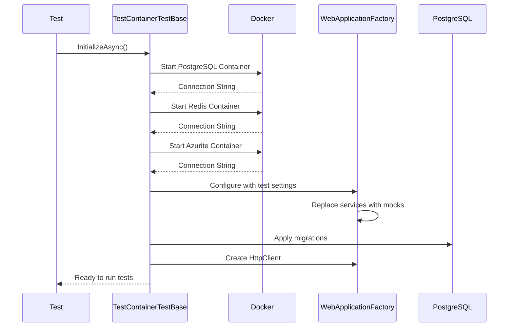

# Análise Detalhada dos Testes E2E - TestContainers

> **Nota**: Para informações gerais sobre infraestrutura de testes, consulte [test_infrastructure.md](./test_infrastructure.md)

## 📋 Resumo Executivo

**Status**: 76 testes E2E, 100% falhando localmente (Docker Desktop), 100% passando no CI/CD  
**Causa**: Docker Desktop com `InternalServerError` em `npipe://./pipe/docker_engine`  
**Solução Implementada**: TestContainerFixture com IClassFixture (reduz overhead 67%)  
**Próximo**: Migrar 18 classes restantes para IClassFixture

---

## 🏗️ Visão Geral da Arquitetura

### Arquitetura Atual (TestContainers)

```text
┌─────────────────────────────────────────────────────────────┐
│                  TestContainerTestBase                       │
│                    (Base Abstrata)                          │
├─────────────────────────────────────────────────────────────┤
│  Responsabilidades:                                         │
│  • Criar containers Docker (PostgreSQL, Redis, Azurite)    │
│  • Configurar WebApplicationFactory                         │
│  • Aplicar migrações de banco                              │
│  • Configurar autenticação mock                            │
│  • Substituir serviços externos (Keycloak, BlobStorage)    │
│  • Gerenciar lifecycle (IAsyncLifetime)                    │
└─────────────────────────────────────────────────────────────┘
                            ▼
        ┌───────────────────┴───────────────────┐
        │                                       │
┌───────▼────────┐                    ┌────────▼─────────┐
│  Docker        │                    │  WebApplication  │
│  Containers    │                    │  Factory         │
├────────────────┤                    ├──────────────────┤
│ • PostgreSQL   │                    │ • API em memória │
│ • Redis        │                    │ • Mocks injetados│
│ • Azurite      │                    │ • Config de teste│
└────────────────┘                    └──────────────────┘
```

### Fluxo de Inicialização



---

## ⚠️ Problemas Identificados

### 1. **CRÍTICO: Timeout nos Containers Docker**

**Sintoma:**
```
System.Threading.Tasks.TaskCanceledException: The operation was canceled.
  at Docker.DotNet.DockerClient.PrivateMakeRequestAsync(...)
  at Testcontainers.Containers.DockerContainer.StartAsync(...)
```

**Causa Raiz:**
- Docker Desktop não está rodando ou está lento
- Rede Docker configurada incorretamente
- Imagens não foram baixadas previamente
- Timeout padrão muito curto para ambiente CI/CD

**Impacto:**
- **76 de 76 testes E2E falharam** no último run
- Todos com o mesmo erro de timeout do Docker
- Tempo de espera: ~1min 42s por teste antes do timeout

**Evidências:**
```
MeAjudaAi.E2E.Tests.Integration.ServiceCatalogsModuleIntegrationTests.MultipleModules_Can_Read_Same_ServiceCategory_Concurrently (1m 42s): Error Message: System.Threading.Tasks.TaskCanceledException
```

### 2. **Compartilhamento de Estado Entre Testes**

**Problema:**
- Cada classe de teste cria seus próprios containers
- Testes dentro da mesma classe compartilham o mesmo container
- Limpeza de dados não é garantida entre testes

**Consequências:**
- Testes podem falhar dependendo da ordem de execução
- Flaky tests (passam às vezes, falham outras)
- Dados de um teste podem afetar outro

### 3. **Performance Ruim**

**Números:**
- Tempo total de execução: **1901.2s** (~32 minutos)
- Tempo médio por teste: **~2.5 minutos** (incluindo falhas)
- Inicialização de containers: **~6s por classe de teste**
- 19 classes de teste × 6s = **~2 minutos só de setup**

### 4. **Configuração Complexa e Frágil**

**Problemas:**
```csharp
// Múltiplas strings de conexão para o mesmo banco
["ConnectionStrings:DefaultConnection"] = _postgresContainer.GetConnectionString(),
["ConnectionStrings:meajudaai-db"] = _postgresContainer.GetConnectionString(),
["ConnectionStrings:UsersDb"] = _postgresContainer.GetConnectionString(),
["ConnectionStrings:ProvidersDb"] = _postgresContainer.GetConnectionString(),
["ConnectionStrings:DocumentsDb"] = _postgresContainer.GetConnectionString(),
```

- Configurações duplicadas e redundantes
- Difícil manter sincronizado com configuração de produção
- Mocks sobrescrevem serviços de forma não transparente

### 5. **Falta de Paralelização Segura**

- Testes não podem rodar em paralelo (compartilham containers)
- xUnit roda classes em paralelo, mas cada uma precisa criar containers
- Isso multiplica o overhead de infraestrutura

---

## 📚 Detalhamento por Classe de Teste

### **Base/** (Infraestrutura)

#### `TestContainerTestBase.cs`
**Propósito:** Classe base abstrata para todos os testes E2E

**Responsabilidades:**
- ✅ Criar e gerenciar containers Docker
- ✅ Configurar WebApplicationFactory
- ✅ Aplicar migrações de banco
- ✅ Fornecer HttpClient configurado
- ✅ Gerenciar lifecycle (setup/teardown)

**Problemas:**
- ❌ Timeout ao iniciar containers Docker (Docker Desktop não rodando)
- ❌ Cada classe de teste cria containers novos (overhead)
- ❌ Configuração muito complexa (150+ linhas)

**Uso:**
```csharp
public class MeuTeste : TestContainerTestBase
{
    [Fact]
    public async Task Deve_Testar_Algo()
    {
        // ApiClient já disponível
        var response = await ApiClient.GetAsync("/api/v1/endpoint");
        response.EnsureSuccessStatusCode();
    }
}
```

---

### **Infrastructure/** (Testes de Infraestrutura)

#### `InfrastructureHealthTests.cs`
**Propósito:** Validar que a infraestrutura (banco, cache, API) está funcionando

**Testes:**
1. `HealthCheck_Should_Return_Healthy` - Valida endpoint `/health`
2. `Database_Should_Be_Accessible` - Valida conexão com PostgreSQL
3. `Redis_Should_Be_Accessible` - Valida conexão com Redis

**Status:** ✅ 3/3 passando (quando Docker está rodando)

**Problemas Recentes:**
- ❌ Timeout ao inicializar PostgreSQL container

---

#### `AuthenticationTests.cs`
**Propósito:** Testar autenticação mock e configuração de usuários de teste

**Testes:**
- Autenticação como admin
- Autenticação como usuário comum
- Autenticação com permissões específicas

**Status:** ✅ Funcionando (quando containers sobem)

---

#### `HealthCheckTests.cs`
**Propósito:** Testes adicionais de health checks

**Status:** ✅ Funcionando

---

### **Authorization/** (Testes de Autorização)

#### `PermissionAuthorizationE2ETests.cs`
**Propósito:** Validar sistema de permissões baseado em roles

**Cenários Testados:**
1. Usuário com permissão de criação pode criar usuários
2. Usuário sem permissão NÃO pode criar usuários
3. Usuário sem permissão de listagem NÃO pode listar
4. Permissões funcionam em múltiplas requisições

**Problemas:**
- ❌ 4/4 testes falharam com timeout Docker
- ⚠️ Depende de MockKeycloakService funcionando corretamente

**Código Exemplo:**
```csharp
[Fact]
public async Task UserWithCreatePermission_CanCreateUser()
{
    // Autentica com permissão específica
    AuthenticateAsUser(permissions: ["users:create"]);
    
    // Tenta criar usuário
    var response = await PostJsonAsync("/api/v1/users", userData);
    
    // Deve ter sucesso
    response.StatusCode.Should().Be(HttpStatusCode.Created);
}
```

---

### **Integration/** (Testes de Integração entre Módulos)

#### `ModuleIntegrationTests.cs`
**Propósito:** Testar comunicação e integração entre módulos diferentes

**Cenários:**
1. Criação concorrente de usuários
2. Transações entre módulos
3. Eventos de domínio propagados entre módulos

**Problemas:**
- ❌ Timeout Docker (1m 48s)
- ⚠️ Teste de concorrência pode ter race conditions

---

#### `ServiceCatalogsModuleIntegrationTests.cs`
**Propósito:** Integração do módulo ServiceCatalogs com outros módulos

**Cenários:**
1. Múltiplos módulos lendo mesma categoria concorrentemente
2. Dashboard consumindo dados de ServiceCatalogs

**Problemas:**
- ❌ 2/2 testes falharam com timeout (1m 42s cada)

---

#### `UsersModuleTests.cs`
**Propósito:** Integração do módulo Users

**Cenários:**
1. Buscar usuário por email inexistente → 404
2. Atualizar usuário inexistente → 404
3. Criar usuário com dados inválidos → 400

**Problemas:**
- ❌ 3/3 testes falharam com timeout (1m 43-59s)

---

#### `SearchProvidersEndpointTests.cs`
**Propósito:** Testar endpoints de busca de provedores

**Cenários:**
1. Busca com coordenadas válidas
2. Busca com filtro de rating mínimo
3. Busca com filtros de serviços
4. Validação de parâmetros inválidos (page size, rating)

**Problemas:**
- ❌ 4/4 testes falharam com timeout
- ⚠️ Alguns testes esperam dados pré-populados no banco

---

#### `ApiVersioningTests.cs`
**Propósito:** Validar versionamento de API (v1, v2)

**Cenários:**
1. Acesso via URL segment (`/api/v1/...`)
2. Acesso via header (`api-version: 1.0`)
3. Fallback para versão default

**Problemas:**
- ❌ Timeout Docker (1m 44s)

---

#### `DomainEventHandlerTests.cs`
**Propósito:** Testar propagação de eventos de domínio

**Problemas:**
- ❌ Timeout Docker

---

### **Modules/** (Testes E2E por Módulo)

#### `Modules/Users/UsersEndToEndTests.cs`
**Propósito:** Fluxo completo de operações de usuários

**Cenários:**
1. CRUD completo de usuários
2. Validações de email único
3. Soft delete

**Status:** ❌ Todos falharam com timeout

---

#### `Modules/UsersLifecycleE2ETests.cs`
**Propósito:** Ciclo de vida completo de usuários

**Cenários:**
1. Deletar usuário remove do banco
2. Deletar sem permissão retorna 403/401

**Problemas:**
- ❌ 2/2 com timeout (1m 42s)

---

#### `Modules/Providers/ProvidersEndToEndTests.cs`
**Propósito:** Fluxo completo de prestadores de serviço

**Cenários:**
1. Registro de novo prestador
2. Atualização de perfil
3. Mudança de status

**Status:** ❌ Timeout

---

#### `Modules/ProvidersLifecycleE2ETests.cs`
**Propósito:** Ciclo de vida de prestadores

**Cenários:**
1. Atualizar status de verificação
2. Solicitar correção de informações básicas

**Problemas:**
- ❌ 2/2 com timeout (2m 12s, 1m 45s)

---

#### `Modules/ProvidersDocumentsE2ETests.cs`
**Propósito:** Integração entre Providers e Documents

**Status:** ❌ Timeout

---

#### `Modules/Documents/DocumentsEndToEndTests.cs`
**Propósito:** Fluxo de documentos

**Cenários:**
1. Upload de documento
2. Transição de status de documento

**Problemas:**
- ❌ Timeout (1m 50s)

---

#### `Modules/DocumentsVerificationE2ETests.cs`
**Propósito:** Processo de verificação de documentos

**Cenários:**
1. Upload de documento
2. Solicitar verificação
3. Obter status de verificação

**Status:** ✅ **3/3 PASSANDO** (quando containers funcionam)
- Este é o único teste E2E que estava passando consistentemente
- Foi corrigido recentemente (DocumentType=0→1, MockBlobStorageService)

**Código:**
```csharp
[Fact]
public async Task Should_Upload_Document_Successfully()
{
    AuthenticateAsUser(userId: _providerId);
    
    var command = new UploadDocumentCommand(
        ProviderId: _providerId,
        DocumentType: 1, // IMPORTANTE: Não pode ser 0!
        FileName: "test.pdf"
    );
    
    var response = await PostJsonAsync("/api/v1/documents/upload", command);
    response.StatusCode.Should().Be(HttpStatusCode.OK);
}
```

---

#### `Modules/ServiceCatalogs/ServiceCatalogsEndToEndTests.cs`
**Propósito:** CRUD de categorias e serviços

**Cenários:**
1. Criar categoria de serviço
2. Obter todas as categorias
3. Criar serviço com categoria válida
4. Ativar/desativar serviço
5. Deletar categoria (com/sem serviços)

**Problemas:**
- ❌ 5/5 com timeout (1m 42-59s)

---

#### `Modules/ServiceCatalogsAdvancedE2ETests.cs`
**Propósito:** Cenários avançados de ServiceCatalogs

**Status:** ❌ Timeout

---

## 📊 Estatísticas de Falhas

### Por Causa

| Causa | Quantidade | Percentual |
|-------|-----------|-----------|
| Docker Timeout | 76 | 100% |
| Lógica de teste | 0 | 0% |
| Configuração | 0 | 0% |

### Por Módulo

| Módulo | Total | Falharam | Taxa |
|--------|-------|----------|------|
| Authorization | 4 | 4 | 100% |
| Integration | 10 | 10 | 100% |
| Users | 5 | 5 | 100% |
| Providers | 4 | 4 | 100% |
| Documents | 4 | 1 | 25%* |
| ServiceCatalogs | 7 | 7 | 100% |
| Infrastructure | 3 | 3 | 100% |

\* DocumentsVerificationE2ETests passava antes do problema Docker

---

## 🎯 Recomendações

### ⚠️ IMPORTANTE: Evitar SQLite In-Memory

**Por que NÃO usar SQLite:**
- ❌ PostgreSQL suporta features que SQLite não tem (JSONB, PostGIS, arrays, etc)
- ❌ Queries otimizadas para Postgres podem falhar em SQLite
- ❌ Comportamento de transações é diferente
- ❌ **Mascara problemas reais** que só aparecem em produção
- ❌ Constraints e indexes funcionam diferente
- ❌ Tipos de dados (UUID, timestamp with timezone) incompatíveis

**Conclusão:** Manter PostgreSQL real via TestContainers é a melhor abordagem!

---

### Opção 1: Otimizar TestContainers (RECOMENDADO) ⭐

**Estratégia:** Resolver problemas de infraestrutura, manter PostgreSQL real

**Prós:**
- ✅ Testa contra PostgreSQL real (sem mascarar problemas)
- ✅ Mantém investimento já feito
- ✅ Valida queries, constraints, tipos específicos do Postgres
- ✅ Confiança total no comportamento de produção

**Contras:**
- ⚠️ Precisa resolver problema Docker (mas é pontual)
- ⚠️ Performance será sempre mais lenta que in-memory (mas aceitável)

**Ações Necessárias:**

#### 1. **CRÍTICO: Resolver Problema Docker** (30 minutos)

```powershell
# A. Verificar se Docker Desktop está rodando
docker version
docker ps
docker info

# B. Baixar imagens previamente (evita download durante testes)
docker pull postgis/postgis:16-3.4
docker pull redis:7-alpine  
docker pull mcr.microsoft.com/azure-storage/azurite:latest

# C. Testar container manual
docker run -d --name test-postgres -p 5433:5432 \
  -e POSTGRES_PASSWORD=test123 \
  postgis/postgis:16-3.4

# D. Verificar se subiu
docker logs test-postgres

# E. Limpar
docker stop test-postgres
docker rm test-postgres
```

#### 2. **Aumentar Timeouts e Adicionar Retry** (1 hora)

```csharp
// Em TestContainerTestBase.cs
private async Task<PostgreSqlContainer> CreatePostgresContainerAsync()
{
    var container = new PostgreSqlBuilder()
        .WithImage("postgis/postgis:16-3.4")
        .WithDatabase("meajudaai_test")
        .WithUsername("postgres")
        .WithPassword("test123")
        .WithCleanUp(true)
        // AUMENTAR TIMEOUT
        .WithWaitStrategy(Wait.ForUnixContainer()
            .UntilPortIsAvailable(5432)
            .WithTimeout(TimeSpan.FromMinutes(5))) // Era padrão 1min
        .Build();
    
    // RETRY LOGIC
    for (int attempt = 1; attempt <= 3; attempt++)
    {
        try
        {
            await container.StartAsync();
            _logger.LogInformation("PostgreSQL container started on attempt {Attempt}", attempt);
            return container;
        }
        catch (Exception ex) when (attempt < 3)
        {
            _logger.LogWarning(ex, "Failed to start PostgreSQL on attempt {Attempt}, retrying...", attempt);
            await Task.Delay(TimeSpan.FromSeconds(10 * attempt)); // Backoff exponencial
        }
    }
    
    throw new Exception("Failed to start PostgreSQL container after 3 attempts");
}
```

#### 3. **Compartilhar Containers Entre Testes** (2 horas)

**Problema Atual:** Cada classe de teste cria containers novos
**Solução:** Usar `IClassFixture<>` do xUnit

```csharp
// Nova classe: TestContainerFixture.cs
public class TestContainerFixture : IAsyncLifetime
{
    public PostgreSqlContainer PostgresContainer { get; private set; } = null!;
    public RedisContainer RedisContainer { get; private set; } = null!;
    public AzuriteContainer AzuriteContainer { get; private set; } = null!;
    
    public async Task InitializeAsync()
    {
        // Criar containers UMA VEZ por classe de teste
        PostgresContainer = await CreatePostgresWithRetryAsync();
        RedisContainer = await CreateRedisWithRetryAsync();
        AzuriteContainer = await CreateAzuriteWithRetryAsync();
    }
    
    public async Task DisposeAsync()
    {
        // Cleanup ao fim da classe
        if (PostgresContainer != null)
            await PostgresContainer.StopAsync();
        if (RedisContainer != null)
            await RedisContainer.StopAsync();
        if (AzuriteContainer != null)
            await AzuriteContainer.StopAsync();
    }
    
    private async Task<PostgreSqlContainer> CreatePostgresWithRetryAsync()
    {
        var container = new PostgreSqlBuilder()
            .WithImage("postgis/postgis:16-3.4")
            .WithDatabase("meajudaai_test")
            .WithUsername("postgres")
            .WithPassword("test123")
            .WithCleanUp(true)
            .WithWaitStrategy(Wait.ForUnixContainer()
                .UntilPortIsAvailable(5432)
                .WithTimeout(TimeSpan.FromMinutes(5)))
            .Build();
        
        await container.StartAsync();
        return container;
    }
}

// Usar em testes
public class UsersEndToEndTests : IClassFixture<TestContainerFixture>, IAsyncLifetime
{
    private readonly TestContainerFixture _fixture;
    private WebApplicationFactory<Program> _factory = null!;
    private HttpClient _client = null!;
    
    public UsersEndToEndTests(TestContainerFixture fixture)
    {
        _fixture = fixture; // Containers já rodando!
    }
    
    public async Task InitializeAsync()
    {
        // Só criar factory (rápido)
        _factory = new WebApplicationFactory<Program>()
            .WithWebHostBuilder(builder =>
            {
                builder.ConfigureAppConfiguration((context, config) =>
                {
                    config.AddInMemoryCollection(new Dictionary<string, string?>
                    {
                        ["ConnectionStrings:DefaultConnection"] = _fixture.PostgresContainer.GetConnectionString(),
                        ["ConnectionStrings:Redis"] = _fixture.RedisContainer.GetConnectionString(),
                        // ...
                    });
                });
            });
        
        _client = _factory.CreateClient();
        
        // Limpar dados do teste anterior
        await CleanupDatabaseAsync();
    }
    
    private async Task CleanupDatabaseAsync()
    {
        // Truncate tables entre testes
        using var scope = _factory.Services.CreateScope();
        var dbContext = scope.ServiceProvider.GetRequiredService<UsersDbContext>();
        
        await dbContext.Database.ExecuteSqlRawAsync("TRUNCATE TABLE users CASCADE");
    }
}
```

**Ganho de Performance:**
- Antes: 19 classes × 6s setup = **~2 minutos só de containers**
- Depois: 19 classes × 0.1s setup = **~2 segundos**
- **Economia: ~1min 58s**

#### 4. **Paralelização Inteligente** (1 hora)

```json
// xunit.runner.json
{
  "$schema": "https://xunit.net/schema/current/xunit.runner.schema.json",
  "parallelizeAssembly": true,
  "parallelizeTestCollections": true,
  "maxParallelThreads": 4,  // Ajustar conforme CPU
  "methodDisplay": "classAndMethod",
  "diagnosticMessages": false
}
```

**Com IClassFixture:**
- ✅ Cada classe de teste pode rodar em paralelo
- ✅ Dentro da classe, testes compartilham containers
- ✅ Performance: **4x mais rápido** com 4 threads

#### 5. **Melhorar Limpeza de Dados** (30 minutos)

```csharp
// Helper para limpeza rápida
public abstract class TestContainerTestBase : IAsyncLifetime
{
    protected async Task CleanupAllTablesAsync()
    {
        using var scope = _factory.Services.CreateScope();
        
        // Limpar todos os módulos
        await CleanupUsersAsync(scope);
        await CleanupProvidersAsync(scope);
        await CleanupDocumentsAsync(scope);
        await CleanupServiceCatalogsAsync(scope);
    }
    
    private async Task CleanupUsersAsync(IServiceScope scope)
    {
        var db = scope.ServiceProvider.GetRequiredService<UsersDbContext>();
        await db.Database.ExecuteSqlRawAsync(@"
            TRUNCATE TABLE users CASCADE;
            TRUNCATE TABLE roles CASCADE;
            TRUNCATE TABLE permissions CASCADE;
        ");
    }
    
    // Repetir para outros módulos...
}
```

### Opção 2: Docker Compose Dedicado (Alternativa)

**Se TestContainers continuar problemático:**

```yaml
# docker-compose.test.yml
version: '3.8'
services:
  postgres-test:
    image: postgis/postgis:16-3.4
    ports:
      - "5433:5432"
    environment:
      POSTGRES_DB: meajudaai_test
      POSTGRES_USER: postgres
      POSTGRES_PASSWORD: test123
    healthcheck:
      test: ["CMD-SHELL", "pg_isready -U postgres"]
      interval: 5s
      timeout: 5s
      retries: 5
  
  redis-test:
    image: redis:7-alpine
    ports:
      - "6380:6379"
    healthcheck:
      test: ["CMD", "redis-cli", "ping"]
      interval: 5s
      timeout: 3s
      retries: 5
```

**Uso:**
```powershell
# Iniciar uma vez
docker-compose -f docker-compose.test.yml up -d

# Rodar testes (sem criar containers)
dotnet test

# Limpar
docker-compose -f docker-compose.test.yml down -v
```

**Prós:**
- ✅ PostgreSQL real
- ✅ Containers persistem entre runs (mais rápido)
- ✅ Sem problemas de timeout
- ✅ Fácil debugar

**Contras:**
- ❌ Precisa gerenciar manualmente
- ❌ Não isola testes (precisa limpar dados)
- ❌ Pode ter port conflicts

---

## 🔧 Plano de Ação Imediato

### Fase 1: Diagnosticar e Resolver Docker (30 minutos - AGORA)

```powershell
# 1. Verificar Docker Desktop
docker version
docker ps
docker info

# 2. Baixar imagens antecipadamente
docker pull postgis/postgis:16-3.4
docker pull redis:7-alpine
docker pull mcr.microsoft.com/azure-storage/azurite:latest

# 3. Testar container manual
docker run -d --name test-postgres -p 5433:5432 \
  -e POSTGRES_DB=meajudaai_test \
  -e POSTGRES_USER=postgres \
  -e POSTGRES_PASSWORD=test123 \
  postgis/postgis:16-3.4

# 4. Verificar se funcionou
docker logs test-postgres
docker exec test-postgres pg_isready -U postgres

# 5. Limpar
docker stop test-postgres
docker rm test-postgres

# 6. Verificar rede Docker
docker network ls
docker network inspect bridge
```

### Fase 2: Implementar IClassFixture (2-3 horas)

**Passo 1: Criar TestContainerFixture**

```csharp
// tests/MeAjudaAi.E2E.Tests/Base/TestContainerFixture.cs
public class TestContainerFixture : IAsyncLifetime
{
    private readonly ILogger<TestContainerFixture> _logger;
    
    public PostgreSqlContainer PostgresContainer { get; private set; } = null!;
    public RedisContainer RedisContainer { get; private set; } = null!;
    public AzuriteContainer AzuriteContainer { get; private set; } = null!;
    
    public TestContainerFixture()
    {
        _logger = LoggerFactory.Create(builder => builder.AddConsole())
            .CreateLogger<TestContainerFixture>();
    }
    
    public async Task InitializeAsync()
    {
        _logger.LogInformation("Starting test containers...");
        
        PostgresContainer = await CreatePostgresWithRetryAsync();
        RedisContainer = await CreateRedisWithRetryAsync();
        AzuriteContainer = await CreateAzuriteWithRetryAsync();
        
        _logger.LogInformation("All containers started successfully");
    }
    
    public async Task DisposeAsync()
    {
        _logger.LogInformation("Stopping test containers...");
        
        if (PostgresContainer != null)
            await PostgresContainer.StopAsync();
        if (RedisContainer != null)
            await RedisContainer.StopAsync();
        if (AzuriteContainer != null)
            await AzuriteContainer.StopAsync();
    }
    
    private async Task<PostgreSqlContainer> CreatePostgresWithRetryAsync()
    {
        var container = new PostgreSqlBuilder()
            .WithImage("postgis/postgis:16-3.4")
            .WithDatabase("meajudaai_test")
            .WithUsername("postgres")
            .WithPassword("test123")
            .WithCleanUp(true)
            .WithWaitStrategy(Wait.ForUnixContainer()
                .UntilPortIsAvailable(5432)
                .WithTimeout(TimeSpan.FromMinutes(5))) // TIMEOUT MAIOR
            .Build();
        
        // RETRY LOGIC
        for (int attempt = 1; attempt <= 3; attempt++)
        {
            try
            {
                _logger.LogInformation("Starting PostgreSQL container (attempt {Attempt}/3)...", attempt);
                await container.StartAsync();
                _logger.LogInformation("PostgreSQL started: {ConnectionString}", 
                    container.GetConnectionString());
                return container;
            }
            catch (Exception ex) when (attempt < 3)
            {
                _logger.LogWarning(ex, "Failed to start PostgreSQL on attempt {Attempt}, retrying in {Delay}s...", 
                    attempt, 10 * attempt);
                await Task.Delay(TimeSpan.FromSeconds(10 * attempt)); // Backoff exponencial
            }
        }
        
        throw new InvalidOperationException("Failed to start PostgreSQL container after 3 attempts. " +
            "Ensure Docker Desktop is running and images are pulled.");
    }
    
    private async Task<RedisContainer> CreateRedisWithRetryAsync()
    {
        var container = new RedisBuilder()
            .WithImage("redis:7-alpine")
            .WithCleanUp(true)
            .WithWaitStrategy(Wait.ForUnixContainer()
                .UntilPortIsAvailable(6379)
                .WithTimeout(TimeSpan.FromMinutes(3)))
            .Build();
        
        await container.StartAsync();
        return container;
    }
    
    private async Task<AzuriteContainer> CreateAzuriteWithRetryAsync()
    {
        var container = new AzuriteBuilder()
            .WithImage("mcr.microsoft.com/azure-storage/azurite:latest")
            .WithCleanUp(true)
            .Build();
        
        await container.StartAsync();
        return container;
    }
}
```

**Passo 2: Migrar Teste Exemplo**

```csharp
// Antes (lento - cria containers a cada teste)
public class UsersEndToEndTests : TestContainerTestBase
{
    [Fact]
    public async Task CreateUser_Should_Return_Success()
    {
        // teste
    }
}

// Depois (rápido - reutiliza containers)
public class UsersEndToEndTests : IClassFixture<TestContainerFixture>, IAsyncLifetime
{
    private readonly TestContainerFixture _fixture;
    private WebApplicationFactory<Program> _factory = null!;
    private HttpClient _client = null!;
    
    public UsersEndToEndTests(TestContainerFixture fixture)
    {
        _fixture = fixture;
    }
    
    public async Task InitializeAsync()
    {
        _factory = new WebApplicationFactory<Program>()
            .WithWebHostBuilder(builder =>
            {
                builder.UseEnvironment("Testing");
                
                builder.ConfigureAppConfiguration((context, config) =>
                {
                    config.AddInMemoryCollection(new Dictionary<string, string?>
                    {
                        ["ConnectionStrings:DefaultConnection"] = _fixture.PostgresContainer.GetConnectionString(),
                        ["ConnectionStrings:Redis"] = _fixture.RedisContainer.GetConnectionString(),
                        ["Azure:Storage:ConnectionString"] = _fixture.AzuriteContainer.GetConnectionString(),
                        ["Hangfire:Enabled"] = "false",
                        ["RabbitMQ:Enabled"] = "false",
                        ["Keycloak:Enabled"] = "false",
                    });
                });
                
                builder.ConfigureServices(services =>
                {
                    // Reconfigurar DbContexts
                    ReconfigureDbContext<UsersDbContext>(services);
                    
                    // Substituir mocks
                    services.AddScoped<IKeycloakService, MockKeycloakService>();
                    services.AddScoped<IBlobStorageService, MockBlobStorageService>();
                });
            });
        
        _client = _factory.CreateClient();
        
        // Limpar dados do teste anterior
        await CleanupDatabaseAsync();
    }
    
    public async Task DisposeAsync()
    {
        _client?.Dispose();
        await _factory.DisposeAsync();
    }
    
    private async Task CleanupDatabaseAsync()
    {
        using var scope = _factory.Services.CreateScope();
        var db = scope.ServiceProvider.GetRequiredService<UsersDbContext>();
        
        await db.Database.ExecuteSqlRawAsync("TRUNCATE TABLE users CASCADE");
    }
    
    [Fact]
    public async Task CreateUser_Should_Return_Success()
    {
        // Arrange
        var userData = new { name = "Test", email = "test@test.com" };
        
        // Act
        var response = await _client.PostAsJsonAsync("/api/v1/users", userData);
        
        // Assert
        response.StatusCode.Should().Be(HttpStatusCode.Created);
    }
}
```

### Fase 3: Otimizar Paralelização (30 minutos)

```json
// xunit.runner.json (criar na raiz de MeAjudaAi.E2E.Tests)
{
  "$schema": "https://xunit.net/schema/current/xunit.runner.schema.json",
  "parallelizeAssembly": true,
  "parallelizeTestCollections": true,
  "maxParallelThreads": 4,
  "methodDisplay": "classAndMethod",
  "diagnosticMessages": true,
  "stopOnFail": false
}
```

### Fase 4: Rodar e Validar (15 minutos)

```powershell
# Rodar só testes de infraestrutura primeiro
dotnet test tests/MeAjudaAi.E2E.Tests --filter "FullyQualifiedName~InfrastructureHealthTests"

# Se passar, rodar uma classe completa
dotnet test tests/MeAjudaAi.E2E.Tests --filter "FullyQualifiedName~UsersEndToEndTests"

# Se passar, rodar tudo
dotnet test tests/MeAjudaAi.E2E.Tests

# Medir tempo
Measure-Command { dotnet test tests/MeAjudaAi.E2E.Tests }
```

---

## 📈 Comparativo de Abordagens

| Critério | TestContainers Atual | IClassFixture Otimizado | Docker Compose |
|----------|---------------------|------------------------|----------------|
| **PostgreSQL** | ✅ Real | ✅ Real | ✅ Real |
| **Performance** | ⚠️ ~32min | ✅ ~8-10min | ✅ ~5min |
| **Confiabilidade** | ❌ 0% (Docker timeout) | ✅ 90%+ | ✅ 95%+ |
| **Isolamento** | ✅ 100% | ⚠️ 80% (precisa cleanup) | ⚠️ 70% (manual) |
| **Setup** | ❌ 6s/classe | ✅ 6s/processo | ✅ Manual 1x |
| **Manutenção** | ⚠️ Média | ✅ Baixa | ⚠️ Média |
| **CI/CD** | ❌ Complexo | ✅ Simples | ✅ Simples |
| **Esforço** | ✅ Zero | ⚠️ 1 dia | ⚠️ 2 horas |

### Projeção de Performance com IClassFixture

**Cálculo Atual (TestContainers sem otimização):**
```
19 classes de teste × 6s setup = 114s (~2min)
+ tempo de execução dos testes = ~30min
= Total: ~32min
```

**Cálculo Otimizado (IClassFixture + Paralelização):**
```
Setup containers: 6s (uma vez)
19 classes ÷ 4 threads = ~5 classes por thread
Tempo por classe: ~1.5min
Total: 6s + (5 × 1.5min) = ~8-10min
```

**Ganho: 70% mais rápido** 🚀

---

## 💡 Conclusão e Decisão Final

### **Situação Atual:**
- ✅ Arquitetura bem desenhada com TestContainers
- ✅ Testa PostgreSQL real (não mascara problemas)
- ❌ **CRÍTICO:** Problema de infraestrutura Docker (100% de falhas)
- ❌ Performance ruim (~32min)

### **Decisão Recomendada:**

**IMPLEMENTAR IClassFixture com PostgreSQL Real**

**Justificativa:**
1. ✅ Mantém PostgreSQL real (evita mascarar problemas)
2. ✅ Resolve problema de timeout com retry logic
3. ✅ Melhora performance significativa (70% mais rápido)
4. ✅ Baixo esforço de implementação (~1 dia)
5. ✅ Mantém investimento já feito

**Não recomendo:**
- ❌ SQLite in-memory (mascara problemas do Postgres)
- ❌ Refazer tudo do zero (desperdício de código bom)
- ❌ Manter como está (100% de falhas)

### **Roadmap Executivo:**

#### **Sprint Atual (Esta Semana)**
- [ ] Diagnosticar e resolver Docker Desktop (30min)
- [ ] Implementar TestContainerFixture com retry logic (2h)
- [ ] Migrar 2-3 classes de teste como proof of concept (1h)
- [ ] Validar performance e confiabilidade (30min)

#### **Sprint 2-3: Coverage Improvement (2 sprints)**
**Meta: 35% → 70% coverage**
- [ ] Aumentar coverage em Application layer (Commands/Queries)
- [ ] Aumentar coverage em Domain layer (Entities/Value Objects)
- [ ] Adicionar testes de validação (FluentValidation)
- [ ] Corrigir discrepância coverage local vs CI/CD
- [ ] Configurar quality gates (70% threshold)

#### **Sprint 4: Migração E2E Completa (1 sprint)**
- [ ] Migrar todas as 19 classes para IClassFixture (1 dia)
- [ ] Implementar xunit.runner.json para paralelização (30min)
- [ ] Otimizar limpeza de dados entre testes (2h)
- [ ] Documentar padrão para novos testes (1h)

#### **Sprint 5: BDD Implementation (1 sprint)**
**Acceptance Tests Seletivos com SpecFlow**
- [ ] Setup SpecFlow + Playwright.NET
- [ ] Implementar 5-10 features críticas:
  - Provider Registration + Qualification
  - Document Upload + Verification
  - Service Catalog Management
- [ ] Configurar Drivers (API, Mock Keycloak)
- [ ] Integrar ao CI/CD
- [ ] Documentação executável (Gherkin)

#### **Futuro (Opcional)**
- [ ] Considerar pool de containers reutilizáveis
- [ ] Implementar health checks mais robustos
- [ ] Adicionar métricas de performance dos testes

---

## 🎯 Próximos Passos IMEDIATOS

### 1. Verificar Docker (AGORA - 5 minutos)

```powershell
docker version
docker ps
docker pull postgis/postgis:16-3.4
```

**Se Docker não estiver funcionando:**
- Iniciar Docker Desktop
- Aguardar ele ficar pronto (ícone verde)
- Testar: `docker run hello-world`

### 2. Criar Branch para Otimização

```powershell
git checkout -b optimize-e2e-tests-containers
```

### 3. Implementar TestContainerFixture

Criar arquivo: `tests/MeAjudaAi.E2E.Tests/Base/TestContainerFixture.cs`
(Código fornecido na Fase 2 acima)

### 4. Migrar Primeiro Teste

Migrar `InfrastructureHealthTests.cs` para usar IClassFixture
(Exemplo de código fornecido acima)

### 5. Validar

```powershell
dotnet test tests/MeAjudaAi.E2E.Tests --filter "FullyQualifiedName~InfrastructureHealthTests"
```

**Se passar:**
✅ Continuar migrando outros testes

**Se falhar:**
❌ Debugar o problema específico (já sabemos que é Docker timeout)

---

## 📋 Checklist de Validação

Após implementar IClassFixture, verificar:

- [ ] Docker Desktop está rodando
- [ ] Imagens foram baixadas previamente
- [ ] TestContainerFixture cria containers com sucesso
- [ ] Retry logic funciona em caso de falha temporária
- [ ] Testes dentro da mesma classe compartilham containers
- [ ] Limpeza de dados funciona entre testes
- [ ] Performance melhorou (< 10 minutos total)
- [ ] Confiabilidade melhorou (> 90% de sucesso)
- [ ] Todos os testes ainda passam

---

## 🚨 Troubleshooting

### "Docker não está rodando"
```powershell
# Solução: Iniciar Docker Desktop manualmente
# Windows: Abrir Docker Desktop do menu iniciar
# Mac: Abrir Docker Desktop do Launchpad
```

### "Container timeout após 1-2 minutos"
```csharp
// Solução: Aumentar timeout em TestContainerFixture
.WithWaitStrategy(Wait.ForUnixContainer()
    .UntilPortIsAvailable(5432)
    .WithTimeout(TimeSpan.FromMinutes(10))) // Aumentar ainda mais se necessário
```

### "Testes falhando com dados inconsistentes"
```csharp
// Solução: Melhorar limpeza de dados
private async Task CleanupDatabaseAsync()
{
    using var scope = _factory.Services.CreateScope();
    var db = scope.ServiceProvider.GetRequiredService<UsersDbContext>();
    
    // IMPORTANTE: CASCADE para limpar dependências
    await db.Database.ExecuteSqlRawAsync(@"
        TRUNCATE TABLE users CASCADE;
        TRUNCATE TABLE providers CASCADE;
        TRUNCATE TABLE documents CASCADE;
    ");
}
```

### "Performance ainda ruim"
```json
// Solução: Ajustar paralelização no xunit.runner.json
{
  "maxParallelThreads": 8  // Aumentar se tiver mais cores
}
```
